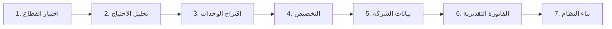
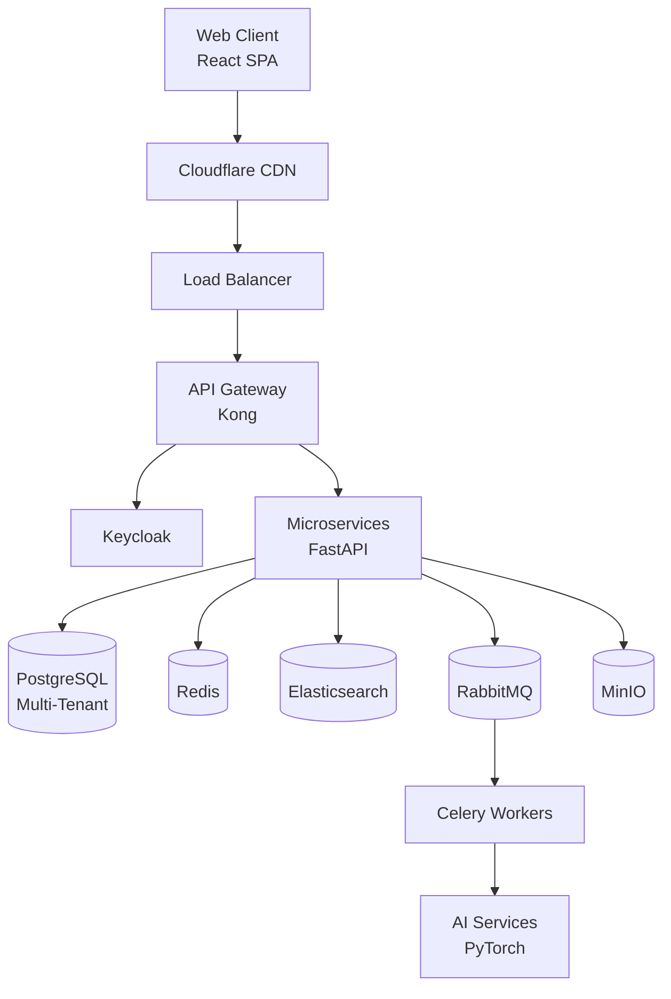

# 14 — Unified Product Requirements Document (PRD)
## نظام EOS | وثيقة متطلبات المنتج الموحدة

> الإصدار: 1.0 | التاريخ: 2026-08-19
> الحالة: ✅ جاهز للتنفيذ
> الجمهور المستهدف: الفريق التقني + Product Team + Stakeholders

---

## 📌 كيفية استخدام هذه الوثيقة

هذه الوثيقة هي **نقطة الدخول الرئيسية** لفهم نظام EOS. لكل قسم، يوجد مرجع للوثيقة التفصيلية الكاملة:

| الرمز | المعنى |
|-------|--------|
| 📖 | راجع الوثيقة التفصيلية للمزيد |
| ⚡ | نقطة حرجة لا يمكن تجاهلها |
| 🎯 | معيار قبول (Acceptance Criterion) |

---

## 1. الملخص التنفيذي (Executive Summary)

### 1.1 ما هو EOS؟

**EOS (Enterprise Operating System)** هو منصة ERP سحابية ذكية قابلة للتخصيص تُمكّن أي شركة — بغض النظر عن حجمها أو قطاعها — من الحصول على نظام إدارة مؤسسي مُصمَّم خصيصاً لطبيعة عملها، عبر عملية تأهيل ذكية تبني الوحدات والتسعير تلقائياً.

**الشعار:** "العميل يخبرنا بنشاطه، والنظام يبني له منظومته."

### 1.2 المشكلة التي نحلها

| المشكلة | الحل في EOS |
|---------|-------------|
| أنظمة ERP معقدة ومكلفة | تسعير معياري + دفع مقابل ما تستخدمه فقط |
| تطبيق واحد لا يناسب كل القطاعات | 10 قوالب قطاعية جاهزة + تخصيص No-Code |
| تنفيذ يستغرق شهوراً | Onboarding ذكي في < 10 دقائق |
| تقارير جامدة غير ذكية | طبقة AI أفقية + مساعد ذكي تفاعلي |
| عدم التوافق مع القوانين المحلية | امتثال مصري كامل (ETA + تأمينات + VAT) |

### 1.3 الأهداف الاستراتيجية

| الهدف | المؤشر | المستهدف (18 شهر) |
|-------|--------|-------------------|
| **اكتساب العملاء** | عدد العملاء المدفوعين | 100+ عميل |
| **الإيرادات** | MRR (Monthly Recurring Revenue) | 500,000 EGP |
| **الاحتفاظ** | Retention Rate بعد 6 أشهر | ≥ 85% |
| **الرضا** | NPS (Net Promoter Score) | ≥ 50 |
| **الأداء** | Response Time (P95) | < 1 ثانية |

### 1.4 المراجع التفصيلية

- 📖 `01-system-architecture.md` — المعمارية الكاملة
- 📖 `06-implementation-roadmap.md` — خارطة الطريق

---

## 2. النطاق (Scope)

### 2.1 ما نبنيه (In Scope)

✅ **الوحدات الأساسية (11 وحدة):**
1. المحاسبة والمالية
2. المخزون والمشتريات
3. شؤون العاملين (HR)
4. المبيعات وCRM
5. نقاط البيع (POS)
6. إدارة المشاريع والمهام
7. سلسلة التوريد
8. التصنيع (MRP)
9. إدارة الأصول
10. خدمة العملاء
11. الفوترة الإلكترونية (ETA)

✅ **القوالب القطاعية (10 قوالب):**
صيدلية، مطعم، عيادة، مقاولات، تجزئة، مصنع، خدمات، لوجستيات، تعليم، عقارات

✅ **طبقة الذكاء الاصطناعي:**
- AI Copilot (مساعد ذكي)
- Demand Forecasting
- Anomaly Detection
- OCR للمستندات
- NLP للتقارير

✅ **البنية التحتية:**
- Multi-Tenant SaaS
- Microservices Architecture
- Egypt Compliance (ETA + NOSI + VAT)
- Security Layer (OWASP Top 10)

### 2.2 ما لا نبنيه (Out of Scope)

❌ **تطبيقات موبايل أصلية** (Native Mobile Apps) — سنكتفي بـ PWA في Phase 1  
❌ **Blockchain / Cryptocurrency** — خارج نطاق المشروع الحالي  
❌ **تطوير Hardware** (مثل أجهزة POS) — سنكتفي بالتكامل مع الأجهزة الموجودة  
❌ **دعم لغات غير العربية والإنجليزية** في Phase 1  
❌ **تكامل مع أنظمة حكومية خارج مصر** — سنركز على السوق المصري أولاً

---

## 3. الشخصيات المستهدفة (User Personas)

### 3.1 personas الأساسية

| الشخصية | الوصف | الهدف الرئيسي | الوحدات المستخدمة |
|---------|-------|---------------|-------------------|
| **أحمد — صاحب الصيدلية** | 35 سنة، يدير صيدلية بفرعين | متابعة المبيعات والمخزون والربحية | POS + Inventory + Accounting |
| **سارة — مديرة المطعم** | 28 سنة، تدير كافيه | إدارة الطلبات والورديات والتكلفة | POS + Recipes + HR |
| **د. محمد — طبيب الأسنان** | 42 سنة، يدير عيادة | المواعيد وملفات المرضى والفوترة | Appointments + Patients + Billing |
| **م. خالد — مدير المقاولات** | 45 سنة، يدير شركة مقاولات | متابعة المشاريع والمستخلصات | Projects + BOQ + Accounting |
| **فاطمة — محاسبة الشركة** | 30 سنة، محاسبة في شركة متوسطة | القيود والتقارير الضريبية | Accounting + ETA + VAT |
| **كريم — مدير الموارد البشرية** | 38 سنة، HR Manager في مصنع | الرواتب والتأمينات والحضور | HR + Payroll + Insurance |

### 3.2 personas داخلية (فريق EOS)

| الشخصية | الدور |
|---------|-------|
| **Super Admin** | إدارة العملاء، الاشتراكات، البنية التحتية |
| **Support Agent** | دعم العملاء، حل المشاكل |
| **Sales Rep** | متابعة العملاء المحتملين |

---

## 4. الوحدات الأساسية — ملخص سريع

### 4.1 جدول الوحدات

| # | الوحدة | الوظيفة الرئيسية | عدد الجداول | الأولوية |
|---|--------|------------------|-------------|----------|
| 1 | **المحاسبة** | القيود، الموازنات، التقارير المالية، الضرائب | 18 | 🔴 P0 |
| 2 | **المخزون** | المخازن، أوامر الشراء، تتبع الدفعات | 14 | 🔴 P0 |
| 3 | **HR** | الحضور، الرواتب، الإجازات، العقود | 12 | 🔴 P0 |
| 4 | **المبيعات/CRM** | العملاء، العروض، الصفقات | 10 | 🔴 P0 |
| 5 | **POS** | البيع السريع، الوردية، النقدية | 8 | 🟡 P1 |
| 6 | **المشاريع** | المهام، الجداول، تتبع الإنجاز | 7 | 🟡 P1 |
| 7 | **سلسلة التوريد** | الموردين، النقل، التوزيع | 9 | 🟡 P1 |
| 8 | **التصنيع (MRP)** | أوامر الإنتاج، BOM، الطاقة | 11 | 🟢 P2 |
| 9 | **الأصول** | الصيانة، الإهلاك، دورة الحياة | 6 | 🟢 P2 |
| 10 | **خدمة العملاء** | التذاكر، قواعد المعرفة، SLA | 7 | 🟢 P2 |
| 11 | **ETA (فوترة إلكترونية)** | تكامل مع مصلحة الضرائب | 5 | 🔴 P0 |

📖 التفاصيل الكاملة: `03-module-specifications.md` (443 KB)

### 4.2 Acceptance Criteria للوحدات الأساسية (P0)

#### المحاسبة
- [ ] 🎯 يمكن إنشاء قيد يومية مزدوج القيد (Double-Entry)
- [ ] 🎯 يمكن إصدار قائمة دخل + ميزانية عمومية + تدفقات نقدية
- [ ] 🎯 حساب ضريبة القيمة المضافة 14% تلقائياً
- [ ] 🎯 تسوية بنكية مع كشف البنك
- [ ] 🎯 Audit Trail لكل عملية محاسبية

#### المخزون
- [ ] 🎯 تتبع المخزون بعدة مخازن
- [ ] 🎯 تتبع الدفعات (Batch) وتواريخ الصلاحية
- [ ] 🎯 تنبيهات النفاد والصلاحية
- [ ] 🎯 أوامر شراء + استلام + فواتير موردين
- [ ] 🎯 جرد دوري مع تسوية الفروقات

#### HR
- [ ] 🎯 إدارة بيانات الموظفين (مشفرة)
- [ ] 🎯 حساب الرواتب مع الخصومات والإضافات
- [ ] 🎯 حساب التأمينات (11% موظف + 18.75% صاحب عمل)
- [ ] 🎯 تسجيل الحضور والانصراف
- [ ] 🎯 إدارة الإجازات والأرصدة

#### المبيعات/CRM
- [ ] 🎯 إدارة Leads → Opportunities → Deals
- [ ] 🎯 عروض أسعار → فواتير مبيعات
- [ ] 🎯 متابعة العملاء (Activities Timeline)
- [ ] 🎯 تقارير المبيعات والتحصيلات

📖 التفاصيل: `03-module-specifications.md`

---

## 5. القوالب القطاعية

### 5.1 القوالب العشرة

| # | القطاع | الوحدات المقترحة تلقائياً | الميزات الخاصة |
|---|--------|---------------------------|----------------|
| 1 | **صيدلية** | Inventory + POS + Accounting + HR | تتبع أدوية + صلاحية + تسعير رسمي |
| 2 | **مطعم/كافيه** | POS + Recipes + Inventory + HR | وصفات + ورديات + تكلفة طبق |
| 3 | **عيادة/مركز طبي** | Appointments + Patients + Billing + HR | ملفات مرضى + تأمين طبي |
| 4 | **مقاولات** | Projects + BOQ + Accounting + HR | مستخلصات + حصر كميات |
| 5 | **تجزئة** | POS + Inventory + CRM + HR | فروع متعددة + ولاء + باركود |
| 6 | **مصنع** | MRP + Inventory + HR + Accounting | BOM + أوامر إنتاج |
| 7 | **خدمات** | Projects + HR + Accounting + CRM | ساعات عمل + فواتير خدمات |
| 8 | **لوجستيات** | Fleet + Inventory + Accounting | أسطول + تتبع شحنات |
| 9 | **تعليم** | Students + HR + Accounting | طلاب + مصاريف + درجات |
| 10 | **عقارات** | Properties + CRM + Accounting | وحدات + إيجارات + عقود |

📖 التفاصيل: `07-industry-templates.md` (153 KB)

### 5.2 Acceptance Criteria للقوالب

- [ ] 🎯 اختيار القطاع في Onboarding يقترح الوحدات المناسبة تلقائياً
- [ ] 🎯 كل قالب له بيانات أولية (Sample Data) للتجربة
- [ ] 🎯 التقارير مخصصة لكل قطاع (مثلاً: تقرير صلاحية أدوية للصيدلية)
- [ ] 🎯 يمكن للعميل تعديل/إضافة وحدات يدوياً بعد الاقتراح

---

## 6. معالج التأسيس (Onboarding Wizard)

### 6.1 الخطوات السبع

| الخطوة | المحتوى | الوقت المتوقع |
|--------|---------|---------------|
| **1. القطاع** | اختيار من 10 قوالب + "مخصص" | 30 ثانية |
| **2. التحليل** | 5-7 أسئلة ذكية (موظفين، فروع، مخزون...) | 2 دقيقة |
| **3. الاقتراح** | عرض الوحدات المقترحة + البديل | 1 دقيقة |
| **4. التخصيص** | إضافة/حذف وحدات يدوياً | 2 دقيقة |
| **5. البيانات** | اسم الشركة، النشاط، logo، إعدادات | 3 دقائق |
| **6. الفاتورة** | عرض السعر التفصيلي + خصومات | 1 دقيقة |
| **7. البناء** | توليد Schema + بيانات أولية | < 60 ثانية |

**الوقت الإجمالي**: < 10 دقائق ⚡

📖 التفاصيل: `04-onboarding-flow.md` (184 KB)

### 6.2 Acceptance Criteria للـ Onboarding

- [ ] 🎯 المستخدم يكمل التأسيس في < 10 دقائق
- [ ] 🎯 الوحدات المقترحة منطقية للقطاع المختار (≥ 80% دقة)
- [ ] 🎯 الفاتورة التقديرية تُحدّث لحظياً عند تغيير الوحدات
- [ ] 🎯 بناء النظام يتم في < 60 ثانية
- [ ] 🎯 بعد البناء، المستخدم يرى Dashboard مخصص لقطاعه

---

## 7. طبقة الذكاء الاصطناعي

### 7.1 الميزات الأساسية

| # | الميزة | الوحدة المستفيدة | الأولوية |
|---|--------|------------------|----------|
| 1 | **AI Copilot** — مساعد ذكي بلغة طبيعية | كل الوحدات | 🔴 P1 |
| 2 | **Demand Forecasting** — التنبؤ بالطلب | Inventory | 🟡 P1 |
| 3 | **Anomaly Detection** — كشف الشذوذ | Accounting | 🟡 P1 |
| 4 | **OCR** — قراءة الفواتير والإيصالات | Accounting | 🟡 P2 |
| 5 | **Auto-Categorization** — تصنيف المصروفات | Accounting | 🟢 P2 |
| 6 | **NLP Reports** — توليد تقارير بلغة طبيعية | كل الوحدات | 🟢 P2 |
| 7 | **Cash Flow Prediction** — تدفقات نقدية متوقعة | Accounting | 🟡 P2 |

📖 التفاصيل: `08-ai-layer-architecture.md` (128 KB)

### 7.2 Acceptance Criteria للـ AI

- [ ] 🎯 AI Copilot يجيب عن أسئلة بسيطة بدقة ≥ 75%
- [ ] 🎯 Demand Forecasting بدقة ≥ 80% (MAPE)
- [ ] 🎯 Anomaly Detection يكتشف ≥ 90% من الحالات الشاذة
- [ ] 🎯 OCR يستخرج البيانات من الفواتير العربية بدقة ≥ 85%
- [ ] 🎯 كل استجابة AI لها Source/Explanation (Explainable AI)

---

## 8. نموذج التسعير

### 8.1 الباقات الأربع

| الباقة | السعر/شهر | الوحدات المضمنة | المستخدمون |
|--------|-----------|-----------------|------------|
| **أساسية** | 999 EGP | Accounting + Inventory + Sales | 5 |
| **احترافية** | 2,499 EGP | أساسية + HR + POS + CRM | 15 |
| **متكاملة** | 4,999 EGP | كل الوحدات الأساسية | 50 |
| **مؤسسية** | حسب الطلب | كل شيء + تخصيص + SLA | غير محدود |

### 8.2 الوحدات المنفصلة (Add-ons)

| الوحدة | السعر/شهر |
|--------|-----------|
| Accounting | 499 EGP |
| Inventory | 399 EGP |
| HR | 599 EGP |
| Sales/CRM | 399 EGP |
| POS | 299 EGP |
| Projects | 349 EGP |
| MRP | 699 EGP |
| AI Layer | 999 EGP |
| ETA Integration | 199 EGP |

📖 التفاصيل: `05-pricing-model.md` (40 KB)

### 8.3 Acceptance Criteria للتسعير

- [ ] 🎯 الفاتورة تُحسب تلقائياً بناءً على الوحدات المختارة
- [ ] 🎯 الخصومات تُطبق حسب عدد المستخدمين والمدة
- [ ] 🎯 فترة تجريبية 14 يوم لكل وحدة
- [ ] 🎯 ترقية/تخفيض الباقة لحظياً دون فقدان بيانات

---

## 9. المتطلبات التقنية

### 9.1 Tech Stack

| الطبقة | التقنية | الإصدار |
|--------|---------|---------|
| **Frontend** | React + TypeScript + Ant Design Pro | 18.x / 5.x |
| **Backend** | FastAPI (Python) + NestJS (Node.js) | 0.110+ / 10.x |
| **Database** | PostgreSQL | 16 |
| **Cache** | Redis | 7.x |
| **Search** | Elasticsearch | 8.x |
| **Storage** | MinIO (S3-Compatible) | Latest |
| **Queue** | RabbitMQ + Celery | 3.12 / 5.x |
| **AI/ML** | PyTorch + Hugging Face + LangChain | 2.x |
| **Infrastructure** | Kubernetes + Docker + Terraform | 1.29+ |
| **CI/CD** | GitHub Actions + ArgoCD | - |
| **Monitoring** | Prometheus + Grafana + ELK | 2.x / 10.x |
| **Auth** | Keycloak (OAuth2/OIDC) | Latest |

📖 التفاصيل: `13-technical-development-plan.md` (30 KB)

### 9.2 المعمارية

📖 التفاصيل: `01-system-architecture.md` (67 KB)

### 9.3 Acceptance Criteria التقنية

- [ ] 🎯 Response Time < 1 ثانية (P95) للـ API endpoints
- [ ] 🎯 Uptime ≥ 99.9% (أقل من 8.7 ساعة downtime/سنة)
- [ ] 🎯 دعم 10,000 مستخدم متزامن
- [ ] 🎯 عزل كامل بين بيانات المستأجرين (Tenant Isolation)
- [ ] 🎯 تشفير AES-256 للبيانات الحساسة
- [ ] 🎯 Audit Trail لكل عملية حرجة
- [ ] 🎯 Auto-Scaling عند زيادة الحمل

---

## 10. الامتثال والأمان

### 10.1 الامتثال المصري ⚡

| المتطلب | الجهة | الأولوية |
|---------|-------|----------|
| **الفوترة الإلكترونية (UBL 2.1)** | ETA — مصلحة الضرائب | 🔴 P0 |
| **ضريبة القيمة المضافة 14%** | ETA | 🔴 P0 |
| **التأمينات الاجتماعية (11% + 18.75%)** | NOSI | 🔴 P0 |
| **ضريبة الدخل (9 شرائح)** | ETA | 🔴 P0 |
| **الاحتفاظ بالسجلات 7 سنوات** | قانون الضرائب | 🔴 P0 |

📖 التفاصيل: `11-egypt-localization-pack.md` (107 KB)

### 10.2 الأمان

| الطبقة | الحماية |
|--------|---------|
| **Network** | WAF + DDoS Protection + TLS 1.3 |
| **Application** | RBAC + MFA + Input Validation |
| **Data** | AES-256-GCM + Row-Level Security |
| **Audit** | Full Audit Trail + SIEM Integration |
| **Compliance** | OWASP Top 10 + SOC2 + ISO 27001 |

📖 التفاصيل: `10-security-compliance-addendum.md` (97 KB)

### 10.3 Acceptance Criteria للامتثال

- [ ] 🎯 إرسال واستقبال فواتير إلكترونية من ETA بنجاح
- [ ] 🎯 حساب دقيق للضرائب والتأمينات
- [ ] 🎯 0 Critical/High vulnerabilities في Security Scan
- [ ] 🎯 اجتياز اختبار اختراق خارجي قبل الإطلاق

---

## 11. خطة التنفيذ

### 11.1 المراحل الأربع

| المرحلة | المدة | الأهداف | Exit Criteria |
|---------|-------|---------|---------------|
| **Phase 1: Foundation** | 3 أشهر | Infrastructure + Auth + Multi-Tenancy | نظام يسجل مستخدم جديد |
| **Phase 2: MVP** | 6 أشهر | الوحدات الأربع الأساسية + Onboarding | 5 عملاء تجريبيين |
| **Phase 3: Expansion** | 5 أشهر | القوالب + AI + ETA | إطلاق تجاري |
| **Phase 4: Scale** | 4 أشهر | AI متقدم + Marketplace + Optimization | 100+ عميل |

📖 التفاصيل: `06-implementation-roadmap.md` (52 KB) + `13-technical-development-plan.md` (30 KB)

### 11.2 Acceptance Criteria لكل مرحلة

#### Phase 1 — Foundation
- [ ] 🎯 Kubernetes Cluster جاهز
- [ ] 🎯 CI/CD Pipeline يعمل
- [ ] 🎯 Auth System + Multi-Tenancy مُختبر
- [ ] 🎯 Base UI Framework جاهز

#### Phase 2 — MVP
- [ ] 🎯 الوحدات الأربع (Accounting, Inventory, HR, Sales) تعمل
- [ ] 🎯 Onboarding Wizard لـ 3 قطاعات
- [ ] 🎯 5 عملاء تجريبيين يستخدمون النظام يومياً
- [ ] 🎯 0 Critical Bugs

#### Phase 3 — Expansion
- [ ] 🎯 10 قوالب قطاعية جاهزة
- [ ] 🎯 AI Layer Phase 1 (Forecasting + Anomaly)
- [ ] 🎯 ETA Integration يعمل
- [ ] 🎯 Public Launch

#### Phase 4 — Scale
- [ ] 🎯 AI Copilot كامل
- [ ] 🎯 Marketplace للإضافات
- [ ] 🎯 100+ عميل مدفوع
- [ ] 🎯 MRR ≥ 500,000 EGP

---

## 12. معايير النجاح (Success Metrics)

### 12.1 مؤشرات المنتج (Product Metrics)

| المؤشر | الهدف (شهر 18) | طريقة القياس |
|--------|----------------|--------------|
| **MAU** (Monthly Active Users) | 5,000+ | Analytics |
| **Feature Adoption** | ≥ 70% للوحدات الأساسية | Product Analytics |
| **Time-to-Value** | < 10 دقائق (Onboarding) | User Testing |
| **Task Completion Rate** | ≥ 90% | Usability Testing |

### 12.2 مؤشرات الأعمال (Business Metrics)

| المؤشر | الهدف (شهر 18) |
|--------|----------------|
| **MRR** | 500,000 EGP |
| **ARR** | 6,000,000 EGP |
| **CAC** (Customer Acquisition Cost) | < 5,000 EGP |
| **LTV** (Lifetime Value) | > 30,000 EGP |
| **LTV/CAC Ratio** | > 6:1 |
| **Churn Rate** (شهري) | < 3% |
| **NPS** | ≥ 50 |

### 12.3 مؤشرات تقنية (Technical Metrics)

| المؤشر | الهدف |
|--------|-------|
| **Uptime** | ≥ 99.9% |
| **P95 Response Time** | < 1s |
| **Error Rate** | < 0.1% |
| **Test Coverage** | ≥ 80% |
| **Deployment Frequency** | أسبوعياً |
| **MTTR** (Mean Time to Recovery) | < 30 دقيقة |

---

## 13. المخاطر الرئيسية

| # | الخطر | الاحتمال | التأثير | التخفيف |
|---|-------|----------|---------|---------|
| R1 | تأخر في تطوير MVP | 🟡 متوسط | 🔴 عالي | Buffer 2 أسبوع بين كل Phase |
| R2 | صعوبة التكامل مع ETA | 🟡 متوسط | 🟡 متوسط | Sandbox Testing مبكر |
| R3 | منافسة Odoo/SAP | 🔴 عالي | 🟡 متوسط | Local Focus + Egypt Compliance |
| R4 | نقص كفاءات تقنية | 🟡 متوسط | 🟡 متوسط | Training Budget + Remote Hiring |
| R5 | مشاكل أداء مع التوسع | 🟡 متوسط | 🔴 عالي | Load Testing شهري + Auto-Scaling |

📖 التفاصيل: `13-technical-development-plan.md` — قسم Risk Management

---

## 14. الميزانية

### 14.1 التوزيع

| البند | المبلغ (EGP) | النسبة |
|-------|--------------|--------|
| **رواتب الفريق** | 10,800,000 | 61% |
| **البنية التحتية** | 4,590,000 | 26% |
| **استشارات وتدريب** | 800,000 | 4% |
| **Contingency (10%)** | 1,619,000 | 9% |
| **الإجمالي** | **17,809,000** | 100% |

**بالدولار**: ~$360,000 USD

📖 التفاصيل: `13-technical-development-plan.md` — قسم Budget

---

## 15. الملاحق — روابط الوثائق التفصيلية

| # | الوثيقة | الحجم | المحتوى |
|---|---------|-------|---------|
| 01 | `01-system-architecture.md` | 67 KB | المعمارية التفصيلية |
| 02 | `02-database-schema.md` | 152 KB | 88 جدول + SQL |
| 03 | `03-module-specifications.md` | 443 KB | 11 وحدة بالتفصيل |
| 04 | `04-onboarding-flow.md` | 184 KB | معالج التأسيس |
| 05 | `05-pricing-model.md` | 40 KB | نموذج التسعير |
| 06 | `06-implementation-roadmap.md` | 52 KB | خارطة الطريق |
| 07 | `07-industry-templates.md` | 153 KB | 10 قوالب قطاعية |
| 08 | `08-ai-layer-architecture.md` | 128 KB | طبقة AI |
| 10 | `10-security-compliance-addendum.md` | 97 KB | الأمان |
| 11 | `11-egypt-localization-pack.md` | 107 KB | الامتثال المصري |
| 12 | `12-industry-test-scenarios.md` | 75 KB | سيناريوهات الاختبار |
| 13 | `13-technical-development-plan.md` | 30 KB | خطة التطوير |

---

## 16. قائمة التحقق النهائية (Final Checklist)

### للمطورين — قبل البدء بأي Sprint

- [ ] ✅ قرأت هذا الـ PRD كاملاً
- [ ] ✅ فهمت Tech Stack من `13-technical-development-plan.md`
- [ ] ✅ راجعت الـ Database Schema في `02-database-schema.md`
- [ ] ✅ فهمت الـ Module Specs للوحدة التي سأعمل عليها
- [ ] ✅ أعددت بيئة التطوير المحلية (Docker + PostgreSQL + Redis)
- [ ] ✅ انضممت لقنوات التواصل (Slack/Discord)

### للمنتج — قبل إطلاق كل Phase

- [ ] ✅ كل Acceptance Criteria محققة
- [ ] ✅ اختبارات الأداء ناجحة
- [ ] ✅ Security Scan نظيف
- [ ] ✅ Documentation مُحدّثة
- [ ] ✅ Team مُدرّب على الميزات الجديدة
- [ ] ✅ Support Team جاهز

---

## 17. التغييرات والموافقات

| الإصدار | التاريخ | التغييرات | الموافق |
|---------|---------|-----------|---------|
| 1.0 | 2026-08-19 | الإصدار الأولي | Product Team + Tech Lead |

---

## 📝 ملاحظات ختامية

هذه الوثيقة هي **العقد الضمني** بين فريق المنتج والفريق التقني. أي تغيير في النطاق يجب أن يمر عبر:
1. طلب تغيير رسمي (Change Request)
2. تحليل التأثير (Impact Analysis)
3. موافقة Product Owner + Tech Lead
4. تحديث هذه الوثيقة + الوثائق المرتبطة

**للاستفسارات**: راجع الوثيقة التفصيلية المرتبطة بكل قسم (📖)

---

*نهاية وثيقة PRD الموحدة*
