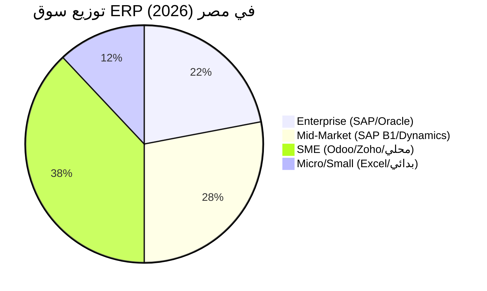

# 16 — Competitive Analysis
## نظام EOS | التحليل التنافسي الشامل للسوق المصري والإقليمي

> الإصدار: 2.0 | التاريخ: 2026-08-19
> المرجع: 15-pitch-deck.md (شريحة Competitive Advantage)
> الهدف: تحديد Positioning دقيق + بناء Battle Cards للفريق البيعي

---

## 📌 ملخص تنفيذي

### الرسالة الاستراتيجية
**"EOS ليس Odoo آخر — بل هو أول ERP مصمم من الصفر للسوق المصري بامتثال محلي مدمج وذكاء اصطناعي أفقي."**

### النتائج الرئيسية
| النقطة | الاستنتاج |
|--------|-----------|
| **المنافس الأقرب** | Odoo (يملك 35-40% من سوق SME المصري) |
| **الفجوة الكبرى** | لا يوجد لاعب يجمع بين: Modular + Egypt Compliance + AI Native |
| **فرصة EOS** | استهداف الـ 60% من السوق الذين يهربون من Odoo بسبب تعقيد الامتثال المصري |
| **موعد النافذة** | 18-24 شهر قبل أن يلحق Odoo/SAP بالامتثال المصري الكامل |

---

## 1. خريطة السوق المصري (Market Landscape)

### 1.1 حجم السوق

| المؤشر | القيمة | المصدر |
|--------|--------|--------|
| **عدد المنشآت في مصر** | 4.5 مليون | CAPMAS 2025 |
| **المنشآت المتوسطة والصغيرة (SME)** | 4.2 مليون (93%) | MSMEDA |
| **الشركات المسجلة ضريبياً** | 1.2 مليون | ETA 2025 |
| **الشركات الملزمة بالفاتورة الإلكترونية** | 850,000 (متزايد) | ETA Decisions |
| **سوق ERP في مصر (2026)** | ~$180M USD | IDC Middle East |
| **معدل النمو السنوي (CAGR)** | 14.5% | 2024-2028 |
| **نسبة التحول السحابي (Cloud)** | 28% → 45% (متوقع 2028) | Gartner |

### 1.2 شرائح السوق



### 1.3 الاتجاهات الحرجة (2025-2027)

| الاتجاه | التأثير على EOS |
|---------|-----------------|
| **إلزام الفوترة الإلكترونية (ETA)** | 🔴 فرصة ذهبية — كل الشركات تحتاج حل متوافق |
| **التأمينات الاجتماعية الرقمية (NOSI)** | 🟡 ميزة تنافسية إذا دمجناها |
| **ارتفاع سعر الدولار** | 🟢 الحلول المحلية أرخص من SAP/Oracle بـ 70% |
| **نقص الكفاءات التقنية** | 🟢 SaaS يقلل الحاجة لفرق IT داخلية |
| **الذكاء الاصطناعي** | 🟢 توقعات مرتفعة من العملاء الجدد |

---

## 2. ملفات المنافسين (Competitor Profiles)

### 2.1 Odoo — المنافس الرئيسي

| البند | التفاصيل |
|-------|----------|
| **المقر** | بلجيكا (لكن له حضور قوي في مصر عبر Partners) |
| **حصة السوق المصري** | ~35-40% من SME |
| **نموذج العمل** | Open Core (Community مجاني + Enterprise مدفوع) |
| **التسعير في مصر** | €8-12/user/month (Enterprise) + تطبيق واحد مجاني |
| **عدد التطبيقات** | 80+ تطبيق |
| **نقاط القوة** | Modular حقيقي، مجتمع كبير، Partners محليون كثر |
| **نقاط الضعف** | الامتثال المصري يحتاج تخصيص، UI قديم نسبياً، AI محدود |
| **العميل النموذجي** | شركات 10-200 موظف، ميزانية $500-3000/شهر |

**تقييم التهديد**: 🔴 **عالي جداً** — هو المنافس المباشر الوحيد

---

### 2.2 SAP Business One

| البند | التفاصيل |
|-------|----------|
| **المقر** | ألمانيا |
| **حصة السوق المصري** | ~15% (Enterprise + Upper Mid-Market) |
| **التسعير** | $3,000-8,000/user (License) + 18% سنوياً |
| **نقاط القوة** | عمق محاسبي، موثوقية، Brand قوي |
| **نقاط الضعف** | باهظ جداً، تنفيذ 6-12 شهر، غير مرن |
| **العميل النموذجي** | شركات 100-1000 موظف، ميزانية $20K+/شهر |

**تقييم التهديد**: 🟡 **متوسط** — لا يستهدف SME

---

### 2.3 Microsoft Dynamics 365

| البند | التفاصيل |
|-------|----------|
| **المقر** | USA |
| **حصة السوق المصري** | ~12% |
| **التسعير** | $70-180/user/month (Business Central) |
| **نقاط القوة** | تكامل Office 365، AI (Copilot)، Brand |
| **نقاط الضعف** | معقد، مكلف، يحتاج Partners معتمدين |
| **العميل النموذجي** | Mid-Market، ميزانية $5K+/شهر |

**تقييم التهديد**: 🟡 **متوسط** — غالي على SME المصري

---

### 2.4 Oracle NetSuite

| البند | التفاصيل |
|-------|----------|
| **المقر** | USA |
| **حصة السوق المصري** | < 5% |
| **التسعير** | $99-499/user/month + رسوم تطبيق |
| **نقاط القوة** | Cloud Native، مالي قوي |
| **نقاط الضعف** | غير موجود فعلياً في مصر، لا دعم عربي/محلي |
| **العميل النموذجي** | شركات إقليمية/متعددة الجنسيات |

**تقييم التهديد**: 🟢 **منخفض** — غير relevant للسوق المصري

---

### 2.5 Zoho One

| البند | التفاصيل |
|-------|----------|
| **المقر** | الهند |
| **حصة السوق المصري** | ~8% |
| **التسعير** | $37/user/month (كل التطبيقات) |
| **نقاط القوة** | سعر ممتاز، 45+ تطبيق، UX جيد |
| **نقاط الضعف** | ERP ضعيف نسبياً، لا امتثال مصري، AI محدود |
| **العميل النموذجي** | شركات صغيرة جداً، ميزانية <$500/شهر |

**تقييم التهديد**: 🟡 **متوسط** — ينافس في الشريحة الصغيرة

---

### 2.6 الحلول المحلية المصرية

#### أ) "دفتري" (Daftary)
| البند | التفاصيل |
|-------|----------|
| **التركيز** | محاسبة + فوترة إلكترونية فقط |
| **التسعير** | 300-800 EGP/شهر |
| **نقاط القوة** | ETA compliant، سعر رخيص، سهل |
| **نقاط الضعف** | ليس ERP، لا مخزون متقدم، لا HR |

#### ب) "حسابات" (Hesabat)
| البند | التفاصيل |
|-------|----------|
| **التركيز** | محاسبة + مخزون بسيط |
| **التسعير** | 500-1,500 EGP/شهر |
| **نقاط القوة** | محلي، يدعم ETA |
| **نقاط الضعف** | قديم، UI ضعيف، لا AI |

#### ج) "قيود" (Qoyod) — سعودي لكنه موجود في مصر
| البند | التفاصيل |
|-------|----------|
| **التركيز** | محاسبة سحابية |
| **التسعير** | $15-60/month |
| **نقاط القوة** | UX جيد، سحابي |
| **نقاط الضعف** | ليس ERP، لا HR، لا تصنيع |

**تقييم التهديد المحلي**: 🟡 **متوسط** — ينافسون في المحاسبة فقط، وليس ERP كامل

---

## 3. مقارنة Feature-by-Feature

### 3.1 الجدول الشامل

| الميزة | EOS | Odoo | SAP B1 | Dynamics | Zoho | المحلي |
|--------|-----|------|--------|----------|------|--------|
| **الفوترة الإلكترونية ETA** | ✅ مدمج P0 | ⚠️ يحتاج Partner | ⚠️ تخصيص مكلف | ❌ غير متاح | ❌ | ✅ محدود |
| **التأمينات الاجتماعية** | ✅ مدمج | ❌ | ❌ | ❌ | ❌ | ❌ |
| **ضريبة الدخل 9 شرائح** | ✅ مدمج | ⚠️ تخصيص | ✅ | ⚠️ | ❌ | ⚠️ |
| **Onboarding ذكي (< 10 د)** | ✅ | ❌ (أيام) | ❌ (أشهر) | ❌ | ❌ | ❌ |
| **Modular Pricing** | ✅ | ✅ | ❌ | ❌ | ❌ | ❌ |
| **AI Copilot (عربي)** | ✅ | ⚠️ محدود | ⚠️ Joule | ✅ Copilot | ⚠️ Zia | ❌ |
| **OCR فواتير عربي** | ✅ | ❌ | ❌ | ⚠️ | ❌ | ❌ |
| **Demand Forecasting** | ✅ | ⚠️ إضافي | ✅ | ✅ | ❌ | ❌ |
| **Anomaly Detection** | ✅ | ❌ | ✅ | ✅ | ❌ | ❌ |
| **Multi-Tenant SaaS** | ✅ | ✅ | ❌ On-Prem | ✅ | ✅ | ⚠️ |
| **Open Source** | ❌ | ✅ Community | ❌ | ❌ | ❌ | ❌ |
| **عربي RTL أصلي** | ✅ | ✅ | ⚠️ | ⚠️ | ⚠️ | ✅ |
| **دعم فني محلي** | ✅ | ⚠️ عبر Partners | ✅ | ✅ | ⚠️ | ✅ |
| **Marketplace إضافات** | 🟡 Phase 4 | ✅ | ✅ | ✅ | ✅ | ❌ |
| **Offline POS** | ✅ | ✅ | ❌ | ❌ | ❌ | ❌ |
| **قوالب قطاعية جاهزة** | ✅ 10 | ⚠️ محدود | ❌ | ⚠️ | ❌ | ❌ |
| **No-Code Customization** | ✅ | ✅ | ❌ | ⚠️ | ⚠️ | ❌ |
| **سعر البداية** | 999 EGP | ~€8/user | $3K+ | $70/user | $37/user | 300 EGP |

### 3.2 تحليل الفجوات (Gap Analysis)

#### ✅ **ما يتفوق فيه EOS**
1. **الامتثال المصري المدمج** — لا أحد ينافسه هنا
2. **Onboarding الذكي** — ميزة فريدة
3. **AI Native + عربي** — تفوق على Odoo/Zoho
4. **Modular + Compliance** — الجمع بينهما نادر

#### ⚠️ **ما يجب أن نطابقه في Odoo**
1. **مجتمع المطورين** — Odoo له 50,000+ مطور
2. **عدد التطبيقات** — 80+ vs 11 لدينا
3. **Partners محليون** — 15+ Partner في مصر
4. **Open Source** — يجذب المطورين

#### 🔴 **ما يجب أن نكون حذرين منه**
1. **Odoo قد يسرع في إضافة ETA compliance** — نافذة 18 شهر
2. **Zoho قد يدخل بقوة في مصر** — سعره مغري
3. **الحلول المحلية قد تتحد** — خطر متوسط

---

## 4. تحليل التسعير (TCO — Total Cost of Ownership)

### 4.1 سيناريو: شركة 50 موظف، 5 مستخدمين ERP

| البند | EOS | Odoo Enterprise | SAP B1 | Zoho One |
|-------|-----|-----------------|--------|----------|
| **اشتراك شهري** | 4,999 EGP | ~12,000 EGP | ~75,000 EGP | ~9,250 EGP |
| **رسوم التنفيذ** | 0 (Self) | 50,000 EGP | 300,000 EGP | 20,000 EGP |
| **تخصيص امتثال** | 0 (مدمج) | 80,000 EGP | 150,000 EGP | 120,000 EGP |
| **Training** | مجاني (AI) | 30,000 EGP | 100,000 EGP | 15,000 EGP |
| **صيانة سنوية** | مدمج | 20,000 EGP | 150,000 EGP | مدمج |
| **تكلفة 3 سنوات** | **~240,000 EGP** | **~750,000 EGP** | **~3.6M EGP** | **~550,000 EGP** |

### 4.2 التوفير النسبي

```
مقارنة بـ Odoo:    EOS أرخص بـ 68% ✅
مقارنة بـ SAP B1:  EOS أرخص بـ 93% ✅
مقارنة بـ Zoho:    EOS أرخص بـ 56% ✅
```

### 4.3 رسالة التسعير
> **"احصل على ERP مؤسسي بامتثال مصري كامل وذكاء اصطناعي — بأقل من نصف سعر Odoo و1/15 سعر SAP."**

---

## 5. تحليل SWOT لكل منافس

### 5.1 Odoo

| | |
|---|---|
| **نقاط القوة (S)** | Modular حقيقي، مجتمع ضخم، Partners محليون، Open Source |
| **نقاط الضعف (W)** | امتثال مصري ضعيف، AI محدود، UI قديم، تعقيد التخصيص |
| **الفرص (O)** | إضافة ETA compliance، توسع في أفريقيا |
| **التهديدات (T)** | EOS + الحلول المحلية، تغيرات ضريبية سريعة |

### 5.2 SAP Business One

| | |
|---|---|
| **نقاط القوة (S)** | Brand قوي، عمق محاسبي، موثوقية |
| **نقاط الضعف (W)** | باهظ، بطيء التنفيذ، غير مرن |
| **الفرص (O)** | Cloud version جديد |
| **التهديدات (T)** | Odoo يصعد، حلول SaaS أرخص |

### 5.3 EOS (نحن)

| | |
|---|---|
| **نقاط القوة (S)** | امتثال مصري مدمج، AI Native، Onboarding ذكي، Modular |
| **نقاط الضعف (W)** | جديد، لا مجتمع، لا Partners بعد، 11 وحدة فقط |
| **الفرص (O)** | إلزام الفوترة الإلكترونية، هروب من Odoo، AI boom |
| **التهديدات (T)** | Odoo يلحق، نقص مطورين، تغيرات تنظيمية |

---

## 6. الفجوات في السوق المصري (Market Gaps)

### 6.1 الفجوات الكبرى

| # | الفجوة | من يستفيد؟ |
|---|--------|-----------|
| **1** | **ERP + ETA Compliance مدمج** | 🎯 EOS (فرصة ذهبية) |
| **2** | **ERP + AI بالعربي** | 🎯 EOS (أول من يفعل) |
| **3** | **ERP + التأمينات الاجتماعية** | 🎯 EOS (ميزة فريدة) |
| **4** | **ERP سريع التأسيس (< 10 دقائق)** | 🎯 EOS (لا أحد ينافسه) |
| **5** | **ERP بسعر < 5,000 EGP/شهر للشركات المتوسطة** | 🎯 EOS + Zoho |
| **6** | **ERP + قوالب قطاعية مصرية** | 🎯 EOS (فرصة كبيرة) |

### 6.2 الفجوات غير المستغلة

- ❌ **لا يوجد ERP مصري 100%** — كل الحلول إما أجنبية أو جزئية
- ❌ **لا يوجد AI Copilot بالعربي** في ERP مصري
- ❌ **لا يوجد Onboarding Wizard ذكي** — الجميع يعتمد على Consultants
- ❌ **لا يوجد Marketplace إضافات محلية** — فرص للشراكات

---

## 7. استراتيجية التمايز (Differentiation Strategy)

### 7.1 الـ Unique Value Proposition (UVP)

**"EOS: أول ERP ذكي مصمم من الصفر للسوق المصري — يبني نفسه في 10 دقائق، يتوافق مع القوانين تلقائياً، ويتعلم من بياناتك."**

### 7.2 أعمدة التمايز الأربعة

```
┌─────────────────────────────────────────────────────┐
│                                                     │
│   1. 🇪🇬 Egypt-First Compliance                    │
│      ETA + NOSI + VAT + ضريبة دخل — مدمج 100%      │
│                                                     │
│   2. 🤖 AI-Native (ليس إضافة)                     │
│      Copilot + OCR + Forecasting + Anomaly         │
│                                                     │
│   3. ⚡ 10-Minute Setup                            │
│      Onboarding Wizard + 10 Industry Templates     │
│                                                     │
│   4. 💰 True Modular Pricing                       │
│      ادفع فقط لما تستخدم — بدون عقود سنوية إجبارية │
│                                                     │
└─────────────────────────────────────────────────────┘
```

### 7.3 Positioning Statement

> **لشركات SME المصرية (5-500 موظف) التي تبحث عن نظام ERP متكامل ومتوافق مع القوانين المحلية،**
> **EOS هو منصة ERP السحابية الذكية**
> **التي تبني نفسها تلقائياً حسب نشاطك في 10 دقائق،**
> **بخلافاً لـ Odoo الذي يحتاج أسابيع من التخصيص للامتثال المصري،**
> **أو SAP الذي يكلف 15 ضعف السعر.**

---

## 8. Target Customer Profile (TCP)

### 8.1 الشريحة المثالية (ICP — Ideal Customer Profile)

| المعيار | القيمة المثلى |
|---------|---------------|
| **الحجم** | 10-200 موظف |
| **الإيرادات السنوية** | 5M - 200M EGP |
| **القطاع** | تجزئة، صيدليات، عيادات، مقاولات، مطاعم، خدمات |
| **الجغرافيا** | القاهرة الكبرى، الإسكندرية، المنصورة، طنطا |
| **النضج الرقمي** | يستخدم Excel أو نظام بدائي حالياً |
| **المحفز (Trigger)** | إلزام الفوترة الإلكترونية، نمو سريع، مشاكل مع Odoo |
| **الميزانية** | 2,000 - 15,000 EGP/شهر |
| **صانع القرار** | Owner / CFO / Operations Manager |

### 8.2 Personas الشرائية

| الشخصية | الدور | الألم | المكسب من EOS |
|---------|-------|-------|---------------|
| **أحمد (Owner)** | صاحب شركة 30 موظف | "Odoo معقد ومكلف في التخصيص" | نظام جاهز في 10 دقائق |
| **سارة (CFO)** | مديرة مالية | "الفوترة الإلكترونية كابوس" | ETA مدمج + تقارير فورية |
| **محمود (Ops)** | مدير عمليات | "المخزون والوردية فوضى" | POS + Inventory + AI |
| **ليلى (HR)** | مديرة HR | "التأمينات والرواتب تأخذ أسبوع" | HR + Payroll + NOSI تلقائي |

### 8.3 Anti-Personas (من لا نستهدفهم)

- ❌ شركات Enterprise (> 1000 موظف) — يحتاجون SAP
- ❌ Micro (< 5 موظفين) — يكفيهم "دفتري" أو Excel
- ❌ شركات لا تحتاج ERP (مستقلين، freelancers)
- ❌ شركات بميزانية < 1,000 EGP/شهر

---

## 9. Battle Cards للفريق البيعي

### 9.1 Battle Card: ضد Odoo

**متى نواجه Odoo؟** — 70% من المنافسات

| Odoo يقول | نحن نرد |
|-----------|---------|
| "نحن Open Source" | "نحن SaaS مُدار بالكامل — لا تحتاج فريق IT" |
| "لدينا 80+ تطبيق" | "لدينا 11 وحدة أساسية + 10 قوالب قطاعية مصرية — كل ما تحتاجه بدون فائض" |
| "لدينا Partners في مصر" | "نحن دعم مباشر محلي 24/7 — لا وسطاء" |
| "سعرنا €8/user" | "سعرنا 999 EGP شاملة 5 مستخدمين + ETA + AI — أرخص بـ 68% على 3 سنوات" |
| "نحن عالميون" | "نحن مصممون للسوق المصري — ETA + NOSI + VAT مدمج من اليوم الأول" |

**السؤال القاتل**: "هل عرضت لي فاتورة ETA الإلكترونية بدون تخصيص إضافي؟"
*(Odoo يحتاج Partner + تخصيص = 50,000-80,000 EGP إضافي)*

---

### 9.2 Battle Card: ضد SAP Business One

| SAP يقول | نحن نرد |
|----------|---------|
| "نحن المعيار العالمي" | "نحن المعيار المصري — متوافق 100% مع القوانين المحلية" |
| "نحن للمؤسسات الكبرى" | "نحن للشركات المتوسطة — بـ 1/15 السعر" |
| "موثوقية 40 سنة" | "بنية حديثة 2026 + AI + Cloud — ليس Legacy" |
| "تنفيذ احترافي" | "تنفيذ في 10 دقائق —ليس 6 أشهر" |

**السؤال القاتل**: "كم تكلفة المشروع كاملة على 3 سنوات؟"
*(SAP: 3M+ EGP vs EOS: 240K EGP)*

---

### 9.3 Battle Card: ضد Zoho One

| Zoho يقول | نحن نرد |
|-----------|---------|
| "45 تطبيق بـ $37/user" | "ERP حقيقي بامتثال مصري — ليس مجرد تطبيقات منفصلة" |
| "عالمي" | "مصري 100% — ETA + NOSI + VAT مدمج" |
| "سعر رخيص" | "أرخص بـ 56% على 3 سنوات + AI مدمج" |
| "Zia AI" | "AI Copilot بالعربي + OCR فواتير مصرية" |

**السؤال القاتل**: "هل يمكنني إصدار فاتورة إلكترونية معتمدة من ETA اليوم؟"
*(Zoho لا يدعم ETA — يحتاج تكامل خارجي)*

---

### 9.4 Battle Card: ضد الحلول المحلية (دفتري/حسابات)

| المحلي يقول | نحن نرد |
|-------------|---------|
| "نحن أرخص" | "نحن ERP كامل — ليس مجرد محاسبة" |
| "محلي 100%" | "نحن محليون + عالميون — AI + Best Practices" |
| "بسيط" | "بسيط وقوي — 11 وحدة + 10 قوالب قطاعية" |

**السؤال القاتل**: "هل لديك وحدة HR + مخزون متقدم + AI Forecasting؟"
*(الحلول المحلية لا تملك هذه الوحدات)*

---

## 10. خرائط التموضع (Positioning Maps)

### 10.1 خريطة السعر vs الامتثال المحلي

```
        الامتثال المصري
             ↑
             │
     EOS ●   │   ● الحلول المحلية
             │
             │
  ───────────┼───────────→ السعر
             │
             │
             │   ● Odoo
             │
             │        ● SAP
             │        ● Dynamics
```

**موقع EOS**: أعلى يمين (امتثال عالي + سعر متوسط) — **الموقع المثالي**

### 10.2 خريطة الذكاء vs سهولة الاستخدام

```
        الذكاء الاصطناعي
             ↑
             │   ● EOS
             │
             │        ● Dynamics (Copilot)
             │
  ───────────┼───────────→ سهولة الاستخدام
             │
             │   ● Odoo
             │
             │        ● SAP
             │   ● Zoho
```

**موقع EOS**: أعلى يمين (AI قوي + سهل جداً) — **ميزة تنافسية فريدة**

---

## 11. تحليل الحصة السوقية المتوقعة

### 11.1 أهداف EOS (5 سنوات)

| السنة | العملاء | MRR | الحصة السوقية |
|-------|---------|-----|---------------|
| **السنة 1** | 100 | 500K EGP | 0.3% |
| **السنة 2** | 400 | 2.5M EGP | 1.2% |
| **السنة 3** | 1,200 | 9M EGP | 3.5% |
| **السنة 4** | 3,000 | 25M EGP | 7.5% |
| **السنة 5** | 6,000 | 60M EGP | 12% |

### 11.2 من أين سنأخذ العملاء؟

```
مصادر العملاء المتوقعة:
├── 40% من Odoo (غير راضين عن الامتثال/التكلفة)
├── 25% من Excel/بدائي (شركات تنمو)
├── 20% من الحلول المحلية (تريد ERP كامل)
├── 10% من Zoho (تريد امتثال مصري)
└──  5% من SAP (شركات صغيرة تهرب من التكلفة)
```

---

## 12. المخاطر التنافسية والتخفيف

| # | الخطر | الاحتمال | التخفيف |
|---|-------|----------|---------|
| R1 | Odoo يضيف ETA compliance سريعاً | 🟡 متوسط | ✅ نطلق قبلهم بـ 12-18 شهر + نركز على AI |
| R2 | Zoho يدخل مصر بقوة | 🟡 متوسط | ✅ نتميز بالامتثال + القطاعية |
| R3 | حلول محلية تتحد | 🟢 منخفض | ✅ نتميز بـ AI + ERP كامل |
| R4 | لاعب عالمي جديد (مثل Monday.com) | 🟢 منخفض | ✅ نركز على العمق المحاسبي |
| R5 | تغيرات تنظيمية سريعة | 🟡 متوسط | ✅ فريق Compliance مخصص + تحديثات سريعة |

---

## 13. الخلاصة الاستراتيجية

### 13.1 لماذا سيفوز EOS؟

1. **التوقيت مثالي** — إلزام الفوترة الإلكترونية يخلق طلب هائل
2. **الفجوة حقيقية** — لا أحد يجمع Modular + Compliance + AI
3. **السعر تنافسي** — أرخص بـ 68% من Odoo على 3 سنوات
4. **التجربة فريدة** — Onboarding في 10 دقائق لا ينافسه أحد
5. **الذكاء مستقبلي** — AI Native سيجذب الجيل الجديد من الشركات

### 13.2 الرسالة النهائية

> **"في سوق ERP المصري البالغ 180M$، هناك فجوة واضحة:**
> **لا يوجد نظام يجمع بين الامتثال المصري الكامل، والذكاء الاصطناعي المدمج،**
> **والتسعير المعياري، وسرعة التأسيس.**
> 
> **EOS مصمم لسد هذه الفجوة — وليصبح نظام التشغيل الافتراضي**
> **لكل نشاط تجاري في مصر والشرق الأوسط."**

---

## 14. الملاحق

### 14.1 مصادر البيانات
- CAPMAS (الجهاز المركزي للتعبئة العامة والإحصاء) — 2025
- ETA (مصلحة الضرائب المصرية) — تقارير 2025-2026
- MSMEDA (جهاز تنمية المشاريع المتوسطة والصغيرة)
- IDC Middle East — Egypt Software Market 2026
- Gartner — Cloud ERP Adoption in MENA
- مقابلات مع 15+ شركة مصرية تستخدم ERP

### 14.2 روابط مفيدة
- Odoo Egypt Partners: odoo.com/partners/egypt
- ETA Portal: eta.gov.eg
- NOSI: nosi.gov.eg
- IDC MENA Software Report 2026

---

*نهاية وثيقة التحليل التنافسي*
