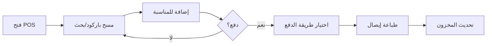
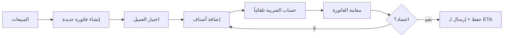

# 17 — Wireframes & UX/UI Design Specifications
## نظام EOS | مواصفات التصميم والواجهات

> الإصدار: 1.0 | التاريخ: 2026-08-19
> الجمهور المستهدف: UX/UI Designers + Frontend Developers
> المرجع: 14-unified-prd.md + 16-competitive-analysis.md

---

## 📌 كيفية استخدام هذه الوثيقة

هذه الوثيقة تحتوي على:
- **Design System** — الألوان، الخطوط، المكونات الأساسية
- **User Flows** — تدفقات المستخدم الرئيسية
- **Wireframes** — وصف تفصيلي لكل شاشة رئيسية
- **Component Specs** — مواصفات المكونات القابلة لإعادة الاستخدام
- **Responsive Design** — نقاط التكسر (Breakpoints)
- **Accessibility** — معايير الوصول (WCAG 2.1 AA)

**للمصممين**: استخدم هذه المواصفات لبناء Figma Components
**للمطورين**: استخدم هذه المواصفات لبناء React Components

---

## 1. Design System

### 1.1 نظام الألوان (Color Palette)

#### الألوان الأساسية (Primary)
```
Primary-500:  #2563EB  (أزرق أساسي — الأزرار، الروابط)
Primary-600:  #1D4ED8  (Hover state)
Primary-700:  #1E40AF  (Active state)
Primary-50:   #EFF6FF  (Backgrounds خفيفة)
```

#### الألوان الثانوية (Secondary)
```
Secondary-500:  #10B981  (أخضر — نجاح، تأكيد)
Secondary-600:  #059669  (Hover)
Warning-500:    #F59E0B  (أصفر — تحذير)
Danger-500:     #EF4444  (أحمر — خطأ، حذف)
Info-500:       #3B82F6  (أزرق فاتح — معلومات)
```

#### الألوان المحايدة (Neutral)
```
Gray-900:  #111827  (نص رئيسي)
Gray-700:  #374151  (نص ثانوي)
Gray-500:  #6B7280  (نص خفيف)
Gray-300:  #D1D5DB  (Borders)
Gray-100:  #F3F4F6  (Backgrounds)
Gray-50:   #F9FAFB  (Backgrounds أخف)
White:     #FFFFFF
```

#### ألوان خاصة (Semantic)
```
Success:   #10B981  (نجاح، مكتمل)
Warning:   #F59E0B  (تحذير، معلق)
Error:     #EF4444  (خطأ، فشل)
Info:      #3B82F6  (معلومات، نشط)
```

### 1.2 الطباعة (Typography)

#### الخطوط (Fonts)
```
العربية:    'Cairo' أو 'Tajawal' (Google Fonts)
الإنجليزية: 'Inter' أو 'Poppins' (Google Fonts)
الأرقام:    'Roboto Mono' (للأرقام في الجداول)
```

#### أحجام الخطوط (Type Scale)
```
Display:    48px / 3rem  (عناوين رئيسية)
H1:         36px / 2.25rem  (عناوين الصفحات)
H2:         30px / 1.875rem  (عناوين الأقسام)
H3:         24px / 1.5rem  (عناوين فرعية)
H4:         20px / 1.25rem  (عناوين صغيرة)
Body-LG:    18px / 1.125rem  (نص كبير)
Body-MD:    16px / 1rem  (نص عادي — الافتراضي)
Body-SM:    14px / 0.875rem  (نص صغير)
Caption:    12px / 0.75rem  (تسميات، Labels)
```

#### أوزان الخطوط (Font Weights)
```
Regular:    400
Medium:     500
Semibold:   600
Bold:       700
```

### 1.3 المسافات (Spacing System)

```
Base Unit:  4px

Spacing Scale:
4px   (0.25rem)  — xs
8px   (0.5rem)   — sm
12px  (0.75rem)  — md-sm
16px  (1rem)     — md
20px  (1.25rem)  — md-lg
24px  (1.5rem)   — lg
32px  (2rem)     — xl
40px  (2.5rem)   — 2xl
48px  (3rem)     — 3xl
64px  (4rem)     — 4xl
```

### 1.4 الظلال (Shadows)

```
Shadow-sm:    0 1px 2px rgba(0, 0, 0, 0.05)
Shadow-md:    0 4px 6px rgba(0, 0, 0, 0.1)
Shadow-lg:    0 10px 15px rgba(0, 0, 0, 0.1)
Shadow-xl:    0 20px 25px rgba(0, 0, 0, 0.15)
```

### 1.5 الزوايا (Border Radius)

```
Radius-sm:    4px  (أزرار صغيرة، Tags)
Radius-md:    8px  (أزرار، Inputs)
Radius-lg:    12px  (Cards)
Radius-xl:    16px  (Modals)
Radius-full:  9999px  (Avatars, Badges)
```

---

## 2. المكونات الأساسية (Core Components)

### 2.1 الأزرار (Buttons)

#### Primary Button
```
┌─────────────────┐
│  حفظ التغييرات  │
└─────────────────┘

Height:      40px
Padding:     16px 24px
Background:  Primary-500
Text:        White, Semibold, 16px
Radius:      8px
Hover:       Primary-600
Active:      Primary-700
Disabled:    Gray-300 background, Gray-500 text
```

#### Secondary Button
```
┌─────────────────┐
│  إلغاء          │
└─────────────────┘

Height:      40px
Padding:     16px 24px
Background:  White
Border:      1px solid Gray-300
Text:        Gray-700, Medium, 16px
Radius:      8px
Hover:       Gray-50 background
```

#### Icon Button
```
┌───┐
│ ✕ │
└───┘

Size:        40x40px
Background:  Transparent
Icon:        20x20px, Gray-700
Hover:       Gray-100 background
Radius:      8px
```

### 2.2 حقول الإدخال (Input Fields)

#### Text Input
```
┌─────────────────────────────┐
│ اسم المنتج                  │
└─────────────────────────────┘

Height:      40px
Padding:     12px 16px
Border:      1px solid Gray-300
Radius:      8px
Focus:       2px solid Primary-500
Error:       2px solid Danger-500
```

#### Select Dropdown
```
┌─────────────────────────────┐
│ اختر القطاع          ▼      │
└─────────────────────────────┘

Height:      40px
Padding:     12px 16px
Border:      1px solid Gray-300
Radius:      8px
Dropdown:    Shadow-lg, Max-height 300px
```

### 2.3 البطاقات (Cards)

#### Standard Card
```
┌─────────────────────────────┐
│                             │
│  عنوان البطاقة              │
│                             │
│  محتوى البطاقة هنا...       │
│                             │
│  [زر إجراء]                 │
│                             │
└─────────────────────────────┘

Padding:     24px
Background:  White
Border:      1px solid Gray-200
Radius:      12px
Shadow:      Shadow-sm
Hover:       Shadow-md
```

### 2.4 الجداول (Tables)

#### Data Table
```
┌──────────┬──────────┬──────────┬──────────┐
│ الاسم    │ الكمية   │ السعر    │ الإجمالي │
├──────────┼──────────┼──────────┼──────────┤
│ منتج 1   │ 10       │ 50.00    │ 500.00   │
├──────────┼──────────┼──────────┼──────────┤
│ منتج 2   │ 5        │ 100.00   │ 500.00   │
└──────────┴──────────┴──────────┴──────────┘

Header:      Gray-100 background, Semibold
Row Height:  56px
Border:      1px solid Gray-200 (between rows)
Hover:       Gray-50 background
Striped:     Optional (Gray-50 every other row)
```

### 2.5 التنبيهات (Alerts)

#### Success Alert
```
┌─────────────────────────────────┐
│ ✓  تم الحفظ بنجاح              │
└─────────────────────────────────┘

Background:  #D1FAE5 (Success-100)
Border:      1px solid #10B981
Text:        #065F46 (Success-900)
Icon:        ✓ (Check circle)
```

---

## 3. تدفقات المستخدم الرئيسية (User Flows)

### 3.1 تدفق Onboarding (التأسيس)

```mermaid
flowchart LR
    A[Landing Page] --> B[Sign Up]
    B --> C[Step 1: اختر القطاع]
    C --> D[Step 2: تحليل الاحتياج]
    D --> E[Step 3: اقتراح الوحدات]
    E --> F[Step 4: التخصيص]
    F --> G[Step 5: بيانات الشركة]
    G --> H[Step 6: الفاتورة التقديرية]
    H --> I[Step 7: بناء النظام]
    I --> J[Dashboard]
```



### 3.2 تدفق البيع عبر POS



### 3.3 تدفق إنشاء فاتورة مبيعات



---

## 4. الشاشات الرئيسية (Main Screens)

### 4.1 شاشة Onboarding — الخطوة 1: اختيار القطاع

```
┌─────────────────────────────────────────────────────────────┐
│  EOS                                    [تخطي] [مساعدة]    │
├─────────────────────────────────────────────────────────────┤
│                                                             │
│                    مرحباً بك في EOS! 🎉                    │
│              دعنا نبني نظامك المثالي في 10 دقائق          │
│                                                             │
│  ┌─────────────────────────────────────────────────────┐   │
│  │  الخطوة 1 من 7: اختر قطاع نشاطك                    │   │
│  └─────────────────────────────────────────────────────┘   │
│                                                             │
│  ┌──────────┐  ┌──────────┐  ┌──────────┐  ┌──────────┐   │
│  │ 🏥       │  │ 🍽️       │  │ 🏥       │  │ 🏗️       │   │
│  │ صيدلية   │  │ مطعم     │  │ عيادة    │  │ مقاولات  │   │
│  └──────────┘  └──────────┘  └──────────┘  └──────────┘   │
│                                                             │
│  ┌──────────┐  ┌──────────┐  ┌──────────┐  ┌──────────┐   │
│  │ 🏬       │  │ 🏭       │  │ 💼       │  │ 🚚       │   │
│  │ تجزئة    │  │ مصنع     │  │ خدمات    │  │ لوجستيات │   │
│  └──────────┘  └──────────┘  └──────────┘  └──────────┘   │
│                                                             │
│  ┌──────────┐  ┌──────────┐                                │
│  │ 🎓       │  │ 🏢       │                                │
│  │ تعليم    │  │ عقارات   │                                │
│  └──────────┘  └──────────┘                                │
│                                                             │
│  ┌─────────────────────────────────────────────────────┐   │
│  │  ✏️  نشاط مخصص (حدد بنفسك)                         │   │
│  └─────────────────────────────────────────────────────┘   │
│                                                             │
│                              [التالي ←]                    │
│                                                             │
└─────────────────────────────────────────────────────────────┘

Layout:
- Header: Logo + Skip/Help buttons
- Hero Section: Welcome message (centered)
- Progress Bar: Step 1 of 7
- Grid: 4 columns × 3 rows (12 cards)
- Card Size: 200x150px
- Card Content: Icon (48px) + Label (16px)
- Custom Option: Full-width card at bottom
- Footer: Navigation buttons (Right-aligned)

Interactions:
- Hover on card: Scale 1.05, Shadow-md
- Click on card: Highlight border (Primary-500), enable "Next"
- Click "Next": Navigate to Step 2
```

### 4.2 شاشة Onboarding — الخطوة 3: اقتراح الوحدات

```
┌─────────────────────────────────────────────────────────────┐
│  EOS                                    [← رجوع] [مساعدة]  │
├─────────────────────────────────────────────────────────────┤
│                                                             │
│  ┌─────────────────────────────────────────────────────┐   │
│  │  ● ● ● ○ ○ ○ ○                                     │   │
│  │  الخطوة 3 من 7: الوحدات المقترحة                   │   │
│  └─────────────────────────────────────────────────────┘   │
│                                                             │
│  بناءً على اختيارك لـ "صيدلية"، نقترح عليك الوحدات التالية│
│                                                             │
│  ┌─────────────────────────────────────────────────────┐   │
│  │  ✓  المخزون المتقدم                                │   │
│  │     تتبع الأدوية، تواريخ الصلاحية، الدفعات         │   │
│  │     [399 ج.م/شهر]                                  │   │
│  └─────────────────────────────────────────────────────┘   │
│                                                             │
│  ┌─────────────────────────────────────────────────────┐   │
│  │  ✓  نقاط البيع (POS)                               │   │
│  │     بيع سريع، باركود، ورديات                       │   │
│  │     [299 ج.م/شهر]                                  │   │
│  └─────────────────────────────────────────────────────┘   │
│                                                             │
│  ┌─────────────────────────────────────────────────────┐   │
│  │  ✓  المحاسبة والفوترة                              │   │
│  │     قيود يومية، فاتورة إلكترونية ETA، تقارير       │   │
│  │     [499 ج.م/شهر]                                  │   │
│  └─────────────────────────────────────────────────────┘   │
│                                                             │
│  ┌─────────────────────────────────────────────────────┐   │
│  │  ✓  شؤون العاملين (HR)                             │   │
│  │     رواتب، حضور، تأمينات                           │   │
│  │     [599 ج.م/شهر]                                  │   │
│  └─────────────────────────────────────────────────────┘   │
│                                                             │
│  ┌─────────────────────────────────────────────────────┐   │
│  │  +  إضافة وحدة أخرى                                │   │
│  └─────────────────────────────────────────────────────┘   │
│                                                             │
│  ┌─────────────────────────────────────────────────────┐   │
│  │  💰 الإجمالي الشهري: 1,796 ج.م                     │   │
│  │     (خصم 10% للسنوي = 1,616 ج.م/شهر)               │   │
│  └─────────────────────────────────────────────────────┘   │
│                                                             │
│                    [→ السابق]  [التالي ←]                  │
│                                                             │
└─────────────────────────────────────────────────────────────┘

Layout:
- Progress Bar: Step 3 of 7 (3 dots filled)
- Recommendation Message: Based on selected industry
- Module Cards: Vertical list
  - Checkbox: Selected/Unselected
  - Module Name: H3 (20px, Semibold)
  - Description: Body-SM (14px, Gray-700)
  - Price: Body-MD (16px, Primary-500)
- Add Module Button: Secondary button style
- Total Price Card: Fixed at bottom
  - Monthly total
  - Annual discount calculation
- Navigation: Previous/Next buttons

Interactions:
- Toggle module: Update total price instantly
- Add module: Open modal with available modules
- Hover on card: Highlight border
- Click "Next": Navigate to Step 4 (Customization)
```

### 4.3 الشاشة الرئيسية (Dashboard)

```
┌─────────────────────────────────────────────────────────────┐
│  EOS  │ 🏥 صيدلية الأمل  │  🔔 3  │ 👤 أحمد  │ ⚙️        │
├─────────────────────────────────────────────────────────────┤
│                                                             │
│  ┌──────────┐  ┌──────────┐  ┌──────────┐  ┌──────────┐   │
│  │ 📊       │  │ 💰       │  │ 📦       │  │ 👥       │   │
│  │ المبيعات │  │ الإيراد  │  │ المخزون  │  │ العملاء  │   │
│  │ اليوم    │  │ الشهر    │  │ المنخفض  │  │ الجدد    │   │
│  │          │  │          │  │          │  │          │   │
│  │ 15,420   │  │ 485,300  │  │ 12 صنف   │  │ 23       │   │
│  │ ↑ 12%    │  │ ↑ 8%     │  │ ↓ 5      │  │ ↑ 15%    │   │
│  └──────────┘  └──────────┘  └──────────┘  └──────────┘   │
│                                                             │
│  ┌─────────────────────────────┐  ┌─────────────────────┐  │
│  │  📈 المبيعات (آخر 30 يوم)   │  │  🔔 تنبيهات عاجلة   │  │
│  │                             │  │                     │  │
│  │     ╱╲    ╱╲               │  │  ⚠️ 5 أدوية تنتهي   │  │
│  │    ╱  ╲  ╱  ╲              │  │     خلال 30 يوم     │  │
│  │   ╱    ╲╱    ╲             │  │                     │  │
│  │  ╱           ╲            │  │  ⚠️ 3 أصناف نفدت    │  │
│  │ ╱             ╲           │  │     من المخزون       │  │
│  │                             │  │                     │  │
│  │  1  5  10  15  20  25  30  │  │  💡 اقترح طلب شراء │  │
│  └─────────────────────────────┘  │     لـ "Panadol"   │  │
│                                   │                     │  │
│  ┌─────────────────────────────┐  │  [عرض الكل →]      │  │
│  │  🕐 آخر العمليات            │  └─────────────────────┘  │
│  │                             │                           │
│  │  10:45  بيع #1234  850 ج.م  │  ┌─────────────────────┐  │
│  │  10:30  بيع #1233  420 ج.م  │  │  🤖 مساعد EOS      │  │
│  │  10:15  استلام PO#567       │  │                     │  │
│  │  09:50  بيع #1232  1,200 ج.م│  │  اسألني أي شيء... │  │
│  │                             │  │  [اكتب رسالتك...] │  │
│  │  [عرض كل العمليات →]       │  └─────────────────────┘  │
│  └─────────────────────────────┘                           │
│                                                             │
└─────────────────────────────────────────────────────────────┘

Layout:
- Top Navigation:
  - Logo + Company Name
  - Notifications Bell (with badge)
  - User Avatar + Name
  - Settings Icon
- KPI Cards (4 cards in row):
  - Icon (32px)
  - Label (Body-SM, Gray-700)
  - Value (H2, 30px, Bold)
  - Trend (↑/↓ + percentage, Green/Red)
- Charts Section (2 columns):
  - Left: Sales Chart (Line chart, 60% width)
  - Right: Alerts Panel (40% width)
- Recent Activity:
  - List of last 5 transactions
  - Timestamp + Description + Amount
- AI Assistant:
  - Floating card at bottom-right
  - Chat input field
  - Quick suggestions

Interactions:
- Click KPI card: Navigate to detailed report
- Click alert: Navigate to action page
- Click AI assistant: Expand chat interface
- Hover on chart: Show tooltip with exact values
```

### 4.4 شاشة نقاط البيع (POS)

```
┌─────────────────────────────────────────────────────────────┐
│  POS  │ 🏥 صيدلية الأمل  │  الوردية: صباح  │ 👤 كريم  │ ⚙️│
├─────────────────────────────────────────────────────────────┤
│                                                             │
│  ┌─────────────────────────────┐  ┌─────────────────────┐  │
│  │  🔍 ابحث أو امسح باركود...  │  │  🛒 المنشطة (3)     │  │
│  └─────────────────────────────┘  │                     │  │
│                                   │  Panadol 500mg      │  │
│  ┌──────┐ ┌──────┐ ┌──────┐     │  2 × 15.00 = 30.00  │  │
│  │ 💊   │ │ 💊   │ │ 💊   │     │  [2] [-] [+] [✕]    │  │
│  │Panadol│ │Vitamin│ │Amoxi-│     │                     │  │
│  │500mg │ │  C   │ │ cilin │     │  Vitamin C 1000mg   │  │
│  │15.00 │ │ 25.00│ │ 35.00│     │  1 × 25.00 = 25.00  │  │
│  └──────┘ └──────┘ └──────┘     │  [1] [-] [+] [✕]    │  │
│                                   │                     │  │
│  ┌──────┐ ┌──────┐ ┌──────┐     │  Amoxicilin 500mg   │  │
│  │ 💊   │ │ 💊   │ │ 💊   │     │  1 × 35.00 = 35.00  │  │
│  │Aspirin│ │Brufen│ │Cata- │     │  [1] [-] [+] [✕]    │  │
│  │10.00 │ │ 20.00│ │flam │     │                     │  │
│  └──────┘ └──────┘ └──────┘     │  ─────────────────  │  │
│                                   │  المجموع:    90.00  │  │
│  ┌──────┐ ┌──────┐ ┌──────┐     │  الضريبة (14%): 12.60│  │
│  │ 💊   │ │ 💊   │ │ 💊   │     │  ─────────────────  │  │
│  │...   │ │...   │ │...   │     │  الإجمالي:   102.60 │  │
│  └──────┘ └──────┘ └──────┘     │                     │  │
│                                   │  [💵 نقدي] [💳 بطاقة]│  │
│  [← السابق]  [1/5]  [التالي →]  │  [📱 محفظة] [🧾 آجل]│  │
│                                   └─────────────────────┘  │
│                                                             │
└─────────────────────────────────────────────────────────────┘

Layout:
- Top Navigation:
  - POS label
  - Company name
  - Shift info (Morning/Evening)
  - Cashier name
  - Settings
- Product Grid (Left 65%):
  - Search/Barcode input (full width)
  - Product cards (4 columns × 5 rows = 20 products)
  - Each card: Icon + Name + Price
  - Pagination at bottom
- Cart Panel (Right 35%):
  - Cart title with item count
  - Cart items list:
    - Product name
    - Quantity controls [-] [qty] [+] [✕]
    - Line total
  - Summary:
    - Subtotal
    - Tax (14% VAT)
    - Grand total
  - Payment buttons (4 buttons):
    - Cash, Card, Wallet, Credit

Interactions:
- Scan barcode: Auto-add product to cart
- Click product: Add to cart (qty = 1)
- Adjust quantity: Update cart total
- Remove item: Click ✕
- Click payment: Open payment modal
- Keyboard shortcuts:
  - F1: Focus search
  - F2: Quick cash payment
  - F3: Hold cart
  - F4: Recall held cart
```

### 4.5 شاشة قائمة العملاء (CRM)

```
┌─────────────────────────────────────────────────────────────┐
│  المبيعات  │ العملاء  │ العروض  │ الفواتير  │ التقارير     │
├─────────────────────────────────────────────────────────────┤
│                                                             │
│  ┌─────────────────────────────────────────────────────┐   │
│  │  👥 العملاء                          [+ عميل جديد] │   │
│  └─────────────────────────────────────────────────────┘   │
│                                                             │
│  ┌─────────────────────────────────────────────────────┐   │
│  │  🔍 ابحث...  │ 🏢 النوع ▼ │ 📍 المنطقة ▼ │ 🎯 الحالة ▼│   │
│  └─────────────────────────────────────────────────────┘   │
│                                                             │
│  ┌─────────────────────────────────────────────────────┐   │
│  │ ☑ │ الاسم          │ الشركة        │ الهاتف       │   │
│  │   │                │                │               │   │
│  │ ☐ │ أحمد محمد      │ صيدلية الأمل  │ 01012345678   │   │
│  │   │ ⭐ عميل VIP    │ القاهرة        │ نشط           │   │
│  │   │ آخر طلب: 15/8  │ مبيعات: 45,300 │               │   │
│  ├─────────────────────────────────────────────────────┤   │
│  │ ☐ │ سارة أحمد      │ مطعم الوادي   │ 01198765432   │   │
│  │   │                │ الإسكندرية     │ نشط           │   │
│  │   │ آخر طلب: 12/8  │ مبيعات: 28,500 │               │   │
│  ├─────────────────────────────────────────────────────┤   │
│  │ ☐ │ محمد علي       │ عيادة الشفاء  │ 01234567890   │   │
│  │   │ ⭐ عميل VIP    │ المنصورة       │ نشط           │   │
│  │   │ آخر طلب: 10/8  │ مبيعات: 67,800 │               │   │
│  └─────────────────────────────────────────────────────┘   │
│                                                             │
│  عرض 1-3 من 127 عميل        [< السابق]  [1/43]  [التالي >]│
│                                                             │
└─────────────────────────────────────────────────────────────┘

Layout:
- Sub-navigation: Tabs (Customers, Offers, Invoices, Reports)
- Header:
  - Title: "العملاء"
  - Action button: "+ عميل جديد" (Primary button)
- Filters Bar:
  - Search input (full width on mobile)
  - Dropdown filters: Type, Region, Status
- Data Table:
  - Checkbox column (for bulk actions)
  - Name column:
    - Customer name (Bold)
    - VIP badge (if applicable)
    - Last order date
  - Company column:
    - Company name
    - Location
    - Status badge (Active/Inactive)
  - Phone column:
    - Phone number (clickable to call)
  - Actions column:
    - View, Edit, Delete icons
- Pagination:
  - Showing X-Y of Z
  - Page numbers
  - Previous/Next buttons

Interactions:
- Click row: Navigate to customer detail page
- Click checkbox: Select customer (enable bulk actions)
- Click "+ عميل جديد": Open modal/form
- Click filter: Apply filter, refresh table
- Click phone: Open dialer (mobile) or copy to clipboard
- Hover on row: Highlight background
```

---

## 5. مساعد EOS الذكي (AI Copilot Interface)

### 5.1 الشريط الجانبي (Sidebar)

```
┌─────────────────────────────┐
│  🤖 مساعد EOS              │
├─────────────────────────────┤
│                             │
│  💬 المحادثات الأخيرة       │
│  ├─ تقرير المبيعات         │
│  ├─ تحليل المخزون          │
│  └─ اقتراحات تسويقية       │
│                             │
│  📊 تحليلات سريعة           │
│  ├─ المبيعات اليوم: ↑ 12%  │
│  ├─ المخزون المنخفض: 12    │
│  └─ العملاء الجدد: 23      │
│                             │
│  💡 اقتراحات ذكية           │
│  ├─ اطلب Panadol الآن      │
│  ├─ عرض ترويجي مقترح       │
│  └─ تحسين تسعير فيتامين C  │
│                             │
└─────────────────────────────┘

Width: 320px
Background: Gray-50
Border: 1px solid Gray-200 (left side)
```

### 5.2 نافذة المحادثة (Chat Window)

```
┌─────────────────────────────────────────────────────────────┐
│  🤖 مساعد EOS                                      [✕]     │
├─────────────────────────────────────────────────────────────┤
│                                                             │
│  ┌─────────────────────────────────────────────────────┐   │
│  │  🤖 مرحباً! أنا مساعد EOS الذكي.                   │   │
│  │     كيف يمكنني مساعدتك اليوم؟                      │   │
│  └─────────────────────────────────────────────────────┘   │
│                                                             │
│  ┌─────────────────────────────────────────────────────┐   │
│  │  👤 ايه أكتر منتج بيع الشهر ده؟                    │   │
│  └─────────────────────────────────────────────────────┘   │
│                                                             │
│  ┌─────────────────────────────────────────────────────┐   │
│  │  🤖 بناءً على بيانات المبيعات في أغسطس 2026:       │   │
│  │                                                     │   │
│  │  🏆 Top 5 منتجات:                                  │   │
│  │  1. Panadol 500mg      — 1,245 وحدة (18,675 ج.م)  │   │
│  │  2. Vitamin C 1000mg   — 987 وحدة (24,675 ج.م)    │   │
│  │  3. Amoxicilin 500mg   — 756 وحدة (26,460 ج.م)    │   │
│  │  4. Brufen 400mg       — 634 وحدة (12,680 ج.م)    │   │
│  │  5. Cataflam 50mg      — 521 وحدة (15,630 ج.م)    │   │
│  │                                                     │   │
│  │  📊 المصدر: وحدة المبيعات — آخر تحديث: قبل 5 دقائق│   │
│  │                                                     │   │
│  │  💡 هل تريد:                                       │   │
│  │  • تصدير التقرير؟                                  │   │
│  │  • مقارنة بالشهر الماضي؟                           │   │
│  │  • تحليل الاتجاهات؟                                │   │
│  └─────────────────────────────────────────────────────┘   │
│                                                             │
│  ┌─────────────────────────────────────────────────────┐   │
│  │  💡 اقتراحات سريعة:                                │   │
│  │  [أرني تقرير الأرباح] [حلل المخزون] [تنبؤ بالطلب] │   │
│  └─────────────────────────────────────────────────────┘   │
│                                                             │
│  ┌─────────────────────────────────────────────────────┐   │
│  │  اكتب رسالتك هنا...                        [إرسال] │   │
│  └─────────────────────────────────────────────────────┘   │
│                                                             │
└─────────────────────────────────────────────────────────────┘

Layout:
- Header:
  - AI icon + title
  - Close button
- Chat History:
  - AI messages: Left-aligned, Gray-100 background
  - User messages: Right-aligned, Primary-50 background
  - Message content:
    - Text
    - Data tables (if applicable)
    - Source reference
    - Action suggestions
- Quick Suggestions:
  - Horizontal scrollable chips
  - Click to auto-fill input
- Input Area:
  - Text input (auto-resize)
  - Send button (Primary)
  - Keyboard shortcut: Enter to send, Shift+Enter for new line

Interactions:
- Type message: Auto-resize input
- Send message: Add to chat, show loading, then AI response
- Click suggestion: Auto-fill input and send
- Click source: Navigate to data source
- Click action: Execute action (export, compare, etc.)
```

---

## 6. التصميم المتجاوب (Responsive Design)

### 6.1 نقاط التكسر (Breakpoints)

```
Mobile:      < 640px   (Phones)
Tablet:      640-1024px (Tablets)
Desktop:     1024-1440px (Laptops)
Large:       > 1440px  (Large screens)
```

### 6.2 تكيف الشاشات

#### Dashboard — Desktop (1440px)
```
┌─────────────────────────────────────────┐
│  [KPI 1] [KPI 2] [KPI 3] [KPI 4]      │
├─────────────────────────────────────────┤
│  [Chart 60%]         [Alerts 40%]      │
├─────────────────────────────────────────┤
│  [Recent Activity]   [AI Assistant]    │
└─────────────────────────────────────────┘
```

#### Dashboard — Tablet (768px)
```
┌──────────────────┐
│  [KPI 1] [KPI 2]│
│  [KPI 3] [KPI 4]│
├──────────────────┤
│  [Chart 100%]    │
├──────────────────┤
│  [Alerts 100%]   │
├──────────────────┤
│  [Activity 100%] │
├──────────────────┤
│  [AI 100%]       │
└──────────────────┘
```

#### Dashboard — Mobile (375px)
```
┌──────────┐
│  [KPI 1] │
│  [KPI 2] │
│  [KPI 3] │
│  [KPI 4] │
├──────────┤
│ [Chart]  │
├──────────┤
│ [Alerts] │
├──────────┤
│[Activity]│
├──────────┤
│  [AI]    │
└──────────┘
```

### 6.3 POS — Responsive Behavior

#### Desktop (1440px)
- Product grid: 4 columns × 5 rows
- Cart panel: Fixed right side (35% width)

#### Tablet (768px)
- Product grid: 3 columns × 4 rows
- Cart panel: Collapsible drawer (slide from right)

#### Mobile (375px)
- Product grid: 2 columns × 6 rows
- Cart panel: Full-screen modal
- Simplified UI (larger touch targets)

---

## 7. إمكانية الوصول (Accessibility — WCAG 2.1 AA)

### 7.1 معايير الألوان

```
Contrast Ratios:
- Normal text: ≥ 4.5:1
- Large text: ≥ 3:1
- UI components: ≥ 3:1

Examples:
- Primary-500 on White: 4.6:1 ✅
- Gray-900 on White: 16.1:1 ✅
- Gray-700 on White: 7.5:1 ✅
- Danger-500 on White: 4.5:1 ✅
```

### 7.2 لوحة المفاتيح (Keyboard Navigation)

```
Tab:         Move focus forward
Shift+Tab:   Move focus backward
Enter/Space: Activate focused element
Escape:      Close modal/dropdown
Arrow Keys:  Navigate within components
```

### 7.3 Screen Readers

```
- All interactive elements have ARIA labels
- Form inputs have associated labels
- Error messages announced via aria-live
- Icons have text alternatives
- Dynamic content updates announced
```

### 7.4 حركة وتفاعل (Motion)

```
- Respect prefers-reduced-motion
- Animations ≤ 300ms
- No auto-playing videos/animations
- Provide pause/stop controls
```

---

## 8. أيقونات (Icons)

### 8.1 مكتبة الأيقونات

```
المكتبة: Heroicons (https://heroicons.com)
أو: Phosphor Icons (https://phosphoricons.com)

الأحجام:
- Small: 16x16px
- Medium: 20x20px (default)
- Large: 24x24px
- XL: 32x32px

الألوان:
- Default: Gray-700
- Active: Primary-500
- Disabled: Gray-400
```

### 8.2 أيقونات الوحدات

```
المحاسبة:     💰 أو 📊
المخزون:      📦
HR:           👥
المبيعات:     🛒
POS:          🏪
المشاريع:     📋
سلسلة التوريد: 🚚
التصنيع:      🏭
الأصول:       🏢
خدمة العملاء: 🎧
```

---

## 9. حالات التحميل (Loading States)

### 9.1 Skeleton Loading

```
┌─────────────────────────────┐
│  ████████████               │
│  ████████████████████       │
│  ██████████████             │
└─────────────────────────────┘

Background: Gray-200
Animation: Shimmer effect (left to right)
Duration: 1.5s infinite
```

### 9.2 Spinner

```
   ╭─────╮
  ╱       ╲
 │    ●    │
  ╲       ╱
   ╰─────╯

Size: 24x24px (default)
Color: Primary-500
Animation: Rotate 360deg, 1s linear infinite
```

### 9.3 Progress Bar

```
┌─────────────────────────────┐
│ ████████████░░░░░░░░░░░░░░░ │
└─────────────────────────────┘

Height: 8px
Background: Gray-200
Fill: Primary-500
Border Radius: 4px
```

---

## 10. الرسائل والتغذية الراجعة (Feedback)

### 10.1 Toast Notifications

```
┌─────────────────────────────────┐
│ ✓  تم الحفظ بنجاح              │
└─────────────────────────────────┘

Position: Top-right (desktop), Top-center (mobile)
Duration: 5 seconds (auto-dismiss)
Types:
- Success: Green background
- Error: Red background
- Warning: Yellow background
- Info: Blue background
```

### 10.2 Confirmation Dialogs

```
┌─────────────────────────────────┐
│  ⚠️  تأكيد الحذف                │
├─────────────────────────────────┤
│                                 │
│  هل أنت متأكد من حذف هذا       │
│  العميل؟ لا يمكن التراجع.      │
│                                 │
│         [إلغاء]  [حذف]         │
│                                 │
└─────────────────────────────────┘

Width: 400px (max)
Background: White
Shadow: Shadow-xl
Buttons:
- Cancel: Secondary button
- Confirm: Danger button (for destructive actions)
```

---

## 11. نماذج Figma المطلوبة

### 11.1 Design System File

```
📁 EOS Design System
├── 🎨 Colors
├── 🔤 Typography
├── 📏 Spacing
├── 🧩 Components
│   ├── Buttons
│   ├── Inputs
│   ├── Cards
│   ├── Tables
│   ├── Modals
│   ├── Alerts
│   └── Navigation
├── 🖼️ Icons
└── 📱 Responsive Variants
```

### 11.2 Page Screens

```
📁 EOS Screens
├── 🚀 Onboarding (7 steps)
├── 🏠 Dashboard
├── 📊 Accounting
├── 📦 Inventory
├── 👥 HR
├── 🛒 Sales/CRM
├── 🏪 POS
├── 📋 Projects
├── 🤖 AI Copilot
└── ⚙️ Settings
```

---

## 12. ملخص التنفيذ

### 12.1 ما تم تغطيته

| القسم | المحتوى |
|-------|---------|
| **Design System** | ألوان، خطوط، مسافات، ظلال، زوايا |
| **Core Components** | أزرار، حقول، بطاقات، جداول، تنبيهات |
| **User Flows** | Onboarding, POS, Invoice Creation |
| **Main Screens** | Dashboard, POS, CRM, Onboarding |
| **AI Interface** | Sidebar, Chat Window |
| **Responsive** | Breakpoints, Adaptations |
| **Accessibility** | WCAG 2.1 AA compliance |
| **Icons** | Library, Sizes, Colors |
| **Loading States** | Skeleton, Spinner, Progress |
| **Feedback** | Toasts, Dialogs |

### 12.2 الخطوات التالية للفريق

#### لمصمم UX/UI:
1. ✅ إنشاء Figma file بناءً على Design System
2. ✅ تصميم جميع الشاشات المذكورة
3. ✅ بناء Component Library قابل لإعادة الاستخدام
4. ✅ إنشاء Prototypes تفاعلية
5. ✅ اختبار Usability مع 5 مستخدمين

#### لمطور Frontend:
1. ✅ إعداد React + TypeScript + Ant Design
2. ✅ بناء Component Library (Button, Input, Card, etc.)
3. ✅ تنفيذ الشاشات الرئيسية
4. ✅ تطبيق Responsive Design
5. ✅ اختبار Accessibility (axe DevTools)

---

*نهاية وثيقة Wireframes & UX/UI Specifications*
