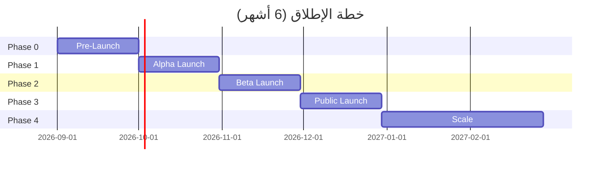

# 19 — Go-to-Market Strategy
## نظام EOS | خطة الإطلاق التسويقي

> الإصدار: 1.0 | التاريخ: 2026-08-19
> الهدف: خطة عملية للحصول على أول 100 عميل مدفوع في 6 أشهر
> المرجع: 16-competitive-analysis.md + 18-financial-model.md

---

## 1. ملخص تنفيذي

### 1.1 الهدف

| المعيار | القيمة |
|---------|--------|
| **الهدف الرئيسي** | 100 عميل مدفوع في 6 أشهر من الإطلاق |
| **MRR الهدف** | 500,000 EGP (نهاية الشهر 6) |
| **CAC الهدف** | < 3,000 EGP |
| **معدل التحويل** | 15% (Trial → Paid) |
| **قنوات المبيعات** | Direct Sales + Partners + Digital Marketing |

### 1.2 الرسالة التسويقية

> **" EOS: نظام ERP يبني نفسه في 10 دقائق — بامتثال مصري كامل وذكاء اصطناعي مدمج."**

---

## 2. شرائح العملاء المستهدفة

### 2.1 الشريحة الأولى (الأولوية — 60% من الجهد)

| المعيار | التفاصيل |
|---------|---------|
| **القطاع** | صيدليات + تجزئة + مطاعم |
| **الحجم** | 10-100 موظف |
| **الجغرافيا** | القاهرة الكبرى + الإسكندرية |
| **المحفز** | إلزام الفوترة الإلكترونية (ETA) |
| **الميزانية** | 2,000-8,000 EGP/شهر |
| **صانع القرار** | Owner / CFO |

### 2.2 الشريحة الثانية (30% من الجهد)

| المعيار | التفاصيل |
|---------|---------|
| **القطاع** | مقاولات + عيادات + خدمات |
| **الحجم** | 50-200 موظف |
| **الجغرافيا** | جميع المحافظات |
| **المحفز** | نمو سريع أو مشاكل مع Odoo |
| **الميزانية** | 5,000-15,000 EGP/شهر |

### 2.3 الشريحة الثالثة (10% من الجهد)

| المعيار | التفاصيل |
|---------|---------|
| **القطاع** | تصنيع + لوجستيات |
| **الحجم** | 100-500 موظف |
| **الجغرافيا** | المناطق الصناعية |
| **المحفز** | تحسين عمليات + تكلفة |
| **الميزانية** | 10,000-25,000 EGP/شهر |

---

## 3. قنوات التسويق والمبيعات

### 3.1 القنوات الرقمية (40% من الميزانية)

#### أ) Google Ads
| البند | التفاصيل |
|-------|---------|
| **الكلمات المفتاحية** | "نظام ERP مصر"، "فوترة إلكترونية"، "إدارة مخزون"، "برنامج محاسبة" |
| **الميزانية الشهرية** | 50,000 EGP |
| **الهدف** | 500 lead/شهر |
| **التكلفة لكل lead** | 100 EGP |
| **معدل التحويل المتوقع** | 10% (50 lead → 5 عملاء) |

#### b) Facebook/Instagram Ads
| البند | التفاصيل |
|-------|---------|
| **الجمهور** | أصحاب مشاريع صغيرة، محاسبين، مديرين |
| **المحتوى** | فيديوهات قصيرة (30 ثانية) + Case Studies |
| **الميزانية الشهرية** | 40,000 EGP |
| **الهدف** | 1,000 lead/شهر |
| **التكلفة لكل lead** | 40 EGP |

#### c) LinkedIn Ads
| البند | التفاصيل |
|-------|---------|
| **الجمهور** | CFOs، IT Managers، Business Owners |
| **المحتوى** | White Papers + Webinars |
| **الميزانية الشهرية** | 20,000 EGP |
| **الهدف** | 200 lead/شهر |
| **التكلفة لكل lead** | 100 EGP |

#### d) Content Marketing
| البند | التفاصيل |
|-------|---------|
| **المحتوى** | مدونة + فيديوهات YouTube + Podcast |
| **المواضيع** | "كيف تختار ERP"، "فوائد الفوترة الإلكترونية"، "قصص نجاح" |
| **الميزانية الشهرية** | 15,000 EGP |
| **الهدف** | 300 lead/شهر (عضوي) |

### 3.2 المبيعات المباشرة (30% من الميزانية)

#### أ) فريق المبيعات
| الدور | العدد | المهمة |
|-------|-------|--------|
| **Sales Manager** | 1 | قيادة الفريق + تصميم الاستراتيجية |
| **Sales Rep (Cairo)** | 2 | زيارات مباشرة + عروض تقديمية |
| **Sales Rep (Alex)** | 1 | تغطية الإسكندرية |
| **SDR (Inside Sales)** | 2 | Cold calling + Email campaigns |

#### b) عملية المبيعات
```
1. Lead Generation (تسويق رقمي)
   ↓
2. Qualification (SDR يتحقق من الأهلية)
   ↓
3. Demo (Sales Rep يعرض النظام)
   ↓
4. Trial (14 يوم مجاني)
   ↓
5. Closing (التوقيع والدفع)
   ↓
6. Onboarding (تأسيس النظام)
   ↓
7. Success (دعم مستمر + upsell)
```

#### c) معايير التأهيل (BANT)
| المعيار | السؤال |
|---------|--------|
| **Budget** | هل لديك ميزانية 2,000+ EGP/شهر؟ |
| **Authority** | هل أنت صانع القرار؟ |
| **Need** | هل تحتاج ERP حالياً؟ |
| **Timeline** | هل تريد البدء خلال 30 يوم؟ |

### 3.3 الشراكات (20% من الميزانية)

#### أ) شراكات استراتيجية
| الشريك | النوع | الفائدة |
|--------|-------|---------|
| **شركات محاسبة** | Referral | 20% عمولة على أول سنة |
| **شركات استشارية إدارية** | Implementation | مشتركون في التنفيذ |
| **شركات تقنية** | Technology | تكامل مع أنظمتهم |
| **مكاتب حكومية** | Compliance | دعم ETA + NOSI |

#### b) برنامج الشركاء
| المستوى | المتطلبات | المزايا |
|---------|-----------|---------|
| **برونزي** | 10 عملاء/سنة | 15% عمولة + تدريب |
| **فضي** | 25 عملاء/سنة | 20% عمولة + دعم أولوية |
| **ذهبي** | 50+ عملاء/سنة | 25% عمولة + SLA + منصة |

### 3.4 الأحداث والمؤتمرات (10% من الميزانية)

| الحدث | التكرار | الميزانية |
|-------|---------|-----------|
| **Webinars** | أسبوعياً | 5,000 EGP/شهر |
| **Workshops** | شهرياً | 20,000 EGP/حدث |
| **Conferences** | ربع سنوي | 100,000 EGP/حدث |
| **Roadshows** | شهرياً (محلي) | 15,000 EGP/حدث |

---

## 4. خطة الإطلاق (Launch Plan)

### 4.1 المراحل



### 4.2 تفصيل كل مرحلة

#### Phase 0: Pre-Launch (الشهر 1)
| المهمة | المسؤول | المدة |
|--------|---------|-------|
| إعداد الموقع الإلكتروني | Marketing | أسبوع |
| إعداد Landing Page | Marketing + Design | أسبوع |
| كتابة 10 مقالات SEO | Content Writer | أسبوعان |
| إعداد حملات Google Ads | Digital Marketing Manager | 3 أيام |
| إعداد CRM (HubSpot) | Sales Manager | يوم |
| تدريب فريق المبيعات | Sales Manager | 3 أيام |
| تجهيز Demo System | Product Manager | أسبوع |

#### Phase 1: Alpha Launch (الشهر 2)
| المهمة | المسؤول | المدة |
|--------|---------|-------|
| إطلاق Landing Page | Marketing | يوم |
| إطلاق Google Ads | Digital Marketing | يوم |
| إطلاق Facebook Ads | Digital Marketing | يوم |
| التواصل مع 50 lead أولي | SDR | أسبوعان |
| إجراء 10 Demos | Sales Rep | أسبوعان |
| تأسيس 5 عملاء تجريبيين | Customer Success | أسبوعان |

#### Phase 2: Beta Launch (الشهر 3)
| المهمة | المسؤول | المدة |
|--------|---------|-------|
| إطلاق LinkedIn Ads | Digital Marketing | يوم |
| إطلاق Content Marketing | Content Writer | يوم |
| التواصل مع 100 lead | SDR | أسبوعان |
| إجراء 20 Demo | Sales Rep | أسبوعان |
| تأسيس 15 عميل | Customer Success | أسبوعان |
| جمع المراجعات | Customer Success | مستمر |

#### Phase 3: Public Launch (الشهر 4)
| المهمة | المسؤول | المدة |
|--------|---------|-------|
| إطلاق رسمي (Press Release) | Marketing | يوم |
| حدث إطلاق (Virtual Event) | Marketing + Sales | يوم |
| حملة Early Bird (خصم 20%) | Marketing | أسبوع |
| التواصل مع 200 lead | SDR | مستمر |
| إجراء 30 Demo | Sales Rep | مستمر |
| تأسيس 25 عميل | Customer Success | مستمر |

#### Phase 4: Scale (الشهر 5-6)
| المهمة | المسؤول | المدة |
|--------|---------|-------|
| إطلاق برنامج الشركاء | Sales Manager | أسبوع |
| إطلاق Referral Program | Marketing | يوم |
| توسيع القنوات | Marketing + Sales | مستمر |
| تأسيس 50 عميل إضافي | Customer Success | مستمر |
| جمع Case Studies | Marketing | 3 حالات |

---

## 5. المحتوى التسويقي

### 5.1 المحتوى المطلوب

| النوع | العدد | الوصف |
|-------|-------|-------|
| **Blog Posts** | 20 | مقالات SEO (1,500+ كلمة) |
| **Case Studies** | 5 | قصص نجاح عملاء |
| **White Papers** | 3 | "دليل اختيار ERP في مصر" |
| ** Videos** | 15 | فيديوهات قصيرة (30-60 ثانية) |
| **Webinars** | 6 | حلقات مباشرة (45 دقيقة) |
| **Infographics** | 10 | رسوم بيانية توضيحية |
| **Email Templates** | 15 | رسائل تسويقية |

### 5.2 المواضيع المقترحة

#### Blog Posts
1. "لماذا تحتاج نظام ERP في 2026؟"
2. "الفوترة الإلكترونية في مصر: الدليل الشامل"
3. "Odoo vs EOS: مقارنة شاملة للسوق المصري"
4. "5 أسباب تجعل ERP السحابي أفضل من المحلي"
5. "كيف تختار نظام ERP لصيدليتك؟"
6. "إدارة المخزون: الأخطاء الشائعة والحلول"
7. "التأمينات الاجتماعية: كيف تحسبها صح؟"
8. "كيف تحسن أرباح مطعمك بـ ERP ذكي؟"
9. "AI في المحاسبة: كيف يغير المستقبل؟"
10. "قصص نجاح: كيف انتقلت الشركة من Excel إلى ERP؟"

#### Case Studies
1. صيدلية الأمل — كيف وفرت 40% من وقت المحاسبة
2. مطعم الوادي — كيف حسنت إدارة المخزون بـ 60%
3. مقاولات الإبداع — كيف أسرعت الفوترة بـ 80%

### 5.3 حملات إلكترونية

#### حملة Early Bird (الشهر 4)
| البند | التفاصيل |
|-------|---------|
| **العرض** | خصم 20% على الاشتراكات السنوية |
| **المدة** | 30 يوم |
| **القنوات** | Email + Social + Google Ads |
| **الهدف** | 50 عميل جديد |

#### حملة Referral (الشهر 5)
| البند | التفاصيل |
|-------|---------|
| **العرض** | شهر مجاني للمحيل + المحال |
| **المدة** | مستمر |
| **القنوات** | Email + In-app |
| **الهدف** | 20 عميل شهرياً من الإحالات |

---

## 6. عملية البيع (Sales Process)

### 6.1 دورة المبيعات

```
المدة الإجمالية: 14-21 يوم

اليوم 1-3:    Lead Generation (تسويق رقمي)
اليوم 4-5:    Qualification (SDR)
اليوم 6-7:    Demo (Sales Rep)
اليوم 8-10:   Trial (14 يوم مجاني)
اليوم 11-14:  Negotiation
اليوم 15-17:  Closing (توقيع)
اليوم 18-21:  Onboarding (تأسيس)
```

### 6.2 نموذج العرض التقديمي

| الشريحة | المحتوى | المدة |
|---------|---------|-------|
| 1. المشكلة | "الأنظمة الحالية معقدة ومكلفة" | 2 دقيقة |
| 2. الحل | "EOS: ERP يبني نفسه في 10 دقائق" | 3 دقائق |
| 3. Demo حي | عرض Onboarding + Dashboard | 10 دقائق |
| 4. التسعير | الباقات والخيارات | 3 دقائق |
| 5. الأسئلة | مناقشة | 7 دقائق |

### 6.3 objections الشائعة والردود

| الاعتراض | الرد |
|----------|------|
| "لدينا Odoo بالفعل" | "EOS يتفوق بامتثال مصري مدمج + AI — بدون تكلفة تخصيص إضافية" |
| "السعر مرتفع" | "TCO أقل بـ 68% من Odoo على 3 سنوات + AI مجاني" |
| "نحتاج وقت للتفكير" | "Trial مجاني 14 يوم — جرب بدون التزام" |
| "لا نحتاج AI" | "AI يوفر 20+ ساعة/شهر في التقارير والتنبؤات" |
| "نخاف من فقدان البيانات" | "بياناتك آمنة — AES-256 + Backup يومي + SOC2" |

---

## 7. قياس الأداء

### 7.1 KPIs التسويقية

| KPI | الهدف الشهري | طريقة القياس |
|-----|-------------|--------------|
| **Website Visitors** | 10,000 | Google Analytics |
| **Leads Generated** | 500 | CRM |
| **MQL (Marketing Qualified Leads)** | 200 | CRM |
| **SQL (Sales Qualified Leads)** | 100 | CRM |
| **Cost per Lead** | < 100 EGP | Marketing spend / Leads |
| **Cost per Acquisition** | < 3,000 EGP | Marketing spend / Customers |

### 7.2 KPIs المبيعات

| KPI | الهدف الشهري | طريقة القياس |
|-----|-------------|--------------|
| **Demos Conducted** | 30 | CRM |
| **Trials Started** | 50 | Product Analytics |
| **Trial → Paid Conversion** | 15% | Product Analytics |
| **New Customers** | 10-15 | CRM |
| **Average Deal Size** | 5,000 EGP/شهر | CRM |
| **Sales Cycle Length** | < 21 يوم | CRM |
| **Win Rate** | > 25% | CRM |

### 7.3 KPIs الاحتفاظ

| KPI | الهدف | طريقة القياس |
|-----|-------|--------------|
| **Net Revenue Retention** | > 110% | Finance |
| **Logo Churn Rate** | < 3% | Product Analytics |
| **NPS** | > 50 | Survey |
| **Support Ticket Resolution** | < 4 ساعات | Support System |

---

## 8. الميزانية التسويقية

### 8.1 تفصيل الميزانية (السنة الأولى)

| القسم | الشهرية | السنوية | النسبة |
|-------|---------|---------|--------|
| **Google Ads** | 50,000 | 600,000 | 25% |
| **Facebook/Instagram** | 40,000 | 480,000 | 20% |
| **LinkedIn Ads** | 20,000 | 240,000 | 10% |
| **Content Marketing** | 15,000 | 180,000 | 8% |
| **Events/Conferences** | 25,000 | 300,000 | 13% |
| **PR/Media** | 10,000 | 120,000 | 5% |
| **Tools (CRM, Analytics)** | 15,000 | 180,000 | 8% |
| **Sales Team** | 50,000 | 600,000 | 25%* |
| **الإجمالي** | **225,000** | **2,700,000** | **100%** |

*ملاحظة: رواتب فريق المبيعات في "تكاليف الفريق" وليس "التسويق"*

### 8.2 العائد على الاستثمار التسويقي (ROAS)

| القناة | الميزانية | الإيرادات المتوقعة | ROAS |
|--------|-----------|-------------------|------|
| Google Ads | 600,000 | 1,800,000 | 3.0x |
| Facebook/Instagram | 480,000 | 960,000 | 2.0x |
| LinkedIn Ads | 240,000 | 600,000 | 2.5x |
| Content Marketing | 180,000 | 720,000 | 4.0x |
| Events | 300,000 | 600,000 | 2.0x |
| **الإجمالي** | **1,800,000** | **4,680,000** | **2.6x** |

---

## 9. خطة المحتوى الشهرية

### 9.1 الشهر 1 (Pre-Launch)

| الأسبوع | المحتوى | القناة |
|---------|---------|--------|
| 1 | مقال: "لماذا ERP في 2026؟" | Blog |
| 2 | فيديو: " EOS — نظرة عامة" | YouTube |
| 3 | مقال: "الفوترة الإلكترونية الدليل" | Blog |
| 4 | Webinar: "كيف تختار ERP" | Zoom |

### 9.2 الشهر 2-3 (Alpha/Beta)

| الأسبوع | المحتوى | القناة |
|---------|---------|--------|
| 1 | Case Study: صيدلية | Blog + Social |
| 2 | فيديو: Demo حي | YouTube |
| 3 | مقال: "Odoo vs EOS" | Blog |
| 4 | Webinar: "AI في المحاسبة" | Zoom |

### 9.3 الشهر 4-6 (Public Launch)

| الأسبوع | المحتوى | القناة |
|---------|---------|--------|
| 1 | Press Release: الإطلاق الرسمي | Media |
| 2 | Case Study: مطعم | Blog + Social |
| 3 | فيديو: "قصة نجاح" | YouTube |
| 4 | Webinar: "roi من ERP" | Zoom |

---

## 10. أدوات التسويق والمبيعات

### 10.1 أدوات مقترحة

| الأداة | الاستخدام | التكلفة/شهر |
|--------|-----------|-------------|
| **HubSpot** | CRM + Marketing Automation | $50 |
| **Google Analytics** | تحليل الموقع | مجاني |
| **Hotjar** | تحليل سلوك المستخدم | $40 |
| **Mailchimp** | Email Marketing | $30 |
| **Canva** | تصميم الرسوم | $13 |
| **Loom** | فيديوهات Demo | مجاني |
| **Zoom** | Webinars | $15 |
| **Ahrefs** | SEO | $100 |

### 10.2 الميزانية الشهرية للأدوات

| الأداة | التكلفة |
|--------|---------|
| HubSpot | 2,500 EGP |
| Google Analytics | 0 |
| Hotjar | 2,000 EGP |
| Mailchimp | 1,500 EGP |
| Canva | 650 EGP |
| Zoom | 750 EGP |
| Ahrefs | 5,000 EGP |
| **الإجمالي** | **12,400 EGP** |

---

## 11. ملخص تنفيذي

### خطة 6 أشهر للحصول على 100 عميل

```
الشهر 1:  5 عملاء  (Alpha — 5 عملاء تجريبيين)
الشهر 2: 10 عملاء  (Beta — Early Adopters)
الشهر 3: 15 عميل   (Beta — Early Adopters)
الشهر 4: 25 عميل   (Public Launch — Early Bird)
الشهر 5: 20 عميل   (Scale)
الشهر 6: 25 عميل   (Scale)
─────────────────────
الإجمالي: 100 عميل ✅
```

### الميزانية الإجمالية للتسويق (6 أشهر)

| البند | المبلغ |
|-------|--------|
| **القنوات الرقمية** | 1,350,000 EGP |
| **المبيعات المباشرة** | 900,000 EGP |
| **الشراكات** | 450,000 EGP |
| **الأحداث** | 300,000 EGP |
| **الإجمالي** | **3,000,000 EGP** |

---

*نهاية خطة الإطلاق التسويقي*
