# 02 — Database Schema (ERD & DDL)

> **EOS Enterprise Operating System** — Complete PostgreSQL Schema Reference  
> Multi-tenant SaaS ERP · Row-Level Security · Partitioned for Scale

---

## Table of Contents

1. [Architecture Overview](#1-architecture-overview)
2. [Schema Strategy](#2-schema-strategy)
3. [Row-Level Security (RLS)](#3-row-level-security-rls)
4. [Shared Schema (`eos_shared`)](#4-shared-schema-eos_shared)
5. [Settings & Configuration](#5-settings--configuration)
6. [Accounting Module](#6-accounting-module)
7. [Inventory Module](#7-inventory-module)
8. [HR Module](#8-hr-module)
9. [Sales & CRM Module](#9-sales--crm-module)
10. [POS Module](#10-pos-module)
11. [Project Management Module](#11-project-management-module)
12. [Supply Chain Module](#12-supply-chain-module)
13. [Manufacturing Module](#13-manufacturing-module)
14. [Asset Management Module](#14-asset-management-module)
15. [Customer Service Module](#15-customer-service-module)
16. [Indexing Strategy](#16-indexing-strategy)
17. [Partitioning Strategy](#17-partitioning-strategy)
18. [Seed Data](#18-seed-data)

---

## 1. Architecture Overview

```
┌──────────────────────────────────────────────────────────────────────┐
│                        EOS Database Architecture                     │
├──────────────────────────────────────────────────────────────────────┤
│                                                                      │
│  ┌─────────────────────────────────────────────────────────┐        │
│  │              eos_shared (Shared Schema)                  │        │
│  │  tenants · users · tenant_members · roles · permissions  │        │
│  │  subscriptions · subscription_plans · branches · depts   │        │
│  └───────────────────────┬─────────────────────────────────┘        │
│                          │                                           │
│          ┌───────────────┼───────────────┐                          │
│          ▼               ▼               ▼                          │
│  ┌──────────────┐ ┌──────────────┐ ┌──────────────┐                │
│  │ eos_tenant_1 │ │ eos_tenant_2 │ │ eos_tenant_N │   ...          │
│  │              │ │              │ │              │                │
│  │ accounting   │ │ accounting   │ │ accounting   │                │
│  │ inventory    │ │ inventory    │ │ inventory    │                │
│  │ hr           │ │ hr           │ │ hr           │                │
│  │ sales_crm    │ │ sales_crm    │ │ sales_crm    │                │
│  │ pos          │ │ pos          │ │ pos          │                │
│  │ projects     │ │ projects     │ │ projects     │                │
│  │ supply_chain │ │ supply_chain │ │ supply_chain │                │
│  │ manufacturing│ │ manufacturing│ │ manufacturing│                │
│  │ assets       │ │ assets       │ │ assets       │                │
│  │ support      │ │ support      │ │ support      │                │
│  │ settings     │ │ settings     │ │ settings     │                │
│  └──────────────┘ └──────────────┘ └──────────────┘                │
│                                                                      │
│  All tenant tables include: tenant_id FK -> eos_shared.tenants.id    │
│  RLS policies filter on tenant_id = current_setting('app.tenant_id') │
└──────────────────────────────────────────────────────────────────────┘
```

### Design Principles

| Principle | Description |
|-----------|-------------|
| **Multi-tenancy** | Shared database, isolated schemas per tenant (`eos_tenant_{uuid}`) |
| **RLS** | Every tenant table is protected by Row-Level Security policies |
| **UUID PKs** | All primary keys use `UUID` (via `gen_random_uuid()`) for global uniqueness |
| **Audit trail** | Timestamps (`created_at`, `updated_at`) and `created_by` on all mutable tables |
| **Soft deletes** | Where applicable, `is_active` flags instead of hard deletes |
| **JSONB flexibility** | Extensible fields (permissions, allowances, custom data) stored as `JSONB` |
| **Naming** | `snake_case` for all identifiers; singular table names |

---

## 2. Schema Strategy

```
PostgreSQL Cluster
├── Schema: eos_shared
│   ├── tenants
│   ├── users
│   ├── tenant_members
│   ├── roles
│   ├── permissions
│   ├── subscriptions
│   ├── subscription_plans
│   ├── branches
│   └── departments
│
├── Schema: eos_tenant_{uuid_1}
│   ├── (all module tables — accounting, inventory, hr, sales_crm, ...)
│   └── every table has tenant_id column (defensive, even within isolated schema)
│
├── Schema: eos_tenant_{uuid_2}
│   └── ...
│
└── Schema: eos_tenant_{uuid_N}
    └── ...
```

**Schema Creation Flow:**

```sql
-- When a new tenant signs up:
CREATE SCHEMA eos_tenant_{tenant_uuid};
-- Then run all module DDL within that schema
-- Then attach RLS policies
```

> **Note:** Every CREATE TABLE statement below is written in a **template form**.  
> At deployment time, the `{tenant_schema}` placeholder is replaced with the  
> actual `eos_tenant_{uuid}` schema name. For the shared schema, no replacement  
> is needed.

---

## 3. Row-Level Security (RLS)

```sql
-- ============================================================
-- RLS Bootstrap (run once per tenant schema)
-- ============================================================
ALTER TABLE {tenant_schema}.<table> ENABLE ROW LEVEL SECURITY;

CREATE POLICY tenant_isolation_policy ON {tenant_schema}.<table>
    USING (tenant_id = current_setting('app.tenant_id')::uuid)
    WITH CHECK (tenant_id = current_setting('app.tenant_id')::uuid);

-- Application sets the context per request:
SET app.tenant_id = '<tenant-uuid>';
```

**Helper function to apply RLS to all tables in a schema:**

```sql
CREATE OR REPLACE FUNCTION eos_shared.apply_rls_to_schema(p_schema TEXT)
RETURNS VOID AS $$
DECLARE
    r RECORD;
BEGIN
    FOR r IN
        SELECT tablename
        FROM pg_tables
        WHERE schemaname = p_schema
    LOOP
        EXECUTE format(
            'ALTER TABLE %I.%I ENABLE ROW LEVEL SECURITY;',
            p_schema, r.tablename
        );
        EXECUTE format(
            'CREATE POLICY tenant_isolation_policy ON %I.%I
             USING (tenant_id = current_setting(''app.tenant_id'')::uuid)
             WITH CHECK (tenant_id = current_setting(''app.tenant_id'')::uuid);',
            p_schema, r.tablename
        );
    END LOOP;
END;
$$ LANGUAGE plpgsql;
```

---

## 4. Shared Schema (`eos_shared`)

The shared schema contains cross-tenant data: user accounts, tenant registry,
subscription plans, and tenant membership.

### 4.1 ER Diagram — Shared Schema

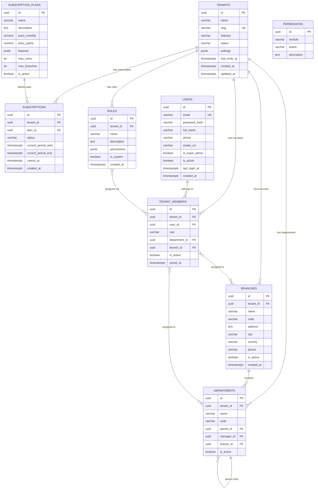

### 4.2 SQL — Shared Schema Tables

```sql
-- ================================================================
-- SCHEMA: eos_shared
-- ================================================================
CREATE SCHEMA IF NOT EXISTS eos_shared;

-- ----------------------------------------------------------------
-- 1. tenants
-- ----------------------------------------------------------------
CREATE TABLE eos_shared.tenants (
    id              UUID PRIMARY KEY DEFAULT gen_random_uuid(),
    name            VARCHAR(255) NOT NULL,
    slug            VARCHAR(100) NOT NULL UNIQUE,
    industry        VARCHAR(100),
    status          VARCHAR(20) NOT NULL DEFAULT 'active'
                        CHECK (status IN ('active','suspended','cancelled','trial')),
    settings        JSONB NOT NULL DEFAULT '{}',
    trial_ends_at   TIMESTAMPTZ,
    created_at      TIMESTAMPTZ NOT NULL DEFAULT now(),
    updated_at      TIMESTAMPTZ NOT NULL DEFAULT now()
);

CREATE INDEX idx_tenants_slug ON eos_shared.tenants (slug);
CREATE INDEX idx_tenants_status ON eos_shared.tenants (status);

COMMENT ON TABLE eos_shared.tenants IS 'Master tenant registry — one row per SaaS customer';
COMMENT ON COLUMN eos_shared.tenants.settings IS 'Tenant-wide configuration (theme, locale, features, etc.)';

-- ----------------------------------------------------------------
-- 2. users
-- ----------------------------------------------------------------
CREATE TABLE eos_shared.users (
    id              UUID PRIMARY KEY DEFAULT gen_random_uuid(),
    email           VARCHAR(255) NOT NULL UNIQUE,
    password_hash   VARCHAR(255) NOT NULL,
    full_name       VARCHAR(255) NOT NULL,
    phone           VARCHAR(50),
    avatar_url      VARCHAR(500),
    is_super_admin  BOOLEAN NOT NULL DEFAULT FALSE,
    is_active       BOOLEAN NOT NULL DEFAULT TRUE,
    last_login_at   TIMESTAMPTZ,
    created_at      TIMESTAMPTZ NOT NULL DEFAULT now()
);

CREATE INDEX idx_users_email ON eos_shared.users (email);
CREATE INDEX idx_users_active ON eos_shared.users (is_active) WHERE is_active = TRUE;

COMMENT ON TABLE eos_shared.users IS 'Global user accounts — a user can belong to multiple tenants';

-- ----------------------------------------------------------------
-- 3. tenant_members
-- ----------------------------------------------------------------
CREATE TABLE eos_shared.tenant_members (
    id              UUID PRIMARY KEY DEFAULT gen_random_uuid(),
    tenant_id       UUID NOT NULL REFERENCES eos_shared.tenants(id) ON DELETE CASCADE,
    user_id         UUID NOT NULL REFERENCES eos_shared.users(id) ON DELETE CASCADE,
    role            VARCHAR(50) NOT NULL DEFAULT 'member'
                        CHECK (role IN ('owner','admin','manager','member','viewer')),
    department_id   UUID,
    branch_id       UUID,
    is_active       BOOLEAN NOT NULL DEFAULT TRUE,
    joined_at       TIMESTAMPTZ NOT NULL DEFAULT now(),

    UNIQUE (tenant_id, user_id)
);

CREATE INDEX idx_tm_tenant ON eos_shared.tenant_members (tenant_id);
CREATE INDEX idx_tm_user ON eos_shared.tenant_members (user_id);
CREATE INDEX idx_tm_active ON eos_shared.tenant_members (tenant_id, is_active) WHERE is_active = TRUE;

COMMENT ON TABLE eos_shared.tenant_members IS 'Maps users to tenants with roles — the core multi-tenant link';

-- ----------------------------------------------------------------
-- 4. roles
-- ----------------------------------------------------------------
CREATE TABLE eos_shared.roles (
    id              UUID PRIMARY KEY DEFAULT gen_random_uuid(),
    tenant_id       UUID NOT NULL REFERENCES eos_shared.tenants(id) ON DELETE CASCADE,
    name            VARCHAR(100) NOT NULL,
    description     TEXT,
    permissions     JSONB NOT NULL DEFAULT '[]',
    is_system       BOOLEAN NOT NULL DEFAULT FALSE,
    created_at      TIMESTAMPTZ NOT NULL DEFAULT now(),

    UNIQUE (tenant_id, name)
);

CREATE INDEX idx_roles_tenant ON eos_shared.roles (tenant_id);

COMMENT ON TABLE eos_shared.roles IS 'Tenant-scoped roles with JSONB permission sets';

-- ----------------------------------------------------------------
-- 5. permissions
-- ----------------------------------------------------------------
CREATE TABLE eos_shared.permissions (
    id              UUID PRIMARY KEY DEFAULT gen_random_uuid(),
    module          VARCHAR(50) NOT NULL,
    action          VARCHAR(50) NOT NULL,
    description     TEXT,

    UNIQUE (module, action)
);

CREATE INDEX idx_permissions_module ON eos_shared.permissions (module);

COMMENT ON TABLE eos_shared.permissions IS 'Global permission catalog — module + action pairs';

-- ----------------------------------------------------------------
-- 6. subscriptions
-- ----------------------------------------------------------------
CREATE TABLE eos_shared.subscriptions (
    id                      UUID PRIMARY KEY DEFAULT gen_random_uuid(),
    tenant_id               UUID NOT NULL REFERENCES eos_shared.tenants(id) ON DELETE CASCADE,
    plan_id                 UUID NOT NULL REFERENCES eos_shared.subscription_plans(id),
    status                  VARCHAR(20) NOT NULL DEFAULT 'active'
                                CHECK (status IN ('active','past_due','cancelled','trialing')),
    current_period_start    TIMESTAMPTZ NOT NULL DEFAULT now(),
    current_period_end      TIMESTAMPTZ NOT NULL,
    cancel_at               TIMESTAMPTZ,
    created_at              TIMESTAMPTZ NOT NULL DEFAULT now()
);

CREATE INDEX idx_sub_tenant ON eos_shared.subscriptions (tenant_id);
CREATE INDEX idx_sub_status ON eos_shared.subscriptions (status);
CREATE INDEX idx_sub_period_end ON eos_shared.subscriptions (current_period_end);

COMMENT ON TABLE eos_shared.subscriptions IS 'Active subscription per tenant — linked to a plan';

-- ----------------------------------------------------------------
-- 7. subscription_plans
-- ----------------------------------------------------------------
CREATE TABLE eos_shared.subscription_plans (
    id              UUID PRIMARY KEY DEFAULT gen_random_uuid(),
    name            VARCHAR(100) NOT NULL,
    description     TEXT,
    price_monthly   NUMERIC(12,2) NOT NULL DEFAULT 0,
    price_yearly    NUMERIC(12,2) NOT NULL DEFAULT 0,
    features        JSONB NOT NULL DEFAULT '[]',
    max_users       INT NOT NULL DEFAULT 5,
    max_branches    INT NOT NULL DEFAULT 1,
    is_active       BOOLEAN NOT NULL DEFAULT TRUE
);

CREATE INDEX idx_plans_active ON eos_shared.subscription_plans (is_active) WHERE is_active = TRUE;

COMMENT ON TABLE eos_shared.subscription_plans IS 'Catalog of available subscription plans';

-- ----------------------------------------------------------------
-- 8. branches
-- ----------------------------------------------------------------
CREATE TABLE eos_shared.branches (
    id              UUID PRIMARY KEY DEFAULT gen_random_uuid(),
    tenant_id       UUID NOT NULL REFERENCES eos_shared.tenants(id) ON DELETE CASCADE,
    name            VARCHAR(255) NOT NULL,
    code            VARCHAR(50) NOT NULL,
    address         TEXT,
    city            VARCHAR(100),
    country         VARCHAR(100),
    phone           VARCHAR(50),
    is_active       BOOLEAN NOT NULL DEFAULT TRUE,
    created_at      TIMESTAMPTZ NOT NULL DEFAULT now(),

    UNIQUE (tenant_id, code)
);

CREATE INDEX idx_branches_tenant ON eos_shared.branches (tenant_id);

COMMENT ON TABLE eos_shared.branches IS 'Physical locations / offices for a tenant';

-- ----------------------------------------------------------------
-- 9. departments
-- ----------------------------------------------------------------
CREATE TABLE eos_shared.departments (
    id              UUID PRIMARY KEY DEFAULT gen_random_uuid(),
    tenant_id       UUID NOT NULL REFERENCES eos_shared.tenants(id) ON DELETE CASCADE,
    name            VARCHAR(255) NOT NULL,
    code            VARCHAR(50) NOT NULL,
    parent_id       UUID REFERENCES eos_shared.departments(id) ON DELETE SET NULL,
    manager_id      UUID,
    branch_id       UUID REFERENCES eos_shared.branches(id) ON DELETE SET NULL,
    is_active       BOOLEAN NOT NULL DEFAULT TRUE,

    UNIQUE (tenant_id, code)
);

CREATE INDEX idx_dept_tenant ON eos_shared.departments (tenant_id);
CREATE INDEX idx_dept_parent ON eos_shared.departments (parent_id);
CREATE INDEX idx_dept_branch ON eos_shared.departments (branch_id);

COMMENT ON TABLE eos_shared.departments IS 'Organizational hierarchy — supports nested parent/child';
```

---

## 5. Settings & Configuration

These tables live in each tenant schema and control company identity, numbering,
workflows, custom fields, audit logging, notifications, and file attachments.

### 5.1 ER Diagram — Settings

```mermaid
erDiagram
    COMPANY_PROFILES ||--o| CURRENCIES : "base currency"
    WORKFLOWS }o--o{ CUSTOM_FIELDS : "governs"
    AUDIT_LOGS }o--o| USERS : "recorded by"
    NOTIFICATIONS }o--|| USERS : "sent to"
    FILES }o--o| USERS : "uploaded by"

    COMPANY_PROFILES {
        uuid id PK
        uuid tenant_id FK
        varchar legal_name
        varchar trade_name
        varchar tax_id
        varchar commercial_register
        text address
        varchar city
        varchar country
        varchar phone
        varchar email
        varchar website
        varchar logo_url
        int fiscal_year_start
        uuid currency_id FK
        timestamptz created_at
    }

    NUMBER_SEQUENCES {
        uuid id PK
        uuid tenant_id FK
        varchar module
        varchar name
        varchar prefix
        int next_number
        int padding
        varchar reset_frequency
    }

    WORKFLOWS {
        uuid id PK
        uuid tenant_id FK
        varchar name
        varchar module
        varchar entity
        jsonb steps
        boolean is_active
        timestamptz created_at
    }

    CUSTOM_FIELDS {
        uuid id PK
        uuid tenant_id FK
        varchar module
        varchar entity
        varchar field_name
        varchar field_type
        varchar label
        boolean required
        text default_value
        jsonb options
        int "order"
        boolean is_active
    }

    AUDIT_LOGS {
        uuid id PK
        uuid tenant_id FK
        uuid user_id FK
        varchar entity_type
        uuid entity_id
        varchar action
        jsonb old_values
        jsonb new_values
        inet ip_address
        text user_agent
        timestamptz created_at
    }

    NOTIFICATIONS {
        uuid id PK
        uuid tenant_id FK
        uuid user_id FK
        varchar type
        varchar title
        text message
        jsonb data
        timestamptz read_at
        timestamptz created_at
    }

    FILES {
        uuid id PK
        uuid tenant_id FK
        varchar entity_type
        uuid entity_id
        varchar filename
        varchar original_name
        varchar mime_type
        bigint size
        varchar path
        uuid uploaded_by FK
        timestamptz created_at
    }
```

### 5.2 SQL — Settings Tables

```sql
-- ================================================================
-- 82. company_profiles
-- ================================================================
CREATE TABLE company_profiles (
    id                  UUID PRIMARY KEY DEFAULT gen_random_uuid(),
    tenant_id           UUID NOT NULL REFERENCES eos_shared.tenants(id) ON DELETE CASCADE,
    legal_name          VARCHAR(255) NOT NULL,
    trade_name          VARCHAR(255),
    tax_id              VARCHAR(100),
    commercial_register VARCHAR(100),
    address             TEXT,
    city                VARCHAR(100),
    country             VARCHAR(100),
    phone               VARCHAR(50),
    email               VARCHAR(255),
    website             VARCHAR(500),
    logo_url            VARCHAR(500),
    fiscal_year_start   INT NOT NULL DEFAULT 1
                            CHECK (fiscal_year_start BETWEEN 1 AND 12),
    currency_id         UUID,
    created_at          TIMESTAMPTZ NOT NULL DEFAULT now(),

    UNIQUE (tenant_id)
);

CREATE INDEX idx_cp_tenant ON company_profiles (tenant_id);

COMMENT ON TABLE company_profiles IS 'Single-row company identity per tenant';

-- ================================================================
-- 83. number_sequences
-- ================================================================
CREATE TABLE number_sequences (
    id                  UUID PRIMARY KEY DEFAULT gen_random_uuid(),
    tenant_id           UUID NOT NULL REFERENCES eos_shared.tenants(id) ON DELETE CASCADE,
    module              VARCHAR(50) NOT NULL,
    name                VARCHAR(100) NOT NULL,
    prefix              VARCHAR(20) NOT NULL DEFAULT '',
    next_number         INT NOT NULL DEFAULT 1,
    padding             INT NOT NULL DEFAULT 5,
    reset_frequency     VARCHAR(20) NOT NULL DEFAULT 'never'
                            CHECK (reset_frequency IN ('never','yearly','monthly')),

    UNIQUE (tenant_id, module, name)
);

CREATE INDEX idx_ns_tenant ON number_sequences (tenant_id);
CREATE INDEX idx_ns_module ON number_sequences (tenant_id, module);

COMMENT ON TABLE number_sequences IS 'Auto-incrementing document number generators per module';

-- ================================================================
-- 84. workflows
-- ================================================================
CREATE TABLE workflows (
    id              UUID PRIMARY KEY DEFAULT gen_random_uuid(),
    tenant_id       UUID NOT NULL REFERENCES eos_shared.tenants(id) ON DELETE CASCADE,
    name            VARCHAR(150) NOT NULL,
    module          VARCHAR(50) NOT NULL,
    entity          VARCHAR(50) NOT NULL,
    steps           JSONB NOT NULL DEFAULT '[]',
    is_active       BOOLEAN NOT NULL DEFAULT TRUE,
    created_at      TIMESTAMPTZ NOT NULL DEFAULT now(),

    UNIQUE (tenant_id, module, entity)
);

CREATE INDEX idx_wf_tenant ON workflows (tenant_id);
CREATE INDEX idx_wf_module ON workflows (tenant_id, module);

COMMENT ON TABLE workflows IS 'Configurable approval workflows — steps stored as JSONB array';

-- ================================================================
-- 85. custom_fields
-- ================================================================
CREATE TABLE custom_fields (
    id              UUID PRIMARY KEY DEFAULT gen_random_uuid(),
    tenant_id       UUID NOT NULL REFERENCES eos_shared.tenants(id) ON DELETE CASCADE,
    module          VARCHAR(50) NOT NULL,
    entity          VARCHAR(50) NOT NULL,
    field_name      VARCHAR(100) NOT NULL,
    field_type      VARCHAR(30) NOT NULL
                        CHECK (field_type IN ('text','number','date','select','multiselect',
                                              'checkbox','url','email','phone','file','json')),
    label           VARCHAR(150) NOT NULL,
    required        BOOLEAN NOT NULL DEFAULT FALSE,
    default_value   TEXT,
    options         JSONB,
    "order"         INT NOT NULL DEFAULT 0,
    is_active       BOOLEAN NOT NULL DEFAULT TRUE,

    UNIQUE (tenant_id, module, entity, field_name)
);

CREATE INDEX idx_cf_tenant ON custom_fields (tenant_id);
CREATE INDEX idx_cf_entity ON custom_fields (tenant_id, module, entity);

COMMENT ON TABLE custom_fields IS 'User-defined fields attached to any entity at runtime';

-- ================================================================
-- 86. audit_logs
-- ================================================================
CREATE TABLE audit_logs (
    id              UUID NOT NULL DEFAULT gen_random_uuid(),
    tenant_id       UUID NOT NULL REFERENCES eos_shared.tenants(id) ON DELETE CASCADE,
    user_id         UUID,
    entity_type     VARCHAR(100) NOT NULL,
    entity_id       UUID NOT NULL,
    action          VARCHAR(10) NOT NULL
                        CHECK (action IN ('create','update','delete')),
    old_values      JSONB,
    new_values      JSONB,
    ip_address      INET,
    user_agent      TEXT,
    created_at      TIMESTAMPTZ NOT NULL DEFAULT now(),

    PRIMARY KEY (id, created_at)
) PARTITION BY RANGE (created_at);

-- Partitions created monthly — see Partitioning Strategy section
CREATE TABLE audit_logs_2026_01 PARTITION OF audit_logs
    FOR VALUES FROM ('2026-01-01') TO ('2026-02-01');
CREATE TABLE audit_logs_2026_02 PARTITION OF audit_logs
    FOR VALUES FROM ('2026-02-01') TO ('2026-03-01');
CREATE TABLE audit_logs_2026_03 PARTITION OF audit_logs
    FOR VALUES FROM ('2026-03-01') TO ('2026-04-01');
CREATE TABLE audit_logs_2026_04 PARTITION OF audit_logs
    FOR VALUES FROM ('2026-04-01') TO ('2026-05-01');
CREATE TABLE audit_logs_2026_05 PARTITION OF audit_logs
    FOR VALUES FROM ('2026-05-01') TO ('2026-06-01');
CREATE TABLE audit_logs_2026_06 PARTITION OF audit_logs
    FOR VALUES FROM ('2026-06-01') TO ('2026-07-01');
CREATE TABLE audit_logs_2026_07 PARTITION OF audit_logs
    FOR VALUES FROM ('2026-07-01') TO ('2026-08-01');
CREATE TABLE audit_logs_2026_08 PARTITION OF audit_logs
    FOR VALUES FROM ('2026-08-01') TO ('2026-09-01');
CREATE TABLE audit_logs_2026_09 PARTITION OF audit_logs
    FOR VALUES FROM ('2026-09-01') TO ('2026-10-01');
CREATE TABLE audit_logs_2026_10 PARTITION OF audit_logs
    FOR VALUES FROM ('2026-10-01') TO ('2026-11-01');
CREATE TABLE audit_logs_2026_11 PARTITION OF audit_logs
    FOR VALUES FROM ('2026-11-01') TO ('2026-12-01');
CREATE TABLE audit_logs_2026_12 PARTITION OF audit_logs
    FOR VALUES FROM ('2026-12-01') TO ('2027-01-01');

CREATE INDEX idx_al_tenant_created ON audit_logs (tenant_id, created_at DESC);
CREATE INDEX idx_al_entity ON audit_logs (tenant_id, entity_type, entity_id);
CREATE INDEX idx_al_user ON audit_logs (tenant_id, user_id);

COMMENT ON TABLE audit_logs IS 'Immutable change-log — range-partitioned by month for performance';

-- ================================================================
-- 87. notifications
-- ================================================================
CREATE TABLE notifications (
    id              UUID PRIMARY KEY DEFAULT gen_random_uuid(),
    tenant_id       UUID NOT NULL REFERENCES eos_shared.tenants(id) ON DELETE CASCADE,
    user_id         UUID NOT NULL,
    type            VARCHAR(50) NOT NULL,
    title           VARCHAR(255) NOT NULL,
    message         TEXT,
    data            JSONB NOT NULL DEFAULT '{}',
    read_at         TIMESTAMPTZ,
    created_at      TIMESTAMPTZ NOT NULL DEFAULT now()
);

CREATE INDEX idx_notif_user ON notifications (tenant_id, user_id, read_at)
    WHERE read_at IS NULL;
CREATE INDEX idx_notif_created ON notifications (tenant_id, created_at DESC);

COMMENT ON TABLE notifications IS 'In-app notifications per user';

-- ================================================================
-- 88. files
-- ================================================================
CREATE TABLE files (
    id              UUID PRIMARY KEY DEFAULT gen_random_uuid(),
    tenant_id       UUID NOT NULL REFERENCES eos_shared.tenants(id) ON DELETE CASCADE,
    entity_type     VARCHAR(100) NOT NULL,
    entity_id       UUID NOT NULL,
    filename        VARCHAR(255) NOT NULL,
    original_name   VARCHAR(255) NOT NULL,
    mime_type       VARCHAR(100) NOT NULL,
    size            BIGINT NOT NULL,
    path            VARCHAR(1000) NOT NULL,
    uploaded_by     UUID,
    created_at      TIMESTAMPTZ NOT NULL DEFAULT now()
);

CREATE INDEX idx_files_entity ON files (tenant_id, entity_type, entity_id);
CREATE INDEX idx_files_uploaded ON files (tenant_id, uploaded_by);

COMMENT ON TABLE files IS 'Polymorphic file attachments — linked to any entity via entity_type + entity_id';
```

---

## 6. Accounting Module

Double-entry bookkeeping with full chart of accounts, journal entries, fiscal year
management, multi-currency support, tax engine, cost centers, and bank reconciliation.

### 6.1 ER Diagram — Accounting

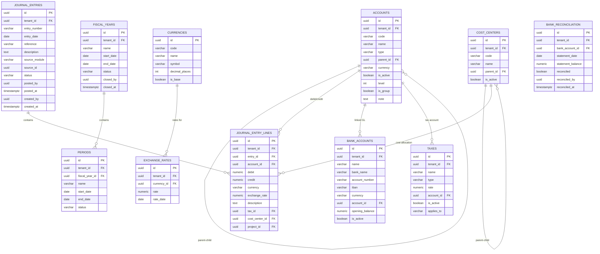

### 6.2 SQL — Accounting Tables

```sql
-- ================================================================
-- 10. accounts (Chart of Accounts)
-- ================================================================
CREATE TABLE accounts (
    id              UUID PRIMARY KEY DEFAULT gen_random_uuid(),
    tenant_id       UUID NOT NULL REFERENCES eos_shared.tenants(id) ON DELETE CASCADE,
    code            VARCHAR(20) NOT NULL,
    name            VARCHAR(255) NOT NULL,
    type            VARCHAR(20) NOT NULL
                        CHECK (type IN ('asset','liability','equity','revenue','expense')),
    parent_id       UUID REFERENCES accounts(id) ON DELETE SET NULL,
    currency        VARCHAR(3) DEFAULT 'USD',
    is_active       BOOLEAN NOT NULL DEFAULT TRUE,
    level           INT NOT NULL DEFAULT 0,
    is_group        BOOLEAN NOT NULL DEFAULT FALSE,
    note            TEXT,

    UNIQUE (tenant_id, code)
);

CREATE INDEX idx_acct_tenant ON accounts (tenant_id);
CREATE INDEX idx_acct_type ON accounts (tenant_id, type);
CREATE INDEX idx_acct_parent ON accounts (parent_id);
CREATE INDEX idx_acct_code ON accounts (tenant_id, code);

COMMENT ON TABLE accounts IS 'Chart of Accounts — hierarchical with parent_id self-reference';
COMMENT ON COLUMN accounts.type IS 'Account classification: asset, liability, equity, revenue, expense';
COMMENT ON COLUMN accounts.is_group IS 'TRUE for header/group accounts that aggregate children';

-- ================================================================
-- 11. journal_entries
-- ================================================================
CREATE TABLE journal_entries (
    id              UUID PRIMARY KEY DEFAULT gen_random_uuid(),
    tenant_id       UUID NOT NULL REFERENCES eos_shared.tenants(id) ON DELETE CASCADE,
    entry_number    VARCHAR(30) NOT NULL,
    entry_date      DATE NOT NULL DEFAULT CURRENT_DATE,
    reference       VARCHAR(100),
    description     TEXT,
    source_module   VARCHAR(50),
    source_id       UUID,
    status          VARCHAR(20) NOT NULL DEFAULT 'draft'
                        CHECK (status IN ('draft','posted','reversed')),
    posted_by       UUID,
    posted_at       TIMESTAMPTZ,
    created_by      UUID,
    created_at      TIMESTAMPTZ NOT NULL DEFAULT now(),

    UNIQUE (tenant_id, entry_number)
);

CREATE INDEX idx_je_tenant ON journal_entries (tenant_id);
CREATE INDEX idx_je_date ON journal_entries (tenant_id, entry_date);
CREATE INDEX idx_je_status ON journal_entries (tenant_id, status);
CREATE INDEX idx_je_source ON journal_entries (tenant_id, source_module, source_id);
CREATE INDEX idx_je_number ON journal_entries (tenant_id, entry_number);

COMMENT ON TABLE journal_entries IS 'General ledger journal entries — header level';

-- ================================================================
-- 12. journal_entry_lines
-- ================================================================
CREATE TABLE journal_entry_lines (
    id              UUID PRIMARY KEY DEFAULT gen_random_uuid(),
    tenant_id       UUID NOT NULL REFERENCES eos_shared.tenants(id) ON DELETE CASCADE,
    entry_id        UUID NOT NULL REFERENCES journal_entries(id) ON DELETE CASCADE,
    account_id      UUID NOT NULL REFERENCES accounts(id),
    debit           NUMERIC(18,4) NOT NULL DEFAULT 0 CHECK (debit >= 0),
    credit          NUMERIC(18,4) NOT NULL DEFAULT 0 CHECK (credit >= 0),
    currency        VARCHAR(3) DEFAULT 'USD',
    exchange_rate   NUMERIC(18,6) DEFAULT 1,
    description     TEXT,
    tax_id          UUID,
    cost_center_id  UUID,
    project_id      UUID,

    CHECK (debit > 0 OR credit > 0),
    CHECK (NOT (debit > 0 AND credit > 0))
);

CREATE INDEX idx_jel_entry ON journal_entry_lines (entry_id);
CREATE INDEX idx_jel_account ON journal_entry_lines (account_id);
CREATE INDEX idx_jel_tenant ON journal_entry_lines (tenant_id);
CREATE INDEX idx_jel_cost_center ON journal_entry_lines (cost_center_id) WHERE cost_center_id IS NOT NULL;
CREATE INDEX idx_jel_project ON journal_entry_lines (project_id) WHERE project_id IS NOT NULL;

COMMENT ON TABLE journal_entry_lines IS 'Journal entry line items — exactly one of debit/credit per row';

-- ================================================================
-- 13. fiscal_years
-- ================================================================
CREATE TABLE fiscal_years (
    id              UUID PRIMARY KEY DEFAULT gen_random_uuid(),
    tenant_id       UUID NOT NULL REFERENCES eos_shared.tenants(id) ON DELETE CASCADE,
    name            VARCHAR(100) NOT NULL,
    start_date      DATE NOT NULL,
    end_date        DATE NOT NULL,
    status          VARCHAR(20) NOT NULL DEFAULT 'open'
                        CHECK (status IN ('open','closed')),
    closed_by       UUID,
    closed_at       TIMESTAMPTZ,

    UNIQUE (tenant_id, name),
    UNIQUE (tenant_id, start_date),
    UNIQUE (tenant_id, end_date)
);

CREATE INDEX idx_fy_tenant ON fiscal_years (tenant_id);

COMMENT ON TABLE fiscal_years IS 'Fiscal year definitions — controls period locking';

-- ================================================================
-- 14. periods
-- ================================================================
CREATE TABLE periods (
    id              UUID PRIMARY KEY DEFAULT gen_random_uuid(),
    tenant_id       UUID NOT NULL REFERENCES eos_shared.tenants(id) ON DELETE CASCADE,
    fiscal_year_id  UUID NOT NULL REFERENCES fiscal_years(id) ON DELETE CASCADE,
    name            VARCHAR(100) NOT NULL,
    start_date      DATE NOT NULL,
    end_date        DATE NOT NULL,
    status          VARCHAR(20) NOT NULL DEFAULT 'open'
                        CHECK (status IN ('open','closed','locked')),

    UNIQUE (tenant_id, fiscal_year_id, name)
);

CREATE INDEX idx_periods_year ON periods (fiscal_year_id);
CREATE INDEX idx_periods_tenant ON periods (tenant_id);
CREATE INDEX idx_periods_status ON periods (tenant_id, status);

COMMENT ON TABLE periods IS 'Accounting periods within a fiscal year — monthly or custom';

-- ================================================================
-- 15. taxes
-- ================================================================
CREATE TABLE taxes (
    id              UUID PRIMARY KEY DEFAULT gen_random_uuid(),
    tenant_id       UUID NOT NULL REFERENCES eos_shared.tenants(id) ON DELETE CASCADE,
    name            VARCHAR(100) NOT NULL,
    type            VARCHAR(20) NOT NULL
                        CHECK (type IN ('fixed','percentage')),
    rate            NUMERIC(8,4) NOT NULL DEFAULT 0,
    account_id      UUID REFERENCES accounts(id) ON DELETE SET NULL,
    is_active       BOOLEAN NOT NULL DEFAULT TRUE,
    applies_to      VARCHAR(20) DEFAULT 'both'
                        CHECK (applies_to IN ('purchase','sale','both')),

    UNIQUE (tenant_id, name)
);

CREATE INDEX idx_tax_tenant ON taxes (tenant_id);

COMMENT ON TABLE taxes IS 'Tax definitions — VAT, sales tax, withholding, etc.';

-- ================================================================
-- 16. currencies
-- ================================================================
CREATE TABLE currencies (
    id              UUID PRIMARY KEY DEFAULT gen_random_uuid(),
    code            VARCHAR(3) NOT NULL UNIQUE,
    name            VARCHAR(100) NOT NULL,
    symbol          VARCHAR(10) NOT NULL,
    decimal_places  INT NOT NULL DEFAULT 2,
    is_base         BOOLEAN NOT NULL DEFAULT FALSE
);

COMMENT ON TABLE currencies IS 'Global currency catalog — ISO 4217 codes';

-- ================================================================
-- 17. exchange_rates
-- ================================================================
CREATE TABLE exchange_rates (
    id              UUID PRIMARY KEY DEFAULT gen_random_uuid(),
    tenant_id       UUID NOT NULL REFERENCES eos_shared.tenants(id) ON DELETE CASCADE,
    currency_id     UUID NOT NULL REFERENCES currencies(id),
    rate            NUMERIC(18,6) NOT NULL CHECK (rate > 0),
    rate_date       DATE NOT NULL DEFAULT CURRENT_DATE,

    UNIQUE (tenant_id, currency_id, rate_date)
);

CREATE INDEX idx_er_tenant ON exchange_rates (tenant_id);
CREATE INDEX idx_er_date ON exchange_rates (tenant_id, rate_date DESC);

COMMENT ON TABLE exchange_rates IS 'Daily exchange rates relative to the tenant base currency';

-- ================================================================
-- 18. cost_centers
-- ================================================================
CREATE TABLE cost_centers (
    id              UUID PRIMARY KEY DEFAULT gen_random_uuid(),
    tenant_id       UUID NOT NULL REFERENCES eos_shared.tenants(id) ON DELETE CASCADE,
    code            VARCHAR(20) NOT NULL,
    name            VARCHAR(255) NOT NULL,
    parent_id       UUID REFERENCES cost_centers(id) ON DELETE SET NULL,
    is_active       BOOLEAN NOT NULL DEFAULT TRUE,

    UNIQUE (tenant_id, code)
);

CREATE INDEX idx_cc_tenant ON cost_centers (tenant_id);
CREATE INDEX idx_cc_parent ON cost_centers (parent_id);

COMMENT ON TABLE cost_centers IS 'Hierarchical cost centers for expense allocation';

-- ================================================================
-- 19. bank_accounts
-- ================================================================
CREATE TABLE bank_accounts (
    id                  UUID PRIMARY KEY DEFAULT gen_random_uuid(),
    tenant_id           UUID NOT NULL REFERENCES eos_shared.tenants(id) ON DELETE CASCADE,
    name                VARCHAR(255) NOT NULL,
    bank_name           VARCHAR(255),
    account_number      VARCHAR(50),
    iban                VARCHAR(50),
    currency            VARCHAR(3) DEFAULT 'USD',
    account_id          UUID REFERENCES accounts(id) ON DELETE SET NULL,
    opening_balance     NUMERIC(18,4) NOT NULL DEFAULT 0,
    is_active           BOOLEAN NOT NULL DEFAULT TRUE,

    UNIQUE (tenant_id, account_number)
);

CREATE INDEX idx_ba_tenant ON bank_accounts (tenant_id);

COMMENT ON TABLE bank_accounts IS 'Bank/cash accounts — linked to GL account via account_id';

-- ================================================================
-- 20. bank_reconciliation
-- ================================================================
CREATE TABLE bank_reconciliation (
    id                  UUID PRIMARY KEY DEFAULT gen_random_uuid(),
    tenant_id           UUID NOT NULL REFERENCES eos_shared.tenants(id) ON DELETE CASCADE,
    bank_account_id     UUID NOT NULL REFERENCES bank_accounts(id) ON DELETE CASCADE,
    statement_date      DATE NOT NULL,
    statement_balance   NUMERIC(18,4) NOT NULL,
    reconciled          BOOLEAN NOT NULL DEFAULT FALSE,
    reconciled_by       UUID,
    reconciled_at       TIMESTAMPTZ
);

CREATE INDEX idx_br_bank ON bank_reconciliation (bank_account_id);
CREATE INDEX idx_br_tenant ON bank_reconciliation (tenant_id);
CREATE INDEX idx_br_date ON bank_reconciliation (tenant_id, statement_date DESC);

COMMENT ON TABLE bank_reconciliation IS 'Bank statement reconciliation records';
```

---

## 7. Inventory Module

Products, warehouses, stock tracking, purchase/supply pipeline, customers, and
physical stock takes.

### 7.1 ER Diagram — Inventory

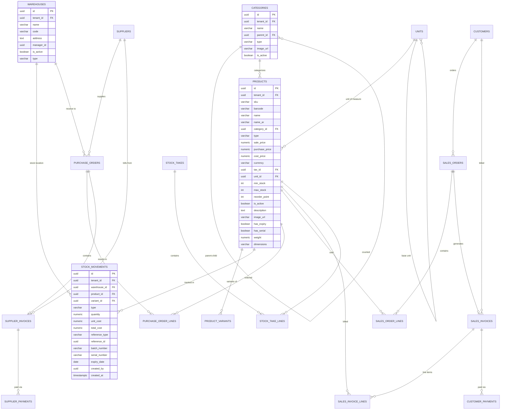

### 7.2 SQL — Inventory Tables

```sql
-- ================================================================
-- 21. warehouses
-- ================================================================
CREATE TABLE warehouses (
    id              UUID PRIMARY KEY DEFAULT gen_random_uuid(),
    tenant_id       UUID NOT NULL REFERENCES eos_shared.tenants(id) ON DELETE CASCADE,
    name            VARCHAR(255) NOT NULL,
    code            VARCHAR(20) NOT NULL,
    address         TEXT,
    manager_id      UUID,
    is_active       BOOLEAN NOT NULL DEFAULT TRUE,
    type            VARCHAR(20) NOT NULL DEFAULT 'main'
                        CHECK (type IN ('main','branch','virtual')),

    UNIQUE (tenant_id, code)
);

CREATE INDEX idx_wh_tenant ON warehouses (tenant_id);

COMMENT ON TABLE warehouses IS 'Inventory locations — physical or virtual';

-- ================================================================
-- 22. categories
-- ================================================================
CREATE TABLE categories (
    id              UUID PRIMARY KEY DEFAULT gen_random_uuid(),
    tenant_id       UUID NOT NULL REFERENCES eos_shared.tenants(id) ON DELETE CASCADE,
    name            VARCHAR(255) NOT NULL,
    parent_id       UUID REFERENCES categories(id) ON DELETE SET NULL,
    type            VARCHAR(20) NOT NULL DEFAULT 'product'
                        CHECK (type IN ('product','service')),
    image_url       VARCHAR(500),
    is_active       BOOLEAN NOT NULL DEFAULT TRUE,

    UNIQUE (tenant_id, name, type)
);

CREATE INDEX idx_cat_tenant ON categories (tenant_id);
CREATE INDEX idx_cat_parent ON categories (parent_id);

COMMENT ON TABLE categories IS 'Product/service categories — supports nested hierarchy';

-- ================================================================
-- 23. units
-- ================================================================
CREATE TABLE units (
    id              UUID PRIMARY KEY DEFAULT gen_random_uuid(),
    tenant_id       UUID NOT NULL REFERENCES eos_shared.tenants(id) ON DELETE CASCADE,
    name            VARCHAR(100) NOT NULL,
    symbol          VARCHAR(20) NOT NULL,
    type            VARCHAR(20) NOT NULL DEFAULT 'reference'
                        CHECK (type IN ('reference','condition','packaging')),
    factor          NUMERIC(12,6) NOT NULL DEFAULT 1,
    base_unit_id    UUID REFERENCES units(id) ON DELETE SET NULL,

    UNIQUE (tenant_id, symbol)
);

CREATE INDEX idx_unit_tenant ON units (tenant_id);

COMMENT ON TABLE units IS 'Units of measure with conversion factor to base unit';

-- ================================================================
-- 24. products
-- ================================================================
CREATE TABLE products (
    id              UUID PRIMARY KEY DEFAULT gen_random_uuid(),
    tenant_id       UUID NOT NULL REFERENCES eos_shared.tenants(id) ON DELETE CASCADE,
    sku             VARCHAR(50) NOT NULL,
    barcode         VARCHAR(50),
    name            VARCHAR(500) NOT NULL,
    name_ar         VARCHAR(500),
    category_id     UUID REFERENCES categories(id) ON DELETE SET NULL,
    type            VARCHAR(20) NOT NULL DEFAULT 'goods'
                        CHECK (type IN ('goods','service','variant')),
    sale_price      NUMERIC(18,4) NOT NULL DEFAULT 0,
    purchase_price  NUMERIC(18,4) NOT NULL DEFAULT 0,
    cost_price      NUMERIC(18,4) NOT NULL DEFAULT 0,
    currency        VARCHAR(3) DEFAULT 'USD',
    tax_id          UUID REFERENCES taxes(id) ON DELETE SET NULL,
    unit_id         UUID REFERENCES units(id) ON DELETE SET NULL,
    min_stock       INT NOT NULL DEFAULT 0,
    max_stock       INT,
    reorder_point   INT NOT NULL DEFAULT 0,
    is_active       BOOLEAN NOT NULL DEFAULT TRUE,
    description     TEXT,
    image_url       VARCHAR(500),
    has_expiry      BOOLEAN NOT NULL DEFAULT FALSE,
    has_serial      BOOLEAN NOT NULL DEFAULT FALSE,
    weight          NUMERIC(10,3),
    dimensions      VARCHAR(50),

    UNIQUE (tenant_id, sku)
);

CREATE INDEX idx_prod_tenant ON products (tenant_id);
CREATE INDEX idx_prod_sku ON products (tenant_id, sku);
CREATE INDEX idx_prod_barcode ON products (tenant_id, barcode) WHERE barcode IS NOT NULL;
CREATE INDEX idx_prod_category ON products (category_id);
CREATE INDEX idx_prod_active ON products (tenant_id, is_active) WHERE is_active = TRUE;

COMMENT ON TABLE products IS 'Master product/service catalog with pricing, stock levels, and attributes';

-- ================================================================
-- 25. product_variants
-- ================================================================
CREATE TABLE product_variants (
    id              UUID PRIMARY KEY DEFAULT gen_random_uuid(),
    tenant_id       UUID NOT NULL REFERENCES eos_shared.tenants(id) ON DELETE CASCADE,
    product_id      UUID NOT NULL REFERENCES products(id) ON DELETE CASCADE,
    sku             VARCHAR(50) NOT NULL,
    barcode         VARCHAR(50),
    name            VARCHAR(500) NOT NULL,
    attributes      JSONB NOT NULL DEFAULT '{}',
    price           NUMERIC(18,4) NOT NULL DEFAULT 0,
    cost_price      NUMERIC(18,4) NOT NULL DEFAULT 0,
    stock_quantity  INT NOT NULL DEFAULT 0,
    is_active       BOOLEAN NOT NULL DEFAULT TRUE,

    UNIQUE (tenant_id, sku),
    UNIQUE (tenant_id, product_id, attributes)
);

CREATE INDEX idx_pv_product ON product_variants (product_id);
CREATE INDEX idx_pv_tenant ON product_variants (tenant_id);

COMMENT ON TABLE product_variants IS 'SKU-level variants (size, color, etc.) — attributes as JSONB';

-- ================================================================
-- 26. stock_movements (partitioned)
-- ================================================================
CREATE TABLE stock_movements (
    id              UUID NOT NULL DEFAULT gen_random_uuid(),
    tenant_id       UUID NOT NULL REFERENCES eos_shared.tenants(id) ON DELETE CASCADE,
    warehouse_id    UUID NOT NULL REFERENCES warehouses(id),
    product_id      UUID NOT NULL REFERENCES products(id),
    variant_id      UUID,
    type            VARCHAR(20) NOT NULL
                        CHECK (type IN ('in','out','adjustment','transfer')),
    quantity        NUMERIC(14,4) NOT NULL CHECK (quantity > 0),
    unit_cost       NUMERIC(18,4) NOT NULL DEFAULT 0,
    total_cost      NUMERIC(18,4) NOT NULL DEFAULT 0,
    reference_type  VARCHAR(50),
    reference_id    UUID,
    batch_number    VARCHAR(100),
    serial_number   VARCHAR(100),
    expiry_date     DATE,
    created_by      UUID,
    created_at      TIMESTAMPTZ NOT NULL DEFAULT now(),

    PRIMARY KEY (id, created_at)
) PARTITION BY RANGE (created_at);

-- Monthly partitions
CREATE TABLE stock_movements_2026_01 PARTITION OF stock_movements
    FOR VALUES FROM ('2026-01-01') TO ('2026-02-01');
CREATE TABLE stock_movements_2026_02 PARTITION OF stock_movements
    FOR VALUES FROM ('2026-02-01') TO ('2026-03-01');
CREATE TABLE stock_movements_2026_03 PARTITION OF stock_movements
    FOR VALUES FROM ('2026-03-01') TO ('2026-04-01');
CREATE TABLE stock_movements_2026_04 PARTITION OF stock_movements
    FOR VALUES FROM ('2026-04-01') TO ('2026-05-01');
CREATE TABLE stock_movements_2026_05 PARTITION OF stock_movements
    FOR VALUES FROM ('2026-05-01') TO ('2026-06-01');
CREATE TABLE stock_movements_2026_06 PARTITION OF stock_movements
    FOR VALUES FROM ('2026-06-01') TO ('2026-07-01');
CREATE TABLE stock_movements_2026_07 PARTITION OF stock_movements
    FOR VALUES FROM ('2026-07-01') TO ('2026-08-01');
CREATE TABLE stock_movements_2026_08 PARTITION OF stock_movements
    FOR VALUES FROM ('2026-08-01') TO ('2026-09-01');
CREATE TABLE stock_movements_2026_09 PARTITION OF stock_movements
    FOR VALUES FROM ('2026-09-01') TO ('2026-10-01');
CREATE TABLE stock_movements_2026_10 PARTITION OF stock_movements
    FOR VALUES FROM ('2026-10-01') TO ('2026-11-01');
CREATE TABLE stock_movements_2026_11 PARTITION OF stock_movements
    FOR VALUES FROM ('2026-11-01') TO ('2026-12-01');
CREATE TABLE stock_movements_2026_12 PARTITION OF stock_movements
    FOR VALUES FROM ('2026-12-01') TO ('2027-01-01');

CREATE INDEX idx_sm_tenant_date ON stock_movements (tenant_id, created_at DESC);
CREATE INDEX idx_sm_product ON stock_movements (tenant_id, product_id);
CREATE INDEX idx_sm_warehouse ON stock_movements (tenant_id, warehouse_id);
CREATE INDEX idx_sm_reference ON stock_movements (tenant_id, reference_type, reference_id);
CREATE INDEX idx_sm_batch ON stock_movements (tenant_id, batch_number)
    WHERE batch_number IS NOT NULL;
CREATE INDEX idx_sm_serial ON stock_movements (tenant_id, serial_number)
    WHERE serial_number IS NOT NULL;

COMMENT ON TABLE stock_movements IS 'Immutable inventory ledger — range-partitioned by month';

-- ================================================================
-- 27. purchase_orders
-- ================================================================
CREATE TABLE purchase_orders (
    id              UUID PRIMARY KEY DEFAULT gen_random_uuid(),
    tenant_id       UUID NOT NULL REFERENCES eos_shared.tenants(id) ON DELETE CASCADE,
    order_number    VARCHAR(30) NOT NULL,
    supplier_id     UUID NOT NULL,
    warehouse_id    UUID REFERENCES warehouses(id),
    order_date      DATE NOT NULL DEFAULT CURRENT_DATE,
    expected_date   DATE,
    status          VARCHAR(20) NOT NULL DEFAULT 'draft'
                        CHECK (status IN ('draft','confirmed','received','cancelled')),
    subtotal        NUMERIC(18,4) NOT NULL DEFAULT 0,
    tax_amount      NUMERIC(18,4) NOT NULL DEFAULT 0,
    discount        NUMERIC(18,4) NOT NULL DEFAULT 0,
    total           NUMERIC(18,4) NOT NULL DEFAULT 0,
    currency        VARCHAR(3) DEFAULT 'USD',
    notes           TEXT,
    created_by      UUID,
    approved_by     UUID,
    approved_at     TIMESTAMPTZ,
    created_at      TIMESTAMPTZ NOT NULL DEFAULT now(),

    UNIQUE (tenant_id, order_number)
);

CREATE INDEX idx_po_tenant ON purchase_orders (tenant_id);
CREATE INDEX idx_po_supplier ON purchase_orders (tenant_id, supplier_id);
CREATE INDEX idx_po_status ON purchase_orders (tenant_id, status);
CREATE INDEX idx_po_date ON purchase_orders (tenant_id, order_date DESC);

COMMENT ON TABLE purchase_orders IS 'Purchase orders to suppliers';

-- ================================================================
-- 28. purchase_order_lines
-- ================================================================
CREATE TABLE purchase_order_lines (
    id              UUID PRIMARY KEY DEFAULT gen_random_uuid(),
    tenant_id       UUID NOT NULL REFERENCES eos_shared.tenants(id) ON DELETE CASCADE,
    order_id        UUID NOT NULL REFERENCES purchase_orders(id) ON DELETE CASCADE,
    product_id      UUID NOT NULL REFERENCES products(id),
    quantity        NUMERIC(14,4) NOT NULL CHECK (quantity > 0),
    received_qty    NUMERIC(14,4) NOT NULL DEFAULT 0,
    unit_price      NUMERIC(18,4) NOT NULL,
    tax_id          UUID,
    discount        NUMERIC(18,4) NOT NULL DEFAULT 0,
    total           NUMERIC(18,4) NOT NULL
);

CREATE INDEX idx_pol_order ON purchase_order_lines (order_id);
CREATE INDEX idx_pol_product ON purchase_order_lines (product_id);

COMMENT ON TABLE purchase_order_lines IS 'Line items for purchase orders';

-- ================================================================
-- 29. supplier_invoices
-- ================================================================
CREATE TABLE supplier_invoices (
    id                  UUID PRIMARY KEY DEFAULT gen_random_uuid(),
    tenant_id           UUID NOT NULL REFERENCES eos_shared.tenants(id) ON DELETE CASCADE,
    invoice_number      VARCHAR(30) NOT NULL,
    supplier_id         UUID NOT NULL,
    purchase_order_id   UUID REFERENCES purchase_orders(id),
    invoice_date        DATE NOT NULL DEFAULT CURRENT_DATE,
    due_date            DATE,
    subtotal            NUMERIC(18,4) NOT NULL DEFAULT 0,
    tax_amount          NUMERIC(18,4) NOT NULL DEFAULT 0,
    discount            NUMERIC(18,4) NOT NULL DEFAULT 0,
    total               NUMERIC(18,4) NOT NULL DEFAULT 0,
    paid_amount         NUMERIC(18,4) NOT NULL DEFAULT 0,
    status              VARCHAR(20) NOT NULL DEFAULT 'draft'
                            CHECK (status IN ('draft','validated','partially_paid','paid','overdue')),
    currency            VARCHAR(3) DEFAULT 'USD',
    notes               TEXT,
    created_by          UUID,
    created_at          TIMESTAMPTZ NOT NULL DEFAULT now(),

    UNIQUE (tenant_id, invoice_number)
);

CREATE INDEX idx_si_tenant ON supplier_invoices (tenant_id);
CREATE INDEX idx_si_supplier ON supplier_invoices (tenant_id, supplier_id);
CREATE INDEX idx_si_status ON supplier_invoices (tenant_id, status);
CREATE INDEX idx_si_due ON supplier_invoices (tenant_id, due_date)
    WHERE status NOT IN ('paid','cancelled');

COMMENT ON TABLE supplier_invoices IS 'Bills received from suppliers';

-- ================================================================
-- 30. supplier_payments
-- ================================================================
CREATE TABLE supplier_payments (
    id              UUID PRIMARY KEY DEFAULT gen_random_uuid(),
    tenant_id       UUID NOT NULL REFERENCES eos_shared.tenants(id) ON DELETE CASCADE,
    payment_number  VARCHAR(30) NOT NULL,
    supplier_id     UUID NOT NULL,
    invoice_id      UUID REFERENCES supplier_invoices(id),
    payment_date    DATE NOT NULL DEFAULT CURRENT_DATE,
    amount          NUMERIC(18,4) NOT NULL CHECK (amount > 0),
    method          VARCHAR(20) NOT NULL
                        CHECK (method IN ('bank','cash','check','online')),
    bank_account_id UUID REFERENCES bank_accounts(id),
    check_number    VARCHAR(50),
    reference       VARCHAR(100),
    notes           TEXT,
    created_by      UUID,
    created_at      TIMESTAMPTZ NOT NULL DEFAULT now(),

    UNIQUE (tenant_id, payment_number)
);

CREATE INDEX idx_sp_tenant ON supplier_payments (tenant_id);
CREATE INDEX idx_sp_supplier ON supplier_payments (tenant_id, supplier_id);
CREATE INDEX idx_sp_invoice ON supplier_payments (invoice_id) WHERE invoice_id IS NOT NULL;
CREATE INDEX idx_sp_date ON supplier_payments (tenant_id, payment_date DESC);

COMMENT ON TABLE supplier_payments IS 'Payments made to suppliers';

-- ================================================================
-- 31. customers
-- ================================================================
CREATE TABLE customers (
    id              UUID PRIMARY KEY DEFAULT gen_random_uuid(),
    tenant_id       UUID NOT NULL REFERENCES eos_shared.tenants(id) ON DELETE CASCADE,
    name            VARCHAR(255) NOT NULL,
    name_ar         VARCHAR(255),
    code            VARCHAR(20) NOT NULL,
    type            VARCHAR(20) NOT NULL DEFAULT 'company'
                        CHECK (type IN ('individual','company')),
    email           VARCHAR(255),
    phone           VARCHAR(50),
    mobile          VARCHAR(50),
    address         TEXT,
    city            VARCHAR(100),
    country         VARCHAR(100),
    tax_id          VARCHAR(100),
    credit_limit    NUMERIC(18,4) NOT NULL DEFAULT 0,
    payment_terms   INT NOT NULL DEFAULT 0,
    is_active       BOOLEAN NOT NULL DEFAULT TRUE,
    tags            JSONB NOT NULL DEFAULT '[]',
    notes           TEXT,
    created_at      TIMESTAMPTZ NOT NULL DEFAULT now(),

    UNIQUE (tenant_id, code)
);

CREATE INDEX idx_cust_tenant ON customers (tenant_id);
CREATE INDEX idx_cust_code ON customers (tenant_id, code);
CREATE INDEX idx_cust_name ON customers (tenant_id, name);
CREATE INDEX idx_cust_email ON customers (tenant_id, email) WHERE email IS NOT NULL;
CREATE INDEX idx_cust_type ON customers (tenant_id, type);

COMMENT ON TABLE customers IS 'Customer master data';

-- ================================================================
-- 32. suppliers
-- ================================================================
CREATE TABLE suppliers (
    id              UUID PRIMARY KEY DEFAULT gen_random_uuid(),
    tenant_id       UUID NOT NULL REFERENCES eos_shared.tenants(id) ON DELETE CASCADE,
    name            VARCHAR(255) NOT NULL,
    name_ar         VARCHAR(255),
    code            VARCHAR(20) NOT NULL,
    type            VARCHAR(20) NOT NULL DEFAULT 'company'
                        CHECK (type IN ('individual','company')),
    email           VARCHAR(255),
    phone           VARCHAR(50),
    mobile          VARCHAR(50),
    address         TEXT,
    city            VARCHAR(100),
    country         VARCHAR(100),
    tax_id          VARCHAR(100),
    payment_terms   INT NOT NULL DEFAULT 0,
    is_active       BOOLEAN NOT NULL DEFAULT TRUE,
    tags            JSONB NOT NULL DEFAULT '[]',
    notes           TEXT,
    created_at      TIMESTAMPTZ NOT NULL DEFAULT now(),

    UNIQUE (tenant_id, code)
);

CREATE INDEX idx_sup_tenant ON suppliers (tenant_id);
CREATE INDEX idx_sup_code ON suppliers (tenant_id, code);
CREATE INDEX idx_sup_name ON suppliers (tenant_id, name);

COMMENT ON TABLE suppliers IS 'Supplier/vendor master data';

-- ================================================================
-- 33. stock_takes
-- ================================================================
CREATE TABLE stock_takes (
    id              UUID PRIMARY KEY DEFAULT gen_random_uuid(),
    tenant_id       UUID NOT NULL REFERENCES eos_shared.tenants(id) ON DELETE CASCADE,
    warehouse_id    UUID NOT NULL REFERENCES warehouses(id),
    status          VARCHAR(20) NOT NULL DEFAULT 'draft'
                        CHECK (status IN ('draft','in_progress','completed')),
    date            DATE NOT NULL DEFAULT CURRENT_DATE,
    notes           TEXT,
    created_by      UUID,
    completed_by    UUID,
    completed_at    TIMESTAMPTZ
);

CREATE INDEX idx_st_tenant ON stock_takes (tenant_id);
CREATE INDEX idx_st_warehouse ON stock_takes (warehouse_id);
CREATE INDEX idx_st_status ON stock_takes (tenant_id, status);

COMMENT ON TABLE stock_takes IS 'Physical inventory count sessions';

-- ================================================================
-- 34. stock_take_lines
-- ================================================================
CREATE TABLE stock_take_lines (
    id              UUID PRIMARY KEY DEFAULT gen_random_uuid(),
    tenant_id       UUID NOT NULL REFERENCES eos_shared.tenants(id) ON DELETE CASCADE,
    take_id         UUID NOT NULL REFERENCES stock_takes(id) ON DELETE CASCADE,
    product_id      UUID NOT NULL REFERENCES products(id),
    variant_id      UUID,
    system_qty      NUMERIC(14,4) NOT NULL DEFAULT 0,
    counted_qty     NUMERIC(14,4) NOT NULL DEFAULT 0,
    difference      NUMERIC(14,4) GENERATED ALWAYS AS (counted_qty - system_qty) STORED,
    notes           TEXT
);

CREATE INDEX idx_stl_take ON stock_take_lines (take_id);
CREATE INDEX idx_stl_product ON stock_take_lines (product_id);

COMMENT ON TABLE stock_take_lines IS 'Individual count lines — difference is auto-computed';
```

---

## 8. HR Module

Employee management, job titles, attendance, leave, payroll, contracts, evaluations,
and training.

### 8.1 ER Diagram — HR

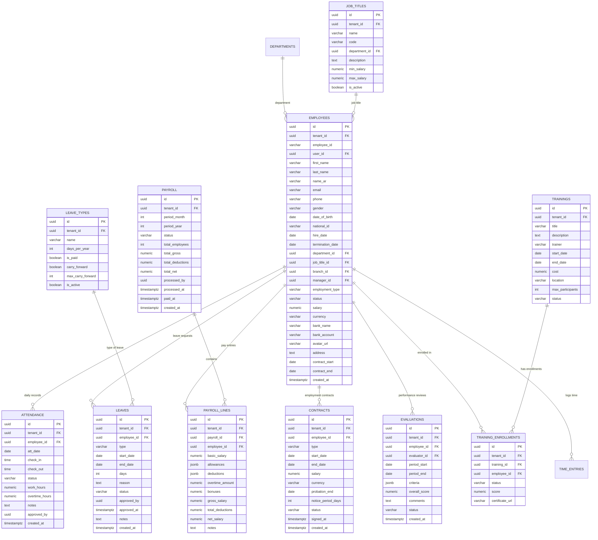

### 8.2 SQL — HR Tables

```sql
-- ================================================================
-- 35. employees
-- ================================================================
CREATE TABLE employees (
    id                  UUID PRIMARY KEY DEFAULT gen_random_uuid(),
    tenant_id           UUID NOT NULL REFERENCES eos_shared.tenants(id) ON DELETE CASCADE,
    employee_id         VARCHAR(30) NOT NULL,
    user_id             UUID REFERENCES eos_shared.users(id) ON DELETE SET NULL,
    first_name          VARCHAR(100) NOT NULL,
    last_name           VARCHAR(100) NOT NULL,
    name_ar             VARCHAR(200),
    email               VARCHAR(255),
    phone               VARCHAR(50),
    gender              VARCHAR(10) CHECK (gender IN ('male','female','other')),
    date_of_birth       DATE,
    national_id         VARCHAR(50),
    hire_date           DATE NOT NULL DEFAULT CURRENT_DATE,
    termination_date    DATE,
    department_id       UUID,
    job_title_id        UUID,
    branch_id           UUID,
    manager_id          UUID REFERENCES employees(id) ON DELETE SET NULL,
    employment_type     VARCHAR(20) NOT NULL DEFAULT 'full_time'
                            CHECK (employment_type IN ('full_time','part_time','contract','intern')),
    status              VARCHAR(20) NOT NULL DEFAULT 'active'
                            CHECK (status IN ('active','on_leave','terminated')),
    salary              NUMERIC(18,4) NOT NULL DEFAULT 0,
    currency            VARCHAR(3) DEFAULT 'USD',
    bank_name           VARCHAR(255),
    bank_account        VARCHAR(50),
    avatar_url          VARCHAR(500),
    address             TEXT,
    contract_start      DATE,
    contract_end        DATE,
    created_at          TIMESTAMPTZ NOT NULL DEFAULT now(),

    UNIQUE (tenant_id, employee_id)
);

CREATE INDEX idx_emp_tenant ON employees (tenant_id);
CREATE INDEX idx_emp_user ON employees (user_id) WHERE user_id IS NOT NULL;
CREATE INDEX idx_emp_dept ON employees (department_id) WHERE department_id IS NOT NULL;
CREATE INDEX idx_emp_manager ON employees (manager_id) WHERE manager_id IS NOT NULL;
CREATE INDEX idx_emp_status ON employees (tenant_id, status);
CREATE INDEX idx_emp_hire ON employees (tenant_id, hire_date DESC);

COMMENT ON TABLE employees IS 'Employee master — linked to user account via user_id';

-- ================================================================
-- 36. job_titles
-- ================================================================
CREATE TABLE job_titles (
    id              UUID PRIMARY KEY DEFAULT gen_random_uuid(),
    tenant_id       UUID NOT NULL REFERENCES eos_shared.tenants(id) ON DELETE CASCADE,
    name            VARCHAR(150) NOT NULL,
    code            VARCHAR(20) NOT NULL,
    department_id   UUID,
    description     TEXT,
    min_salary      NUMERIC(18,4),
    max_salary      NUMERIC(18,4),
    is_active       BOOLEAN NOT NULL DEFAULT TRUE,

    UNIQUE (tenant_id, code)
);

CREATE INDEX idx_jt_tenant ON job_titles (tenant_id);

COMMENT ON TABLE job_titles IS 'Job title / position catalog';

-- ================================================================
-- 37. attendance
-- ================================================================
CREATE TABLE attendance (
    id              UUID PRIMARY KEY DEFAULT gen_random_uuid(),
    tenant_id       UUID NOT NULL REFERENCES eos_shared.tenants(id) ON DELETE CASCADE,
    employee_id     UUID NOT NULL REFERENCES employees(id) ON DELETE CASCADE,
    att_date        DATE NOT NULL,
    check_in        TIME,
    check_out       TIME,
    status          VARCHAR(20) NOT NULL DEFAULT 'present'
                        CHECK (status IN ('present','absent','late','half_day','leave')),
    work_hours      NUMERIC(6,2) DEFAULT 0,
    overtime_hours  NUMERIC(6,2) DEFAULT 0,
    notes           TEXT,
    approved_by     UUID,
    created_at      TIMESTAMPTZ NOT NULL DEFAULT now(),

    UNIQUE (tenant_id, employee_id, att_date)
);

CREATE INDEX idx_att_tenant ON attendance (tenant_id);
CREATE INDEX idx_att_employee ON attendance (employee_id);
CREATE INDEX idx_att_date ON attendance (tenant_id, att_date);
CREATE INDEX idx_att_status ON attendance (tenant_id, status);

COMMENT ON TABLE attendance IS 'Daily attendance records per employee';

-- ================================================================
-- 38. leaves
-- ================================================================
CREATE TABLE leaves (
    id              UUID PRIMARY KEY DEFAULT gen_random_uuid(),
    tenant_id       UUID NOT NULL REFERENCES eos_shared.tenants(id) ON DELETE CASCADE,
    employee_id     UUID NOT NULL REFERENCES employees(id) ON DELETE CASCADE,
    type            VARCHAR(30) NOT NULL
                        CHECK (type IN ('annual','sick','maternity','paternity','unpaid','emergency')),
    start_date      DATE NOT NULL,
    end_date        DATE NOT NULL,
    days            INT NOT NULL CHECK (days > 0),
    reason          TEXT,
    status          VARCHAR(20) NOT NULL DEFAULT 'pending'
                        CHECK (status IN ('pending','approved','rejected','cancelled')),
    approved_by     UUID,
    approved_at     TIMESTAMPTZ,
    notes           TEXT,
    created_at      TIMESTAMPTZ NOT NULL DEFAULT now(),

    CHECK (end_date >= start_date)
);

CREATE INDEX idx_leave_tenant ON leaves (tenant_id);
CREATE INDEX idx_leave_employee ON leaves (employee_id);
CREATE INDEX idx_leave_status ON leaves (tenant_id, status);
CREATE INDEX idx_leave_dates ON leaves (tenant_id, start_date, end_date);

COMMENT ON TABLE leaves IS 'Leave requests and approvals';

-- ================================================================
-- 39. leave_types
-- ================================================================
CREATE TABLE leave_types (
    id                  UUID PRIMARY KEY DEFAULT gen_random_uuid(),
    tenant_id           UUID NOT NULL REFERENCES eos_shared.tenants(id) ON DELETE CASCADE,
    name                VARCHAR(100) NOT NULL,
    days_per_year       INT NOT NULL DEFAULT 0,
    is_paid             BOOLEAN NOT NULL DEFAULT TRUE,
    carry_forward       BOOLEAN NOT NULL DEFAULT FALSE,
    max_carry_forward   INT NOT NULL DEFAULT 0,
    is_active           BOOLEAN NOT NULL DEFAULT TRUE,

    UNIQUE (tenant_id, name)
);

CREATE INDEX idx_lt_tenant ON leave_types (tenant_id);

COMMENT ON TABLE leave_types IS 'Configurable leave type definitions per tenant';

-- ================================================================
-- 40. payroll
-- ================================================================
CREATE TABLE payroll (
    id              UUID PRIMARY KEY DEFAULT gen_random_uuid(),
    tenant_id       UUID NOT NULL REFERENCES eos_shared.tenants(id) ON DELETE CASCADE,
    period_month    INT NOT NULL CHECK (period_month BETWEEN 1 AND 12),
    period_year     INT NOT NULL CHECK (period_year BETWEEN 2020 AND 2099),
    status          VARCHAR(20) NOT NULL DEFAULT 'draft'
                        CHECK (status IN ('draft','processing','completed','paid')),
    total_employees INT NOT NULL DEFAULT 0,
    total_gross     NUMERIC(18,4) NOT NULL DEFAULT 0,
    total_deductions NUMERIC(18,4) NOT NULL DEFAULT 0,
    total_net       NUMERIC(18,4) NOT NULL DEFAULT 0,
    processed_by    UUID,
    processed_at    TIMESTAMPTZ,
    paid_at         TIMESTAMPTZ,
    created_at      TIMESTAMPTZ NOT NULL DEFAULT now(),

    UNIQUE (tenant_id, period_month, period_year)
);

CREATE INDEX idx_pay_tenant ON payroll (tenant_id);
CREATE INDEX idx_pay_period ON payroll (tenant_id, period_year, period_month);
CREATE INDEX idx_pay_status ON payroll (tenant_id, status);

COMMENT ON TABLE payroll IS 'Monthly payroll run header';

-- ================================================================
-- 41. payroll_lines
-- ================================================================
CREATE TABLE payroll_lines (
    id                  UUID PRIMARY KEY DEFAULT gen_random_uuid(),
    tenant_id           UUID NOT NULL REFERENCES eos_shared.tenants(id) ON DELETE CASCADE,
    payroll_id          UUID NOT NULL REFERENCES payroll(id) ON DELETE CASCADE,
    employee_id         UUID NOT NULL REFERENCES employees(id),
    basic_salary        NUMERIC(18,4) NOT NULL DEFAULT 0,
    allowances          JSONB NOT NULL DEFAULT '{}',
    deductions          JSONB NOT NULL DEFAULT '{}',
    overtime_amount     NUMERIC(18,4) NOT NULL DEFAULT 0,
    bonuses             NUMERIC(18,4) NOT NULL DEFAULT 0,
    gross_salary        NUMERIC(18,4) NOT NULL DEFAULT 0,
    total_deductions    NUMERIC(18,4) NOT NULL DEFAULT 0,
    net_salary          NUMERIC(18,4) NOT NULL DEFAULT 0,
    notes               TEXT,

    UNIQUE (tenant_id, payroll_id, employee_id)
);

CREATE INDEX idx_pl_payroll ON payroll_lines (payroll_id);
CREATE INDEX idx_pl_employee ON payroll_lines (employee_id);

COMMENT ON TABLE payroll_lines IS 'Per-employee payroll breakdown — allowances/deductions as JSONB';

-- ================================================================
-- 42. contracts
-- ================================================================
CREATE TABLE contracts (
    id                  UUID PRIMARY KEY DEFAULT gen_random_uuid(),
    tenant_id           UUID NOT NULL REFERENCES eos_shared.tenants(id) ON DELETE CASCADE,
    employee_id         UUID NOT NULL REFERENCES employees(id) ON DELETE CASCADE,
    type                VARCHAR(20) NOT NULL
                            CHECK (type IN ('permanent','temporary','probation')),
    start_date          DATE NOT NULL,
    end_date            DATE,
    salary              NUMERIC(18,4) NOT NULL,
    currency            VARCHAR(3) DEFAULT 'USD',
    probation_end       DATE,
    notice_period_days  INT NOT NULL DEFAULT 30,
    status              VARCHAR(20) NOT NULL DEFAULT 'active'
                            CHECK (status IN ('active','expired','terminated')),
    signed_at           TIMESTAMPTZ,
    created_at          TIMESTAMPTZ NOT NULL DEFAULT now()
);

CREATE INDEX idx_con_tenant ON contracts (tenant_id);
CREATE INDEX idx_con_employee ON contracts (employee_id);
CREATE INDEX idx_con_status ON contracts (tenant_id, status);

COMMENT ON TABLE contracts IS 'Employment contracts — one active at a time per employee';

-- ================================================================
-- 43. evaluations
-- ================================================================
CREATE TABLE evaluations (
    id              UUID PRIMARY KEY DEFAULT gen_random_uuid(),
    tenant_id       UUID NOT NULL REFERENCES eos_shared.tenants(id) ON DELETE CASCADE,
    employee_id     UUID NOT NULL REFERENCES employees(id) ON DELETE CASCADE,
    evaluator_id    UUID NOT NULL REFERENCES employees(id),
    period_start    DATE NOT NULL,
    period_end      DATE NOT NULL,
    criteria        JSONB NOT NULL DEFAULT '[]',
    overall_score   NUMERIC(5,2),
    comments        TEXT,
    status          VARCHAR(20) NOT NULL DEFAULT 'draft'
                        CHECK (status IN ('draft','submitted','reviewed')),
    created_at      TIMESTAMPTZ NOT NULL DEFAULT now()
);

CREATE INDEX idx_eval_tenant ON evaluations (tenant_id);
CREATE INDEX idx_eval_employee ON evaluations (employee_id);
CREATE INDEX idx_eval_period ON evaluations (tenant_id, period_start, period_end);

COMMENT ON TABLE evaluations IS 'Performance evaluations — criteria scored via JSONB array';

-- ================================================================
-- 44. trainings
-- ================================================================
CREATE TABLE trainings (
    id                  UUID PRIMARY KEY DEFAULT gen_random_uuid(),
    tenant_id           UUID NOT NULL REFERENCES eos_shared.tenants(id) ON DELETE CASCADE,
    title               VARCHAR(255) NOT NULL,
    description         TEXT,
    trainer             VARCHAR(255),
    start_date          DATE,
    end_date            DATE,
    cost                NUMERIC(18,4) NOT NULL DEFAULT 0,
    location            VARCHAR(255),
    max_participants    INT,
    status              VARCHAR(20) NOT NULL DEFAULT 'planned'
                            CHECK (status IN ('planned','in_progress','completed','cancelled'))
);

CREATE INDEX idx_trn_tenant ON trainings (tenant_id);
CREATE INDEX idx_trn_status ON trainings (tenant_id, status);

COMMENT ON TABLE trainings IS 'Training programs / courses';

-- ================================================================
-- 45. training_enrollments
-- ================================================================
CREATE TABLE training_enrollments (
    id                  UUID PRIMARY KEY DEFAULT gen_random_uuid(),
    tenant_id           UUID NOT NULL REFERENCES eos_shared.tenants(id) ON DELETE CASCADE,
    training_id         UUID NOT NULL REFERENCES trainings(id) ON DELETE CASCADE,
    employee_id         UUID NOT NULL REFERENCES employees(id) ON DELETE CASCADE,
    status              VARCHAR(20) NOT NULL DEFAULT 'enrolled'
                            CHECK (status IN ('enrolled','completed','dropped')),
    score               NUMERIC(5,2),
    certificate_url     VARCHAR(500),

    UNIQUE (tenant_id, training_id, employee_id)
);

CREATE INDEX idx_te_training ON training_enrollments (training_id);
CREATE INDEX idx_te_employee ON training_enrollments (employee_id);

COMMENT ON TABLE training_enrollments IS 'Employee enrollment in training programs';
```

---

## 9. Sales & CRM Module

Leads, opportunities, quotations, sales orders, invoices, payments, and activity
tracking.

### 9.1 ER Diagram — Sales & CRM

```mermaid
erDiagram
    LEADS ||--o{ OPPORTUNITIES : "converts to"
    LEADS ||--o{ ACTIVITIES : "has activities"
    OPPORTUNITIES ||--o{ QUOTATIONS : "generates"
    OPPORTUNITIES }o--|| OPPORTUNITY_STAGES : "at stage"
    CUSTOMERS ||--o{ QUOTATIONS : "receives"
    CUSTOMERS ||--o{ SALES_INVOICES : "billed"
    CUSTOMERS ||--o{ CUSTOMER_PAYMENTS : "pays"
    QUOTATIONS ||--o{ QUOTATION_LINES : "contains"
    QUOTATIONS ||--o| SALES_ORDERS : "converts to"
    SALES_ORDERS ||--o{ SALES_ORDER_LINES : "contains"
    SALES_ORDERS ||--o| SALES_INVOICES : "generates"
    SALES_INVOICES ||--o{ SALES_INVOICE_LINES : "line items"
    SALES_INVOICES ||--o{ CUSTOMER_PAYMENTS : "paid via"
    PRODUCTS ||--o{ QUOTATION_LINES : "quoted"
    PRODUCTS ||--o{ SALES_ORDER_LINES : "ordered"
    PRODUCTS ||--o{ SALES_INVOICE_LINES : "invoiced"

    LEADS {
        uuid id PK
        uuid tenant_id FK
        varchar name
        varchar company
        varchar email
        varchar phone
        varchar source
        varchar status
        uuid assigned_to FK
        numeric estimated_value
        varchar currency
        int probability
        date expected_close_date
        text lost_reason
        jsonb tags
        text notes
        uuid created_by
        timestamptz created_at
    }

    OPPORTUNITIES {
        uuid id PK
        uuid tenant_id FK
        uuid lead_id FK
        varchar name
        uuid stage_id FK
        numeric amount
        varchar currency
        int probability
        date expected_close_date
        date actual_close_date
        varchar status
        uuid assigned_to FK
        text lost_reason
        text notes
        timestamptz created_at
    }

    OPPORTUNITY_STAGES {
        uuid id PK
        uuid tenant_id FK
        varchar name
        int probability
        int stage_order
        varchar color
        boolean is_active
    }

    QUOTATIONS {
        uuid id PK
        uuid tenant_id FK
        varchar quote_number
        uuid customer_id FK
        uuid lead_id FK
        uuid opportunity_id FK
        date quote_date
        date valid_until
        varchar status
        numeric subtotal
        numeric discount
        numeric tax_amount
        numeric total
        varchar currency
        text terms
        text notes
        uuid created_by
        timestamptz created_at
    }

    QUOTATION_LINES {
        uuid id PK
        uuid tenant_id FK
        uuid quotation_id FK
        uuid product_id FK
        text description
        numeric quantity
        numeric unit_price
        numeric discount
        uuid tax_id FK
        numeric total
    }

    SALES_ORDERS {
        uuid id PK
        uuid tenant_id FK
        varchar order_number
        uuid quotation_id FK
        uuid customer_id FK
        date order_date
        date delivery_date
        varchar status
        numeric subtotal
        numeric tax_amount
        numeric discount
        numeric total
        varchar currency
        text shipping_address
        text notes
        uuid created_by
        timestamptz created_at
    }

    SALES_ORDER_LINES {
        uuid id PK
        uuid tenant_id FK
        uuid order_id FK
        uuid product_id FK
        text description
        numeric quantity
        numeric delivered_qty
        numeric unit_price
        numeric discount
        uuid tax_id FK
        numeric total
    }

    SALES_INVOICES {
        uuid id PK
        uuid tenant_id FK
        varchar invoice_number
        uuid customer_id FK
        uuid sales_order_id FK
        date invoice_date
        date due_date
        numeric subtotal
        numeric tax_amount
        numeric discount
        numeric total
        numeric paid_amount
        varchar status
        varchar currency
        text notes
        varchar e_invoice_uuid
        text e_invoice_qr
        uuid created_by
        timestamptz created_at
    }

    SALES_INVOICE_LINES {
        uuid id PK
        uuid tenant_id FK
        uuid invoice_id FK
        uuid product_id FK
        text description
        numeric quantity
        numeric unit_price
        numeric discount
        uuid tax_id FK
        numeric total
    }

    CUSTOMER_PAYMENTS {
        uuid id PK
        uuid tenant_id FK
        varchar payment_number
        uuid customer_id FK
        uuid invoice_id FK
        date payment_date
        numeric amount
        varchar method
        uuid bank_account_id FK
        varchar check_number
        varchar reference
        text notes
        uuid created_by
        timestamptz created_at
    }

    ACTIVITIES {
        uuid id PK
        uuid tenant_id FK
        varchar type
        varchar subject
        text description
        uuid lead_id FK
        uuid opportunity_id FK
        uuid customer_id FK
        uuid assigned_to FK
        date due_date
        boolean completed
        timestamptz completed_at
        uuid created_by
        timestamptz created_at
    }
```

### 9.2 SQL — Sales & CRM Tables

```sql
-- ================================================================
-- 46. leads
-- ================================================================
CREATE TABLE leads (
    id                  UUID PRIMARY KEY DEFAULT gen_random_uuid(),
    tenant_id           UUID NOT NULL REFERENCES eos_shared.tenants(id) ON DELETE CASCADE,
    name                VARCHAR(255) NOT NULL,
    company             VARCHAR(255),
    email               VARCHAR(255),
    phone               VARCHAR(50),
    source              VARCHAR(30)
                            CHECK (source IN ('website','referral','cold_call','social','advertisement','other')),
    status              VARCHAR(20) NOT NULL DEFAULT 'new'
                            CHECK (status IN ('new','contacted','qualified','proposal','negotiation','won','lost')),
    assigned_to         UUID,
    estimated_value     NUMERIC(18,4),
    currency            VARCHAR(3) DEFAULT 'USD',
    probability         INT DEFAULT 0 CHECK (probability BETWEEN 0 AND 100),
    expected_close_date DATE,
    lost_reason         TEXT,
    tags                JSONB NOT NULL DEFAULT '[]',
    notes               TEXT,
    created_by          UUID,
    created_at          TIMESTAMPTZ NOT NULL DEFAULT now()
);

CREATE INDEX idx_lead_tenant ON leads (tenant_id);
CREATE INDEX idx_lead_status ON leads (tenant_id, status);
CREATE INDEX idx_lead_assigned ON leads (assigned_to) WHERE assigned_to IS NOT NULL;
CREATE INDEX idx_lead_source ON leads (tenant_id, source);
CREATE INDEX idx_lead_created ON leads (tenant_id, created_at DESC);

COMMENT ON TABLE leads IS 'Sales leads — top of funnel';

-- ================================================================
-- 47. opportunities
-- ================================================================
CREATE TABLE opportunities (
    id                  UUID PRIMARY KEY DEFAULT gen_random_uuid(),
    tenant_id           UUID NOT NULL REFERENCES eos_shared.tenants(id) ON DELETE CASCADE,
    lead_id             UUID REFERENCES leads(id) ON DELETE SET NULL,
    name                VARCHAR(255) NOT NULL,
    stage_id            UUID,
    amount              NUMERIC(18,4) NOT NULL DEFAULT 0,
    currency            VARCHAR(3) DEFAULT 'USD',
    probability         INT DEFAULT 0 CHECK (probability BETWEEN 0 AND 100),
    expected_close_date DATE,
    actual_close_date   DATE,
    status              VARCHAR(20) NOT NULL DEFAULT 'open'
                            CHECK (status IN ('open','won','lost')),
    assigned_to         UUID,
    lost_reason         TEXT,
    notes               TEXT,
    created_at          TIMESTAMPTZ NOT NULL DEFAULT now()
);

CREATE INDEX idx_opp_tenant ON opportunities (tenant_id);
CREATE INDEX idx_opp_stage ON opportunities (stage_id) WHERE stage_id IS NOT NULL;
CREATE INDEX idx_opp_status ON opportunities (tenant_id, status);
CREATE INDEX idx_opp_assigned ON opportunities (assigned_to) WHERE assigned_to IS NOT NULL;
CREATE INDEX idx_opp_expected ON opportunities (tenant_id, expected_close_date)
    WHERE status = 'open';

COMMENT ON TABLE opportunities IS 'Sales opportunities — tracked through pipeline stages';

-- ================================================================
-- 48. opportunity_stages
-- ================================================================
CREATE TABLE opportunity_stages (
    id              UUID PRIMARY KEY DEFAULT gen_random_uuid(),
    tenant_id       UUID NOT NULL REFERENCES eos_shared.tenants(id) ON DELETE CASCADE,
    name            VARCHAR(100) NOT NULL,
    probability     INT NOT NULL DEFAULT 0 CHECK (probability BETWEEN 0 AND 100),
    stage_order     INT NOT NULL DEFAULT 0,
    color           VARCHAR(7),
    is_active       BOOLEAN NOT NULL DEFAULT TRUE,

    UNIQUE (tenant_id, name),
    UNIQUE (tenant_id, stage_order)
);

CREATE INDEX idx_os_tenant ON opportunity_stages (tenant_id);

COMMENT ON TABLE opportunity_stages IS 'Configurable pipeline stages for opportunities';

-- ================================================================
-- 49. quotations
-- ================================================================
CREATE TABLE quotations (
    id              UUID PRIMARY KEY DEFAULT gen_random_uuid(),
    tenant_id       UUID NOT NULL REFERENCES eos_shared.tenants(id) ON DELETE CASCADE,
    quote_number    VARCHAR(30) NOT NULL,
    customer_id     UUID NOT NULL,
    lead_id         UUID REFERENCES leads(id) ON DELETE SET NULL,
    opportunity_id  UUID REFERENCES opportunities(id) ON DELETE SET NULL,
    quote_date      DATE NOT NULL DEFAULT CURRENT_DATE,
    valid_until     DATE,
    status          VARCHAR(20) NOT NULL DEFAULT 'draft'
                        CHECK (status IN ('draft','sent','accepted','rejected','expired')),
    subtotal        NUMERIC(18,4) NOT NULL DEFAULT 0,
    discount        NUMERIC(18,4) NOT NULL DEFAULT 0,
    tax_amount      NUMERIC(18,4) NOT NULL DEFAULT 0,
    total           NUMERIC(18,4) NOT NULL DEFAULT 0,
    currency        VARCHAR(3) DEFAULT 'USD',
    terms           TEXT,
    notes           TEXT,
    created_by      UUID,
    created_at      TIMESTAMPTZ NOT NULL DEFAULT now(),

    UNIQUE (tenant_id, quote_number)
);

CREATE INDEX idx_qt_tenant ON quotations (tenant_id);
CREATE INDEX idx_qt_customer ON quotations (tenant_id, customer_id);
CREATE INDEX idx_qt_status ON quotations (tenant_id, status);
CREATE INDEX idx_qt_date ON quotations (tenant_id, quote_date DESC);

COMMENT ON TABLE quotations IS 'Sales quotations / proposals';

-- ================================================================
-- 50. quotation_lines
-- ================================================================
CREATE TABLE quotation_lines (
    id              UUID PRIMARY KEY DEFAULT gen_random_uuid(),
    tenant_id       UUID NOT NULL REFERENCES eos_shared.tenants(id) ON DELETE CASCADE,
    quotation_id    UUID NOT NULL REFERENCES quotations(id) ON DELETE CASCADE,
    product_id      UUID REFERENCES products(id) ON DELETE SET NULL,
    description     TEXT,
    quantity        NUMERIC(14,4) NOT NULL CHECK (quantity > 0),
    unit_price      NUMERIC(18,4) NOT NULL,
    discount        NUMERIC(18,4) NOT NULL DEFAULT 0,
    tax_id          UUID,
    total           NUMERIC(18,4) NOT NULL
);

CREATE INDEX idx_qtl_quotation ON quotation_lines (quotation_id);
CREATE INDEX idx_qtl_product ON quotation_lines (product_id) WHERE product_id IS NOT NULL;

COMMENT ON TABLE quotation_lines IS 'Quotation line items';

-- ================================================================
-- 51. sales_orders
-- ================================================================
CREATE TABLE sales_orders (
    id              UUID PRIMARY KEY DEFAULT gen_random_uuid(),
    tenant_id       UUID NOT NULL REFERENCES eos_shared.tenants(id) ON DELETE CASCADE,
    order_number    VARCHAR(30) NOT NULL,
    quotation_id    UUID REFERENCES quotations(id) ON DELETE SET NULL,
    customer_id     UUID NOT NULL,
    order_date      DATE NOT NULL DEFAULT CURRENT_DATE,
    delivery_date   DATE,
    status          VARCHAR(20) NOT NULL DEFAULT 'draft'
                        CHECK (status IN ('draft','confirmed','processing','shipped','delivered','cancelled')),
    subtotal        NUMERIC(18,4) NOT NULL DEFAULT 0,
    tax_amount      NUMERIC(18,4) NOT NULL DEFAULT 0,
    discount        NUMERIC(18,4) NOT NULL DEFAULT 0,
    total           NUMERIC(18,4) NOT NULL DEFAULT 0,
    currency        VARCHAR(3) DEFAULT 'USD',
    shipping_address TEXT,
    notes           TEXT,
    created_by      UUID,
    created_at      TIMESTAMPTZ NOT NULL DEFAULT now(),

    UNIQUE (tenant_id, order_number)
);

CREATE INDEX idx_so_tenant ON sales_orders (tenant_id);
CREATE INDEX idx_so_customer ON sales_orders (tenant_id, customer_id);
CREATE INDEX idx_so_status ON sales_orders (tenant_id, status);
CREATE INDEX idx_so_date ON sales_orders (tenant_id, order_date DESC);

COMMENT ON TABLE sales_orders IS 'Confirmed sales orders';

-- ================================================================
-- 52. sales_order_lines
-- ================================================================
CREATE TABLE sales_order_lines (
    id              UUID PRIMARY KEY DEFAULT gen_random_uuid(),
    tenant_id       UUID NOT NULL REFERENCES eos_shared.tenants(id) ON DELETE CASCADE,
    order_id        UUID NOT NULL REFERENCES sales_orders(id) ON DELETE CASCADE,
    product_id      UUID NOT NULL REFERENCES products(id),
    description     TEXT,
    quantity        NUMERIC(14,4) NOT NULL CHECK (quantity > 0),
    delivered_qty   NUMERIC(14,4) NOT NULL DEFAULT 0,
    unit_price      NUMERIC(18,4) NOT NULL,
    discount        NUMERIC(18,4) NOT NULL DEFAULT 0,
    tax_id          UUID,
    total           NUMERIC(18,4) NOT NULL
);

CREATE INDEX idx_sol_order ON sales_order_lines (order_id);
CREATE INDEX idx_sol_product ON sales_order_lines (product_id);

COMMENT ON TABLE sales_order_lines IS 'Sales order line items with delivery tracking';

-- ================================================================
-- 53. sales_invoices
-- ================================================================
CREATE TABLE sales_invoices (
    id                  UUID PRIMARY KEY DEFAULT gen_random_uuid(),
    tenant_id           UUID NOT NULL REFERENCES eos_shared.tenants(id) ON DELETE CASCADE,
    invoice_number      VARCHAR(30) NOT NULL,
    customer_id         UUID NOT NULL,
    sales_order_id      UUID REFERENCES sales_orders(id) ON DELETE SET NULL,
    invoice_date        DATE NOT NULL DEFAULT CURRENT_DATE,
    due_date            DATE,
    subtotal            NUMERIC(18,4) NOT NULL DEFAULT 0,
    tax_amount          NUMERIC(18,4) NOT NULL DEFAULT 0,
    discount            NUMERIC(18,4) NOT NULL DEFAULT 0,
    total               NUMERIC(18,4) NOT NULL DEFAULT 0,
    paid_amount         NUMERIC(18,4) NOT NULL DEFAULT 0,
    status              VARCHAR(20) NOT NULL DEFAULT 'draft'
                            CHECK (status IN ('draft','sent','partially_paid','paid','overdue','cancelled')),
    currency            VARCHAR(3) DEFAULT 'USD',
    notes               TEXT,
    e_invoice_uuid      VARCHAR(100),
    e_invoice_qr        TEXT,
    created_by          UUID,
    created_at          TIMESTAMPTZ NOT NULL DEFAULT now(),

    UNIQUE (tenant_id, invoice_number)
);

CREATE INDEX idx_si_cust_tenant ON sales_invoices (tenant_id, customer_id);
CREATE INDEX idx_si_status ON sales_invoices (tenant_id, status);
CREATE INDEX idx_si_due ON sales_invoices (tenant_id, due_date)
    WHERE status NOT IN ('paid','cancelled');
CREATE INDEX idx_si_date ON sales_invoices (tenant_id, invoice_date DESC);
CREATE INDEX idx_si_order ON sales_invoices (sales_order_id) WHERE sales_order_id IS NOT NULL;

COMMENT ON TABLE sales_invoices IS 'Customer invoices — e-invoice fields for ZATCA/VAT compliance';

-- ================================================================
-- 54. sales_invoice_lines
-- ================================================================
CREATE TABLE sales_invoice_lines (
    id              UUID PRIMARY KEY DEFAULT gen_random_uuid(),
    tenant_id       UUID NOT NULL REFERENCES eos_shared.tenants(id) ON DELETE CASCADE,
    invoice_id      UUID NOT NULL REFERENCES sales_invoices(id) ON DELETE CASCADE,
    product_id      UUID REFERENCES products(id) ON DELETE SET NULL,
    description     TEXT,
    quantity        NUMERIC(14,4) NOT NULL CHECK (quantity > 0),
    unit_price      NUMERIC(18,4) NOT NULL,
    discount        NUMERIC(18,4) NOT NULL DEFAULT 0,
    tax_id          UUID,
    total           NUMERIC(18,4) NOT NULL
);

CREATE INDEX idx_sil_invoice ON sales_invoice_lines (invoice_id);
CREATE INDEX idx_sil_product ON sales_invoice_lines (product_id) WHERE product_id IS NOT NULL;

COMMENT ON TABLE sales_invoice_lines IS 'Invoice line items';

-- ================================================================
-- 55. customer_payments
-- ================================================================
CREATE TABLE customer_payments (
    id              UUID PRIMARY KEY DEFAULT gen_random_uuid(),
    tenant_id       UUID NOT NULL REFERENCES eos_shared.tenants(id) ON DELETE CASCADE,
    payment_number  VARCHAR(30) NOT NULL,
    customer_id     UUID NOT NULL,
    invoice_id      UUID REFERENCES sales_invoices(id),
    payment_date    DATE NOT NULL DEFAULT CURRENT_DATE,
    amount          NUMERIC(18,4) NOT NULL CHECK (amount > 0),
    method          VARCHAR(20) NOT NULL
                        CHECK (method IN ('bank','cash','check','online')),
    bank_account_id UUID REFERENCES bank_accounts(id),
    check_number    VARCHAR(50),
    reference       VARCHAR(100),
    notes           TEXT,
    created_by      UUID,
    created_at      TIMESTAMPTZ NOT NULL DEFAULT now(),

    UNIQUE (tenant_id, payment_number)
);

CREATE INDEX idx_cp_tenant ON customer_payments (tenant_id);
CREATE INDEX idx_cp_customer ON customer_payments (tenant_id, customer_id);
CREATE INDEX idx_cp_invoice ON customer_payments (invoice_id) WHERE invoice_id IS NOT NULL;
CREATE INDEX idx_cp_date ON customer_payments (tenant_id, payment_date DESC);

COMMENT ON TABLE customer_payments IS 'Payments received from customers';

-- ================================================================
-- 56. activities
-- ================================================================
CREATE TABLE activities (
    id              UUID PRIMARY KEY DEFAULT gen_random_uuid(),
    tenant_id       UUID NOT NULL REFERENCES eos_shared.tenants(id) ON DELETE CASCADE,
    type            VARCHAR(20) NOT NULL
                        CHECK (type IN ('call','email','meeting','task','note')),
    subject         VARCHAR(255) NOT NULL,
    description     TEXT,
    lead_id         UUID REFERENCES leads(id) ON DELETE SET NULL,
    opportunity_id  UUID REFERENCES opportunities(id) ON DELETE SET NULL,
    customer_id     UUID,
    assigned_to     UUID,
    due_date        DATE,
    completed       BOOLEAN NOT NULL DEFAULT FALSE,
    completed_at    TIMESTAMPTZ,
    created_by      UUID,
    created_at      TIMESTAMPTZ NOT NULL DEFAULT now()
);

CREATE INDEX idx_act_tenant ON activities (tenant_id);
CREATE INDEX idx_act_lead ON activities (lead_id) WHERE lead_id IS NOT NULL;
CREATE INDEX idx_act_opp ON activities (opportunity_id) WHERE opportunity_id IS NOT NULL;
CREATE INDEX idx_act_assigned ON activities (assigned_to, completed)
    WHERE completed = FALSE;
CREATE INDEX idx_act_due ON activities (tenant_id, due_date)
    WHERE completed = FALSE AND due_date IS NOT NULL;

COMMENT ON TABLE activities IS 'CRM activities — calls, emails, meetings, tasks, notes';
```

---

## 10. POS Module

Point-of-sale sessions, orders, payments, terminals, and table management.

### 10.1 ER Diagram — POS

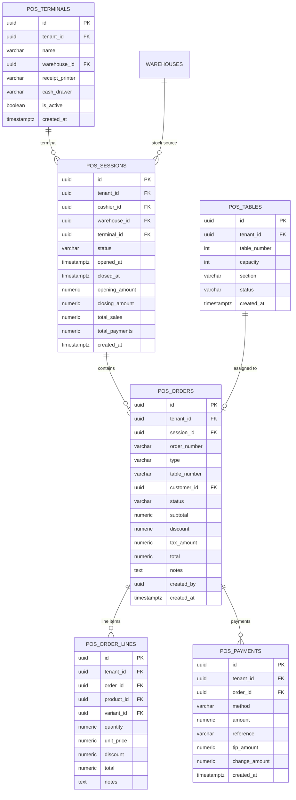

### 10.2 SQL — POS Tables

```sql
-- ================================================================
-- 57. pos_sessions
-- ================================================================
CREATE TABLE pos_sessions (
    id              UUID PRIMARY KEY DEFAULT gen_random_uuid(),
    tenant_id       UUID NOT NULL REFERENCES eos_shared.tenants(id) ON DELETE CASCADE,
    cashier_id      UUID NOT NULL,
    warehouse_id    UUID NOT NULL REFERENCES warehouses(id),
    terminal_id     UUID,
    status          VARCHAR(20) NOT NULL DEFAULT 'open'
                        CHECK (status IN ('open','closed')),
    opened_at       TIMESTAMPTZ NOT NULL DEFAULT now(),
    closed_at       TIMESTAMPTZ,
    opening_amount  NUMERIC(18,4) NOT NULL DEFAULT 0,
    closing_amount  NUMERIC(18,4),
    total_sales     NUMERIC(18,4) NOT NULL DEFAULT 0,
    total_payments  NUMERIC(18,4) NOT NULL DEFAULT 0,
    created_at      TIMESTAMPTZ NOT NULL DEFAULT now()
);

CREATE INDEX idx_poss_tenant ON pos_sessions (tenant_id);
CREATE INDEX idx_poss_status ON pos_sessions (tenant_id, status) WHERE status = 'open';
CREATE INDEX idx_poss_cashier ON pos_sessions (cashier_id);

COMMENT ON TABLE pos_sessions IS 'POS shift sessions — opened and closed by cashiers';

-- ================================================================
-- 58. pos_orders
-- ================================================================
CREATE TABLE pos_orders (
    id              UUID PRIMARY KEY DEFAULT gen_random_uuid(),
    tenant_id       UUID NOT NULL REFERENCES eos_shared.tenants(id) ON DELETE CASCADE,
    session_id      UUID NOT NULL REFERENCES pos_sessions(id) ON DELETE CASCADE,
    order_number    VARCHAR(30) NOT NULL,
    type            VARCHAR(20) NOT NULL DEFAULT 'dine_in'
                        CHECK (type IN ('dine_in','takeaway','delivery')),
    table_number    VARCHAR(10),
    customer_id     UUID,
    status          VARCHAR(20) NOT NULL DEFAULT 'open'
                        CHECK (status IN ('open','served','cancelled')),
    subtotal        NUMERIC(18,4) NOT NULL DEFAULT 0,
    discount        NUMERIC(18,4) NOT NULL DEFAULT 0,
    tax_amount      NUMERIC(18,4) NOT NULL DEFAULT 0,
    total           NUMERIC(18,4) NOT NULL DEFAULT 0,
    notes           TEXT,
    created_by      UUID,
    created_at      TIMESTAMPTZ NOT NULL DEFAULT now(),

    UNIQUE (tenant_id, order_number)
);

CREATE INDEX idx_poso_tenant ON pos_orders (tenant_id);
CREATE INDEX idx_poso_session ON pos_orders (session_id);
CREATE INDEX idx_poso_status ON pos_orders (tenant_id, status);
CREATE INDEX idx_poso_date ON pos_orders (tenant_id, created_at DESC);

COMMENT ON TABLE pos_orders IS 'POS terminal orders';

-- ================================================================
-- 59. pos_order_lines
-- ================================================================
CREATE TABLE pos_order_lines (
    id              UUID PRIMARY KEY DEFAULT gen_random_uuid(),
    tenant_id       UUID NOT NULL REFERENCES eos_shared.tenants(id) ON DELETE CASCADE,
    order_id        UUID NOT NULL REFERENCES pos_orders(id) ON DELETE CASCADE,
    product_id      UUID NOT NULL REFERENCES products(id),
    variant_id      UUID,
    quantity        NUMERIC(14,4) NOT NULL CHECK (quantity > 0),
    unit_price      NUMERIC(18,4) NOT NULL,
    discount        NUMERIC(18,4) NOT NULL DEFAULT 0,
    total           NUMERIC(18,4) NOT NULL,
    notes           TEXT
);

CREATE INDEX idx_posol_order ON pos_order_lines (order_id);
CREATE INDEX idx_posol_product ON pos_order_lines (product_id);

COMMENT ON TABLE pos_order_lines IS 'POS order line items';

-- ================================================================
-- 60. pos_payments
-- ================================================================
CREATE TABLE pos_payments (
    id              UUID PRIMARY KEY DEFAULT gen_random_uuid(),
    tenant_id       UUID NOT NULL REFERENCES eos_shared.tenants(id) ON DELETE CASCADE,
    order_id        UUID NOT NULL REFERENCES pos_orders(id) ON DELETE CASCADE,
    method          VARCHAR(20) NOT NULL
                        CHECK (method IN ('cash','card','online','wallet')),
    amount          NUMERIC(18,4) NOT NULL CHECK (amount > 0),
    reference       VARCHAR(100),
    tip_amount      NUMERIC(18,4) NOT NULL DEFAULT 0,
    change_amount   NUMERIC(18,4) NOT NULL DEFAULT 0,
    created_at      TIMESTAMPTZ NOT NULL DEFAULT now()
);

CREATE INDEX idx_posp_order ON pos_payments (order_id);
CREATE INDEX idx_posp_tenant ON pos_payments (tenant_id);

COMMENT ON TABLE pos_payments IS 'Payment transactions for POS orders';

-- ================================================================
-- 61. pos_terminals
-- ================================================================
CREATE TABLE pos_terminals (
    id              UUID PRIMARY KEY DEFAULT gen_random_uuid(),
    tenant_id       UUID NOT NULL REFERENCES eos_shared.tenants(id) ON DELETE CASCADE,
    name            VARCHAR(100) NOT NULL,
    warehouse_id    UUID NOT NULL REFERENCES warehouses(id),
    receipt_printer VARCHAR(255),
    cash_drawer     VARCHAR(255),
    is_active       BOOLEAN NOT NULL DEFAULT TRUE,
    created_at      TIMESTAMPTZ NOT NULL DEFAULT now(),

    UNIQUE (tenant_id, name)
);

CREATE INDEX idx_post_tenant ON pos_terminals (tenant_id);

COMMENT ON TABLE pos_terminals IS 'Physical POS terminal definitions';

-- ================================================================
-- 62. pos_tables
-- ================================================================
CREATE TABLE pos_tables (
    id              UUID PRIMARY KEY DEFAULT gen_random_uuid(),
    tenant_id       UUID NOT NULL REFERENCES eos_shared.tenants(id) ON DELETE CASCADE,
    table_number    INT NOT NULL,
    capacity        INT NOT NULL DEFAULT 4,
    section         VARCHAR(50),
    status          VARCHAR(20) NOT NULL DEFAULT 'available'
                        CHECK (status IN ('available','occupied','reserved')),
    created_at      TIMESTAMPTZ NOT NULL DEFAULT now(),

    UNIQUE (tenant_id, table_number)
);

CREATE INDEX idx_postbl_tenant ON pos_tables (tenant_id);
CREATE INDEX idx_postbl_status ON pos_tables (tenant_id, status);

COMMENT ON TABLE pos_tables IS 'Restaurant / cafe table management';
```

---

## 11. Project Management Module

Projects, tasks, milestones, and time tracking.

### 11.1 ER Diagram — Projects

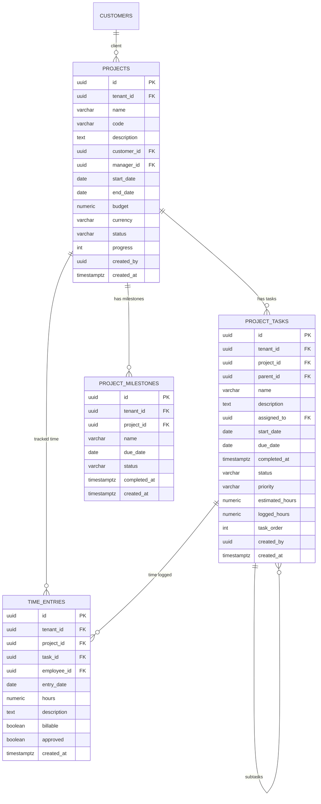

### 11.2 SQL — Project Tables

```sql
-- ================================================================
-- 63. projects
-- ================================================================
CREATE TABLE projects (
    id              UUID PRIMARY KEY DEFAULT gen_random_uuid(),
    tenant_id       UUID NOT NULL REFERENCES eos_shared.tenants(id) ON DELETE CASCADE,
    name            VARCHAR(255) NOT NULL,
    code            VARCHAR(20) NOT NULL,
    description     TEXT,
    customer_id     UUID,
    manager_id      UUID,
    start_date      DATE,
    end_date        DATE,
    budget          NUMERIC(18,4) NOT NULL DEFAULT 0,
    currency        VARCHAR(3) DEFAULT 'USD',
    status          VARCHAR(20) NOT NULL DEFAULT 'planning'
                        CHECK (status IN ('planning','in_progress','on_hold','completed','cancelled')),
    progress        INT NOT NULL DEFAULT 0 CHECK (progress BETWEEN 0 AND 100),
    created_by      UUID,
    created_at      TIMESTAMPTZ NOT NULL DEFAULT now(),

    UNIQUE (tenant_id, code)
);

CREATE INDEX idx_proj_tenant ON projects (tenant_id);
CREATE INDEX idx_proj_status ON projects (tenant_id, status);
CREATE INDEX idx_proj_manager ON projects (manager_id) WHERE manager_id IS NOT NULL;
CREATE INDEX idx_proj_customer ON projects (customer_id) WHERE customer_id IS NOT NULL;

COMMENT ON TABLE projects IS 'Project master — budget, timeline, and progress tracking';

-- ================================================================
-- 64. project_tasks
-- ================================================================
CREATE TABLE project_tasks (
    id                  UUID PRIMARY KEY DEFAULT gen_random_uuid(),
    tenant_id           UUID NOT NULL REFERENCES eos_shared.tenants(id) ON DELETE CASCADE,
    project_id          UUID NOT NULL REFERENCES projects(id) ON DELETE CASCADE,
    parent_id           UUID REFERENCES project_tasks(id) ON DELETE SET NULL,
    name                VARCHAR(255) NOT NULL,
    description         TEXT,
    assigned_to         UUID,
    start_date          DATE,
    due_date            DATE,
    completed_at        TIMESTAMPTZ,
    status              VARCHAR(20) NOT NULL DEFAULT 'todo'
                            CHECK (status IN ('todo','in_progress','review','done')),
    priority            VARCHAR(10) NOT NULL DEFAULT 'medium'
                            CHECK (priority IN ('low','medium','high','urgent')),
    estimated_hours     NUMERIC(8,2),
    logged_hours        NUMERIC(8,2) NOT NULL DEFAULT 0,
    task_order          INT NOT NULL DEFAULT 0,
    created_by          UUID,
    created_at          TIMESTAMPTZ NOT NULL DEFAULT now()
);

CREATE INDEX idx_pt_project ON project_tasks (project_id);
CREATE INDEX idx_pt_parent ON project_tasks (parent_id) WHERE parent_id IS NOT NULL;
CREATE INDEX idx_pt_assigned ON project_tasks (assigned_to, status)
    WHERE status NOT IN ('done');
CREATE INDEX idx_pt_status ON project_tasks (project_id, status);
CREATE INDEX idx_pt_due ON project_tasks (tenant_id, due_date)
    WHERE status NOT IN ('done') AND due_date IS NOT NULL;

COMMENT ON TABLE project_tasks IS 'Tasks within projects — supports subtask nesting via parent_id';

-- ================================================================
-- 65. project_milestones
-- ================================================================
CREATE TABLE project_milestones (
    id              UUID PRIMARY KEY DEFAULT gen_random_uuid(),
    tenant_id       UUID NOT NULL REFERENCES eos_shared.tenants(id) ON DELETE CASCADE,
    project_id      UUID NOT NULL REFERENCES projects(id) ON DELETE CASCADE,
    name            VARCHAR(255) NOT NULL,
    due_date        DATE NOT NULL,
    status          VARCHAR(20) NOT NULL DEFAULT 'pending'
                        CHECK (status IN ('pending','completed','overdue')),
    completed_at    TIMESTAMPTZ,
    created_at      TIMESTAMPTZ NOT NULL DEFAULT now()
);

CREATE INDEX idx_pm_project ON project_milestones (project_id);
CREATE INDEX idx_pm_due ON project_milestones (tenant_id, due_date)
    WHERE status = 'pending';

COMMENT ON TABLE project_milestones IS 'Key project milestones with due dates';

-- ================================================================
-- 66. time_entries
-- ================================================================
CREATE TABLE time_entries (
    id              UUID PRIMARY KEY DEFAULT gen_random_uuid(),
    tenant_id       UUID NOT NULL REFERENCES eos_shared.tenants(id) ON DELETE CASCADE,
    project_id      UUID NOT NULL REFERENCES projects(id) ON DELETE CASCADE,
    task_id         UUID REFERENCES project_tasks(id) ON DELETE SET NULL,
    employee_id     UUID NOT NULL,
    entry_date      DATE NOT NULL DEFAULT CURRENT_DATE,
    hours           NUMERIC(6,2) NOT NULL CHECK (hours > 0),
    description     TEXT,
    billable        BOOLEAN NOT NULL DEFAULT TRUE,
    approved        BOOLEAN NOT NULL DEFAULT FALSE,
    created_at      TIMESTAMPTZ NOT NULL DEFAULT now()
);

CREATE INDEX idx_te_proj ON time_entries (project_id);
CREATE INDEX idx_te_task ON time_entries (task_id) WHERE task_id IS NOT NULL;
CREATE INDEX idx_te_employee ON time_entries (employee_id);
CREATE INDEX idx_te_date ON time_entries (tenant_id, entry_date);
CREATE INDEX idx_te_billable ON time_entries (tenant_id, billable, approved)
    WHERE billable = TRUE AND approved = FALSE;

COMMENT ON TABLE time_entries IS 'Time tracking against projects and tasks';
```

---

## 12. Supply Chain Module

Shipments, carriers, and delivery tracking.

### 12.1 ER Diagram — Supply Chain

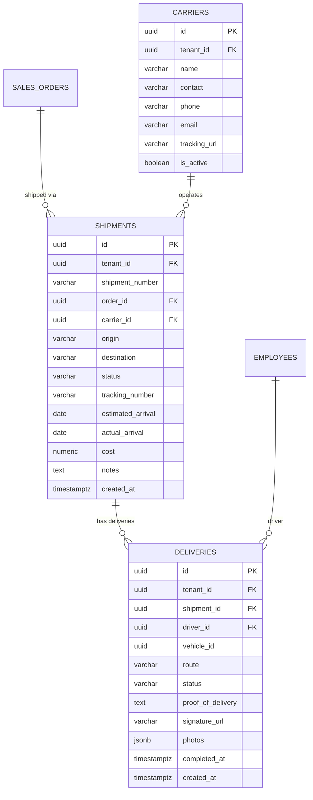

### 12.2 SQL — Supply Chain Tables

```sql
-- ================================================================
-- 67. shipments
-- ================================================================
CREATE TABLE shipments (
    id                  UUID PRIMARY KEY DEFAULT gen_random_uuid(),
    tenant_id           UUID NOT NULL REFERENCES eos_shared.tenants(id) ON DELETE CASCADE,
    shipment_number     VARCHAR(30) NOT NULL,
    order_id            UUID,
    carrier_id          UUID,
    origin              VARCHAR(500),
    destination         VARCHAR(500),
    status              VARCHAR(20) NOT NULL DEFAULT 'pending'
                            CHECK (status IN ('pending','in_transit','delivered','returned')),
    tracking_number     VARCHAR(100),
    estimated_arrival   DATE,
    actual_arrival      DATE,
    cost                NUMERIC(18,4) NOT NULL DEFAULT 0,
    notes               TEXT,
    created_at          TIMESTAMPTZ NOT NULL DEFAULT now(),

    UNIQUE (tenant_id, shipment_number)
);

CREATE INDEX idx_ship_tenant ON shipments (tenant_id);
CREATE INDEX idx_ship_status ON shipments (tenant_id, status);
CREATE INDEX idx_ship_order ON shipments (order_id) WHERE order_id IS NOT NULL;
CREATE INDEX idx_ship_tracking ON shipments (tenant_id, tracking_number)
    WHERE tracking_number IS NOT NULL;

COMMENT ON TABLE shipments IS 'Outbound shipment tracking';

-- ================================================================
-- 68. carriers
-- ================================================================
CREATE TABLE carriers (
    id              UUID PRIMARY KEY DEFAULT gen_random_uuid(),
    tenant_id       UUID NOT NULL REFERENCES eos_shared.tenants(id) ON DELETE CASCADE,
    name            VARCHAR(255) NOT NULL,
    contact         VARCHAR(255),
    phone           VARCHAR(50),
    email           VARCHAR(255),
    tracking_url    VARCHAR(500),
    is_active       BOOLEAN NOT NULL DEFAULT TRUE,

    UNIQUE (tenant_id, name)
);

CREATE INDEX idx_carrier_tenant ON carriers (tenant_id);

COMMENT ON TABLE carriers IS 'Shipping carrier / logistics provider catalog';

-- ================================================================
-- 69. deliveries
-- ================================================================
CREATE TABLE deliveries (
    id                  UUID PRIMARY KEY DEFAULT gen_random_uuid(),
    tenant_id           UUID NOT NULL REFERENCES eos_shared.tenants(id) ON DELETE CASCADE,
    shipment_id         UUID NOT NULL REFERENCES shipments(id) ON DELETE CASCADE,
    driver_id           UUID,
    vehicle_id          UUID,
    route               VARCHAR(500),
    status              VARCHAR(20) NOT NULL DEFAULT 'scheduled'
                            CHECK (status IN ('scheduled','in_progress','completed','failed')),
    proof_of_delivery   TEXT,
    signature_url       VARCHAR(500),
    photos              JSONB NOT NULL DEFAULT '[]',
    completed_at        TIMESTAMPTZ,
    created_at          TIMESTAMPTZ NOT NULL DEFAULT now()
);

CREATE INDEX idx_del_shipment ON deliveries (shipment_id);
CREATE INDEX idx_del_driver ON deliveries (driver_id) WHERE driver_id IS NOT NULL;
CREATE INDEX idx_del_status ON deliveries (tenant_id, status);

COMMENT ON TABLE deliveries IS 'Last-mile delivery tracking with proof-of-delivery';
```

---

## 13. Manufacturing Module

Bills of materials, work centers, and production orders.

### 13.1 ER Diagram — Manufacturing

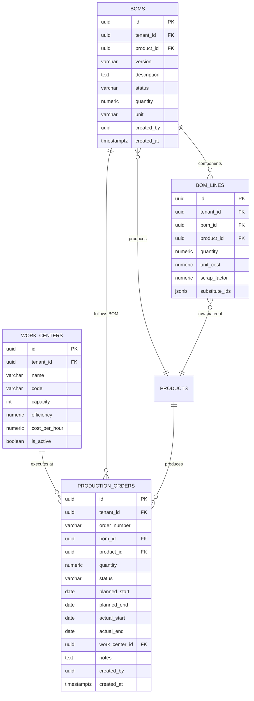

### 13.2 SQL — Manufacturing Tables

```sql
-- ================================================================
-- 70. boms (Bill of Materials)
-- ================================================================
CREATE TABLE boms (
    id              UUID PRIMARY KEY DEFAULT gen_random_uuid(),
    tenant_id       UUID NOT NULL REFERENCES eos_shared.tenants(id) ON DELETE CASCADE,
    product_id      UUID NOT NULL REFERENCES products(id),
    version         VARCHAR(20) NOT NULL DEFAULT '1.0',
    description     TEXT,
    status          VARCHAR(20) NOT NULL DEFAULT 'draft'
                        CHECK (status IN ('draft','active','obsolete')),
    quantity        NUMERIC(14,4) NOT NULL DEFAULT 1,
    unit            VARCHAR(20) DEFAULT 'ea',
    created_by      UUID,
    created_at      TIMESTAMPTZ NOT NULL DEFAULT now(),

    UNIQUE (tenant_id, product_id, version)
);

CREATE INDEX idx_bom_tenant ON boms (tenant_id);
CREATE INDEX idx_bom_product ON boms (product_id);
CREATE INDEX idx_bom_status ON boms (tenant_id, status);

COMMENT ON TABLE boms IS 'Bill of Materials — versioned per product';

-- ================================================================
-- 71. bom_lines
-- ================================================================
CREATE TABLE bom_lines (
    id              UUID PRIMARY KEY DEFAULT gen_random_uuid(),
    tenant_id       UUID NOT NULL REFERENCES eos_shared.tenants(id) ON DELETE CASCADE,
    bom_id          UUID NOT NULL REFERENCES boms(id) ON DELETE CASCADE,
    product_id      UUID NOT NULL REFERENCES products(id),
    quantity        NUMERIC(14,4) NOT NULL CHECK (quantity > 0),
    unit_cost       NUMERIC(18,4) NOT NULL DEFAULT 0,
    scrap_factor    NUMERIC(8,4) NOT NULL DEFAULT 0,
    substitute_ids  JSONB NOT NULL DEFAULT '[]'
);

CREATE INDEX idx_boml_bom ON bom_lines (bom_id);
CREATE INDEX idx_boml_product ON bom_lines (product_id);

COMMENT ON TABLE bom_lines IS 'BOM component lines — substitute products stored as JSONB array of UUIDs';

-- ================================================================
-- 72. work_centers
-- ================================================================
CREATE TABLE work_centers (
    id              UUID PRIMARY KEY DEFAULT gen_random_uuid(),
    tenant_id       UUID NOT NULL REFERENCES eos_shared.tenants(id) ON DELETE CASCADE,
    name            VARCHAR(255) NOT NULL,
    code            VARCHAR(20) NOT NULL,
    capacity        INT NOT NULL DEFAULT 1,
    efficiency      NUMERIC(6,2) NOT NULL DEFAULT 100,
    cost_per_hour   NUMERIC(18,4) NOT NULL DEFAULT 0,
    is_active       BOOLEAN NOT NULL DEFAULT TRUE,

    UNIQUE (tenant_id, code)
);

CREATE INDEX idx_wc_tenant ON work_centers (tenant_id);

COMMENT ON TABLE work_centers IS 'Production work centers / machines with capacity and cost';

-- ================================================================
-- 73. production_orders
-- ================================================================
CREATE TABLE production_orders (
    id              UUID PRIMARY KEY DEFAULT gen_random_uuid(),
    tenant_id       UUID NOT NULL REFERENCES eos_shared.tenants(id) ON DELETE CASCADE,
    order_number    VARCHAR(30) NOT NULL,
    bom_id          UUID NOT NULL REFERENCES boms(id),
    product_id      UUID NOT NULL REFERENCES products(id),
    quantity        NUMERIC(14,4) NOT NULL CHECK (quantity > 0),
    status          VARCHAR(20) NOT NULL DEFAULT 'planned'
                        CHECK (status IN ('planned','in_progress','completed','cancelled')),
    planned_start   DATE,
    planned_end     DATE,
    actual_start    DATE,
    actual_end      DATE,
    work_center_id  UUID REFERENCES work_centers(id),
    notes           TEXT,
    created_by      UUID,
    created_at      TIMESTAMPTZ NOT NULL DEFAULT now(),

    UNIQUE (tenant_id, order_number)
);

CREATE INDEX idx_po_tenant_mfg ON production_orders (tenant_id);
CREATE INDEX idx_po_status_mfg ON production_orders (tenant_id, status);
CREATE INDEX idx_po_product ON production_orders (product_id);
CREATE INDEX idx_po_bom ON production_orders (bom_id);
CREATE INDEX idx_po_workcenter ON production_orders (work_center_id)
    WHERE work_center_id IS NOT NULL;

COMMENT ON TABLE production_orders IS 'Manufacturing work orders — tracks production lifecycle';
```

---

## 14. Asset Management Module

Fixed assets, depreciation, maintenance scheduling, and work orders.

### 14.1 ER Diagram — Assets

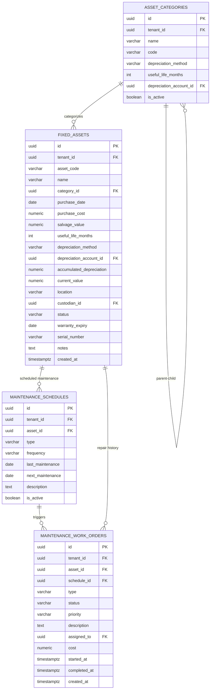

### 14.2 SQL — Asset Tables

```sql
-- ================================================================
-- 74. fixed_assets
-- ================================================================
CREATE TABLE fixed_assets (
    id                          UUID PRIMARY KEY DEFAULT gen_random_uuid(),
    tenant_id                   UUID NOT NULL REFERENCES eos_shared.tenants(id) ON DELETE CASCADE,
    asset_code                  VARCHAR(30) NOT NULL,
    name                        VARCHAR(255) NOT NULL,
    category_id                 UUID,
    purchase_date               DATE NOT NULL,
    purchase_cost               NUMERIC(18,4) NOT NULL,
    salvage_value               NUMERIC(18,4) NOT NULL DEFAULT 0,
    useful_life_months          INT NOT NULL,
    depreciation_method         VARCHAR(30) NOT NULL DEFAULT 'straight_line'
                                    CHECK (depreciation_method IN ('straight_line','declining_balance')),
    depreciation_account_id     UUID,
    accumulated_depreciation    NUMERIC(18,4) NOT NULL DEFAULT 0,
    current_value               NUMERIC(18,4) NOT NULL DEFAULT 0,
    location                    VARCHAR(255),
    custodian_id                UUID,
    status                      VARCHAR(20) NOT NULL DEFAULT 'active'
                                    CHECK (status IN ('active','disposed','under_maintenance')),
    warranty_expiry             DATE,
    serial_number               VARCHAR(100),
    notes                       TEXT,
    created_at                  TIMESTAMPTZ NOT NULL DEFAULT now(),

    UNIQUE (tenant_id, asset_code)
);

CREATE INDEX idx_fa_tenant ON fixed_assets (tenant_id);
CREATE INDEX idx_fa_category ON fixed_assets (category_id) WHERE category_id IS NOT NULL;
CREATE INDEX idx_fa_status ON fixed_assets (tenant_id, status);
CREATE INDEX idx_fa_custodian ON fixed_assets (custodian_id) WHERE custodian_id IS NOT NULL;

COMMENT ON TABLE fixed_assets IS 'Fixed asset register with depreciation tracking';

-- ================================================================
-- 75. asset_categories
-- ================================================================
CREATE TABLE asset_categories (
    id                          UUID PRIMARY KEY DEFAULT gen_random_uuid(),
    tenant_id                   UUID NOT NULL REFERENCES eos_shared.tenants(id) ON DELETE CASCADE,
    name                        VARCHAR(255) NOT NULL,
    code                        VARCHAR(20) NOT NULL,
    depreciation_method         VARCHAR(30) NOT NULL DEFAULT 'straight_line'
                                    CHECK (depreciation_method IN ('straight_line','declining_balance')),
    useful_life_months          INT NOT NULL,
    depreciation_account_id     UUID,
    is_active                   BOOLEAN NOT NULL DEFAULT TRUE,

    UNIQUE (tenant_id, code)
);

CREATE INDEX idx_ac_tenant ON asset_categories (tenant_id);

COMMENT ON TABLE asset_categories IS 'Asset category definitions with default depreciation rules';

-- ================================================================
-- 76. maintenance_schedules
-- ================================================================
CREATE TABLE maintenance_schedules (
    id              UUID PRIMARY KEY DEFAULT gen_random_uuid(),
    tenant_id       UUID NOT NULL REFERENCES eos_shared.tenants(id) ON DELETE CASCADE,
    asset_id        UUID NOT NULL REFERENCES fixed_assets(id) ON DELETE CASCADE,
    type            VARCHAR(20) NOT NULL
                        CHECK (type IN ('preventive','corrective')),
    frequency       VARCHAR(50) NOT NULL,
    last_maintenance DATE,
    next_maintenance DATE NOT NULL,
    description     TEXT,
    is_active       BOOLEAN NOT NULL DEFAULT TRUE
);

CREATE INDEX idx_ms_asset ON maintenance_schedules (asset_id);
CREATE INDEX idx_ms_next ON maintenance_schedules (tenant_id, next_maintenance)
    WHERE is_active = TRUE;

COMMENT ON TABLE maintenance_schedules IS 'Preventive/corrective maintenance scheduling';

-- ================================================================
-- 77. maintenance_work_orders
-- ================================================================
CREATE TABLE maintenance_work_orders (
    id              UUID PRIMARY KEY DEFAULT gen_random_uuid(),
    tenant_id       UUID NOT NULL REFERENCES eos_shared.tenants(id) ON DELETE CASCADE,
    asset_id        UUID NOT NULL REFERENCES fixed_assets(id),
    schedule_id     UUID REFERENCES maintenance_schedules(id) ON DELETE SET NULL,
    type            VARCHAR(20) NOT NULL,
    status          VARCHAR(20) NOT NULL DEFAULT 'open'
                        CHECK (status IN ('open','in_progress','completed')),
    priority        VARCHAR(10) NOT NULL DEFAULT 'medium'
                        CHECK (priority IN ('low','medium','high','urgent')),
    description     TEXT,
    assigned_to     UUID,
    cost            NUMERIC(18,4) NOT NULL DEFAULT 0,
    started_at      TIMESTAMPTZ,
    completed_at    TIMESTAMPTZ,
    created_at      TIMESTAMPTZ NOT NULL DEFAULT now()
);

CREATE INDEX idx_mwo_tenant ON maintenance_work_orders (tenant_id);
CREATE INDEX idx_mwo_asset ON maintenance_work_orders (asset_id);
CREATE INDEX idx_mwo_status ON maintenance_work_orders (tenant_id, status)
    WHERE status NOT IN ('completed');

COMMENT ON TABLE maintenance_work_orders IS 'Maintenance work orders for assets';
```

---

## 15. Customer Service Module

Ticketing system, messages, categories, and knowledge base.

### 15.1 ER Diagram — Support

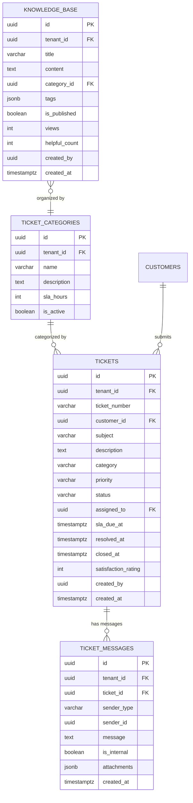

### 15.2 SQL — Customer Service Tables

```sql
-- ================================================================
-- 78. tickets
-- ================================================================
CREATE TABLE tickets (
    id                  UUID PRIMARY KEY DEFAULT gen_random_uuid(),
    tenant_id           UUID NOT NULL REFERENCES eos_shared.tenants(id) ON DELETE CASCADE,
    ticket_number       VARCHAR(30) NOT NULL,
    customer_id         UUID,
    subject             VARCHAR(500) NOT NULL,
    description         TEXT,
    category            VARCHAR(100),
    priority            VARCHAR(10) NOT NULL DEFAULT 'medium'
                            CHECK (priority IN ('low','medium','high','urgent')),
    status              VARCHAR(20) NOT NULL DEFAULT 'open'
                            CHECK (status IN ('open','in_progress','waiting','resolved','closed')),
    assigned_to         UUID,
    sla_due_at          TIMESTAMPTZ,
    resolved_at         TIMESTAMPTZ,
    closed_at           TIMESTAMPTZ,
    satisfaction_rating INT CHECK (satisfaction_rating BETWEEN 1 AND 5),
    created_by          UUID,
    created_at          TIMESTAMPTZ NOT NULL DEFAULT now(),

    UNIQUE (tenant_id, ticket_number)
);

CREATE INDEX idx_tick_tenant ON tickets (tenant_id);
CREATE INDEX idx_tick_status ON tickets (tenant_id, status)
    WHERE status NOT IN ('closed');
CREATE INDEX idx_tick_priority ON tickets (tenant_id, priority, status)
    WHERE status NOT IN ('closed','resolved');
CREATE INDEX idx_tick_assigned ON tickets (assigned_to, status)
    WHERE status NOT IN ('closed') AND assigned_to IS NOT NULL;
CREATE INDEX idx_tick_sla ON tickets (tenant_id, sla_due_at)
    WHERE status NOT IN ('closed','resolved') AND sla_due_at IS NOT NULL;
CREATE INDEX idx_tick_customer ON tickets (customer_id) WHERE customer_id IS NOT NULL;

COMMENT ON TABLE tickets IS 'Support tickets with SLA tracking and satisfaction ratings';

-- ================================================================
-- 79. ticket_messages
-- ================================================================
CREATE TABLE ticket_messages (
    id              UUID PRIMARY KEY DEFAULT gen_random_uuid(),
    tenant_id       UUID NOT NULL REFERENCES eos_shared.tenants(id) ON DELETE CASCADE,
    ticket_id       UUID NOT NULL REFERENCES tickets(id) ON DELETE CASCADE,
    sender_type     VARCHAR(20) NOT NULL
                        CHECK (sender_type IN ('customer','agent','system')),
    sender_id       UUID,
    message         TEXT NOT NULL,
    is_internal     BOOLEAN NOT NULL DEFAULT FALSE,
    attachments     JSONB NOT NULL DEFAULT '[]',
    created_at      TIMESTAMPTZ NOT NULL DEFAULT now()
);

CREATE INDEX idx_tm_ticket ON ticket_messages (ticket_id);
CREATE INDEX idx_tm_created ON ticket_messages (ticket_id, created_at);

COMMENT ON TABLE ticket_messages IS 'Conversation thread for support tickets';

-- ================================================================
-- 80. ticket_categories
-- ================================================================
CREATE TABLE ticket_categories (
    id              UUID PRIMARY KEY DEFAULT gen_random_uuid(),
    tenant_id       UUID NOT NULL REFERENCES eos_shared.tenants(id) ON DELETE CASCADE,
    name            VARCHAR(100) NOT NULL,
    description     TEXT,
    sla_hours       INT NOT NULL DEFAULT 24,
    is_active       BOOLEAN NOT NULL DEFAULT TRUE,

    UNIQUE (tenant_id, name)
);

CREATE INDEX idx_tc_tenant ON ticket_categories (tenant_id);

COMMENT ON TABLE ticket_categories IS 'Ticket categories with SLA hour targets';

-- ================================================================
-- 81. knowledge_base
-- ================================================================
CREATE TABLE knowledge_base (
    id              UUID PRIMARY KEY DEFAULT gen_random_uuid(),
    tenant_id       UUID NOT NULL REFERENCES eos_shared.tenants(id) ON DELETE CASCADE,
    title           VARCHAR(500) NOT NULL,
    content         TEXT NOT NULL,
    category_id     UUID,
    tags            JSONB NOT NULL DEFAULT '[]',
    is_published    BOOLEAN NOT NULL DEFAULT FALSE,
    views           INT NOT NULL DEFAULT 0,
    helpful_count   INT NOT NULL DEFAULT 0,
    created_by      UUID,
    created_at      TIMESTAMPTZ NOT NULL DEFAULT now()
);

CREATE INDEX idx_kb_tenant ON knowledge_base (tenant_id);
CREATE INDEX idx_kb_published ON knowledge_base (tenant_id, is_published)
    WHERE is_published = TRUE;
CREATE INDEX idx_kb_category ON knowledge_base (category_id) WHERE category_id IS NOT NULL;

COMMENT ON TABLE knowledge_base IS 'Self-service knowledge base articles';
```

---

## 16. Indexing Strategy

### Design Principles

| Principle | Implementation |
|-----------|---------------|
| **Tenant isolation first** | Every index starts with `tenant_id` for RLS-aware query performance |
| **Partial indexes** | Filter on `is_active`, `status`, `read_at IS NULL` to reduce index size |
| **Covering indexes** | Frequently filtered columns grouped to enable index-only scans |
| **Unique constraints** | Business keys (`code`, `order_number`, `sku`) are unique per tenant |
| **Exclude unused** | No indexes on rarely-queried columns (e.g., `notes`, `description`) |

### Index Patterns

```sql
-- Pattern 1: Tenant + Status (most common filter)
CREATE INDEX idx_<table>_status ON <table> (tenant_id, status);

-- Pattern 2: Tenant + Date range (reporting)
CREATE INDEX idx_<table>_date ON <table> (tenant_id, <date_column> DESC);

-- Pattern 3: FK lookups
CREATE INDEX idx_<table>_<fk> ON <table> (<fk_column>);

-- Pattern 4: Partial for active records
CREATE INDEX idx_<table>_active ON <table> (tenant_id, is_active)
    WHERE is_active = TRUE;

-- Pattern 5: Polymorphic references
CREATE INDEX idx_<table>_entity ON <table> (tenant_id, entity_type, entity_id);
```

### Table-Level Index Summary

| Module | Table | Key Indexes |
|--------|-------|-------------|
| Accounting | `journal_entries` | `(tenant_id, entry_date)`, `(tenant_id, status)`, `(tenant_id, source_module, source_id)` |
| Accounting | `journal_entry_lines` | `(entry_id)`, `(account_id)`, `(tenant_id, cost_center_id)` |
| Accounting | `audit_logs` | `(tenant_id, created_at DESC)`, `(tenant_id, entity_type, entity_id)` |
| Inventory | `products` | `(tenant_id, sku)`, `(tenant_id, barcode)`, `(category_id)`, `(tenant_id, is_active)` |
| Inventory | `stock_movements` | `(tenant_id, created_at DESC)`, `(tenant_id, product_id)`, `(tenant_id, warehouse_id)` |
| HR | `employees` | `(tenant_id, employee_id)`, `(department_id)`, `(tenant_id, status)` |
| HR | `attendance` | `(tenant_id, employee_id, att_date)` UNIQUE, `(tenant_id, att_date)` |
| Sales | `leads` | `(tenant_id, status)`, `(assigned_to)`, `(tenant_id, created_at DESC)` |
| Sales | `sales_invoices` | `(tenant_id, customer_id)`, `(tenant_id, status)`, `(tenant_id, due_date)` partial |
| POS | `pos_orders` | `(session_id)`, `(tenant_id, status)`, `(tenant_id, created_at DESC)` |
| Support | `tickets` | `(tenant_id, status)` partial, `(assigned_to, status)` partial, `(tenant_id, sla_due_at)` partial |

---

## 17. Partitioning Strategy

### Which Tables to Partition

| Table | Partition Key | Strategy | Rationale |
|-------|--------------|----------|-----------|
| `audit_logs` | `created_at` | Range by month | Immutable, append-only, old data archived |
| `stock_movements` | `created_at` | Range by month | High volume, immutable ledger |

### Partition Creation SQL

```sql
-- ============================================================
-- Automated partition creation function
-- ============================================================
CREATE OR REPLACE FUNCTION eos_shared.create_monthly_partitions(
    p_table_name TEXT,
    p_schema TEXT,
    p_months_ahead INT DEFAULT 3
)
RETURNS VOID AS $$
DECLARE
    v_start DATE;
    v_end DATE;
    v_partition_name TEXT;
    v_month TEXT;
BEGIN
    FOR i IN 0..p_months_ahead LOOP
        v_start := date_trunc('month', CURRENT_DATE + (i || ' months')::interval);
        v_end := v_start + INTERVAL '1 month';
        v_month := to_char(v_start, 'YYYY_MM');
        v_partition_name := p_table_name || '_' || v_month;

        -- Check if partition already exists
        IF NOT EXISTS (
            SELECT 1 FROM pg_class c
            JOIN pg_namespace n ON n.oid = c.relnamespace
            WHERE c.relname = v_partition_name
            AND n.nspname = p_schema
        ) THEN
            EXECUTE format(
                'CREATE TABLE %I.%I PARTITION OF %I.%I FOR VALUES FROM (%L) TO (%L);',
                p_schema, v_partition_name,
                p_schema, p_table_name,
                v_start, v_end
            );
            RAISE NOTICE 'Created partition %.%: % to %',
                p_schema, v_partition_name, v_start, v_end;
        END IF;
    END LOOP;
END;
$$ LANGUAGE plpgsql;

-- ============================================================
-- Run partition creation for each partitioned table
-- ============================================================
-- Call per-tenant schema:
SELECT eos_shared.create_monthly_partitions('audit_logs', 'eos_tenant_{id}', 6);
SELECT eos_shared.create_monthly_partitions('stock_movements', 'eos_tenant_{id}', 6);
```

### Partition Maintenance

```sql
-- ============================================================
-- Automated partition maintenance (run via pg_cron)
-- ============================================================
CREATE OR REPLACE FUNCTION eos_shared.maintain_partitions()
RETURNS VOID AS $$
DECLARE
    r RECORD;
BEGIN
    FOR r IN
        SELECT schemaname, tablename
        FROM pg_tables
        WHERE tablename IN ('audit_logs', 'stock_movements')
    LOOP
        PERFORM eos_shared.create_monthly_partitions(
            r.tablename,
            r.schemaname,
            6  -- create 6 months ahead
        );
    END LOOP;
END;
$$ LANGUAGE plpgsql;

-- Schedule via pg_cron (runs first of every month at midnight):
-- SELECT cron.schedule('maintain-partitions', '0 0 1 * *',
--     $$SELECT eos_shared.maintain_partitions()$$);

-- ============================================================
-- Archive old partitions (example: drop partitions older than 2 years)
-- ============================================================
CREATE OR REPLACE FUNCTION eos_shared.drop_old_partitions(
    p_table_name TEXT,
    p_schema TEXT,
    p_retention_months INT DEFAULT 24
)
RETURNS VOID AS $$
DECLARE
    r RECORD;
    v_cutoff DATE;
BEGIN
    v_cutoff := date_trunc('month', CURRENT_DATE - (p_retention_months || ' months')::interval);

    FOR r IN
        SELECT inhrelid::regclass::text AS partition_name
        FROM pg_inherits
        WHERE inhparent = (p_schema || '.' || p_table_name)::regclass
    LOOP
        -- Extract date from partition name (format: tablename_YYYY_MM)
        -- and drop if older than cutoff
        IF (regexp_replace(r.partition_name, '.*_(\d{4}_\d{2})$', '\1')::text
            < to_char(v_cutoff, 'YYYY_MM')) THEN
            EXECUTE format('DROP TABLE IF EXISTS %I.%I;',
                p_schema, r.partition_name);
            RAISE NOTICE 'Dropped old partition: %.%', p_schema, r.partition_name;
        END IF;
    END LOOP;
END;
$$ LANGUAGE plpgsql;
```

### Partition Pruning Notes

```sql
-- PostgreSQL automatically prunes partitions when filtering by created_at
-- Example query that benefits from partition pruning:

EXPLAIN ANALYZE
SELECT *
FROM audit_logs
WHERE tenant_id = 'abc-123'
  AND created_at >= '2026-06-01'
  AND created_at < '2026-07-01';
-- Only scans: audit_logs_2026_06

-- Ensure application always includes date range filters on partitioned tables
-- for optimal performance.
```

---

## 18. Seed Data

### Default Subscription Plans

```sql
INSERT INTO eos_shared.subscription_plans (id, name, description, price_monthly, price_yearly, features, max_users, max_branches)
VALUES
    (gen_random_uuid(), 'Starter', 'For small businesses just getting started',
     29.99, 299.00,
     '["accounting","inventory","sales","basic_reports"]'::jsonb, 5, 1),
    (gen_random_uuid(), 'Professional', 'For growing businesses with advanced needs',
     79.99, 799.00,
     '["accounting","inventory","sales","hr","pos","projects","advanced_reports","e_invoicing"]'::jsonb, 25, 5),
    (gen_random_uuid(), 'Enterprise', 'For large organizations requiring full suite',
     199.99, 1999.00,
     '["all_modules","api_access","priority_support","custom_fields","workflows","multi_currency"]'::jsonb, -1, -1);
```

### Default Permission Catalog

```sql
INSERT INTO eos_shared.permissions (id, module, action, description) VALUES
    -- Accounting
    (gen_random_uuid(), 'accounting', 'view', 'View accounts and reports'),
    (gen_random_uuid(), 'accounting', 'create', 'Create journal entries'),
    (gen_random_uuid(), 'accounting', 'edit', 'Edit journal entries'),
    (gen_random_uuid(), 'accounting', 'delete', 'Delete journal entries'),
    (gen_random_uuid(), 'accounting', 'post', 'Post journal entries'),
    (gen_random_uuid(), 'accounting', 'close_period', 'Close accounting periods'),
    (gen_random_uuid(), 'accounting', 'reconcile', 'Perform bank reconciliation'),
    -- Inventory
    (gen_random_uuid(), 'inventory', 'view', 'View products and stock'),
    (gen_random_uuid(), 'inventory', 'create', 'Create products'),
    (gen_random_uuid(), 'inventory', 'edit', 'Edit products'),
    (gen_random_uuid(), 'inventory', 'delete', 'Delete products'),
    (gen_random_uuid(), 'inventory', 'adjust', 'Adjust stock levels'),
    (gen_random_uuid(), 'inventory', 'purchase', 'Create purchase orders'),
    -- HR
    (gen_random_uuid(), 'hr', 'view', 'View employees'),
    (gen_random_uuid(), 'hr', 'create', 'Create employees'),
    (gen_random_uuid(), 'hr', 'edit', 'Edit employees'),
    (gen_random_uuid(), 'hr', 'delete', 'Delete employees'),
    (gen_random_uuid(), 'hr', 'payroll', 'Process payroll'),
    (gen_random_uuid(), 'hr', 'approve_leave', 'Approve leave requests'),
    -- Sales
    (gen_random_uuid(), 'sales', 'view', 'View leads and opportunities'),
    (gen_random_uuid(), 'sales', 'create', 'Create leads and quotes'),
    (gen_random_uuid(), 'sales', 'edit', 'Edit sales documents'),
    (gen_random_uuid(), 'sales', 'delete', 'Delete sales documents'),
    (gen_random_uuid(), 'sales', 'invoice', 'Create invoices'),
    (gen_random_uuid(), 'sales', 'receive_payment', 'Record payments'),
    -- POS
    (gen_random_uuid(), 'pos', 'view', 'View POS data'),
    (gen_random_uuid(), 'pos', 'operate', 'Open/close shifts and process orders'),
    (gen_random_uuid(), 'pos', 'void', 'Void POS orders'),
    -- Settings
    (gen_random_uuid(), 'settings', 'company', 'Manage company profile'),
    (gen_random_uuid(), 'settings', 'users', 'Manage users and roles'),
    (gen_random_uuid(), 'settings', 'workflows', 'Configure workflows'),
    (gen_random_uuid(), 'settings', 'custom_fields', 'Manage custom fields');
```

### Default Opportunity Stages

```sql
-- These are created per-tenant during tenant provisioning
-- Example for a new tenant:
INSERT INTO opportunity_stages (tenant_id, name, probability, stage_order, color, is_active)
VALUES
    ('{tenant_id}', 'Prospecting', 10, 1, '#6B7280', TRUE),
    ('{tenant_id}', 'Qualification', 25, 2, '#3B82F6', TRUE),
    ('{tenant_id}', 'Proposal', 50, 3, '#8B5CF6', TRUE),
    ('{tenant_id}', 'Negotiation', 75, 4, '#F59E0B', TRUE),
    ('{tenant_id}', 'Closed Won', 100, 5, '#10B981', TRUE),
    ('{tenant_id}', 'Closed Lost', 0, 6, '#EF4444', TRUE);
```

---

## Table Count Summary

| Schema | Module | Table Count |
|--------|--------|-------------|
| `eos_shared` | Shared / Cross-tenant | 9 |
| `eos_tenant_*` | Settings & Configuration | 7 |
| `eos_tenant_*` | Accounting | 11 |
| `eos_tenant_*` | Inventory | 14 |
| `eos_tenant_*` | HR | 11 |
| `eos_tenant_*` | Sales & CRM | 11 |
| `eos_tenant_*` | POS | 6 |
| `eos_tenant_*` | Project Management | 4 |
| `eos_tenant_*` | Supply Chain | 3 |
| `eos_tenant_*` | Manufacturing | 4 |
| `eos_tenant_*` | Asset Management | 4 |
| `eos_tenant_*` | Customer Service | 4 |
| | **TOTAL** | **88** |

---

*Document generated for EOS Enterprise Operating System v1.0*  
*Database: PostgreSQL 16+ with RLS, JSONB, Partitioning*
