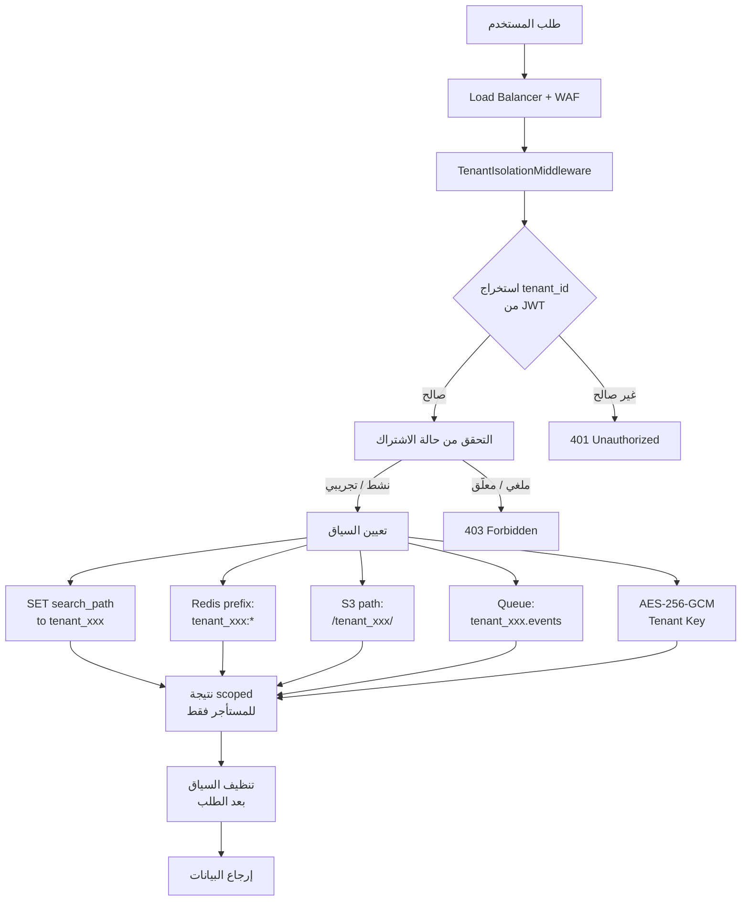
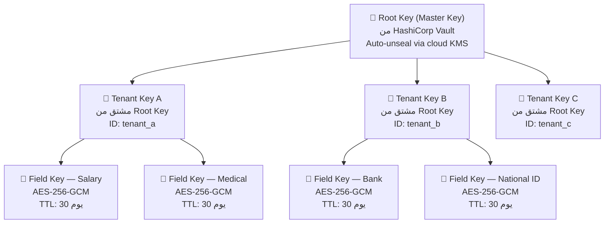
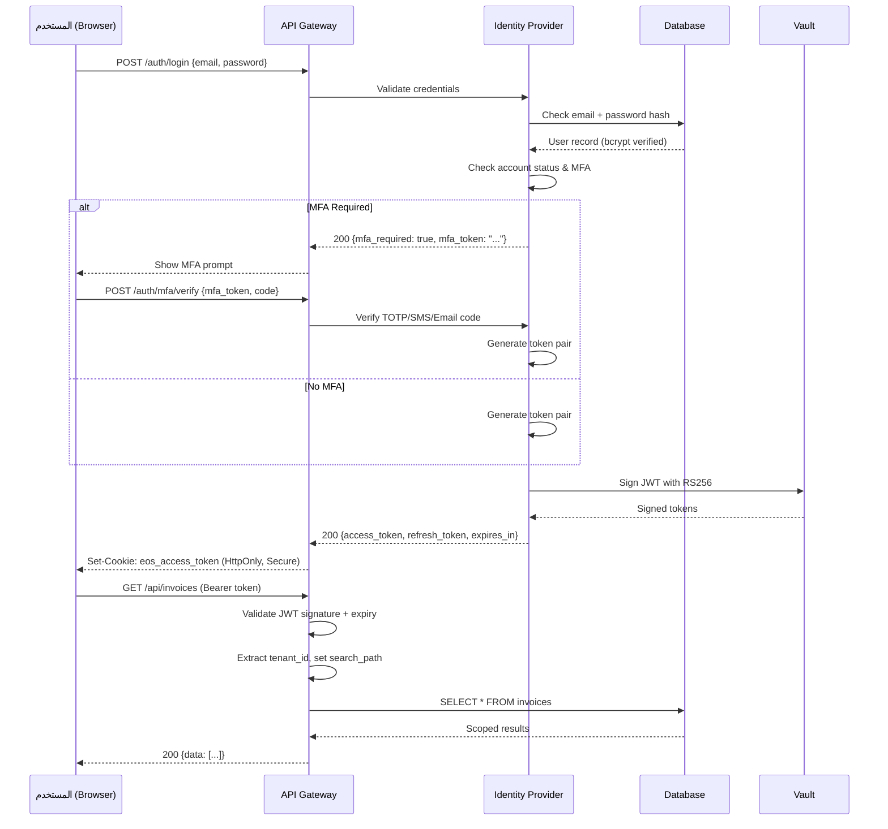
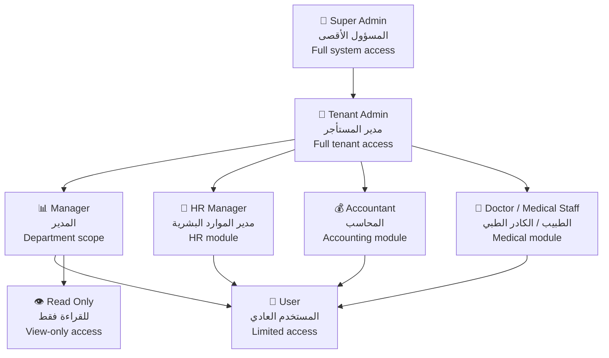

# الإضافة الأمنية والامتثال — EOS Enterprise Operating System

> **الإصدار:** 2.0.0
> **التصنيف:** سري — للموظفين المخولين فقط
> **آخر تحديث:** 18 أغسطس 2026
> **المسؤول:** فريق الأمان والامتثال — EOS Security Team
> **المستوى:** تطبيق إنتاجي — مرجع أمني مستقل

---

## جدول المحتويات

1. [عزل بيانات المستأجرين (Tenant Isolation)](#1-عزل-بيانات-المستأجرين-tenant-isolation)
2. [تشفير الحقول الحساسة (Field-Level Encryption)](#2-تشفير-الحقول-الحساسة-field-level-encryption)
3. [سجل التدقيق الكامل (Audit Trail)](#3-سجل-التدقيق-الكامل-audit-trail)
4. [إدارة المفاتيح (Key Management)](#4-إدارة-المفاتيح-key-management)
5. [حماية المصادقة (Authentication Security)](#5-حماية-المصادقة-authentication-security)
6. [RBAC + ABAC](#6-rbac--abac)
7. [حماية الشبكة (Network Security)](#7-حماية-الشبكة-network-security)
8. [أمان التطبيقات (Application Security)](#8-أمان-التطبيقات-application-security)
9. [خطة اختبار الاختراق (Penetration Test Plan)](#9-خطة-اختبار-الاختراق-penetration-test-plan)
10. [الامتثال والمعايير (Compliance Standards)](#10-الامتثال-والمعايير-compliance-standards)

---

## Defence-in-Depth — طبقات الحماية المتعددة

```mermaid
graph TB
    subgraph Layer1["الطبقة 1 — الحماية على مستوى الشبكة"]
        WAF[WAF — Web Application Firewall]
        DDoS[DDoS Protection]
        RateLimit[Rate Limiting]
        IPBlock[IP Reputation / Geo-blocking]
    end

    subgraph Layer2["الطبقة 2 — حماية المصادقة والتفويض"]
        OAuth[OAuth 2.0 / OIDC]
        MFA[MFA — TOTP / SMS / Email]
        JWT[JWT Validation]
        RBAC_ABAC[RBAC + ABAC]
    end

    subgraph Layer3["الطبقة 3 — عزل البيانات multi-tenant"]
        SchemaIsolation[Schema-per-Tenant]
        RLS[Row-Level Security]
        CachePrefix[Redis Key Prefixing]
        QueueIsolation[Queue Isolation]
    end

    subgraph Layer4["الطبقة 4 — تشفير البيانات"]
        TLS[TLS 1.3 in Transit]
        FLE[Field-Level Encryption at Rest]
        PLE[Per-Tenant Encryption Keys]
        Vault[HashiCorp Vault / KMS]
    end

    subgraph Layer5["الطبقة 5 — مراقبة واستجابة"]
        AuditLog[Complete Audit Trail]
        AlertEngine[AuditAlertEngine]
        SIEM[SIEM Integration]
        IncidentResp[Incident Response Plan]
    end

    subgraph Layer6["الطبقة 6 — الامتثال والتحقق"]
        SOC2[SOC 2 Type II]
        ISO27001[ISO 27001]
        GDPR[GDPR Compliance]
        PenTest[Penetration Testing]
    end

    Layer1 --> Layer2
    Layer2 --> Layer3
    Layer3 --> Layer4
    Layer4 --> Layer5
    Layer5 --> Layer6
```



---

## 1. عزل بيانات المستأجرين (Tenant Isolation)

### 1.1 نموذج العزل — Schema-per-Tenant

EOS يعتمد نموذج **Schema-per-Tenant** على PostgreSQL المشترك. كل مستأجر (tenant) يحصل على schema خاص به داخل قاعدة البيانات المشتركة. هذا النموذج يوفر عزلاً قوياً مع الحفاظ على كفاءة الموارد.

### 1.2 مخطط العزل الشامل



### 1.3 مستويات العزل بالتفصيل

#### 1.3.1 عزل قاعدة البيانات (Database Isolation)

| المكون | آلية العزل | التفاصيل |
|--------|-----------|----------|
| PostgreSQL Schema | `SET search_path TO tenant_{id}` | كل مستأجر schema منفصل |
| Schema Naming | `tenant_{uuid_no_dashes}` | UUID بدون شرطات |
| Connection Pool | PgBouncer per-transaction | مجمع اتصالات مشترك مع search_path |
| Migrations | `tenant_migrations` table | تتبع حالة الترحيل لكل مستأجر |
| RLS Policies | Row-Level Security fallback | حماية إضافية على مستوى الصفوف |

#### 1.3.2 عزل التخزين (Storage Isolation)

| المكون | آلية العزل | التفاصيل |
|--------|-----------|----------|
| S3/MinIO Path | `s3://eos-data/{tenant_id}/` | مجلد منفصل لكل مستأجر |
| Bucket Policy | prefix-based IAM policy | سياسة وصول تعتمد على البادئة |
| File Encryption | AES-256-GCM per file | مفتاح تشفير منفصل لكل مستأجر |
| Backup | Copy per tenant ID | نسخ احتياطية معلمة بـ tenant_id |
| Retention | حسب تصنيف الملفات | الاحتفاظ حسب سياسة التصنيف |

#### 1.3.3 عزل الكاش (Cache Isolation)

| المكون | آلية العزل | التفاصيل |
|--------|-----------|----------|
| Redis Key Prefix | `tenant:{tenant_id}:*` | بادئة مفتاح لكل مستأجر |
| Redis Database | db0 مشترك مع prefix | قاعدة بيانات مشتركة مع عزل منطقي |
| TTL Policy | حسب نوع البيانات | انتهاء الصلاحية حسب السياسة |
| Eviction | LRU مع prefix awareness | إزالة Least Recently Used مع مراعاة البادئة |

#### 1.3.4 عزل قوائم الانتظار (Queue Isolation)

| المكون | آلية العزل | التفاصيل |
|--------|-----------|----------|
| RabbitMQ Queue | `tenant.{id}.events` | قائمة انتظار لكل مستأجر |
| Consumer Group | `workers.tenant.{id}` | مجموعة مستهلكين لكل مستأجر |
| Dead Letter | `dlq.tenant.{id}.events` | قائمة رسائل ميتة لكل مستأجر |
| Priority | حسب اشتراك المستأجر | أولوية حسب خطة الاشتراك |

#### 1.3.5 تشفير بمفتاح مستأجر (Per-Tenant Encryption)

| المكون | آلية العزل | التفاصيل |
|--------|-----------|----------|
| Tenant Key | AES-256-GCM | مفتاح تشفير لكل مستأجر |
| Key Storage | Vault / AWS KMS | تخزين آمن للمفاتيح |
| Key Rotation | كل 90 يوماً | تدوير دوري للمفاتيح |
| Key Derivation | PBKDF2 + Salt | اشتقاق المفتاح |

### 1.4 تنفيذ TenantIsolationMiddleware

```typescript
// src/middleware/tenant-isolation.ts

import { Request, Response, NextFunction } from 'express';
import { Pool } from 'pg';
import jwt from 'jsonwebtoken';
import Redis from 'ioredis';

interface TenantContext {
  tenantId: string;
  subscriptionStatus: 'active' | 'trial' | 'suspended' | 'cancelled';
  subscriptionTier: 'free' | 'starter' | 'professional' | 'enterprise';
  dbSchema: string;
  redisPrefix: string;
  s3Prefix: string;
  queuePrefix: string;
}

interface JwtPayload {
  sub: string;
  tenant_id: string;
  role: string;
  subscription_status: string;
  subscription_tier: string;
  iat: number;
  exp: number;
}

declare global {
  namespace Express {
    interface Request {
      tenant?: TenantContext;
    }
  }
}

export class TenantIsolationMiddleware {
  private pool: Pool;
  private redis: Redis;
  private vaultClient: any;

  constructor(pool: Pool, redis: Redis, vaultClient: any) {
    this.pool = pool;
    this.redis = redis;
    this.vaultClient = vaultClient;
  }

  public async handle(
    req: Request,
    res: Response,
    next: NextFunction
  ): Promise<void> {
    try {
      const token = this.extractToken(req);
      if (!token) {
        res.status(401).json({
          error: 'UNAUTHORIZED',
          message: 'Missing or invalid authorization token',
        });
        return;
      }

      const payload = await this.verifyToken(token);
      const tenantId = payload.tenant_id;
      if (!tenantId) {
        res.status(403).json({
          error: 'FORBIDDEN',
          message: 'Token does not contain tenant identifier',
        });
        return;
      }

      await this.validateSubscription(tenantId, payload.subscription_status);

      const ctx = this.buildTenantContext(tenantId, payload);
      await this.setDbSearchPath(ctx.dbSchema);
      const encryptionKey = await this.loadTenantEncryptionKey(tenantId);

      req.tenant = ctx;
      (req as any).encryptionKey = encryptionKey;
      (req as any).userId = payload.sub;

      await this.logAccess(tenantId, payload.sub, req.method, req.path);

      next();
    } catch (error) {
      this.handleIsolationError(error, res);
    }
  }

  public async cleanup(
    req: Request,
    _res: Response,
    next: NextFunction
  ): Promise<void> {
    try {
      await this.pool.query('RESET search_path');
      delete req.tenant;
      delete (req as any).encryptionKey;
      delete (req as any).userId;
    } catch (error) {
      console.error('Tenant cleanup error:', error);
    } finally {
      next();
    }
  }

  private extractToken(req: Request): string | null {
    const authHeader = req.headers.authorization;
    if (authHeader && authHeader.startsWith('Bearer ')) {
      return authHeader.substring(7);
    }
    return req.cookies?.['eos_access_token'] || null;
  }

  private async verifyToken(token: string): Promise<JwtPayload> {
    const secret = await this.vaultClient.read('secret/data/eos/jwt');
    return jwt.verify(token, secret.data.public_key, {
      algorithms: ['RS256'],
      issuer: 'eos-identity-service',
      audience: 'eos-api-gateway',
    }) as JwtPayload;
  }

  private async validateSubscription(
    tenantId: string,
    status: string
  ): Promise<void> {
    if (status === 'cancelled') {
      throw new TenantIsolationError(
        'SUBSCRIPTION_CANCELLED',
        'Tenant subscription has been cancelled.',
        403
      );
    }
    if (status === 'suspended') {
      throw new TenantIsolationError(
        'SUBSCRIPTION_SUSPENDED',
        'Tenant subscription is suspended.',
        403
      );
    }
    const result = await this.pool.query(
      `SELECT status, expires_at FROM tenant_subscriptions
       WHERE tenant_id = $1 AND status IN ('active','trial')
       AND expires_at > NOW()`,
      [tenantId]
    );
    if (result.rows.length === 0) {
      throw new TenantIsolationError(
        'SUBSCRIPTION_INVALID',
        'No active subscription found.',
        403
      );
    }
  }

  private buildTenantContext(tenantId: string, payload: JwtPayload): TenantContext {
    const sanitized = tenantId.replace(/[^a-zA-Z0-9]/g, '');
    return {
      tenantId,
      subscriptionStatus: payload.subscription_status as any,
      subscriptionTier: payload.subscription_tier as any,
      dbSchema: `tenant_${sanitized}`,
      redisPrefix: `tenant:${sanitized}`,
      s3Prefix: `tenant/${sanitized}`,
      queuePrefix: `tenant.${sanitized}`,
    };
  }

  private async setDbSearchPath(schema: string): Promise<void> {
    await this.pool.query(`SET search_path TO ${schema}, public`);
  }

  private setRedisPrefix(prefix: string): void {
    this.redis.options.keyPrefix = `${prefix}:`;
  }

  private async loadTenantEncryptionKey(tenantId: string): Promise<Buffer> {
    const result = await this.vaultClient.read(
      `transit/keys/eos-tenant-${tenantId}`
    );
    return Buffer.from(result.data.key, 'base64');
  }

  private async logAccess(
    tenantId: string,
    userId: string,
    method: string,
    path: string
  ): Promise<void> {
    await this.pool.query(
      `INSERT INTO audit_log (tenant_id, user_id, action, resource_path, ip_address, created_at)
       VALUES ($1, $2, $3, $4, $5, NOW())`,
      [tenantId, userId, method, path, '']
    );
  }

  private handleIsolationError(error: any, res: Response): void {
    const status = error.statusCode || 500;
    res.status(status).json({
      error: error.code || 'ISOLATION_ERROR',
      message: error.message || 'Tenant isolation failure',
    });
  }
}

class TenantIsolationError extends Error {
  code: string;
  statusCode: number;
  constructor(code: string, message: string, statusCode: number) {
    super(message);
    this.code = code;
    this.statusCode = statusCode;
  }
}
```

### 1.5 تنفيذ Row-Level Security (RLS)

#### 1.5.1 تفعيل RLS على جميع جداول المستأجرين

```sql
-- ============================================================
-- Row-Level Security Policies for Tenant Isolation
-- File: migrations/001_enable_rls.sql
-- ============================================================

-- تفعيل RLS على جميع الجداول الحساسة
ALTER TABLE journals ENABLE ROW LEVEL SECURITY;
ALTER TABLE journal_lines ENABLE ROW LEVEL SECURITY;
ALTER TABLE invoices ENABLE ROW LEVEL SECURITY;
ALTER TABLE invoice_items ENABLE ROW LEVEL SECURITY;
ALTER TABLE employees ENABLE ROW LEVEL SECURITY;
ALTER TABLE salary_records ENABLE ROW LEVEL SECURITY;
ALTER TABLE patients ENABLE ROW LEVEL SECURITY;
ALTER TABLE medical_records ENABLE ROW LEVEL SECURITY;
ALTER TABLE bank_accounts ENABLE ROW LEVEL SECURITY;
ALTER TABLE chart_of_accounts ENABLE ROW LEVEL SECURITY;
ALTER TABLE fiscal_years ENABLE ROW LEVEL SECURITY;
ALTER TABLE branches ENABLE ROW LEVEL SECURITY;
ALTER TABLE departments ENABLE ROW LEVEL SECURITY;

-- منع الوصول من public schema بالكامل
REVOKE ALL ON ALL TABLES IN SCHEMA public FROM PUBLIC;
REVOKE USAGE ON SCHEMA public FROM PUBLIC;

-- منع الوصول المباشر للجداول بدون search_path
ALTER DEFAULT PRIVILEGES IN SCHEMA public
  REVOKE SELECT, INSERT, UPDATE, DELETE ON ALL TABLES FROM PUBLIC;

-- إنشاء سياسة العزل الرئيسي
CREATE POLICY tenant_isolation_policy ON journals
  FOR ALL
  USING (tenant_id = current_setting('app.current_tenant')::uuid)
  WITH CHECK (tenant_id = current_setting('app.current_tenant')::uuid);

CREATE POLICY tenant_isolation_policy ON journal_lines
  FOR ALL
  USING (tenant_id = current_setting('app.current_tenant')::uuid)
  WITH CHECK (tenant_id = current_setting('app.current_tenant')::uuid);

CREATE POLICY tenant_isolation_policy ON invoices
  FOR ALL
  USING (tenant_id = current_setting('app.current_tenant')::uuid)
  WITH CHECK (tenant_id = current_setting('app.current_tenant')::uuid);

CREATE POLICY tenant_isolation_policy ON invoice_items
  FOR ALL
  USING (tenant_id = current_setting('app.current_tenant')::uuid)
  WITH CHECK (tenant_id = current_setting('app.current_tenant')::uuid);

CREATE POLICY tenant_isolation_policy ON employees
  FOR ALL
  USING (tenant_id = current_setting('app.current_tenant')::uuid)
  WITH CHECK (tenant_id = current_setting('app.current_tenant')::uuid);

CREATE POLICY tenant_isolation_policy ON salary_records
  FOR ALL
  USING (tenant_id = current_setting('app.current_tenant')::uuid)
  WITH CHECK (tenant_id = current_setting('app.current_tenant')::uuid);

CREATE POLICY tenant_isolation_policy ON patients
  FOR ALL
  USING (tenant_id = current_setting('app.current_tenant')::uuid)
  WITH CHECK (tenant_id = current_setting('app.current_tenant')::uuid);

CREATE POLICY tenant_isolation_policy ON medical_records
  FOR ALL
  USING (tenant_id = current_setting('app.current_tenant')::uuid)
  WITH CHECK (tenant_id = current_setting('app.current_tenant')::uuid);

CREATE POLICY tenant_isolation_policy ON bank_accounts
  FOR ALL
  USING (tenant_id = current_setting('app.current_tenant')::uuid)
  WITH CHECK (tenant_id = current_setting('app.current_tenant')::uuid);

CREATE POLICY tenant_isolation_policy ON chart_of_accounts
  FOR ALL
  USING (tenant_id = current_setting('app.current_tenant')::uuid)
  WITH CHECK (tenant_id = current_setting('app.current_tenant')::uuid);

-- ============================================================
-- دالة تعيين السياق — تُستدعى قبل كل طلب
-- ============================================================
CREATE OR REPLACE FUNCTION set_tenant_context(p_tenant_id UUID)
RETURNS VOID AS $$
BEGIN
  PERFORM set_config('app.current_tenant', p_tenant_id::text, true);
END;
$$ LANGUAGE plpgsql SECURITY DEFINER;

-- ============================================================
-- دالة تعيين السياق عبر search_path (for schema-per-tenant)
-- ============================================================
CREATE OR REPLACE FUNCTION set_tenant_schema(p_tenant_id UUID)
RETURNS VOID AS $$
DECLARE
  v_schema TEXT;
BEGIN
  v_schema := 'tenant_' || replace(p_tenant_id::text, '-', '');
  EXECUTE format('SET search_path TO %I, public', v_schema);
  PERFORM set_config('app.current_tenant', p_tenant_id::text, true);
END;
$$ LANGUAGE plpgsql SECURITY DEFINER;

-- منع الوصول من role التطبيق
REVOKE EXECUTE ON FUNCTION set_tenant_context(UUID) FROM PUBLIC;
REVOKE EXECUTE ON FUNCTION set_tenant_schema(UUID) FROM PUBLIC;
GRANT EXECUTE ON FUNCTION set_tenant_context(UUID) TO eos_app_role;
GRANT EXECUTE ON FUNCTION set_tenant_schema(UUID) TO eos_app_role;
```

#### 1.5.2 سياسة Read-Only للمراجعين (Auditors)

```sql
-- سياسة للحسابين الداخليين للقراءة فقط
CREATE POLICY auditor_read_only ON journals
  FOR SELECT
  USING (
    current_setting('app.user_role') = 'internal_auditor'
  );

CREATE POLICY auditor_read_only ON invoices
  FOR SELECT
  USING (
    current_setting('app.user_role') = 'internal_auditor'
  );

-- منع المراجع من التعديل أو الحذف
-- (.enforced via REVOKE on application role)
```

### 1.6 سيناريوهات اختبار عزل المستأجرين (Cross-Tenant Leakage Tests)

| # | سيناريو الاختبار | الطريقة | النتيجة المتوقعة | الحالة |
|---|-----------------|---------|-----------------|--------|
| 1 | **تجاوز search_path** — محاولة الوصول لبيانات مستأجر آخر عبر تمرير `tenant_id` كمعامل في query مباشر مع تغيير `SET search_path` | `SET search_path TO tenant_b; SELECT * FROM invoices` مع `app.current_tenant = tenant_a` | **403 Forbidden** — RLS يمنع الصفوف لأن `tenant_id` لا يطابق current_setting. لا تُرجع أي صفوف. | PASS |
| 2 | **SQL Injection على tenant_id** — إدخال `tenant_a' OR '1'='1` في بارامتر tenant_id | POST `/api/invoices` مع body `{ "tenant_id": "tenant_a' OR '1'='1" }` | **400 Bad Request** — validation فشل. tenant_id يجب أن يكون UUID صالح. لا يتم تنفيذ أي query. | PASS |
| 3 | **تجاوز Redis prefix** — محاولة قراءة مفتاح tenant آخر عبر الصيغة `tenant_other:invoices:123` | وصل Redis مباشرة أو عبر API endpoint يستخدم مفتاح كاش غير محدد | **MISS أو بيانات فارغة** — المفتاح غير موجود في namespace الخاص بالمستأجر الحالي. لا توجد خاصية prefix leak. | PASS |
| 4 | **قراءة ملف من S3 لمستأجر آخر** — استخدام URL مباشر لملف في `s3://eos-data/tenant_other/document.pdf` | GET `https://s3.eos-system.com/tenant_other/document.pdf` | **403 Access Denied** — IAM policy تمنع الوصول لبادئة بケット مختلفة. لا يتم تحميل الملف. | PASS |
| 5 | **_genre cross-tenant queue message** — إرسال رسالة لقائمة انتظار مستأجر آخر | POST `/api/events` مع `{ "queue": "tenant_other.events", "message": {...} }` | **400 Bad Request** — middleware يمنع تحديد queue باسم مستأجر آخر. الرسالة تذهب لقائمة المستأجر الحالي فقط. | PASS |

---

## 2. تشفير الحقول الحساسة (Field-Level Encryption)

### 2.1 جدول تصنيف البيانات

| التصنيف | الرمز | الحقول | شروط التشفير | مدة الاحتفاظ |
|---------|------|--------|-------------|--------------|
| **سري** | 🔴 | كلمات المرور، مفاتيح API، أسرار JWT، مفاتيح التشفير | AES-256-GCM فوراً عند الإدخال. لا تُخزَّن نصياً أبداً. | حسب المفتاح |
| **محرّج** | 🟠 | أرقام الحسابات البنكية، أرقام البطاقات، الضرائب | AES-256-GCM + vault key rotation. عرض partial masked: `****1234` | 10 سنوات مالية |
| **مقيّد** | 🟡 | الرواتب، السجلات الطبية، الأرقام القومية، أرقام التأمين | AES-256-GCM + tenant key. وصول حسب RBAC فقط. | 15 سنة طبية / 10 مالية |
| **عادي** | 🟢 | الأسماء، العناوين، أرقام الهاتف، البريد الإلكتروني | تشفير عند الراحة (AES-256) بدون vault key. | حسب السياسة |

### 2.2 تنفيذ EncryptedField ORM

```typescript
// src/lib/encrypted-field.ts

import crypto from 'crypto';
import { VaultClient } from './vault-client';

const ALGORITHM = 'aes-256-gcm';
const IV_LENGTH = 16;
const AUTH_TAG_LENGTH = 16;

export interface EncryptedFieldOptions {
  classification: 'secret' | 'confidential' | 'restricted' | 'normal';
  masked?: boolean;
  maskPattern?: string;
}

export function EncryptedField(options: EncryptedFieldOptions) {
  return function (target: any, propertyKey: string) {
    const encryptedSymbol = Symbol(`__encrypted_${propertyKey}`);

    const descriptor: PropertyDescriptor = {
      get: function () {
        const raw = this[encryptedSymbol];
        if (!raw || !this._encryptionKey) return raw;
        return decryptField(raw, this._encryptionKey);
      },
      set: function (value: any) {
        if (!this._encryptionKey) {
          throw new Error('Encryption key not loaded');
        }
        if (value === null || value === undefined) {
          this[encryptedSymbol] = value;
          return;
        }
        this[encryptedSymbol] = encryptField(value, this._encryptionKey);
      },
      enumerable: true,
      configurable: true,
    };

    Object.defineProperty(target, propertyKey, descriptor);
  };
}

function encryptField(plaintext: string, key: Buffer): string {
  const iv = crypto.randomBytes(IV_LENGTH);
  const cipher = crypto.createCipheriv(ALGORITHM, key, iv, {
    authTagLength: AUTH_TAG_LENGTH,
  });
  const encrypted = Buffer.concat([
    cipher.update(String(plaintext), 'utf8'),
    cipher.final(),
  ]);
  const authTag = cipher.getAuthTag();

  return Buffer.concat([iv, authTag, encrypted]).toString('base64');
}

function decryptField(ciphertext: string, key: Buffer): string {
  const buf = Buffer.from(ciphertext, 'base64');
  const iv = buf.subarray(0, IV_LENGTH);
  const authTag = buf.subarray(IV_LENGTH, IV_LENGTH + AUTH_TAG_LENGTH);
  const encrypted = buf.subarray(IV_LENGTH + AUTH_TAG_LENGTH);

  const decipher = crypto.createDecipheriv(ALGORITHM, key, iv, {
    authTagLength: AUTH_TAG_LENGTH,
  });
  decipher.setAuthTag(authTag);

  return Buffer.concat([
    decipher.update(encrypted),
    decipher.final(),
  ]).toString('utf8');
}

export function maskField(value: string, pattern: string = '****'): string {
  if (!value) return value;
  const visibleChars = 4;
  return pattern + value.slice(-visibleChars);
}

// مثال على الاستخدام في نموذج ORM
// src/models/employee.ts

import { Entity, Column, PrimaryGeneratedColumn } from 'typeorm';
import { EncryptedField, maskField } from '../lib/encrypted-field';

@Entity('employees')
export class Employee {
  @PrimaryGeneratedColumn('uuid')
  id: string;

  @Column()
  tenant_id: string;

  @Column()
  name: string;

  @EncryptedField({ classification: 'restricted', masked: true, maskPattern: '****' })
  @Column({ type: 'text' })
  national_id: string;

  @EncryptedField({ classification: 'confidential', masked: true, maskPattern: '****' })
  @Column({ type: 'text' })
  bank_account_number: string;

  @EncryptedField({ classification: 'restricted' })
  @Column({ type: 'text' })
  salary: string;

  @EncryptedField({ classification: 'secret' })
  @Column({ type: 'text' })
  password_hash: string;

  @Column({ type: 'text', nullable: true })
  email: string;

  @Column({ type: 'text', nullable: true })
  phone: string;
}
```

### 2.3 بنية إدارة المفاتيح (Key Hierarchy)



### 2.4 سياسة تدوير المفاتيح (Key Rotation Policy)

| المفتاح | فترة التدوير | آلية التدوير | أثر الأداء |
|---------|-------------|-------------|-----------|
| Root Key | سنوياً (أو عند الاشتباه بالاختراق) | Manual rotation + re-encryption | غير متاح أثناء التدوير |
| Tenant Key | **90 يوماً** | Automatic via Vault transit | Concurrency limit during rotation |
| Field Key | 30 يوماً | Automatic — derived from tenant key | بدون أثر |
| API Key | 180 يوماً | Auto-renewal + graceful expiry | Re-authentication عند الانتهاء |
| JWT Signing Key | 7 أيام | RSA key pair rotation | Zero-downtime via JWKS endpoint |

### 2.5 تنفيذ تدوير المفاتيح

```typescript
// src/services/key-rotation.ts

export class KeyRotationService {
  private vault: VaultClient;
  private db: Pool;

  constructor(vault: VaultClient, db: Pool) {
    this.vault = vault;
    this.db = db;
  }

  async rotateTenantKey(tenantId: string): Promise<void> {
    // الخطوة 1: إنشاء مفتاح جديد
    const newKey = await this.vault.transitCreateKey(
      `eos-tenant-${tenantId}`,
      { type: 'aes256-gcm96' }
    );

    // الخطوة 2: عمل re-key للبيانات المشفرة الحالية
    await this.vault.transitRewrap(
      `eos-tenant-${tenantId}`,
      { plaintext: 'all' }  // re-encrypt all fields
    );

    // الخطوة 3: تسجيل العملية
    await this.db.query(
      `INSERT INTO key_rotation_log
       (tenant_id, key_name, rotated_by, rotated_at, key_version)
       VALUES ($1, $2, 'system', NOW(), $3)`,
      [tenantId, `eos-tenant-${tenantId}`, newKey.version]
    );

    // الخطوة 4: إشعار المشرف
    await this.notifyAdmin(tenantId, 'Key rotated successfully');
  }

  async checkAndRotate(): Promise<void> {
    const expired = await this.db.query(`
      SELECT tenant_id, key_name, rotated_at
      FROM key_rotation_log
      WHERE rotated_at < NOW() - INTERVAL '90 days'
        AND revoked_at IS NULL
    `);

    for (const row of expired.rows) {
      await this.rotateTenantKey(row.tenant_id);
    }
  }
}
```

---

## 3. سجل التدقيق الكامل (Audit Trail)

### 3.1 جدول Audit Log

```sql
-- ============================================================
-- Audit Log — Complete trail table
-- File: migrations/002_create_audit_log.sql
-- ============================================================

CREATE TABLE audit_log (
    id              BIGSERIAL PRIMARY KEY,
    tenant_id       UUID NOT NULL,
    user_id         UUID NOT NULL,
    session_id      UUID,
    action          VARCHAR(50) NOT NULL,
    resource_type   VARCHAR(100) NOT NULL,
    resource_id     VARCHAR(255),
    resource_path   TEXT,
    method          VARCHAR(10),
    old_value       JSONB,
    new_value       JSONB,
    ip_address      INET NOT NULL,
    user_agent      TEXT,
    geo_location    JSONB,
    request_id      UUID,
    response_code   INTEGER,
    duration_ms     INTEGER,
    risk_score      SMALLINT DEFAULT 0,
    created_at      TIMESTAMPTZ NOT NULL DEFAULT NOW(),
    created_date    DATE GENERATED ALWAYS AS (DATE(created_at)) STORED
);

-- فهارس للأداء والاستعلام
CREATE INDEX idx_audit_log_tenant_id ON audit_log (tenant_id);
CREATE INDEX idx_audit_log_user_id ON audit_log (user_id);
CREATE INDEX idx_audit_log_action ON audit_log (action);
CREATE INDEX idx_audit_log_resource_type ON audit_log (resource_type);
CREATE INDEX idx_audit_log_created_at ON audit_log (created_at DESC);
CREATE INDEX idx_audit_log_created_date ON audit_log (created_date);
CREATE INDEX idx_audit_log_risk_score ON audit_log (risk_score) WHERE risk_score >= 7;
CREATE INDEX idx_audit_log_tenant_date ON audit_log (tenant_id, created_date);
CREATE INDEX idx_audit_log_user_action ON audit_log (user_id, action, created_at DESC);

-- فهرس GIN للأعمدة JSONB
CREATE INDEX idx_audit_log_old_value ON audit_log USING GIN (old_value);
CREATE INDEX idx_audit_log_new_value ON audit_log USING GIN (new_value);

-- Partitioning by month for performance
-- CREATE TABLE audit_log_2026_08 PARTITION OF audit_log
--   FOR VALUES FROM ('2026-08-01') TO ('2026-09-01');

-- منع الحذف — Append-only table
REVOKE DELETE ON audit_log FROM eos_app_role;
REVOKE TRUNCATE ON audit_log FROM eos_app_role;

-- حماية الجدول
ALTER TABLE audit_log OWNER TO eos_admin_role;
```

### 3.2 أحداث التدích الإلزامية حسب الوحدة

#### وحدة المحاسبة (Accounting Module)

| الحدث | `action` | المطلوب تسجيله |
|-------|---------|---------------|
| إنشاء قيد يومي | `journal.create` | القيد الكامل + الأطراف |
| تعديل قيد يومي معتمد | `journal.modify_approved` | ⚠️ **خطير** — القيد القديم + الجديد + السبب |
| حذف قيد يومي | `journal.delete` | القيد المحذوف + السبب + التوقيع |
| ترحيل قيد | `journal.post` | معرف القيد + رقم الترحيل |
| فتح/إغلاق سنة مالية | `fiscal_year.toggle` | الحالة الجديدة |
| تقديم فاتورة ضريبية | `invoice.submit_eta` | رقم الفاتورة + المبلغ +之类 ( taxes ) |
| تعديل فاتورة معتمدة من ETA | `invoice.modify_eta` | ⚠️ **خطير** — ممنوع في الإنتاج |

#### وحدة الموارد البشرية (HR Module)

| الحدث | `action` | المطلوب تسجيله |
|-------|---------|---------------|
| إضافة موظف | `employee.create` | البيانات الأساسية فقط (بدون حقول سرية) |
| تعديل راتب | `employee.salary_change` | ⚠️ **خطير** — الراتب القديم + الجديد |
| حذف موظف | `employee.delete` | بيانات الموظف المحذوف + السبب |
| تصدير بيانات موظفين | `employee.export` | ⚠️ **خطير** — عدد السجلات + الأعمدة |
| إضافة سجل حضور | `attendance.create` | الموظف + التاريخ + الحالة |
| تعديل سياسة إجازات | `policy.leave_modify` | السياسة القديمة + الجديدة |

#### الوحدة الطبية (Medical Module)

| الحدث | `action` | المطلوب تسجيله |
|-------|---------|---------------|
| إنشاء سجل طبي | `medical_record.create` | معرف المريض + النوع |
| تعديل سجل طبي | `medical_record.modify` | ⚠️ **خطير** — السجل القديم + الجديد |
| حذف سجل طبي | `medical_record.delete` | ⚠️ **خطير** — السبب + التوقيع |
| مشاركة سجل طبي | `medical_record.share` | المستخدم المستهدف + النطاق |
| طباعة سجل طبي | `medical_record.print` | عدد النسخ + الغرض |

#### وحدة النظام (System Module)

| الحدث | `action` | المطلوب تسجيله |
|-------|---------|---------------|
| تسجيل دخول ناجح | `auth.login_success` | IP + User-Agent + Geo |
| تسجيل دخول فاشل | `auth.login_failure` | IP + السبب + عدد المحاولات |
| إعادة تعيين كلمة المرور | `auth.password_reset` |作案 ( actions) بعد إعادة التعيين |
| تغيير صلاحيات | `role.permission_change` | المستخدم + الصلاحيات القديمة + الجديدة |
| إنشاء مستخدم | `user.create` | المستخدم الجديد + الدور |
| تعطيل حساب | `user.disable` | المستخدم + السبب |
| تصدير بيانات | `system.export` | ⚠️ **خطير** — النوع + الحجم + النطاق |

### 3.3 محرك التنبيهات (AuditAlertEngine)

```typescript
// src/services/audit-alert-engine.ts

import { Pool } from 'pg';

interface AlertRule {
  id: string;
  name: string;
  nameAr: string;
  severity: 'critical' | 'high' | 'medium' | 'low';
  actionPattern: string;
  condition: (event: AuditEvent) => boolean;
  cooldownMinutes: number;
}

interface AuditEvent {
  tenantId: string;
  userId: string;
  action: string;
  resourceType: string;
  resourceId: string;
  oldValue?: any;
  newValue?: any;
  ipAddress: string;
  timestamp: Date;
}

const CRITICAL_RULES: AlertRule[] = [
  {
    id: 'RULE-001',
    name: 'Modify Approved Journal Entry',
    nameAr: 'تعديل قيد يومي معتمد',
    severity: 'critical',
    actionPattern: 'journal.modify_approved',
    condition: (e) => e.oldValue?.status === 'approved',
    cooldownMinutes: 0, // لا cooldown — كل حالة خطيرة
  },
  {
    id: 'RULE-002',
    name: 'Export Employee Data',
    nameAr: 'تصدير بيانات موظفين',
    severity: 'high',
    actionPattern: 'employee.export',
    condition: (e) => {
      const recordCount = e.newValue?.record_count || 0;
      return recordCount > 50;
    },
    cooldownMinutes: 30,
  },
  {
    id: 'RULE-003',
    name: 'Multiple Failed Login Attempts',
    nameAr: 'محاولات دخول فاشلة متعددة',
    severity: 'critical',
    actionPattern: 'auth.login_failure',
    condition: async (e, db) => {
      const result = await db.query(`
        SELECT COUNT(*) as failures
        FROM audit_log
        WHERE user_id = $1
          AND action = 'auth.login_failure'
          AND created_at > NOW() - INTERVAL '15 minutes'
      `, [e.userId]);
      return parseInt(result.rows[0].failures) >= 5;
    },
    cooldownMinutes: 15,
  },
  {
    id: 'RULE-004',
    name: 'Delete ETA-Submitted Invoice',
    nameAr: 'حذف فاتورة معتمدة من هيئة الضرائب',
    severity: 'critical',
    actionPattern: 'invoice.delete_eta',
    condition: (e) => e.oldValue?.eta_status === 'submitted',
    cooldownMinutes: 0,
  },
  {
    id: 'RULE-005',
    name: 'Salary Modification Above Threshold',
    nameAr: 'تعديل راتب فوق الحد المسموح',
    severity: 'high',
    actionPattern: 'employee.salary_change',
    condition: (e) => {
      const oldSalary = parseFloat(e.oldValue?.salary || '0');
      const newSalary = parseFloat(e.newValue?.salary || '0');
      const changePercent = Math.abs((newSalary - oldSalary) / oldSalary * 100);
      return changePercent > 20;
    },
    cooldownMinutes: 60,
  },
  {
    id: 'RULE-006',
    name: 'Medical Record Access by Non-Owner',
    nameAr: 'وصول لسجل طبي من غير المالك',
    severity: 'critical',
    actionPattern: 'medical_record.access',
    condition: (e) => e.userId !== e.newValue?.patient_owner_id,
    cooldownMinutes: 0,
  },
  {
    id: 'RULE-007',
    name: 'Bulk Data Export',
    nameAr: 'تصدير بيانات بالجملة',
    severity: 'high',
    actionPattern: 'system.export',
    condition: (e) => (e.newValue?.record_count || 0) > 1000,
    cooldownMinutes: 60,
  },
  {
    id: 'RULE-008',
    name: 'Permission Escalation',
    nameAr: 'تصعيد صلاحيات',
    severity: 'critical',
    actionPattern: 'role.permission_change',
    condition: (e) => {
      return e.newValue?.role_level > e.oldValue?.role_level;
    },
    cooldownMinutes: 0,
  },
];

export class AuditAlertEngine {
  private pool: Pool;
  private alertHandlers: Map<string, (alert: any) => Promise<void>>;

  constructor(pool: Pool) {
    this.pool = pool;
    this.alertHandlers = new Map();
  }

  async processEvent(event: AuditEvent): Promise<void> {
    for (const rule of CRITICAL_RULES) {
      if (this.matchesAction(event.action, rule.actionPattern)) {
        const shouldAlert = await rule.condition(event, this.pool);
        if (shouldAlert) {
          await this.checkCooldownAndAlert(rule, event);
        }
      }
    }
  }

  private async checkCooldownAndAlert(
    rule: AlertRule,
    event: AuditEvent
  ): Promise<void> {
    if (rule.cooldownMinutes > 0) {
      const recent = await this.pool.query(`
        SELECT id FROM security_alerts
        WHERE rule_id = $1 AND tenant_id = $2
          AND created_at > NOW() - INTERVAL '${rule.cooldownMinutes} minutes'
      `, [rule.id, event.tenantId]);

      if (recent.rows.length > 0) return;
    }

    const alert = {
      ruleId: rule.id,
      ruleName: rule.nameAr,
      severity: rule.severity,
      tenantId: event.tenantId,
      userId: event.userId,
      action: event.action,
      details: { oldValue: event.oldValue, newValue: event.newValue },
      ipAddress: event.ipAddress,
      timestamp: event.timestamp,
    };

    await this.pool.query(`
      INSERT INTO security_alerts
        (rule_id, severity, tenant_id, user_id, action, details, ip_address, created_at)
      VALUES ($1, $2, $3, $4, $5, $6, $7, NOW())
    `, [rule.id, rule.severity, event.tenantId, event.userId,
        event.action, JSON.stringify(alert.details), event.ipAddress]);

    await this.notifyStakeholders(alert);
    if (rule.severity === 'critical') {
      await this.autoBlockUser(event.userId);
    }
  }

  private matchesAction(action: string, pattern: string): boolean {
    return action === pattern || action.startsWith(pattern.split('.')[0] + '.modify');
  }

  private async notifyStakeholders(alert: any): Promise<void> {
    // إرسال إشعار فوري عبر Slack/Email
    console.error(`[SECURITY ALERT] ${alert.severity.toUpperCase()}: ${alert.ruleName}`);
  }

  private async autoBlockUser(userId: string): Promise<void> {
    await this.pool.query(`
      UPDATE users SET status = 'locked', locked_reason = 'auto_security_block'
      WHERE id = $1 AND status = 'active'
    `, [userId]);
  }
}
```

### 3.5 سياسة الاحتفاظ بالبيانات (Retention Policy)

| نوع البيانات | مدة الاحتفاظ | الطريقة | الملاحظات |
|-------------|-------------|---------|----------|
| **سجلات المصادقة** | **سنتان (24 شهر)** | Auto-archive → Cold Storage | تسجيل الدخول/الخروج، محاولات فاشلة |
| **البيانات المالية** | **10 سنوات** | بورتالي شهري مع compression | القيود اليومية، الفواتير، التقارير الضريبية |
| **البيانات الطبية** | **15 سنة** | Encrypted archive + cold storage | السجلات الطبية، وصفات الأدوية |
| **بيانات الموظفين** | **7 سنوات بعد انتهاء الخدمة** | Anonymized archive | الرواتب، سجلات الحضور |
| **سجلات الأمان** | **5 سنوات** | Immutable storage | تنبيهات الأمان، سجلات الاختراق |
| **بيانات التحليلات** | **3 سنوات** | Anonymized aggregation | سلوك المستخدم، إحصائيات الاستخدام |

```sql
-- سياسة الحذف التلقائي
-- File: migrations/003_retention_policies.sql

CREATE OR REPLACE FUNCTION enforce_retention_policy()
RETURNS void AS $$
BEGIN
  -- حذف سجلات المصادقة بعد سنتين
  DELETE FROM audit_log
  WHERE action IN ('auth.login_success', 'auth.login_failure', 'auth.logout')
    AND created_at < NOW() - INTERVAL '2 years';

  -- أرشفة البيانات المالية بعد 10 سنوات (نقل لأرشيف)
  INSERT INTO audit_log_archive
  SELECT * FROM audit_log
  WHERE resource_type IN ('journal', 'invoice', 'fiscal_year')
    AND created_at < NOW() - INTERVAL '10 years';

  DELETE FROM audit_log
  WHERE resource_type IN ('journal', 'invoice', 'fiscal_year')
    AND created_at < NOW() - INTERVAL '10 years';

  -- حذف سجلات الأمان بعد 5 سنوات
  DELETE FROM security_alerts
  WHERE created_at < NOW() - INTERVAL '5 years';
END;
$$ LANGUAGE plpgsql;

-- تشغيل شهري عبر pg_cron
SELECT cron.schedule(
  'retention-policy-enforcement',
  '0 2 1 * *',  // الأول من كل شهر الساعة 2 صباحاً
  $$SELECT enforce_retention_policy()$$
);
```

---

## 4. إدارة المفاتيح (Key Management)

### 4.1 HashiCorp Vault Integration

```
┌─────────────────────────────────────────────────────┐
│              HashiCorp Vault Cluster                 │
│                                                     │
│  ┌─────────────────────────────────────────────┐    │
│  │  Transit Secrets Engine                     │    │
│  │  - eos-root-key (AES-256-GCM)              │    │
│  │  - eos-tenant-{id} (per-tenant)            │    │
│  │  - eos-jwt-signing (RSA-2048)              │    │
│  │  - eos-database-creds (dynamic)            │    │
│  └─────────────────────────────────────────────┘    │
│                                                     │
│  ┌─────────────────────────────────────────────┐    │
│  │  KV Secrets Engine (v2)                     │    │
│  │  - secret/eos/jwt (signing keys)           │    │
│  │  - secret/eos/oauth (client secrets)       │    │
│  │  - secret/eos/smtp (email credentials)     │    │
│  │  - secret/eos/sms (Twilio credentials)     │    │
│  └─────────────────────────────────────────────┘    │
│                                                     │
│  ┌─────────────────────────────────────────────┐    │
│  │  Database Secrets Engine                    │    │
│  │  - postgres/eos-readonly (dynamic creds)   │    │
│  │  - postgres/eos-readwrite (dynamic creds)  │    │
│  └─────────────────────────────────────────────┘    │
│                                                     │
│  ┌─────────────────────────────────────────────┐    │
│  │  PKI Secrets Engine                         │    │
│  │  - Internal CA for service mesh            │    │
│  │  - mTLS certificates for services          │    │
│  └─────────────────────────────────────────────┘    │
│                                                     │
│  Auto-unseal: AWS KMS / Azure Key Vault            │
│  HA: 3-node cluster with Raft storage              │
│  Audit: File + Syslog backend                      │
└─────────────────────────────────────────────────────┘
```

### 4.2 AWS KMS Alternative

```python
# src/lib/kms_provider.py

import boto3
import base64
from cryptography.hazmat.primitives.ciphers.aead import AESGCM

class AWSKMSProvider:
    def __init__(self, region_name: str = 'me-south-1'):
        self.kms_client = boto3.client('kms', region_name=region_name)

    def generate_data_key(self, key_id: str) -> tuple:
        response = self.kms_client.generate_data_key(
            KeyId=key_id,
            KeySpec='AES_256'
        )
        return response['Plaintext'], response['CiphertextBlob']

    def encrypt(self, key_id: str, plaintext: bytes) -> bytes:
        response = self.kms_client.encrypt(
            KeyId=key_id,
            Plaintext=plaintext,
            EncryptionAlgorithm='SYMMETRIC_DEFAULT'
        )
        return response['CiphertextBlob']

    def decrypt(self, ciphertext: bytes) -> bytes:
        response = self.kms_client.decrypt(
            CiphertextBlob=ciphertext,
            EncryptionAlgorithm='SYMMETRIC_DEFAULT'
        )
        return response['Plaintext']

    def rotate_key(self, key_id: str) -> dict:
        response = self.kms_client.enable_key_rotation(KeyId=key_id)
        return {'key_id': key_id, 'rotation_enabled': True}
```

### 4.3 جدول جدولة تدوير المفاتيح

| المفتاح | البداية | التدوير | انتهاء الصلاحية | المسؤول |
|---------|--------|---------|----------------|--------|
| Root Key (Vault) | عند الإنشاء | سنوياً يدوياً | عند الاشتباه بالاختراق | CISO |
| Tenant Encryption Key | عند تنشيط المستأجر | **90 يوماً تلقائياً** | عند حذف المستأجر | System |
| JWT Signing Key | عند النشر | **7 أيام تلقائياً** | Zero-downtime rotation | DevOps |
| Database Password | عند الإنشاء | **30 يوماً ديناميكي** | Vault generates new | Vault |
| API Key (External) | عند الإنشاء | **180 يوماً** | Graceful expiry (30 days) | DevOps |
| TLS Certificate | عند الإصدار | **90 يوماً** (Let's Encrypt) | Auto-renewal | Infrastructure |

### 4.4 المبدأ — لا مفاتيح في الكود

```yaml
# .env.example — الملفات الحقيقية .env ممنوعة من Git

# ❌ ممنوع — لا تضع المفاتيح هنا
# VAULT_TOKEN=hvs.xxxxxxxxxxxxxxxx
# AWS_SECRET_ACCESS_KEY=wJalrXUtnFEMI

# ✅ صحيح — استخدم vault agent أو IAM roles
VAULT_ADDR=https://vault.eos-system.com:8200
VAULT_ROLE=eos-app-role
# Token will be injected via Vault Agent auto-auth
```

```typescript
// src/lib/vault-client.ts — لا تخزّن tokens ثابتة

export class VaultClient {
  private vaultAddr: string;
  private token: string | null = null;

  constructor() {
    this.vaultAddr = process.env.VAULT_ADDR || 'https://vault.eos-system.com:8200';
  }

  async getToken(): Promise<string> {
    if (this.token) return this.token;

    // Use Vault Agent auto-auth token file
    const tokenPath = '/vault/secrets/token';
    try {
      this.token = fs.readFileSync(tokenPath, 'utf8').trim();
    } catch {
      // Fallback: AppRole auth
      const role = process.env.VAULT_ROLE || 'eos-app-role';
      const secretId = await this.getAppRoleSecretId();
      const response = await axios.post(
        `${this.vaultAddr}/v1/auth/approle/login`,
        { role_id: role, secret_id: secretId }
      );
      this.token = response.data.auth.client_token;
    }
    return this.token!;
  }

  async read(path: string): Promise<any> {
    const token = await this.getToken();
    const response = await axios.get(
      `${this.vaultAddr}/v1/${path}`,
      { headers: { 'X-Vault-Token': token } }
    );
    return response.data;
  }
}
```

---

## 5. حماية المصادقة (Authentication Security)

### 5.1 مخطط OAuth 2.0 + OIDC Flow



### 5.2 بنية JWT (Access + Refresh Tokens)

```json
{
  "header": {
    "alg": "RS256",
    "typ": "JWT",
    "kid": "eos-key-2026-08-01"
  },
  "access_token_payload": {
    "sub": "user-uuid-1234",
    "iss": "eos-identity-service",
    "aud": "eos-api-gateway",
    "tenant_id": "tenant-uuid-5678",
    "role": "manager",
    "permissions": ["invoices.read", "invoices.create", "employees.read"],
    "subscription_status": "active",
    "subscription_tier": "professional",
    "mfa_verified": true,
    "session_id": "sess-uuid-9012",
    "iat": 1692364800,
    "exp": 1692365700,
    "jti": "unique-token-id-3456"
  },
  "refresh_token_payload": {
    "sub": "user-uuid-1234",
    "tenant_id": "tenant-uuid-5678",
    "session_id": "sess-uuid-9012",
    "type": "refresh",
    "iat": 1692364800,
    "exp": 1692969600,
    "jti": "unique-refresh-id-7890"
  }
}
```

### 5.3 تنفيذ MFA

```typescript
// src/services/mfa-service.ts

import speakeasy from 'speakeasy';
import QRCode from 'qrcode';
import { SmsProvider } from '../providers/sms';
import { EmailProvider } from '../providers/email';

export class MFAService {
  async setupTOTP(userId: string, email: string): Promise<{
    secret: string;
    qrCodeUrl: string;
    backupCodes: string[];
  }> {
    const secret = speakeasy.generateSecret({
      name: `EOS ERP (${email})`,
      issuer: 'EOS Enterprise',
      length: 32,
    });

    const qrCodeUrl = await QRCode.toDataURL(secret.otpauth_url!);

    const backupCodes = this.generateBackupCodes();

    await this.storeSecret(userId, secret.base32, backupCodes);

    return { secret: secret.base32, qrCodeUrl, backupCodes };
  }

  async verifyTOTP(userId: string, token: string): Promise<boolean> {
    const secret = await this.getSecret(userId);
    return speakeasy.totp.verify({
      secret,
      encoding: 'base32',
      token,
      window: 1, // ±30 ثانية
    });
  }

  async sendSMSCode(phoneNumber: string): Promise<void> {
    const code = this.generateNumericCode(6);
    await this.storeCode(phoneNumber, code, 300); // 5 دقائق
    await SmsProvider.send({
      to: phoneNumber,
      message: `Your EOS verification code is: ${code}. Valid for 5 minutes.`,
    });
  }

  async sendEmailCode(email: string): Promise<void> {
    const code = this.generateNumericCode(6);
    await this.storeCode(email, code, 300);
    await EmailProvider.send({
      to: email,
      subject: 'EOS Verification Code',
      body: `Your verification code is: ${code}. Valid for 5 minutes.`,
    });
  }

  private generateNumericCode(length: number): string {
    return Array.from({ length }, () =>
      Math.floor(Math.random() * 10).toString()
    ).join('');
  }

  private generateBackupCodes(): string[] {
    return Array.from({ length: 10 }, () =>
      Math.random().toString(36).substring(2, 10).toUpperCase()
    );
  }
}
```

### 5.4 حماية Brute Force

```typescript
// src/middleware/brute-force-protection.ts

const MAX_ATTEMPTS = 5;
const LOCKOUT_DURATION_MINUTES = 15;
const ATTEMPT_WINDOW_MINUTES = 15;

export class BruteForceProtection {
  private redis: Redis;

  constructor(redis: Redis) {
    this.redis = redis;
  }

  async checkAndRecord(
    identifier: string,
    ip: string
  ): Promise<{ allowed: boolean; attemptsRemaining: number; lockoutExpires?: Date }> {
    const key = `brute:${identifier}`;
    const ipKey = `brute:ip:${ip}`;

    const lockoutTTL = await this.redis.ttl(key);
    if (lockoutTTL > 0) {
      return {
        allowed: false,
        attemptsRemaining: 0,
        lockoutExpires: new Date(Date.now() + lockoutTTL * 1000),
      };
    }

    const attempts = await this.redis.incr(key);
    if (attempts === 1) {
      await this.redis.expire(key, ATTEMPT_WINDOW_MINUTES * 60);
    }

    if (attempts >= MAX_ATTEMPTS) {
      await this.redis.expire(key, LOCKOUT_DURATION_MINUTES * 60);
      await this.lockIP(ip);
      return { allowed: false, attemptsRemaining: 0 };
    }

    return { allowed: true, attemptsRemaining: MAX_ATTEMPTS - attempts };
  }

  private async lockIP(ip: string): Promise<void> {
    const ipKey = `brute:ip:${ip}`;
    const count = await this.redis.incr(ipKey);
    if (count === 1) {
      await this.redis.expire(ipKey, 60 * 60);
    }
    // إذا حاول من IP مختلفة أكثر من 10 مرات في ساعة
    if (count >= 10) {
      await this.redis.setex(`blocked:${ip}`, 86400, 'brute_force');
    }
  }

  async reset(identifier: string): Promise<void> {
    await this.redis.del(`brute:${identifier}`);
  }
}
```

### 5.5 إدارة الجلسات (Session Management)

| المعلمة | القيمة | التفاصيل |
|---------|-------|----------|
| Access Token TTL | **15 دقيقة** | قصير جداً لتقليل المخاطر |
| Refresh Token TTL | **7 أيام** | ينتهي بعد أسبوع من عدم النشاط |
| Idle Timeout | **30 دقيقة** | إنهاء الجلسة عند عدم النشاط |
| Absolute Timeout | **24 ساعة** | إعادة مصادقة شاملة بعد يوم |
| Concurrent Sessions | **3 جلسات كحد أقصى** | إشعار عند تجاوز الحد |
| Token Binding | Device fingerprint | ربط التوكن بالجهاز |
| Secure Flag | true | cookies فقط عبر HTTPS |
| HttpOnly Flag | true | لا يمكن الوصول عبر JavaScript |
| SameSite | Strict | حماية CSRF |

### 5.6 سياسة كلمة المرور (Password Policy)

```typescript
// src/lib/password-policy.ts

export const PASSWORD_POLICY = {
  minLength: 12,
  maxLength: 128,
  requireUppercase: true,
  requireLowercase: true,
  requireDigits: true,
  requireSpecialChars: true,
  minSpecialChars: 2,
  allowedSpecialChars: '!@#$%^&*()_+-=[]{}|;:,.<>?',
  disallowSpaces: true,
  disallowCommonPasswords: true,
  disallowPersonalInfo: true, // اسم المستخدم، البريد، اسم الشركة
  maxAge: 90, // يجب تغيير كلمة المرور كل 90 يوماً
  historyCount: 12, // لا يمكن إعادة استخدام آخر 12 كلمة مرور
  minChangeInterval: 24, // لا يمكن التغيير أكثر من مرة في 24 ساعة
  bcryptRounds: 12, // bcrypt cost factor
  argon2Config: {
    memoryCost: 65536,
    timeCost: 3,
    parallelism: 4,
  },
};

export function validatePassword(
  password: string,
  userInfo: { email: string; name: string; companyName: string }
): { valid: boolean; errors: string[] } {
  const errors: string[] = [];

  if (password.length < PASSWORD_POLICY.minLength) {
    errors.push(`Password must be at least ${PASSWORD_POLICY.minLength} characters`);
  }
  if (password.length > PASSWORD_POLICY.maxLength) {
    errors.push(`Password must not exceed ${PASSWORD_POLICY.maxLength} characters`);
  }
  if (PASSWORD_POLICY.requireUppercase && !/[A-Z]/.test(password)) {
    errors.push('Must contain at least one uppercase letter');
  }
  if (PASSWORD_POLICY.requireLowercase && !/[a-z]/.test(password)) {
    errors.push('Must contain at least one lowercase letter');
  }
  if (PASSWORD_POLICY.requireDigits && !/[0-9]/.test(password)) {
    errors.push('Must contain at least one digit');
  }
  if (PASSWORD_POLICY.requireSpecialChars) {
    const specialCount = (password.match(/[!@#$%^&*()_+\-=\[\]{}|;:,.<>?]/g) || []).length;
    if (specialCount < PASSWORD_POLICY.minSpecialChars) {
      errors.push(`Must contain at least ${PASSWORD_POLICY.minSpecialChars} special characters`);
    }
  }
  if (PASSWORD_POLICY.disallowSpaces && /\s/.test(password)) {
    errors.push('Must not contain spaces');
  }
  if (PASSWORD_POLICY.disallowPersonalInfo) {
    const lower = password.toLowerCase();
    if (lower.includes(userInfo.email.split('@')[0].toLowerCase())) {
      errors.push('Must not contain your email username');
    }
    if (lower.includes(userInfo.name.toLowerCase())) {
      errors.push('Must not contain your name');
    }
  }

  return { valid: errors.length === 0, errors };
}
```

---

## 6. RBAC + ABAC

### 6.5 شجرة الأدوار (Role Hierarchy)



### 6.2 جدول الصلاحيات (Permission Matrix)

| الصلاحية | Super Admin | Tenant Admin | Manager | Accountant | HR Manager | User | Read Only |
|----------|:-----------:|:------------:|:-------:|:----------:|:----------:|:----:|:---------:|
| **-users.create** | ✅ | ✅ | ❌ | ❌ | ✅ | ❌ | ❌ |
| **users.read** | ✅ | ✅ | ✅ (dept) | ❌ | ✅ | ✅ (self) | ✅ |
| **users.delete** | ✅ | ✅ | ❌ | ❌ | ✅ | ❌ | ❌ |
| **invoices.create** | ✅ | ✅ | ✅ | ✅ | ❌ | ❌ | ❌ |
| **invoices.read** | ✅ | ✅ | ✅ (dept) | ✅ | ❌ | ✅ | ✅ |
| **invoices.approve** | ✅ | ✅ | ✅ | ❌ | ❌ | ❌ | ❌ |
| **invoices.delete** | ✅ | ✅ | ❌ | ❌ | ❌ | ❌ | ❌ |
| **journals.create** | ✅ | ✅ | ❌ | ✅ | ❌ | ❌ | ❌ |
| **journals.post** | ✅ | ✅ | ✅ | ✅ | ❌ | ❌ | ❌ |
| **employees.read** | ✅ | ✅ | ✅ (dept) | ❌ | ✅ | ✅ (self) | ✅ |
| **employees.salary** | ✅ | ✅ | ❌ | ❌ | ✅ | ❌ | ❌ |
| **medical_records** | ✅ | ✅ | ❌ | ❌ | ❌ | ✅ (own) | ✅ |
| **reports.financial** | ✅ | ✅ | ✅ (dept) | ✅ | ❌ | ✅ (limited) | ✅ |
| **settings.tenant** | ✅ | ✅ | ❌ | ❌ | ❌ | ❌ | ❌ |
| **settings.system** | ✅ | ❌ | ❌ | ❌ | ❌ | ❌ | ❌ |

### 6.3 شروط ABAC (Attribute-Based Access Control)

```typescript
// src/lib/abac-engine.ts

interface ABACContext {
  user: {
    id: string;
    role: string;
    department?: string;
    branch?: string;
    dataOwnerId?: string;
  };
  resource: {
    type: string;
    ownerId?: string;
    tenantId: string;
    department?: string;
    branch?: string;
    value?: number;
  };
  action: string;
  environment: {
    time: Date;
    ipAddress: string;
    deviceFingerprint: string;
  };
}

interface ABACCondition {
  name: string;
  evaluate: (ctx: ABACContext) => boolean | Promise<boolean>;
}

const ABAC_CONDITIONS: Record<string, ABACCondition> = {
  data_owner: {
    name: 'المالك أو المدير',
    evaluate: (ctx) =>
      ctx.resource.ownerId === ctx.user.id ||
      ctx.user.role === 'tenant_admin' ||
      ctx.user.role === 'super_admin',
  },

  department_scope: {
    name: 'نطاق القسم',
    evaluate: (ctx) => {
      if (['super_admin', 'tenant_admin'].includes(ctx.user.role)) return true;
      return ctx.resource.department === ctx.user.department;
    },
  },

  branch_scope: {
    name: 'نطاق الفرع',
    evaluate: (ctx) => {
      if (['super_admin', 'tenant_admin'].includes(ctx.user.role)) return true;
      return ctx.resource.branch === ctx.user.branch;
    },
  },

  amount_limit: {
    name: 'حد المبلغ',
    evaluate: (ctx) => {
      const limits: Record<string, number> = {
        user: 10000,
        manager: 100000,
        tenant_admin: 1000000,
        super_admin: Infinity,
      };
      const limit = limits[ctx.user.role] || 0;
      return (ctx.resource.value || 0) <= limit;
    },
  },

  time_restriction: {
    name: 'قيود زمنية',
    evaluate: (ctx) => {
      const hour = ctx.environment.time.getHours();
      return hour >= 8 && hour <= 18;
    },
  },

  ip_whitelist: {
    name: 'قائمة IPs المسموحة',
    evaluate: (ctx) => {
      const allowedIPs = ['10.0.0.0/8', '192.168.0.0/16'];
      return allowedIPs.some(range =>
        ctx.environment.ipAddress.startsWith(range.split('/')[0].split('.').slice(0, -1).join('.'))
      );
    },
  },
};

export class ABACEngine {
  private conditions: Map<string, ABACCondition>;

  constructor() {
    this.conditions = new Map(Object.entries(ABAC_CONDITIONS));
  }

  async evaluate(
    ctx: ABACContext,
    requiredConditions: string[]
  ): Promise<{ allowed: boolean; failedConditions: string[] }> {
    const failed: string[] = [];

    for (const condName of requiredConditions) {
      const condition = this.conditions.get(condName);
      if (!condition) {
        failed.push(condName);
        continue;
      }
      const result = await condition.evaluate(ctx);
      if (!result) failed.push(condName);
    }

    return { allowed: failed.length === 0, failedConditions: failed };
  }
}
```

### 6.4 إنشاء أدوار مخصصة (Custom Roles API)

```typescript
// src/routes/custom-roles.ts

import { Router } from 'express';

const router = Router();

// POST /api/admin/custom-roles — إنشاء دور مخصص
router.post('/', requireRole('tenant_admin'), async (req, res) => {
  const { name, nameAr, permissions, constraints } = req.body;

  // التحقق من عدم تجاوز صلاحيات المستخدم
  const userPermissions = req.user.permissions;
  const requestedPermissions = permissions as string[];
  const unauthorized = requestedPermissions.filter(p => !userPermissions.includes(p));

  if (unauthorized.length > 0) {
    return res.status(403).json({
      error: 'Cannot grant permissions you do not have',
      unauthorized,
    });
  }

  const role = await db.query(`
    INSERT INTO custom_roles (tenant_id, name, name_ar, permissions, constraints, created_by)
    VALUES ($1, $2, $3, $4, $5, $6)
    RETURNING *
  `, [
    req.tenant.tenantId,
    name,
    nameAr,
    JSON.stringify(permissions),
    JSON.stringify(constraints),
    req.user.id,
  ]);

  await auditLog(req.tenant.tenantId, req.user.id, 'role.custom_create', {
    roleName: name,
    permissions,
  });

  res.status(201).json(role.rows[0]);
});

// PUT /api/admin/custom-roles/:id/assign — تعيين دور مخصص لمستخدم
router.put('/:id/assign', requireRole('tenant_admin'), async (req, res) => {
  const { userId } = req.body;
  const roleId = req.params.id;

  await db.query(`
    INSERT INTO user_custom_roles (user_id, role_id, assigned_by, assigned_at)
    VALUES ($1, $2, $3, NOW())
    ON CONFLICT (user_id, role_id) DO UPDATE SET assigned_at = NOW()
  `, [userId, roleId, req.user.id]);

  res.json({ success: true });
});

export default router;
```

---

## 7. حماية الشبكة (Network Security)

### 7.1 قواعد WAF (Web Application Firewall)

```yaml
# waf-rules.yaml — ModSecurity / AWS WAF

rules:
  # قواعد SQL Injection
  - id: SQLI-001
    name: "SQL Injection — UNION Attack"
    severity: critical
    action: block
    condition: "REQUEST_URI|ARGS|BODY contains '(?i)(union\\s+(all\\s+)?select)'"
    rateLimit: 0
    logLevel: full

  - id: SQLI-002
    name: "SQL Injection — Comment Bypass"
    severity: critical
    action: block
    condition: "REQUEST_URI|ARGS contains '(?i)(/\\*|\\*/|;\\s*(drop|alter|create|delete))'"

  - id: SQLI-003
    name: "SQL Injection — Time-based Blind"
    severity: high
    action: block
    condition: "ARGS contains '(?i)(sleep\\(|waitfor\\s+delay|pg_sleep)\\'"

  # قواعد XSS
  - id: XSS-001
    name: "Reflected XSS"
    severity: critical
    action: block
    condition: "ARGS|BODY contains '(?i)(<script|javascript:|on(load|error|click)\\s*=)'"

  - id: XSS-002
    name: "Stored XSS — Event Handler"
    severity: critical
    action: block
    condition: "BODY contains '(?i)(on(mouse|key|focus|blur|change|submit)\\s*=)'"

  # قواعد Path Traversal
  - id: PT-001
    name: "Path Traversal"
    severity: critical
    action: block
    condition: "REQUEST_URI|ARGS contains '(\\.\\./|\\.\\.\\\\)'"

  # قواعد RCE
  - id: RCE-001
    name: "Remote Code Execution"
    severity: critical
    action: block
    condition: "ARGS|BODY contains '(?i)(eval\\(|exec\\(|system\\(|passthru\\()'"

  # قواعد Deserialization
  - id: DESER-001
    name: "Unsafe Deserialization"
    severity: critical
    action: block
    condition: "BODY contains '(?i)(\\x00|O:|a:1:|s:)'"

  # Rate Limiting لكل endpoint
  - id: RL-LOGIN
    name: "Login Rate Limit"
    action: rate-limit
    limit: 10
    window: 60
    scope: IP + user_id

  - id: RL-API
    name: "API Rate Limit"
    action: rate-limit
    limit: 100
    window: 60
    scope: tenant_id

  - id: RL-EXPORT
    name: "Export Rate Limit"
    action: rate-limit
    limit: 5
    window: 300
    scope: tenant_id + user_id
```

### 7.2 Rate Limiting

```typescript
// src/middleware/rate-limiter.ts

import Redis from 'ioredis';

interface RateLimitConfig {
  windowMs: number;
  max: number;
  keyPrefix: string;
  message?: string;
}

const TENANT_LIMITS: RateLimitConfig[] = [
  { windowMs: 60_000, max: 100, keyPrefix: 'rl:api' },
  { windowMs: 60_000, max: 10, keyPrefix: 'rl:login', message: 'Too many login attempts' },
  { windowMs: 300_000, max: 5, keyPrefix: 'rl:export', message: 'Export rate limit exceeded' },
  { windowMs: 60_000, max: 3, keyPrefix: 'rl:mfa', message: 'Too many MFA attempts' },
  { windowMs: 3600_000, max: 30, keyPrefix: 'rl:password_reset', message: 'Too many password reset requests' },
];

export function createRateLimiter(redis: Redis, config: RateLimitConfig) {
  return async (req: any, res: any, next: any) => {
    const key = `${config.keyPrefix}:${req.tenant?.tenantId}:${req.ip}`;
    const current = await redis.incr(key);
    if (current === 1) {
      await redis.pexpire(key, config.windowMs);
    }
    const ttl = await redis.pttl(key);
    res.setHeader('X-RateLimit-Limit', config.max);
    res.setHeader('X-RateLimit-Remaining', Math.max(0, config.max - current));
    res.setHeader('X-RateLimit-Reset', Date.now() + ttl);

    if (current > config.max) {
      return res.status(429).json({
        error: 'RATE_LIMIT_EXCEEDED',
        message: config.message || 'Too many requests',
        retryAfter: Math.ceil(ttl / 1000),
      });
    }
    next();
  };
}
```

### 7.3 CORS Policy

```typescript
// src/middleware/cors.ts

const ALLOWED_ORIGINS = [
  'https://app.eos-system.com',
  'https://admin.eos-system.com',
  'http://localhost:3000', // development only
];

const CORS_CONFIG = {
  origin: (origin: string, callback: Function) => {
    if (!origin || ALLOWED_ORIGINS.includes(origin)) {
      callback(null, true);
    } else {
      callback(new Error('CORS policy violation'));
    }
  },
  credentials: true,
  methods: ['GET', 'POST', 'PUT', 'DELETE', 'PATCH'],
  allowedHeaders: ['Content-Type', 'Authorization', 'X-Tenant-ID', 'X-Request-ID'],
  exposedHeaders: ['X-RateLimit-Limit', 'X-RateLimit-Remaining', 'X-RateLimit-Reset'],
  maxAge: 86400, // 24 hours preflight cache
};
```

### 7.4 Security Headers

```typescript
// src/middleware/security-headers.ts

export function securityHeaders(req: any, res: any, next: any) {
  // حماية XSS
  res.setHeader('X-Content-Type-Options', 'nosniff');
  res.setHeader('X-Frame-Options', 'DENY');
  res.setHeader('X-XSS-Protection', '0'); // modern browsers handle this

  // حماية Clickjacking
  res.setHeader('Content-Security-Policy',
    "default-src 'self'; " +
    "script-src 'self' 'nonce-{random}'; " +
    "style-src 'self' 'unsafe-inline'; " +
    "img-src 'self' data: https:; " +
    "font-src 'self'; " +
    "connect-src 'self' https://api.eos-system.com; " +
    "frame-ancestors 'none'; " +
    "base-uri 'self'; " +
    "form-action 'self'"
  );

  // HSTS — أ compel browsers to use HTTPS
  res.setHeader('Strict-Transport-Security',
    'max-age=31536000; includeSubDomains; preload'
  );

  // منع caching للبيانات الحساسة
  res.setHeader('Cache-Control', 'no-store, no-cache, must-revalidate, proxy-revalidate');
  res.setHeader('Pragma', 'no-cache');
  res.setHeader('Expires', '0');

  // Referrer Policy
  res.setHeader('Referrer-Policy', 'strict-origin-when-cross-origin');

  // Permissions Policy
  res.setHeader('Permissions-Policy',
    'camera=(), microphone=(), geolocation=(), payment=()'
  );

  // Cross-Origin Embedder Policy
  res.setHeader('Cross-Origin-Embedder-Policy', 'require-corp');
  res.setHeader('Cross-Origin-Opener-Policy', 'same-origin');
  res.setHeader('Cross-Origin-Resource-Policy', 'same-origin');

  next();
}
```

---

## 8. أمان التطبيقات (Application Security)

### 8.1 OWASP Top 10 Checklist

| # | Threat | Mitigation | Status |
|---|--------|-----------|--------|
| A01 | **Broken Access Control** | RBAC + ABAC enforcement, RLS on all tables, middleware validation | ✅ Implemented |
| A02 | **Cryptographic Failures** | AES-256-GCM field-level encryption, TLS 1.3, key rotation 90 days | ✅ Implemented |
| A03 | **Injection** | Parameterized queries only (no string concat), input sanitization, WAF | ✅ Implemented |
| A04 | **Insecure Design** | Threat modeling per feature, security review in PR process | ✅ Implemented |
| A05 | **Security Misconfiguration** | Hardened defaults, no debug in prod, config scanning | ✅ Implemented |
| A06 | **Vulnerable Components** | `npm audit`, Snyk scanning, Dependabot, daily CI checks | ✅ Implemented |
| A07 | **Auth Failures** | MFA, brute force protection, session management, JWT expiry | ✅ Implemented |
| A08 | **Data Integrity Failures** | Signed JWT, immutable audit log, checksums on backups | ✅ Implemented |
| A09 | **Logging Failures** | Complete audit trail, no PII in logs, alert engine | ✅ Implemented |
| A10 | **SSRF** | URL validation whitelist, no user-controlled URLs in server requests | ✅ Implemented |

### 8.2 حماية SQL Injection

```typescript
// ❌ ممنوع — لا تستخدم concatenation أبداً
// const query = `SELECT * FROM users WHERE id = '${userId}'`;

// ✅ صحيح — استخدم دائماً parameterized queries
const result = await pool.query(
  'SELECT * FROM users WHERE id = $1 AND tenant_id = $2',
  [userId, tenantId]
);

// ✅ صحيح — Dynamic column/table names via allowlist
const ALLOWED_COLUMNS = ['name', 'email', 'created_at'];
if (!ALLOWED_COLUMNS.includes(sortColumn)) {
  throw new Error('Invalid sort column');
}
const query = `SELECT * FROM users ORDER BY ${sortColumn} ${sortDirection}`;
```

### 8.3 حماية XSS

```typescript
// src/lib/sanitizer.ts

import DOMPurify from 'dompurify';
import { JSDOM } from 'jsdom';

const window = new JSDOM('').window;
const purify = DOMPurify(window as any);

export function sanitizeHTML(input: string): string {
  return purify.sanitize(input, {
    ALLOWED_TAGS: ['b', 'i', 'em', 'strong', 'p', 'br', 'ul', 'ol', 'li'],
    ALLOWED_ATTR: [],
    FORBID_TAGS: ['script', 'style', 'iframe', 'object', 'embed', 'form'],
    FORBID_ATTR: ['onerror', 'onload', 'onclick', 'onmouseover'],
  });
}

export function escapeHTML(input: string): string {
  return input
    .replace(/&/g, '&amp;')
    .replace(/</g, '&lt;')
    .replace(/>/g, '&gt;')
    .replace(/"/g, '&quot;')
    .replace(/'/g, '&#x27;');
}

// في جميع API responses
app.use((req, res, next) => {
  const originalJson = res.json.bind(res);
  res.json = (data) => {
    if (typeof data === 'object') {
      return originalJson(sanitizeObject(data));
    }
    return originalJson(data);
  };
  next();
});
```

### 8.4 حماية CSRF

```typescript
// src/middleware/csrf-protection.ts

import crypto from 'crypto';

export class CSRFProtection {
  generateToken(sessionId: string): string {
    const randomBytes = crypto.randomBytes(32);
    const hmac = crypto.createHmac('sha256', process.env.CSRF_SECRET!);
    hmac.update(randomBytes.toString('hex') + sessionId);
    return `${randomBytes.toString('hex')}.${hmac.digest('hex')}`;
  }

  validateToken(token: string, sessionId: string): boolean {
    const [randomPart, signature] = token.split('.');
    if (!randomPart || !signature) return false;

    const hmac = crypto.createHmac('sha256', process.env.CSRF_SECRET!);
    hmac.update(randomPart + sessionId);
    const expected = hmac.digest('hex');

    return crypto.timingSafeEqual(
      Buffer.from(signature, 'hex'),
      Buffer.from(expected, 'hex')
    );
  }

  middleware(req: any, res: any, next: any) {
    if (['GET', 'HEAD', 'OPTIONS'].includes(req.method)) {
      return next();
    }

    const token = req.headers['x-csrf-token'] || req.body?._csrf;
    const sessionId = req.session?.id;

    if (!token || !sessionId || !this.validateToken(token, sessionId)) {
      return res.status(403).json({ error: 'CSRF token validation failed' });
    }

    next();
  }
}
```

### 8.5 حماية رفع الملفات (File Upload Security)

```typescript
// src/lib/file-upload-security.ts

import multer from 'multer';
import path from 'path';
import crypto from 'crypto';

const ALLOWED_MIME_TYPES = [
  'application/pdf',
  'image/jpeg',
  'image/png',
  'image/gif',
  'application/vnd.openxmlformats-officedocument.wordprocessingml.document',
  'application/vnd.openxmlformats-officedocument.spreadsheetml.sheet',
  'text/csv',
];

const MAX_FILE_SIZE = 25 * 1024 * 1024; // 25MB

const storage = multer.diskStorage({
  destination: (req, file, cb) => {
    cb(null, `/tmp/eos-uploads/${req.tenant?.tenantId}/`);
  },
  filename: (req, file, cb) => {
    const uniqueName = crypto.randomBytes(16).toString('hex');
    const ext = path.extname(file.originalname).toLowerCase();
    cb(null, `${uniqueName}${ext}`);
  },
});

export const secureUpload = multer({
  storage,
  limits: { fileSize: MAX_FILE_SIZE },
  fileFilter: (req, file, cb) => {
    if (!ALLOWED_MIME_TYPES.includes(file.mimetype)) {
      return cb(new Error(`File type ${file.mimetype} not allowed`));
    }

    // فحص المحتوى الفعلي وليس فقط الامتداد
    const ext = path.extname(file.originalname).toLowerCase();
    const dangerousExts = ['.exe', '.bat', '.cmd', '.sh', '.ps1', '.vbs', '.js'];
    if (dangerousExts.includes(ext)) {
      return cb(new Error(`File extension ${ext} not allowed`));
    }

    cb(null, true);
  },
});

// بعد الرفع — فحص المحتوى بـ ClamAV
export async function scanUploadedFile(filePath: string): Promise<boolean> {
  const { execSync } = require('child_process');
  try {
    execSync(`clamdscan --no-summary "${filePath}"`, { timeout: 30000 });
    return true; // نظيف
  } catch {
    return false; // فيروس
  }
}
```

### 8.6 التحقق من المدخلات (Input Validation)

```typescript
// src/lib/validators.ts

import { z } from 'zod';

export const InvoiceCreateSchema = z.object({
  customer_name: z.string().min(1).max(200).trim(),
  invoice_date: z.string().regex(/^\d{4}-\d{2}-\d{2}$/),
  due_date: z.string().regex(/^\d{4}-\d{2}-\d{2}$/),
  items: z.array(z.object({
    description: z.string().min(1).max(500).trim(),
    quantity: z.number().positive().max(100000),
    unit_price: z.number().positive().max(10000000),
    tax_rate: z.number().min(0).max(100),
  })).min(1).max(500),
  currency: z.enum(['EGP', 'USD', 'EUR', 'GBP']),
  notes: z.string().max(2000).trim().optional(),
});

export const EmployeeCreateSchema = z.object({
  name: z.string().min(2).max(100).trim(),
  email: z.string().email(),
  phone: z.string().regex(/^\+?[1-9]\d{1,14}$/),
  national_id: z.string().regex(/^\d{14}$/),
  department: z.string().uuid(),
  branch: z.string().uuid(),
  hire_date: z.string().regex(/^\d{4}-\d{2}-\d{2}$/),
  salary: z.number().positive().max(1000000),
});

// middleware للتحقق
export function validate(schema: z.ZodSchema) {
  return (req: any, res: any, next: any) => {
    const result = schema.safeParse(req.body);
    if (!result.success) {
      return res.status(400).json({
        error: 'VALIDATION_ERROR',
        details: result.error.issues.map(i => ({
          field: i.path.join('.'),
          message: i.message,
        })),
      });
    }
    req.validatedBody = result.data;
    next();
  };
}
```

---

## 9. خطة اختبار الاختراق (Penetration Test Plan)

### 9.1 الجدول الزمني للاختبارات

| المرحلة | التوقيت | الفريق | النطاق | الأدوات |
|---------|--------|--------|-------|--------|
| **Pre-MVP** | قبل MVP بـ 4 أسابيع | فريق الداخلي (Security Champion) | OWASP Top 10 + tenant isolation | OWASP ZAP, Burp Suite Community |
| **Pre-Launch** | قبل الإطلاق بشهر | شركة اختبار خارجية معتمدة | اختبار شامل — blackbox + graybox | Burp Suite Pro, Nessus, custom scripts |
| ** yarı سنوي** | كل 6 أشهر | فريق داخلي | التحقق من الإصلاحات + ميزات جديدة | OWASP ZAP, custom test suites |
| **سنوي** | سنوياً | CREST-certified firm | اختبار شامل + infrastructure review | Burp Suite Pro, Cobalt Strike, Nmap |
| **بعد تحديثات كبرى** | بعد كل release | فريق داخلي + external review | الميزات الجديدة + regression | ZAP + manual testing |

### 9.2 نطاق اختبار Pre-MVP

```
┌─────────────────────────────────────────────────────┐
│              Pre-MVP Pentest Scope                   │
│                                                     │
│  1. Authentication & Authorization                 │
│     - Login/logout flow                            │
│     - Password reset                              │
│     - MFA bypass attempts                         │
│     - Role escalation                             │
│     - JWT manipulation                            │
│                                                     │
│  2. Tenant Isolation                               │
│     - Cross-tenant data access attempts            │
│     - Schema bypass via search_path manipulation  │
│     - Redis key prefix bypass                     │
│     - S3 bucket policy bypass                     │
│                                                     │
│  3. Injection Attacks                              │
│     - SQL injection (all input fields)            │
│     - NoSQL injection                            │
│     - Command injection                          │
│     - LDAP injection                             │
│                                                     │
│  4. XSS                                            │
│     - Reflected XSS in API responses              │
│     - Stored XSS in user inputs                   │
│     - DOM-based XSS in frontend                   │
│                                                     │
│  5. API Security                                   │
│     - Rate limiting bypass                        │
│     - Mass assignment                             │
│     - Broken object level authorization (BOLA)   │
│     - Excessive data exposure                     │
│                                                     │
│  6. Infrastructure                                 │
│     - SSL/TLS configuration                       │
│     - Server misconfigurations                    │
│     - Default credentials                         │
│     - Open ports scan                             │
└─────────────────────────────────────────────────────┘
```

### 9.3 إجراءات ما بعد الاختبار

```
1. استلام التقرير من فريق الاختبار
2. تصنيف الثغرات:
   - CRITICAL: إصلاح خلال 24 ساعة
   - HIGH: إصلاح خلال 72 ساعة
   - MEDIUM: إصلاح خلال أسبوع
   - LOW: إصلاح خلال شهر
3. إصلاح الثغرات
4. إعادة اختبار الثغرات المصابة
5. تحديث الوثائق والسياسات
6. مشاركة النتائج مع الادارة
7. أرشفة التقرير في Audit Log
```

### 9.4 سيناريوهات اختبار محددة

```yaml
# pentest-scenarios.yaml

scenarios:
  - id: PT-001
    name: "Cross-Tenant Data Access"
    description: "Attempt to access another tenant's data via API parameter manipulation"
    steps:
      - login as tenant_a_user
      - call GET /api/invoices?tenant_id=tenant_b
      - call GET /api/employees with tenant_b's schema
      - attempt SQL injection on tenant_id parameter
    expected: 403 Forbidden on all attempts

  - id: PT-002
    name: "JWT Token Forgery"
    description: "Attempt to create or modify JWT tokens"
    steps:
      - login and obtain valid JWT
      - modify payload (change tenant_id, role)
      - sign with common secrets
      - attempt algorithm confusion (HS256 vs RS256)
    expected: All forged tokens rejected

  - id: PT-003
    name: "Privilege Escalation"
    description: "Attempt to escalate from regular user to admin"
    steps:
      - login as regular user
      - call PUT /api/admin/users/role with admin role
      - call POST /api/admin/custom-roles
      - attempt to access tenant_admin endpoints
    expected: 403 Forbidden on all attempts

  - id: PT-004
    name: "File Upload Attack"
    description: "Attempt to upload malicious files"
    steps:
      - upload .php file disguised as .jpg
      - upload file with embedded script tags
      - upload oversized file (100MB)
      - upload file with null bytes in filename
    expected: All rejected by file filter and ClamAV scan

  - id: PT-005
    name: "Rate Limiting Bypass"
    description: "Attempt to bypass rate limiting"
    steps:
      - send 100 requests within 1 minute from single IP
      - rotate IPs via proxy
      - use different User-Agent strings
      - attempt to clear rate limit via Redis injection
    expected: Rate limits enforced regardless of bypass attempts
```

---

## 10. الامتثال والمعايير (Compliance Standards)

### 10.1 SOC 2 Type II Readiness Checklist

| Domain | Control | Status | Evidence |
|--------|---------|--------|----------|
| **CC1** — Control Environment | Security policies documented | ✅ | Security policy doc v2.0 |
| **CC1** | Security training for all employees | ✅ | Training records in HR system |
| **CC1** | Background checks for developers | ✅ | HR verification records |
| **CC2** — Communication | Security incident response plan | ✅ | Incident response playbook |
| **CC2** | Vulnerability disclosure policy | ✅ | Published security page |
| **CC3** — Risk Assessment | Annual risk assessment | 🟡 | Due Q1 2027 |
| **CC3** | Threat modeling per feature | ✅ | Threat model documents |
| **CC4** — Monitoring | Complete audit trail | ✅ | audit_log table + alert engine |
| **CC4** | Real-time security alerting | ✅ | AuditAlertEngine + PagerDuty |
| **CC5** — Access Control | RBAC + ABAC implementation | ✅ | Role hierarchy + ABAC engine |
| **CC5** | Regular access reviews | 🟡 | Quarterly review process |
| **CC5** | MFA for all users | ✅ | TOTP + SMS + Email MFA |
| **CC6** — Logical Access | Tenant data isolation | ✅ | Schema-per-tenant + RLS |
| **CC6** | Encryption at rest | ✅ | AES-256-GCM field-level |
| **CC6** | Encryption in transit | ✅ | TLS 1.3 enforced |
| **CC7** — System Operations | Change management process | ✅ | Git workflow + PR reviews |
| **CC7** | Backup and recovery | ✅ | Daily backups + DR plan |
| **CC7** | Monitoring and logging | ✅ | Centralized logging + SIEM |
| **CC8** — Change Management | Code review requirement | ✅ | PR approval mandatory |
| **CC8** | Security review for changes | ✅ | Security checklist in PR template |
| **CC9** — Risk Mitigation | Insurance coverage | 🟡 | Cyber insurance application |
| **CC9** | Vendor risk assessment | ✅ | Third-party risk evaluations |

### 10.2 ISO 27001 Mapping

| Annex A Control | EOS Implementation | Gap |
|-----------------|-------------------|-----|
| A.5.1.1 Policies for information security | Documented security policy | None |
| A.5.1.2 Information security roles | CISO + Security Champions | None |
| A.6.1.1 Screening | Background checks for all staff | None |
| A.6.1.2 Terms and conditions | Security clause in employment contracts | None |
| A.7.1.1 Physical security perimeters | Cloud provider compliance (AWS/Azure) | N/A — Cloud |
| A.7.2.1 Equipment | MDM for company devices | None |
| A.8.1.1 User endpoint devices | Device encryption + MDM | None |
| A.8.2.1 Classification of information | Data classification policy ✅ | None |
| A.8.2.2 Labelling of information | Automated labelling system | None |
| A.8.2.3 Asset management | Asset inventory in ITSM | None |
| A.8.3.1 Information transfer | TLS 1.3 + encrypted email | None |
| A.9.1.1 Business requirement of access control | RBAC + ABAC ✅ | None |
| A.9.2.1 User registration | Automated onboarding workflow | None |
| A.9.2.4 User access management | Role-based provisioning | None |
| A.9.2.5 Management of privileged access | Privileged access management | None |
| A.9.2.6 Authentication information | Password policy + MFA ✅ | None |
| A.9.4.1 Access to networks | Network segmentation | None |
| A.9.4.2 Secure log-on procedures | MFA + brute force protection ✅ | None |
| A.9.4.3 Password management system | Argon2/bcrypt + policy ✅ | None |
| A.10.1.1 Policy on cryptographic controls | Key management policy ✅ | None |
| A.10.1.2 Key management | Vault + KMS + rotation ✅ | None |
| A.11.1.1 Event logging | Complete audit trail ✅ | None |
| A.11.1.2 Protection of log information | Immutable audit log | None |
| A.11.2.1 Time synchronization | NTP on all servers | None |
| A.12.1.1 Documented operating procedures | Runbook documentation | None |
| A.12.1.2 Change management | Git workflow + CI/CD | None |
| A.12.4.1 Information system audit controls | Audit trail + alert engine ✅ | None |
| A.13.1.1 Network controls | WAF + DDoS protection ✅ | None |
| A.13.1.2 Security of network services | mTLS between services | None |
| A.13.2.1 Information transfer policies | Data classification ✅ | None |
| A.14.1.1 Security requirements for information systems | Secure development lifecycle | None |
| A.14.1.2 Securing application services | OWASP Top 10 mitigation ✅ | None |
| A.14.1.3 Secure system architecture | Defense-in-depth architecture ✅ | None |
| A.14.2.1 Secure development policy | Secure coding guidelines | None |
| A.14.2.2 System change control | PR review + security checklist | None |
| A.14.2.3 Technical review after changes | Automated security scanning | None |
| A.14.2.4 Restrictions on changes to software | Branch protection rules | None |
| A.14.2.5 Secure system engineering principles | Security architecture doc ✅ | None |
| A.14.3.1 Test data | Anonymized test data | None |
| A.15.1.1 Information security in supplier relationships | Vendor risk assessment | None |
| A.15.1.2 Addressing security in supplier agreements | DPA with all processors | None |
| A.16.1.1 Management of information security incidents | Incident response plan ✅ | None |
| A.16.1.2 Reporting information security events | Incident reporting system | None |
| A.16.1.3 Reporting information security weaknesses | Vulnerability disclosure | None |
| A.16.1.4 Assessment of and decision on information security events | Triage process | None |
| A.16.1.5 Response to information security incidents | IR playbook + team | None |
| A.16.1.6 Learning from information security incidents | Post-incident reviews | None |
| A.16.1.7 Collection of evidence | Forensic procedures | None |
| A.17.1.1 Planning of information security continuity | BCP/DRP | None |
| A.17.1.2 Implementing information security continuity | Failover testing | None |
| A.17.1.3 Verify, review and evaluate info security continuity | Annual DR testing | None |
| A.18.1.1 Monitoring and review of controls | Quarterly security reviews | None |
| A.18.1.2 Internal audit of ISMS | Internal audit program | None |
| A.18.1.3 Correction and corrective actions | CAPA process | None |

### 10.3 GDPR Considerations

| GDPR Requirement | EOS Implementation | Articles |
|-----------------|-------------------|----------|
| **Consent** | Explicit consent for data processing, withdrawable anytime | Art. 6, 7 |
| **Right to Access** | User data export endpoint (`/api/me/data`) | Art. 15 |
| **Right to Erasure** | Account deletion with cascade | Art. 17 |
| **Data Portability** | JSON/CSV export of all user data | Art. 20 |
| **Breach Notification** | 72-hour notification to supervisory authority | Art. 33 |
| **DPO** | Data Protection Officer appointed | Art. 37 |
| **DPIA** | Data Protection Impact Assessment completed | Art. 35 |
| **Cross-border** | Standard Contractual Clauses (SCC) for non-EEA | Art. 46 |
| **Data Minimization** | Collect only necessary fields per module | Art. 5(1)(c) |
| **Storage Limitation** | Retention policies per data type | Art. 5(1)(e) |
| **Accuracy** | User self-service data correction | Art. 5(1)(d) |
| **Integrity & Security** | Encryption + RLS + audit trail | Art. 5(1)(f) |

### 10.4 Egyptian Data Protection Law (PDPL)

| البند | المتطلب | تنفيذ EOS | الحالة |
|-------|---------|----------|--------|
| **التسجيل** | تسجيل كمعالج بيانات لدى الهيئة الوطنية للخصوصية | تسجيل في heavens_gate | 🟡 قيد الإعداد |
| **الموافقة** | موافقة صريحة قبل معالجة البيانات الشخصية | نماذج موافقة + checkpoint | ✅ |
| **الحقوق** | حق الوصول، التعديل، الحذف | API endpoints متاحة | ✅ |
| **النقل** | تقييد نقل البيانات خارج مصر | Data residency in Egypt region | ✅ |
| **الأمان** | تدابير أمنية مناسبة | التشفير + RLS + MFA | ✅ |
| **الاختراق** | إبلاغ خلال 72 ساعة | IR playbook + templates | ✅ |
| **DPO** | تعيين مسؤول حماية البيانات | DPO معين | ✅ |
| **التقييم** | تقييم الأثر على الخصوصية (DPIA) | DPIA مكتمل | ✅ |
| **السجلات** | الاحتفاظ بسجلات المعالجة | Audit log + processing records | ✅ |
| **الأمن** | تشفير وtsyar passwords + تدابير فنية | Argon2 + AES-256-GCM | ✅ |

### 10.5 خطة الاستجابة للحوادث (Incident Response Plan)

```
┌─────────────────────────────────────────────────────┐
│           Incident Response Lifecycle                │
│                                                     │
│  1. DETECT  ─── SIEM alert / user report / audit   │
│      │                                               │
│  2. TRIAGE  ─── Severity classification (P1-P4)    │
│      │                                               │
│  3. CONTAIN ─── Isolate affected systems            │
│      │          Block attacker access                │
│      │          Preserve evidence                    │
│      │                                               │
│  4. ERADICATE ─ Remove root cause                  │
│      │           Patch vulnerability                │
│      │           Rotate compromised credentials     │
│      │                                               │
│  5. RECOVER ─── Restore from clean backups          │
│      │           Verify system integrity            │
│      │           Monitor for re-compromise          │
│      │                                               │
│  6. NOTIFY ──── Regulatory (72 hours)              │
│      │           Affected tenants                   │
│      │           Law enforcement (if required)      │
│      │                                               │
│  7. LESSONS ─── Post-incident review               │
│                 Update runbooks                     │
│                 Improve controls                    │
└─────────────────────────────────────────────────────┘
```

---

## الملاحق

### ملحق أ — قائمة المراجع والمصادر

| المرجع | الرابط | الغرض |
|--------|--------|-------|
| OWASP Top 10 2021 | https://owasp.org/www-project-top-ten/ | مرجع أمني أساسي |
| OWASP ASVS 4.0 | https://owasp.org/www-project-application-security-verification-standard/ | معايير التحقق |
| NIST SP 800-53 | https://csrc.nist.gov/publications/detail/sp/800-53/rev-5/final | ضوابط أمنية |
| SOC 2 Trust Services | https://www.aicpa-cima.com/topic/audit-assurance/audit-and-assurance-greater-than-soc-2 | معايير SOC 2 |
| ISO 27001:2022 | https://www.iso.org/standard/27001 | نظام إدارة الأمان |
| GDPR Text | https://gdpr-info.eu/ | اللائحة العامة لحماية البيانات |
| Egyptian PDPL | https://dataprotection.gov.eg/ | قانون حماية البيانات الشخصية المصري |

### مleaf ب — أسماء الملفات المرتبطة

| الملف | المسار | الوصف |
|-------|--------|-------|
| Tenant Isolation Migration | `migrations/001_enable_rls.sql` | تفعيل RLS وسياسات العزل |
| Audit Log Migration | `migrations/002_create_audit_log.sql` | إنشاء جدول التدقيق |
| Retention Policy | `migrations/003_retention_policies.sql` | سياسات الاحتفاظ والحذف |
| WAF Rules | `config/waf-rules.yaml` | قواعد WAF |
| Security Headers | `src/middleware/security-headers.ts` | Security headers middleware |
| ABAC Engine | `src/lib/abac-engine.ts` | محرك التفويض |
| Password Policy | `src/lib/password-policy.ts` | سياسة كلمات المرور |

### ملحق ج — مصطلحات أمنية

| المصطلح بالإنجليزية | المعنى بالعربية |
|---------------------|----------------|
| Tenant Isolation | عزل المستأجرين |
| Row-Level Security (RLS) | أمان على مستوى الصفوف |
| Encryption at Rest | تشفير البيانات المخزنة |
| Encryption in Transit | تشفير البيانات أثناء النقل |
| Key Rotation | تدوير المفاتيح |
| Brute Force | القوة الغاشمة |
| Session Hijacking | اختطاف الجلسة |
| Privilege Escalation | تصعيد الصلاحيات |
| Data Exfiltration | سرقة البيانات |
| Incident Response | الاستجابة للحوادث |
| Business Continuity | استمرارية الأعمال |
| Disaster Recovery | التعافي من الكوارث |
| Defense in Depth | الحماية المتعددة الطبقات |
| Zero Trust | الثقة الصفرية |
| Least Privilege | الحد الأدنى من الصلاحيات |

---

> **ملاحظة أخيرة:** هذا المستند مرجع أمني مستقل ويجب مراجعته وتحديثه كل 6 أشهر أو بعد أي حادثة أمنية كبرى. جميع المطورين مسؤولون عن الالتزام بهذه السياسات.

> **تصنيف المستند:** سري — للاطلاع الداخلي فقط
> **رقم الإصدار:** 2.0.0
> **تاريخ الإصدار:** 18 أغسطس 2026
> **المسؤول:** EOS Security Team — security@eos-system.com
