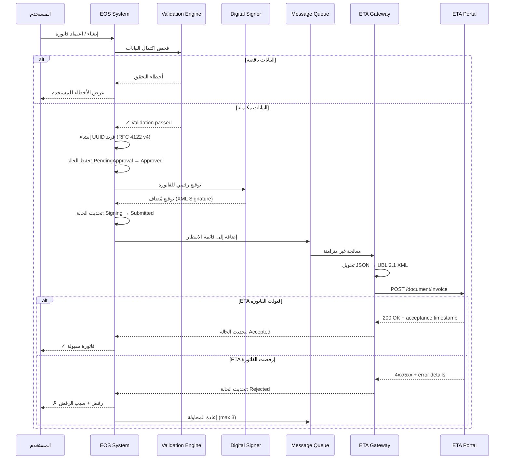
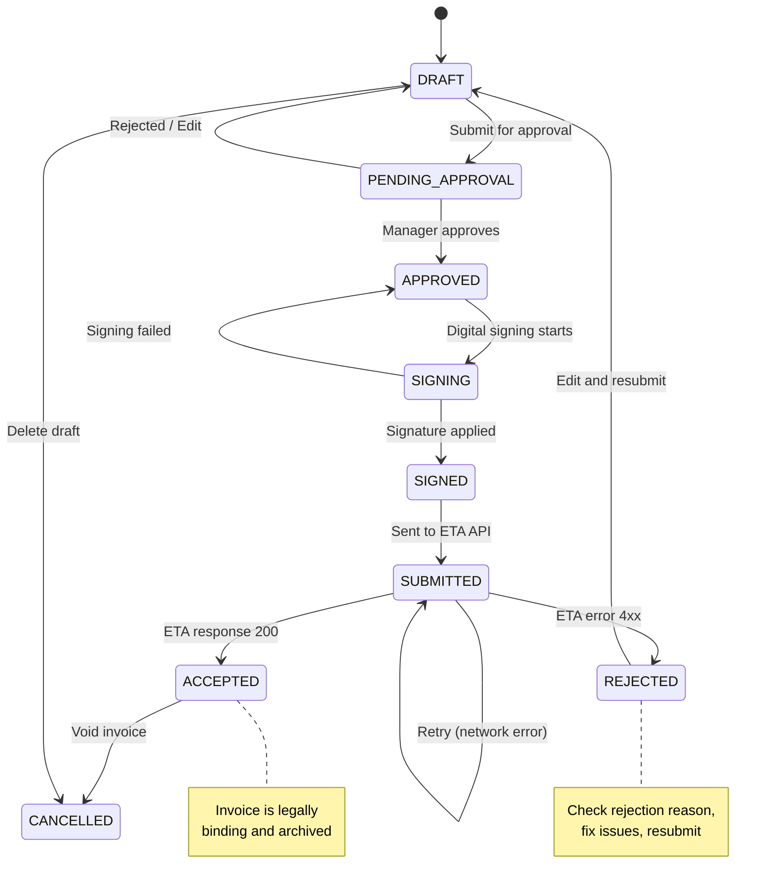
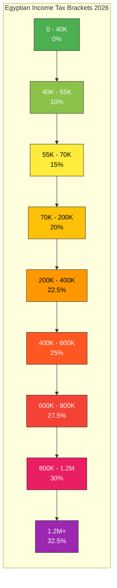
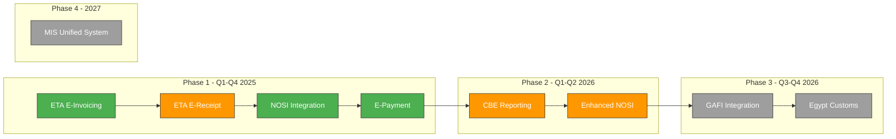
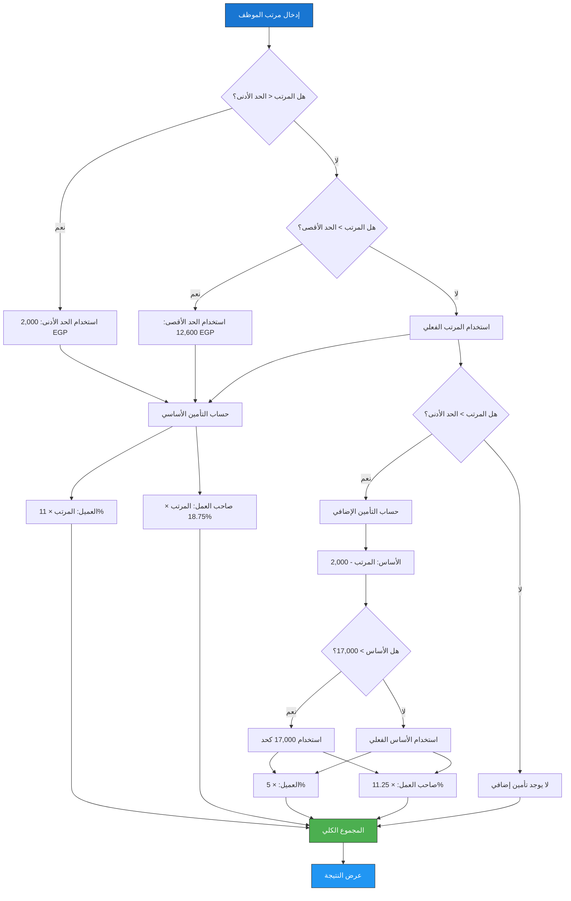

# حزمة توطين مصر - Egypt Localization Pack

## EOS Enterprise Operating System - Egyptian Market Localization

**Version:** 3.2.0  
**Last Updated:** 2026-08-18  
**Classification:** Internal / Confidential  
**Applicable Market:** Arab Republic of Egypt  
**Target Deployment:** Multi-Tenant SaaS (AWS me-south-1 / Azure Egypt North)

---

## جدول المحتويات

1. [الفوترة الإلكترونية - Egyptian Tax Authority (ETA)](#1-الفوترة-الإلكترونية---eta)
2. [التأمينات الاجتماعية - Social Insurance (NOSI)](#2-التأمينات-الاجتماعية---nosy)
3. [ضريبة الدخل على المرتبات - Payroll Tax](#3-ضريبة-الدخل-على-المرتبات)
4. [القيمة المضافة المصرية - VAT 14%](#4-القيمة-المضافة-المصرية)
5. [الإعدادات الافتراضية لمصر - Default Configuration](#5-الإعدادات-الافتراضية)
6. [تكاملات حكومية مستقبلية - Future Government Integrations](#6-تكاملات-حكومية-مستقبلية)
7. [قائمة الامتثال - Compliance Checklist](#7-قائمة-الامتثال)

---

## 1. الفوترة الإلكترونية - ETA (Egyptian Tax Authority)

### 1.1 المتطلبات التنظيمية - Regulatory Requirements

#### الأساس القانوني

| القانون / القرار | المحتوى | الحالة |
|---|---|---|
| القانون 67/2016 | قانون ضريبة القيمة المضافة - يُلزم جميع businesses المسجلة بإصدار فواتير إلكترونية | مُفعّل |
| القرار الوزاري 177/2020 | التوسع الإلزامي للفوترة الإلكترونية لجميع taxpayers المسجلين | مُفعّل |
| القرار الوزاري 188/2023 | إلزامية التوقيع الرقمي لجميع الفواتير الإلكترونية | مُفعّل |
| القرار الوزاري 30/2025 | تحديثات على التوقيع الرقمي و B2C integration | ساري |
| الجودة الفنية ETF/TR-01 | متطلبات تقنية للفواتير الإلكترونية و تسلسل UUID | مُفعّل |

#### المعايير التقنية

| المعيار | الوصف | الاستخدام |
|---|---|---|
| **UBL 2.1** | Universal Business Language version 2.1 | XML-based invoice format (primary) |
| **CII** | Cross Industry Invoice (UN/CEFACT) | Alternative XML format |
| **JSON** | Custom JSON mapping to UBL 2.1 | API submission format |
| **GS1 EPCIS** | Supply chain data | B2B supply chain tracking |

#### آليات التوقيع الرقمي

| الطريقة | الوصف | حالة التفعيل |
|---|---|---|
| **USB Token** | شهادة رقمية على USB (e.g., Sectigo, Cairo IT) | مُفعّل |
| **HSM** | Hardware Security Module للـ high-volume issuers | مُفعّل |
| **Cloud Signing** | توقيع سحابي عبر ETA-approved providers | قيد المراجعة |

#### ETA API Endpoints

```
Base URL: https://api.eta.gov.eg/etd/
Production: https://api.eta.gov.eg/etd/
Staging: https://api-eta.gov.eg/etd/

Endpoints:
  POST /v1.0/auth/token          → JWT token generation
  POST /v1.0/document/invoice    → Submit invoice
  GET  /v1.0/document/invoice/{uuid} → Query invoice status
  POST /v1.0/document/invoice/cancel → Cancel invoice
  GET  /v1.0/factory/light-docs  → B2B document list
```

---

### 1.2 معمارية التكامل - Integration Architecture



#### مكونات المعمارية

| المكون | الوصف | التقنية |
|---|---|---|
| **Validation Engine** | فحص شامل للبيانات قبل الإرسال | Python + Pydantic |
| **UUID Generator** | توليد معرّف فريد لكل فاتورة | UUID v4 + Namespace |
| **Digital Signer** | توقيع رقمي بالشهادة | pkcs11 + OpenSSL |
| **Message Queue** | قوائم انتظار للإرسال غير المتزامن | Redis / RabbitMQ |
| **ETA Gateway** | بوابة التكامل مع هيئة الضرائب | REST API + retry logic |
| **Status Tracker** | تتبع حالة كل فاتورة | PostgreSQL + Events |

---

### 1.3 هيكل الفاتورة الإلكترونية - UBL 2.1 Invoice Structure

#### مثال شامل - فاتورة بيع (Sales Invoice)

```json
{
  "invoiceNumber": "INV-2026-000123",
  "invoiceTypeCode": "I",
  "documentType": "I",
  "issueDate": "2026-08-18",
  "issueTime": "14:30:00Z",
  "dueDate": "2026-09-17",
  "uuid": "a1b2c3d4-e5f6-7890-abcd-ef1234567890",
  "currency": "EGP",
  "exchangeRate": {
    "sourceCurrency": "USD",
    "targetCurrency": "EGP",
    "rate": 50.25,
    "date": "2026-08-18"
  },

  "issuer": {
    "type": "B",
    "tax_id": "123456789",
    "name": "شركة تكنولوجيا المعلومات المتقدمة",
    "name_en": "Advanced IT Solutions Co.",
    "address": {
      "country": "EG",
      "governorate": "Cairo",
      "regionCity": "Nasr City",
      "street": "Ahmed Orabi St.",
      "buildingNumber": "42",
      "postalCode": "11341",
      "additionalInformation": "Building 42, Floor 3"
    },
    "commercialRegistration": "CR-12345",
    "taxCardNumber": "123456789",
    "electronicMail": "billing@ait-solutions.com",
    "telephone": "+20222334455",
    "companyLegalName": "شركة تكنولوجيا المعلومات المتقدمة ش.م.م"
  },

  "receiver": {
    "type": "B",
    "tax_id": "987654321",
    "name": "مجموعة البناء الحديث",
    "name_en": "Modern Construction Group",
    "address": {
      "country": "EG",
      "governorate": "Giza",
      "regionCity": "Dokki",
      "street": "Tharwat St.",
      "buildingNumber": "15",
      "postalCode": "12311"
    },
    "commercialRegistration": "CR-67890",
    "taxCardNumber": "987654321",
    "electronicMail": "finance@mcg.com.eg",
    "telephone": "+20233445566"
  },

  "invoiceLines": [
    {
      "lineId": 1,
      "itemCode": "IT-SVC-001",
      "description": "تطوير نظام إدارة محتوى",
      "description_en": "CMS Development Services",
      "itemType": "EGS",
      "itemTypeCode": "EGS-11000000",
      "unitType": "EA",
      "quantity": 120,
      "unitPrice": 5000.00,
      "salesTotal": 600000.00,
      "discountTotal": 0.00,
      "totalDiscount": 0.00,
      "totalTaxableAmount": 600000.00,
      "taxableItems": [
        {
          "taxType": "T1",
          "taxRate": 14.0,
          "taxAmount": 84000.00,
          "taxableItemAmount": 600000.00
        }
      ],
      "lineTaxTotal": 84000.00,
      "lineNetTotal": 600000.00,
      "lineGrossTotal": 684000.00
    },
    {
      "lineId": 2,
      "itemCode": "IT-SVC-002",
      "description": "استشارات تقنية",
      "description_en": "Technical Consulting",
      "itemType": "EGS",
      "itemTypeCode": "EGS-82000000",
      "unitType": "HUR",
      "quantity": 40,
      "unitPrice": 1500.00,
      "salesTotal": 60000.00,
      "discountTotal": 0.00,
      "totalDiscount": 0.00,
      "totalTaxableAmount": 60000.00,
      "taxableItems": [
        {
          "taxType": "T1",
          "taxRate": 14.0,
          "taxAmount": 8400.00,
          "taxableItemAmount": 60000.00
        }
      ],
      "lineTaxTotal": 8400.00,
      "lineNetTotal": 60000.00,
      "lineGrossTotal": 68400.00
    }
  ],

  "taxTotals": [
    {
      "taxType": "T1",
      "taxTypeCode": "VAT",
      "taxRate": 14.0,
      "taxAmount": 92400.00,
      "taxableAmount": 660000.00
    }
  ],

  "invoiceTotal": {
    "totalNetAmount": 660000.00,
    "totalTaxAmount": 92400.00,
    "totalGrossAmount": 752400.00,
    "totalDiscountAmount": 0.00,
    "roundingAmount": 0.00,
    "totalPayableAmount": 752400.00,
    "currencyCode": "EGP"
  },

  "payment": {
    "paymentMethod": "BANK_TRANSFER",
    "paymentTerms": "Net 30",
    "bankName": "CIB - Commercial International Bank",
    "bankAccountNumber": "1234567890123456",
    "iban": "EG1234567890123456789012345",
    "swiftCode": "CIBEEGCX"
  },

  "signatures": [
    {
      "signatureType": "I",
      "signatureValue": "MIIGazCCBBOgAwIBAgIUK...",
      "certificateIssuer": "Sectigo Limited",
      "serialNumber": "01:23:45:67:89:AB:CD:EF",
      "signatureDate": "2026-08-18T14:30:00Z",
      "status": "VALID"
    }
  ],

  "metadata": {
    "submissionId": "SUB-2026-0818000123",
    "submissionTime": "2026-08-18T14:31:00Z",
    "etaReference": "ETA-INV-20260818-001234",
    "internalReference": "SALES-ORD-2026-0456",
    "tenantId": "tenant-eg-cairo-001"
  }
}
```

#### شرح أنواع الفواتير

| الرمز | النوع | الوصف |
|---|---|---|
| **I** | Invoice | فاتورة بيع عادية |
| **C** | Credit Note | إشعار دائن |
| **D** | Debit Note | إشعار مدين |

#### شرح أنواع الضرائب

| الرمز | النوع | النسبة | الوصف |
|---|---|---|---|
| **T1** | VAT | 14% | ضريبة القيمة المضافة العامة |
| **T2** | Table Tax | 5%-15% | ضريبة جدولية (سلع خاصة) |
| **T3** | WHT | 0.5%-20% | ضريبة خصم |
| **T4** | Stamp Tax | 0.5% | ضريبة الدمغة |
| **T5** | Development | 5% | ضريبة التنمية (ملغاة) |
| **T6** | Other | varies | ضرائب أخرى |
| **T7** | Exempt | 0% | معفاة من الضريبة |
| **T8** | Out of Scope | N/A | خارج نطاق الضريبة |

---

### 1.4 ETAGateway Integration Code

```python
"""
ETA Gateway Integration Module
EOS Enterprise Operating System - Egypt Localization
"""

import uuid
import hashlib
import logging
import xml.etree.ElementTree as ET
from datetime import datetime, date
from typing import Optional, Dict, List, Any
from dataclasses import dataclass, field
from enum import Enum
from pathlib import Path

import httpx
from cryptography.hazmat.primitives import hashes, serialization
from cryptography.hazmat.primitives.asymmetric import padding
from cryptography.hazmat.backends import default_backend

logger = logging.getLogger("eos.egypt.eta")


class InvoiceType(Enum):
    INVOICE = "I"
    CREDIT_NOTE = "C"
    DEBIT_NOTE = "D"


class InvoiceStatus(Enum):
    DRAFT = "DRAFT"
    PENDING_APPROVAL = "PENDING_APPROVAL"
    APPROVED = "APPROVED"
    SIGNING = "SIGNING"
    SIGNED = "SIGNED"
    SUBMITTED = "SUBMITTED"
    ACCEPTED = "ACCEPTED"
    REJECTED = "REJECTED"
    CANCELLED = "CANCELLED"


class TaxType(Enum):
    VAT_14 = "T1"
    TABLE_TAX = "T2"
    WHT = "T3"
    STAMP = "T4"
    DEVELOPMENT = "T5"
    OTHER = "T6"
    EXEMPT = "T7"
    OUT_OF_SCOPE = "T8"


@dataclass
class TaxableItem:
    tax_type: TaxType
    tax_rate: float
    tax_amount: float
    taxable_amount: float


@dataclass
class InvoiceLine:
    line_id: int
    item_code: str
    description: str
    item_type: str = "EGS"
    item_type_code: str = "EGS-11000000"
    unit_type: str = "EA"
    quantity: float = 0.0
    unit_price: float = 0.0
    sales_total: float = 0.0
    discount_total: float = 0.0
    taxable_items: List[TaxableItem] = field(default_factory=list)
    tax_total: float = 0.0
    net_total: float = 0.0
    gross_total: float = 0.0


@dataclass
class Address:
    country: str = "EG"
    governorate: str = ""
    region_city: str = ""
    street: str = ""
    building_number: str = ""
    postal_code: str = ""
    additional_information: str = ""


@dataclass
class Party:
    party_type: str  # "B" for Business, "P" for Person
    tax_id: str
    name: str
    address: Address
    commercial_registration: str = ""
    tax_card_number: str = ""
    email: str = ""
    telephone: str = ""
    legal_name: str = ""


@dataclass
class Signature:
    signature_type: str = "I"
    signature_value: str = ""
    certificate_issuer: str = ""
    serial_number: str = ""
    signature_date: str = ""
    status: str = "VALID"


@dataclass
class ETALineValidation:
    """Result of validating a single invoice line."""
    line_id: int
    is_valid: bool
    errors: List[str] = field(default_factory=list)
    warnings: List[str] = field(default_factory=list)


@dataclass
class ETAResponse:
    """ETA API response wrapper."""
    success: bool
    status_code: int
    eta_reference: str = ""
    submission_id: str = ""
    timestamp: str = ""
    error_message: str = ""
    error_code: str = ""
    raw_response: Dict[str, Any] = field(default_factory=dict)


class ETAGateway:
    """
    Gateway for Egyptian Tax Authority (ETA) e-invoicing integration.

    Handles authentication, invoice signing, submission, and status tracking
    for compliance with Egyptian Law 67/2016 and ETA technical requirements.
    """

    API_BASE = "https://api.eta.gov.eg/etd"
    TOKEN_PATH = "/v1.0/auth/token"
    SUBMIT_PATH = "/v1.0/document/invoice"
    STATUS_PATH = "/v1.0/document/invoice/{uuid}"
    CANCEL_PATH = "/v1.0/document/invoice/cancel"
    B2B_DOCS_PATH = "/v1.0/factory/light-docs"

    def __init__(
        self,
        client_id: str,
        client_secret: str,
        token_path: str = "",
        cert_path: str = "",
        private_key_path: str = "",
        sandbox: bool = True,
        max_retries: int = 3,
        timeout: int = 30,
    ):
        self.client_id = client_id
        self.client_secret = client_secret
        self.token_path = Path(token_path) if token_path else None
        self.cert_path = Path(cert_path) if cert_path else None
        self.private_key_path = Path(private_key_path) if private_key_path else None
        self.sandbox = sandbox
        self.max_retries = max_retries
        self.timeout = timeout

        self._access_token: Optional[str] = None
        self._token_expiry: Optional[datetime] = None
        self._http_client: Optional[httpx.Client] = None

    @property
    def base_url(self) -> str:
        if self.sandbox:
            return "https://api-eta.gov.eg/etd"
        return self.API_BASE

    def _get_client(self) -> httpx.Client:
        if self._http_client is None or self._http_client.is_closed:
            self._http_client = httpx.Client(
                timeout=self.timeout,
                follow_redirects=True,
                verify=not self.sandbox,
            )
        return self._http_client

    # ─── Authentication ───────────────────────────────────────────

    def authenticate(self) -> str:
        """
        Obtain access token from ETA using client credentials.

        Returns:
            JWT access token string

        Raises:
            ETAAuthError: If authentication fails
        """
        client = self._get_client()
        auth_url = f"{self.base_url}{self.TOKEN_PATH}"

        payload = {
            "client_id": self.client_id,
            "client_secret": self.client_secret,
            "grant_type": "client_credentials",
        }

        headers = {
            "Content-Type": "application/x-www-form-urlencoded",
            "Accept": "application/json",
        }

        try:
            response = client.post(auth_url, data=payload, headers=headers)
            response.raise_for_status()
        except httpx.HTTPStatusError as e:
            logger.error(f"ETA authentication failed: {e.response.status_code}")
            raise ETAAuthError(
                f"Authentication failed with status {e.response.status_code}: "
                f"{e.response.text}"
            ) from e
        except httpx.RequestError as e:
            logger.error(f"ETA authentication network error: {e}")
            raise ETAAuthError(f"Network error during authentication: {e}") from e

        data = response.json()
        self._access_token = data.get("access_token", "")
        expires_in = data.get("expires_in", 3600)
        self._token_expiry = datetime.utcnow().timestamp() + expires_in

        logger.info("ETA authentication successful")
        return self._access_token

    def _ensure_authenticated(self) -> str:
        """Ensure we have a valid token, refreshing if necessary."""
        now = datetime.utcnow().timestamp()
        if (
            self._access_token is None
            or self._token_expiry is None
            or now >= self._token_expiry - 60
        ):
            return self.authenticate()
        return self._access_token

    def _get_auth_headers(self) -> Dict[str, str]:
        token = self._ensure_authenticated()
        return {
            "Authorization": f"Bearer {token}",
            "Content-Type": "application/json",
            "Accept": "application/json",
        }

    # ─── Invoice Signing ──────────────────────────────────────────

    def _sign_invoice(self, invoice_xml: str) -> Signature:
        """
        Sign invoice XML using the configured certificate.

        Args:
            invoice_xml: The UBL 2.1 XML content to sign

        Returns:
            Signature object with the digital signature data

        Raises:
            ETASigningError: If signing fails
        """
        if self.private_key_path is None:
            raise ETASigningError("No private key path configured for signing")

        try:
            private_key_data = self.private_key_path.read_bytes()
            private_key = serialization.load_pem_private_key(
                private_key_data, password=None, backend=default_backend()
            )

            # Compute canonical hash of the invoice XML
            invoice_bytes = invoice_xml.encode("utf-8")
            digest = hashlib.sha256(invoice_bytes).digest()

            # Sign the digest
            signature_bytes = private_key.sign(
                invoice_bytes,
                padding.PKCS1v15(),
                hashes.SHA256(),
            )

            # Read certificate info
            cert_info = self._read_certificate_info()

            return Signature(
                signature_type="I",
                signature_value=signature_bytes.hex(),
                certificate_issuer=cert_info.get("issuer", "Unknown"),
                serial_number=cert_info.get("serial", ""),
                signature_date=datetime.utcnow().isoformat() + "Z",
                status="VALID",
            )

        except Exception as e:
            logger.error(f"Invoice signing failed: {e}")
            raise ETASigningError(f"Signing failed: {e}") from e

    def _read_certificate_info(self) -> Dict[str, str]:
        """Read certificate information from the configured certificate path."""
        if self.cert_path is None:
            return {"issuer": "Unknown", "serial": ""}
        try:
            from cryptography import x509
            cert_data = self.cert_path.read_bytes()
            cert = x509.load_pem_x509_certificate(cert_data, default_backend())
            return {
                "issuer": cert.issuer.rfc4514_string(),
                "serial": format(cert.serial_number, "02x"),
            }
        except Exception:
            return {"issuer": "Unknown", "serial": ""}

    # ─── Invoice Submission ───────────────────────────────────────

    def submit_invoice(self, invoice_data: Dict[str, Any]) -> ETAResponse:
        """
        Sign and submit an invoice to ETA.

        Args:
            invoice_data: Complete invoice dictionary

        Returns:
            ETAResponse with submission status
        """
        # Generate UUID if not present
        if "uuid" not in invoice_data:
            invoice_data["uuid"] = str(uuid.uuid4())

        # Convert to UBL XML
        invoice_xml = self._to_ubl_xml(invoice_data)

        # Sign the invoice
        signature = self._sign_invoice(invoice_xml)
        invoice_data["signatures"] = [signature.__dict__]

        # Submit to ETA
        submit_url = f"{self.base_url}{self.SUBMIT_PATH}"
        headers = self._get_auth_headers()

        payload = {
            "document": invoice_xml,
            "uuid": invoice_data["uuid"],
            "signatures": [signature.__dict__],
        }

        for attempt in range(1, self.max_retries + 1):
            try:
                client = self._get_client()
                response = client.post(submit_url, json=payload, headers=headers)

                if response.status_code == 200:
                    data = response.json()
                    logger.info(
                        f"Invoice {invoice_data['uuid']} submitted successfully"
                    )
                    return ETAResponse(
                        success=True,
                        status_code=200,
                        eta_reference=data.get("etaReference", ""),
                        submission_id=data.get("submissionId", ""),
                        timestamp=data.get("timestamp", ""),
                        raw_response=data,
                    )
                elif response.status_code == 409:
                    # Duplicate submission
                    logger.warning(
                        f"Invoice {invoice_data['uuid']} already submitted"
                    )
                    return ETAResponse(
                        success=True,
                        status_code=409,
                        error_message="Invoice already submitted",
                        raw_response=response.json(),
                    )
                else:
                    error_data = response.json() if response.text else {}
                    logger.warning(
                        f"Invoice submission attempt {attempt} failed: "
                        f"{response.status_code}"
                    )
                    if attempt == self.max_retries:
                        return ETAResponse(
                            success=False,
                            status_code=response.status_code,
                            error_message=error_data.get("error", ""),
                            error_code=error_data.get("errorCode", ""),
                            raw_response=error_data,
                        )

            except httpx.RequestError as e:
                logger.warning(f"Network error on attempt {attempt}: {e}")
                if attempt == self.max_retries:
                    raise ETASubmissionError(f"Network error: {e}") from e

        return ETAResponse(
            success=False,
            status_code=0,
            error_message="Max retries exceeded",
        )

    # ─── Status Check ─────────────────────────────────────────────

    def check_invoice_status(self, invoice_uuid: str) -> ETAResponse:
        """
        Query the status of a submitted invoice.

        Args:
            invoice_uuid: The UUID of the submitted invoice

        Returns:
            ETAResponse with current status
        """
        status_url = (
            f"{self.base_url}{self.STATUS_PATH.format(uuid=invoice_uuid)}"
        )
        headers = self._get_auth_headers()

        try:
            client = self._get_client()
            response = client.get(status_url, headers=headers)
            response.raise_for_status()

            data = response.json()
            logger.info(f"Invoice {invoice_uuid} status: {data.get('status')}")

            return ETAResponse(
                success=True,
                status_code=response.status_code,
                eta_reference=data.get("etaReference", ""),
                timestamp=data.get("timestamp", ""),
                raw_response=data,
            )

        except httpx.HTTPStatusError as e:
            return ETAResponse(
                success=False,
                status_code=e.response.status_code,
                error_message=f"Status check failed: {e.response.text}",
            )
        except httpx.RequestError as e:
            raise ETASubmissionError(
                f"Network error checking status: {e}"
            ) from e

    # ─── UBL XML Conversion ───────────────────────────────────────

    def _to_ubl_xml(self, invoice: Dict[str, Any]) -> str:
        """
        Convert invoice dictionary to UBL 2.1 XML format.

        This is a simplified converter; production implementation should use
        a full UBL 2.1 schema validator.
        """
        nsmap = {
            "": "urn:oasis:names:specification:ubl:schema:xsd:Invoice-2",
            "cac": "urn:oasis:names:specification:ubl:schema:xsd:CommonAggregateComponents-2",
            "cbc": "urn:oasis:names:specification:ubl:schema:xsd:CommonBasicComponents-2",
            "ext": "urn:oasis:names:specification:ubl:schema:xsd:CommonExtensionComponents-2",
            "qdt": "urn:oasis:names:specification:ubl:schema:xsd:QualifiedDatatypes-2",
        }

        root = ET.Element("Invoice", nsmap)
        root.set("xmlns", nsmap[""])

        # Basic fields
        self._add_elem(root, "cbc:ID", invoice.get("invoiceNumber", ""))
        self._add_elem(
            root, "cbc:InvoiceTypeCode", invoice.get("invoiceTypeCode", "I")
        )
        self._add_elem(root, "cbc:IssueDate", invoice.get("issueDate", ""))
        self._add_elem(root, "cbc:IssueTime", invoice.get("issueTime", ""))
        self._add_elem(root, "cbc:DueDate", invoice.get("dueDate", ""))
        self._add_elem(root, "cbc:UUID", invoice.get("uuid", ""))

        # Currency
        self._add_elem(
            root, "cbc:DocumentCurrencyCode", invoice.get("currency", "EGP")
        )

        # Issuer
        issuer = invoice.get("issuer", {})
        supplier = ET.SubElement(root, "cac:AccountingSupplierParty")
        party = ET.SubElement(supplier, "cac:Party")
        self._add_elem(party, "cbc:EndpointID", issuer.get("tax_id", ""))
        party_id = ET.SubElement(party, "cac:PartyIdentification")
        self._add_elem(party_id, "cbc:ID", issuer.get("tax_id", ""))
        party_name = ET.SubElement(party, "cac:PartyName")
        self._add_elem(party_name, "cbc:Name", issuer.get("name", ""))

        # Issuer address
        address_data = issuer.get("address", {})
        postal = ET.SubElement(party, "cac:PostalAddress")
        self._add_elem(postal, "cbc:StreetName", address_data.get("street", ""))
        self._add_elem(
            postal, "cbc:BuildingNumber", address_data.get("buildingNumber", "")
        )
        self._add_elem(
            postal, "cbc:CityName", address_data.get("regionCity", "")
        )
        self._add_elem(
            postal, "cbc:PostalZone", address_data.get("postalCode", "")
        )
        country = ET.SubElement(postal, "cac:Country")
        self._add_elem(country, "cbc:IdentificationCode", address_data.get("country", "EG"))

        # Receiver
        receiver = invoice.get("receiver", {})
        customer = ET.SubElement(root, "cac:AccountingCustomerParty")
        party2 = ET.SubElement(customer, "cac:Party")
        self._add_elem(party2, "cbc:EndpointID", receiver.get("tax_id", ""))
        party_id2 = ET.SubElement(party2, "cac:PartyIdentification")
        self._add_elem(party_id2, "cbc:ID", receiver.get("tax_id", ""))
        party_name2 = ET.SubElement(party2, "cac:PartyName")
        self._add_elem(party_name2, "cbc:Name", receiver.get("name", ""))

        # Invoice lines
        for line in invoice.get("invoiceLines", []):
            inv_line = ET.SubElement(root, "cac:InvoiceLine")
            self._add_elem(inv_line, "cbc:ID", str(line.get("lineId", "")))
            self._add_elem(inv_line, "cbc:InvoicedQuantity", str(line.get("quantity", "")))
            self._add_elem(inv_line, "cbc:LineExtensionAmount", str(line.get("salesTotal", "")))

            item = ET.SubElement(inv_line, "cac:Item")
            self._add_elem(item, "cbc:Name", line.get("description", ""))

            price = ET.SubElement(inv_line, "cac:Price")
            self._add_elem(price, "cbc:PriceAmount", str(line.get("unitPrice", "")))

        # Tax totals
        tax_totals = invoice.get("taxTotals", [])
        for tt in tax_totals:
            tax_sub = ET.SubElement(root, "cac:TaxTotal")
            tax_amount = ET.SubElement(tax_sub, "cbc:TaxAmount")
            tax_amount.set("currencyID", invoice.get("currency", "EGP"))
            tax_amount.text = str(tt.get("taxAmount", ""))
            tax_scheme = ET.SubElement(tax_sub, "cac:TaxScheme")
            self._add_elem(tax_scheme, "cbc:ID", tt.get("taxTypeCode", "VAT"))

        # Legal monetary total
        totals = invoice.get("invoiceTotal", {})
        monetary = ET.SubElement(root, "cac:LegalMonetaryTotal")
        self._add_elem(monetary, "cbc:LineExtensionAmount", str(totals.get("totalNetAmount", "")))
        self._add_elem(monetary, "cbc:TaxExclusiveAmount", str(totals.get("totalNetAmount", "")))
        self._add_elem(monetary, "cbc:TaxInclusiveAmount", str(totals.get("totalGrossAmount", "")))
        self._add_elem(monetary, "cbc:PayableAmount", str(totals.get("totalPayableAmount", "")))

        ET.indent(root, space="  ")
        return ET.tostring(root, encoding="unicode", xml_declaration=True)

    @staticmethod
    def _add_elem(parent: ET.Element, tag: str, text: str) -> ET.Element:
        """Helper to add an XML element with text."""
        elem = ET.SubElement(parent, tag)
        elem.text = text
        return elem

    # ─── Cleanup ──────────────────────────────────────────────────

    def close(self):
        """Close the HTTP client and clean up resources."""
        if self._http_client and not self._http_client.is_closed:
            self._http_client.close()

    def __enter__(self):
        return self

    def __exit__(self, exc_type, exc_val, exc_tb):
        self.close()


# ─── Exceptions ───────────────────────────────────────────────────

class ETAAuthError(Exception):
    """Raised when ETA authentication fails."""
    pass


class ETASigningError(Exception):
    """Raised when invoice signing fails."""
    pass


class ETASubmissionError(Exception):
    """Raised when invoice submission fails."""
    pass


class ETAValidationError(Exception):
    """Raised when invoice validation fails before submission."""
    pass


# ─── Validator ────────────────────────────────────────────────────

class ETAInvoiceValidator:
    """
    Pre-submission validator for Egyptian e-invoices.
    Validates all fields per ETA requirements before sending.
    """

    VALID_TAX_TYPES = {"T1", "T2", "T3", "T4", "T5", "T6", "T7", "T8"}
    VALID_CURRENCIES = {"EGP", "USD", "EUR", "GBP", "SAR", "AED"}
    VAT_RATE = 14.0
    TAX_ID_LENGTH = 9

    def validate(self, invoice: Dict[str, Any]) -> List[str]:
        """
        Validate an invoice dictionary against ETA requirements.

        Returns:
            List of validation error messages (empty if valid)
        """
        errors: List[str] = []

        errors.extend(self._validate_basic_fields(invoice))
        errors.extend(self._validate_issuer(invoice.get("issuer", {})))
        errors.extend(self._validate_receiver(invoice.get("receiver", {})))
        errors.extend(self._validate_lines(invoice.get("invoiceLines", [])))
        errors.extend(self._validate_totals(invoice))
        errors.extend(self._validate_dates(invoice))

        return errors

    def _validate_basic_fields(self, invoice: Dict[str, Any]) -> List[str]:
        errors = []
        doc_type = invoice.get("documentType", "")
        if doc_type not in ("I", "C", "D"):
            errors.append(f"Invalid documentType: '{doc_type}'. Must be I, C, or D.")
        if not invoice.get("invoiceNumber"):
            errors.append("invoiceNumber is required.")
        if not invoice.get("issueDate"):
            errors.append("issueDate is required.")
        currency = invoice.get("currency", "")
        if currency not in self.VALID_CURRENCIES:
            errors.append(f"Unsupported currency: '{currency}'.")
        return errors

    def _validate_issuer(self, issuer: Dict[str, Any]) -> List[str]:
        errors = []
        if not issuer.get("tax_id"):
            errors.append("Issuer tax_id is required.")
        elif len(issuer["tax_id"]) != self.TAX_ID_LENGTH:
            errors.append(
                f"Issuer tax_id must be {self.TAX_ID_LENGTH} digits, "
                f"got {len(issuer['tax_id'])}."
            )
        elif not issuer["tax_id"].isdigit():
            errors.append("Issuer tax_id must contain only digits.")
        if not issuer.get("name"):
            errors.append("Issuer name is required.")
        return errors

    def _validate_receiver(self, receiver: Dict[str, Any]) -> List[str]:
        errors = []
        if not receiver.get("tax_id"):
            errors.append("Receiver tax_id is required.")
        elif len(receiver["tax_id"]) != self.TAX_ID_LENGTH:
            errors.append(
                f"Receiver tax_id must be {self.TAX_ID_LENGTH} digits, "
                f"got {len(receiver['tax_id'])}."
            )
        return errors

    def _validate_lines(self, lines: List[Dict[str, Any]]) -> List[str]:
        errors = []
        if not lines:
            errors.append("At least one invoice line is required.")
            return errors

        for i, line in enumerate(lines, 1):
            prefix = f"Line {i}"
            if not line.get("description"):
                errors.append(f"{prefix}: description is required.")
            if (line.get("quantity", 0) or 0) <= 0:
                errors.append(f"{prefix}: quantity must be positive.")
            if (line.get("unitPrice", 0) or 0) < 0:
                errors.append(f"{prefix}: unitPrice cannot be negative.")

            for j, ti in enumerate(line.get("taxableItems", []), 1):
                if ti.get("taxType") not in self.VALID_TAX_TYPES:
                    errors.append(
                        f"{prefix} TaxableItem {j}: invalid taxType "
                        f"'{ti.get('taxType')}'."
                    )
                if (ti.get("taxRate", 0) or 0) < 0:
                    errors.append(f"{prefix} TaxableItem {j}: taxRate cannot be negative.")
        return errors

    def _validate_totals(self, invoice: Dict[str, Any]) -> List[str]:
        errors = []
        totals = invoice.get("invoiceTotal", {})
        lines = invoice.get("invoiceLines", [])

        calculated_net = sum(
            (line.get("salesTotal", 0) or 0) - (line.get("discountTotal", 0) or 0)
            for line in lines
        )
        stated_net = totals.get("totalNetAmount", 0)

        if abs(calculated_net - stated_net) > 0.01:
            errors.append(
                f"totalNetAmount mismatch: calculated {calculated_net}, "
                f"stated {stated_net}."
            )

        # Verify VAT calculation
        calculated_tax = round(calculated_net * self.VAT_RATE / 100, 2)
        stated_tax = totals.get("totalTaxAmount", 0)
        if abs(calculated_tax - stated_tax) > 0.01:
            errors.append(
                f"VAT calculation mismatch: expected {calculated_tax}, "
                f"got {stated_tax}."
            )

        return errors

    def _validate_dates(self, invoice: Dict[str, Any]) -> List[str]:
        errors = []
        issue_date_str = invoice.get("issueDate", "")
        if issue_date_str:
            try:
                issue_date = datetime.strptime(issue_date_str, "%Y-%m-%d").date()
                if issue_date > date.today():
                    errors.append("issueDate cannot be in the future.")
            except ValueError:
                errors.append(f"Invalid issueDate format: '{issue_date_str}'. Use YYYY-MM-DD.")

        due_date_str = invoice.get("dueDate", "")
        if due_date_str:
            try:
                datetime.strptime(due_date_str, "%Y-%m-%d")
            except ValueError:
                errors.append(f"Invalid dueDate format: '{due_date_str}'. Use YYYY-MM-DD.")
        return errors
```

---

### 1.5 قاعدة البيانات - Database Schema

#### جدول الفواتير الإلكترونية

```sql
-- ─── ETA Invoices Table ──────────────────────────────────────────
CREATE TABLE eta_invoices (
    id                    BIGSERIAL PRIMARY KEY,
    tenant_id             UUID NOT NULL REFERENCES tenants(id),

    -- Invoice identification
    invoice_number        VARCHAR(50) NOT NULL,
    uuid                  UUID NOT NULL UNIQUE DEFAULT gen_random_uuid(),
    invoice_type          VARCHAR(1) NOT NULL CHECK (invoice_type IN ('I', 'C', 'D')),
    document_type         VARCHAR(10) NOT NULL DEFAULT 'invoice',

    -- Dates
    issue_date            DATE NOT NULL DEFAULT CURRENT_DATE,
    issue_time            TIME NOT NULL DEFAULT CURRENT_TIME,
    due_date              DATE,
    cancellation_date     DATE,
    submission_date       TIMESTAMPTZ,
    acceptance_date       TIMESTAMPTZ,

    -- Parties
    issuer_tax_id         VARCHAR(9) NOT NULL,
    issuer_name           VARCHAR(255) NOT NULL,
    issuer_address        JSONB NOT NULL DEFAULT '{}',
    receiver_tax_id       VARCHAR(9) NOT NULL,
    receiver_name         VARCHAR(255) NOT NULL,
    receiver_address      JSONB NOT NULL DEFAULT '{}',

    -- Financials
    currency              VARCHAR(3) NOT NULL DEFAULT 'EGP',
    exchange_rate         DECIMAL(12, 6) DEFAULT 1.0,
    total_net_amount      DECIMAL(15, 2) NOT NULL DEFAULT 0.00,
    total_tax_amount      DECIMAL(15, 2) NOT NULL DEFAULT 0.00,
    total_gross_amount    DECIMAL(15, 2) NOT NULL DEFAULT 0.00,
    total_discount_amount DECIMAL(15, 2) NOT NULL DEFAULT 0.00,

    -- Lines stored as JSONB for flexibility
    invoice_lines         JSONB NOT NULL DEFAULT '[]',
    tax_totals            JSONB NOT NULL DEFAULT '[]',

    -- Status tracking
    status                VARCHAR(30) NOT NULL DEFAULT 'DRAFT'
        CHECK (status IN (
            'DRAFT', 'PENDING_APPROVAL', 'APPROVED',
            'SIGNING', 'SIGNED', 'SUBMITTED',
            'ACCEPTED', 'REJECTED', 'CANCELLED'
        )),
    status_message        TEXT,
    rejection_reason      TEXT,

    -- ETA references
    eta_reference         VARCHAR(100),
    submission_id         VARCHAR(100),

    -- Digital signature
    signature_data        JSONB,
    signature_status      VARCHAR(20),

    -- Audit
    created_by            UUID NOT NULL REFERENCES users(id),
    approved_by           UUID REFERENCES users(id),
    created_at            TIMESTAMPTZ NOT NULL DEFAULT NOW(),
    updated_at            TIMESTAMPTZ NOT NULL DEFAULT NOW(),

    -- Metadata
    metadata              JSONB DEFAULT '{}',
    internal_reference    VARCHAR(100),

    -- Indexes
    CONSTRAINT uk_eta_invoice_number_tenant
        UNIQUE (tenant_id, invoice_number),
    CONSTRAINT chk_eta_tax_id_format
        CHECK (issuer_tax_id ~ '^\d{9}$'),
    CONSTRAINT chk_receiver_tax_id_format
        CHECK (receiver_tax_id ~ '^\d{9}$')
);

CREATE INDEX idx_eta_invoices_tenant_status
    ON eta_invoices (tenant_id, status);
CREATE INDEX idx_eta_invoices_issue_date
    ON eta_invoices (tenant_id, issue_date);
CREATE INDEX idx_eta_invoices_uuid
    ON eta_invoices (uuid);
CREATE INDEX idx_eta_invoices_eta_reference
    ON eta_invoices (eta_reference) WHERE eta_reference IS NOT NULL;
CREATE INDEX idx_eta_invoices_submission_date
    ON eta_invoices (tenant_id, submission_date)
    WHERE submission_date IS NOT NULL;

-- Audit trigger for updated_at
CREATE OR REPLACE FUNCTION update_eta_invoices_updated_at()
RETURNS TRIGGER AS $$
BEGIN
    NEW.updated_at = NOW();
    RETURN NEW;
END;
$$ LANGUAGE plpgsql;

CREATE TRIGGER trg_eta_invoices_updated_at
    BEFORE UPDATE ON eta_invoices
    FOR EACH ROW
    EXECUTE FUNCTION update_eta_invoices_updated_at();

-- Status history table
CREATE TABLE eta_invoice_status_history (
    id              BIGSERIAL PRIMARY KEY,
    invoice_id      BIGINT NOT NULL REFERENCES eta_invoices(id) ON DELETE CASCADE,
    from_status     VARCHAR(30),
    to_status       VARCHAR(30) NOT NULL,
    changed_by      UUID REFERENCES users(id),
    changed_at      TIMESTAMPTZ NOT NULL DEFAULT NOW(),
    notes           TEXT,
    eta_response    JSONB
);

CREATE INDEX idx_eta_status_history_invoice
    ON eta_invoice_status_history (invoice_id, changed_at);
```

#### State Machine Diagram



---

### 1.6 قواعد التحقق قبل الإرسال - Pre-Submission Validation Rules

```python
# Validation rules summary for reference

VALIDATION_RULES = {
    "issuer_tax_id": {
        "required": True,
        "type": "string",
        "pattern": r"^\d{9}$",
        "description": "9-digit Egyptian tax registration number",
    },
    "receiver_tax_id": {
        "required": True,
        "type": "string",
        "pattern": r"^\d{9}$",
        "description": "9-digit Egyptian tax registration number",
    },
    "invoice_number": {
        "required": True,
        "type": "string",
        "max_length": 50,
        "pattern": r"^[A-Z0-9\-]+$",
        "description": "Unique invoice number per tenant",
    },
    "issue_date": {
        "required": True,
        "type": "date",
        "max_value": "today",
        "description": "Cannot be in the future",
    },
    "due_date": {
        "required": False,
        "type": "date",
        "min_value": "issue_date",
        "description": "Must be on or after issue date",
    },
    "currency": {
        "required": True,
        "type": "string",
        "allowed_values": ["EGP", "USD", "EUR", "GBP", "SAR", "AED"],
        "description": "Supported currencies per ETA",
    },
    "invoice_lines": {
        "required": True,
        "type": "array",
        "min_items": 1,
        "item_rules": {
            "description": {"required": True, "min_length": 1},
            "quantity": {"required": True, "type": "float", "min_value": 0.01},
            "unit_price": {"required": True, "type": "float", "min_value": 0},
            "taxable_items": {
                "required": True,
                "type": "array",
                "min_items": 1,
                "item_rules": {
                    "tax_type": {"required": True, "allowed_values": ["T1","T2","T3","T4","T5","T6","T7","T8"]},
                    "tax_rate": {"required": True, "type": "float", "min_value": 0, "max_value": 100},
                },
            },
        },
    },
    "tax_totals": {
        "description": "Must equal sum of all line taxable amounts * rates",
        "verification": "mathematical_cross_check",
    },
    "total_net_amount": {
        "description": "Must equal sum of (salesTotal - discountTotal) for all lines",
        "verification": "line_sum_cross_check",
    },
    "total_tax_amount": {
        "description": "Must equal 14% of taxable amounts (for T1 items)",
        "verification": "vat_calculation_cross_check",
    },
}
```

---

## 2. التأمينات الاجتماعية - Social Insurance (NOSI)

### 2.1 المتطلبات التنظيمية - Regulatory Requirements

#### الأساس القانوني

| القانون | المحتوى | الحالة |
|---|---|---|
| **القانون 148/2019** | تأمينات اجتماعية شاملة - يشمل التأمين الصحي والمعاشات | مُفعّل |
| **قرار وزير 240/2020** | الهيكل التنفيذي للتأمينات الجديدة | مُفعّل |
| **قرار وزير 275/2022** | تعديلات على الحد الأدنى والأقصى للمرتبات | مُفعّل |
| **قرار وزير 18/2025** | تحديثات 2025-2026 على نسب التأمين | ساري |

#### نسب التأمين 2026

| البند | النسبة | الشريحة |
|---|---|---|
| **التأمين на المرتبات (BASIC)** | 11% (عميل) + 18.75% (صاحب عمل) | كل المرتبات |
| **التأمين الصحي الإضافي (SUPPLEMENTARY)** | 5% (عميل) + 11.25% (صاحب عمل) | فوق الحد الأدنى |

#### حدود المرتبات المؤمّن عليها (2026)

| البند | القيمة (EGP/شهر) |
|---|---|
| **الحد الأدنى للمرتبة المؤمّنة** | 2,000 |
| **الحد الأقصى للمرتبة المؤمّنة (BASIC)** | 12,600 |
| **الحد الأقصى للمرتبة المؤمّنة (SUPPLEMENTARY)** | 19,000 |

#### النماذج التأمينية

| النموذج | الوصف | الإيداع | الحالة |
|---|---|---|---|
| **النموذج 1** | إقرار تأمين عامل جديد | عند التعيين | مُفعّل |
| **النموذج 2** | إقرار شهري للتأمين | شهري (حتى 15 من الشهر التالي) | مُفعّل |
| **النموذج 3** | إقرار تغيير المرتبة | عند التغيير | مُفعّل |
| **النموذج 6** | إقرار إنهاء الخدمة (استقالة/فصل) | عند الإنهاء | مُفعّل |
| **النموذج 14** | إقرار التأمين الصحي | شهري | مُفعّل |

---

### 2.2 EgyptInsuranceCalculator Code

```python
"""
Egypt Social Insurance Calculator
EOS Enterprise Operating System - Egypt Localization

Implements Egyptian social insurance calculations per Law 148/2019.
"""

from dataclasses import dataclass
from enum import Enum
from typing import Optional
from decimal import Decimal, ROUND_HALF_UP


class InsuranceType(Enum):
    BASIC = "basic"
    SUPPLEMENTARY = "supplementary"
    TOTAL = "total"


@dataclass(frozen=True)
class InsuranceRates:
    """
    Egyptian Social Insurance rates for 2026.
    Updated per Law 148/2019 and subsequent ministerial decisions.
    """
    # Basic insurance (all employees)
    basic_employee_rate: float = 0.11       # 11%
    basic_employer_rate: float = 0.1875     # 18.75%

    # Supplementary insurance (above minimum threshold)
    supplementary_employee_rate: float = 0.05    # 5%
    supplementary_employer_rate: float = 0.1125  # 11.25%

    # Salary bounds (monthly EGP)
    minimum_salary: Decimal = Decimal("2000.00")
    basic_maximum_salary: Decimal = Decimal("12600.00")
    supplementary_maximum_salary: Decimal = Decimal("19000.00")

    # Annual limits
    annual_basic_maximum: Decimal = Decimal("151200.00")
    annual_supplementary_maximum: Decimal = Decimal("228000.00")


@dataclass
class InsuranceResult:
    """Result of insurance calculation for a single employee."""
    employee_salary: Decimal
    insurance_type: InsuranceType
    employee_share: Decimal
    employer_share: Decimal
    total_contribution: Decimal
    salary_used_for_calc: Decimal  # Salary after capping
    capped: bool
    cap_applied: Optional[str] = None  # "minimum" or "maximum"
    additional_amount: Optional[Decimal] = None  # Supplementary amount


class EgyptInsuranceCalculator:
    """
    Calculates Egyptian social insurance contributions per Law 148/2019.

    Usage:
        calc = EgyptInsuranceCalculator()
        result = calc.calculate(Decimal("15000.00"), InsuranceType.TOTAL)
        print(f"Employee: {result.employee_share}, Employer: {result.employer_share}")
    """

    def __init__(self, rates: Optional[InsuranceRates] = None):
        self.rates = rates or InsuranceRates()

    def calculate(
        self,
        monthly_salary: Decimal,
        insurance_type: InsuranceType = InsuranceType.TOTAL,
    ) -> InsuranceResult:
        """
        Calculate insurance contribution for a given monthly salary.

        Args:
            monthly_salary: Employee's gross monthly salary in EGP
            insurance_type: BASIC, SUPPLEMENTARY, or TOTAL

        Returns:
            InsuranceResult with detailed breakdown
        """
        salary = Decimal(str(monthly_salary))
        rates = self.rates

        if insurance_type == InsuranceType.BASIC:
            return self._calculate_basic(salary, rates)
        elif insurance_type == InsuranceType.SUPPLEMENTARY:
            return self._calculate_supplementary(salary, rates)
        else:  # TOTAL
            return self._calculate_total(salary, rates)

    def _calculate_basic(
        self, salary: Decimal, rates: InsuranceRates
    ) -> InsuranceResult:
        """Calculate basic insurance contribution."""
        capped = False
        cap_applied = None
        salary_used = salary

        if salary < rates.minimum_salary:
            salary_used = rates.minimum_salary
            capped = True
            cap_applied = "minimum"
        elif salary > rates.basic_maximum_salary:
            salary_used = rates.basic_maximum_salary
            capped = True
            cap_applied = "maximum"

        employee_share = (
            salary_used * Decimal(str(rates.basic_employee_rate))
        ).quantize(Decimal("0.01"), rounding=ROUND_HALF_UP)

        employer_share = (
            salary_used * Decimal(str(rates.basic_employer_rate))
        ).quantize(Decimal("0.01"), rounding=ROUND_HALF_UP)

        total = employee_share + employer_share

        return InsuranceResult(
            employee_salary=salary,
            insurance_type=InsuranceType.BASIC,
            employee_share=employee_share,
            employer_share=employer_share,
            total_contribution=total,
            salary_used_for_calc=salary_used,
            capped=capped,
            cap_applied=cap_applied,
        )

    def _calculate_supplementary(
        self, salary: Decimal, rates: InsuranceRates
    ) -> InsuranceResult:
        """Calculate supplementary insurance contribution."""
        capped = False
        cap_applied = None
        salary_used = salary

        # Supplementary applies only above minimum salary
        if salary <= rates.minimum_salary:
            return InsuranceResult(
                employee_salary=salary,
                insurance_type=InsuranceType.SUPPLEMENTARY,
                employee_share=Decimal("0.00"),
                employer_share=Decimal("0.00"),
                total_contribution=Decimal("0.00"),
                salary_used_for_calc=Decimal("0.00"),
                capped=False,
            )

        # Supplementary base is salary above minimum, capped at supplementary max
        supplementary_base = salary - rates.minimum_salary

        if supplementary_base > rates.supplementary_maximum_salary - rates.minimum_salary:
            supplementary_base = rates.supplementary_maximum_salary - rates.minimum_salary
            capped = True
            cap_applied = "maximum"

        salary_used = supplementary_base

        employee_share = (
            supplementary_base * Decimal(str(rates.supplementary_employee_rate))
        ).quantize(Decimal("0.01"), rounding=ROUND_HALF_UP)

        employer_share = (
            supplementary_base * Decimal(str(rates.supplementary_employer_rate))
        ).quantize(Decimal("0.01"), rounding=ROUND_HALF_UP)

        total = employee_share + employer_share

        return InsuranceResult(
            employee_salary=salary,
            insurance_type=InsuranceType.SUPPLEMENTARY,
            employee_share=employee_share,
            employer_share=employer_share,
            total_contribution=total,
            salary_used_for_calc=salary_used,
            capped=capped,
            cap_applied=cap_applied,
            additional_amount=supplementary_base,
        )

    def _calculate_total(
        self, salary: Decimal, rates: InsuranceRates
    ) -> InsuranceResult:
        """Calculate total insurance (basic + supplementary)."""
        basic = self._calculate_basic(salary, rates)
        supplementary = self._calculate_supplementary(salary, rates)

        return InsuranceResult(
            employee_salary=salary,
            insurance_type=InsuranceType.TOTAL,
            employee_share=basic.employee_share + supplementary.employee_share,
            employer_share=basic.employer_share + supplementary.employer_share,
            total_contribution=basic.total_contribution + supplementary.total_contribution,
            salary_used_for_calc=basic.salary_used_for_calc + supplementary.salary_used_for_calc,
            capped=basic.capped or supplementary.capped,
            cap_applied="combined",
            additional_amount=supplementary.additional_amount,
        )

    def calculate_annual(self, annual_salary: Decimal) -> InsuranceResult:
        """Calculate insurance based on annual salary, distributing monthly."""
        monthly = annual_salary / Decimal("12")
        result = self.calculate(monthly)
        # Scale to annual
        return InsuranceResult(
            employee_salary=annual_salary,
            insurance_type=result.insurance_type,
            employee_share=result.employee_share * Decimal("12"),
            employer_share=result.employer_share * Decimal("12"),
            total_contribution=result.total_contribution * Decimal("12"),
            salary_used_for_calc=result.salary_used_for_calc * Decimal("12"),
            capped=result.capped,
            cap_applied=result.cap_applied,
            additional_amount=result.additional_amount * Decimal("12") if result.additional_amount else None,
        )

    def get_submission_deadline(self, year: int, month: int) -> str:
        """Return the NOSI submission deadline for a given month."""
        from datetime import date
        if month == 12:
            deadline = date(year + 1, 1, 15)
        else:
            deadline = date(year, month + 1, 15)
        return deadline.isoformat()
```

---

### 2.3 قاعدة البيانات - Social Insurance Tables

```sql
-- ─── Employee Insurance Records ──────────────────────────────────
CREATE TABLE employee_insurance (
    id                  BIGSERIAL PRIMARY KEY,
    tenant_id           UUID NOT NULL REFERENCES tenants(id),
    employee_id         BIGINT NOT NULL REFERENCES employees(id),

    -- Insurance details
    insurance_number    VARCHAR(20) NOT NULL,
    insurance_type      VARCHAR(20) NOT NULL DEFAULT 'basic'
        CHECK (insurance_type IN ('basic', 'supplementary', 'total')),
    insurance_status    VARCHAR(20) NOT NULL DEFAULT 'active'
        CHECK (insurance_status IN ('active', 'suspended', 'terminated')),

    -- Salary information
    insured_salary      DECIMAL(12, 2) NOT NULL,
    basic_insured       DECIMAL(12, 2) NOT NULL,
    supplementary_insured DECIMAL(12, 2) DEFAULT 0.00,
    salary_currency     VARCHAR(3) NOT NULL DEFAULT 'EGP',

    -- Rates (snapshot at enrollment)
    employee_rate       DECIMAL(5, 4) NOT NULL,
    employer_rate       DECIMAL(5, 4) NOT NULL,

    -- Dates
    enrollment_date     DATE NOT NULL,
    effective_from      DATE NOT NULL,
    effective_to        DATE,
    termination_date    DATE,

    -- Form references
    form_1_reference    VARCHAR(50),   -- Appointment form
    form_6_reference    VARCHAR(50),   -- Termination form

    -- Audit
    created_at          TIMESTAMPTZ NOT NULL DEFAULT NOW(),
    updated_at          TIMESTAMPTZ NOT NULL DEFAULT NOW(),

    -- Constraints
    CONSTRAINT uk_employee_insurance_tenant
        UNIQUE (tenant_id, employee_id, insurance_type),
    CONSTRAINT chk_insured_salary_positive
        CHECK (insured_salary > 0),
    CONSTRAINT chk_rates_valid
        CHECK (employee_rate >= 0 AND employee_rate <= 1),
    CONSTRAINT chk_dates_valid
        CHECK (effective_to IS NULL OR effective_to >= effective_from)
);

CREATE INDEX idx_employee_insurance_employee
    ON employee_insurance (employee_id);
CREATE INDEX idx_employee_insurance_status
    ON employee_insurance (tenant_id, insurance_status);

-- ─── Monthly Insurance Submissions ───────────────────────────────
CREATE TABLE insurance_submissions (
    id                      BIGSERIAL PRIMARY KEY,
    tenant_id               UUID NOT NULL REFERENCES tenants(id),
    employee_id             BIGINT NOT NULL REFERENCES employees(id),

    -- Submission period
    submission_year         INTEGER NOT NULL CHECK (submission_year BETWEEN 2020 AND 2099),
    submission_month        INTEGER NOT NULL CHECK (submission_month BETWEEN 1 AND 12),

    -- Form type
    form_type               VARCHAR(5) NOT NULL CHECK (form_type IN ('1', '2', '3', '6', '14')),

    -- Financial data
    insured_salary          DECIMAL(12, 2) NOT NULL,
    employee_contribution   DECIMAL(12, 2) NOT NULL,
    employer_contribution   DECIMAL(12, 2) NOT NULL,
    total_contribution      DECIMAL(12, 2) NOT NULL,

    -- Submission status
    status                  VARCHAR(20) NOT NULL DEFAULT 'draft'
        CHECK (status IN ('draft', 'pending', 'submitted', 'accepted', 'rejected', 'paid')),

    -- NOSI references
    nosi_reference          VARCHAR(100),
    payment_reference       VARCHAR(100),
    submission_date         TIMESTAMPTZ,
    payment_date            DATE,

    -- Deadline tracking
    deadline                DATE NOT NULL,
    is_late                 BOOLEAN GENERATED ALWAYS AS (
        submission_date > deadline OR payment_date > deadline
    ) STORED,

    -- Error handling
    rejection_reason        TEXT,
    retry_count             INTEGER DEFAULT 0,

    -- Audit
    created_at              TIMESTAMPTZ NOT NULL DEFAULT NOW(),
    updated_at              TIMESTAMPTZ NOT NULL DEFAULT NOW(),

    -- Constraints
    CONSTRAINT uk_insurance_submission_period
        UNIQUE (tenant_id, employee_id, submission_year, submission_month, form_type),
    CONSTRAINT chk_deadline_day
        CHECK (EXTRACT(DAY FROM deadline) = 15)
);

CREATE INDEX idx_insurance_submissions_period
    ON insurance_submissions (tenant_id, submission_year, submission_month);
CREATE INDEX idx_insurance_submissions_deadline
    ON insurance_submissions (deadline, status)
    WHERE status NOT IN ('accepted', 'paid');
CREATE INDEX idx_insurance_submissions_late
    ON insurance_submissions (tenant_id, is_late)
    WHERE is_late = TRUE;

-- ─── Insurance Settings ──────────────────────────────────────────
CREATE TABLE insurance_settings (
    id                          BIGSERIAL PRIMARY KEY,
    tenant_id                   UUID NOT NULL REFERENCES tenants(id),

    -- Basic insurance rates
    basic_employee_rate         DECIMAL(5, 4) NOT NULL DEFAULT 0.11,
    basic_employer_rate         DECIMAL(5, 4) NOT NULL DEFAULT 0.1875,

    -- Supplementary rates
    supplementary_employee_rate DECIMAL(5, 4) NOT NULL DEFAULT 0.05,
    supplementary_employer_rate DECIMAL(5, 4) NOT NULL DEFAULT 0.1125,

    -- Salary bounds
    minimum_insured_salary      DECIMAL(12, 2) NOT NULL DEFAULT 2000.00,
    basic_maximum_salary        DECIMAL(12, 2) NOT NULL DEFAULT 12600.00,
    supplementary_maximum_salary DECIMAL(12, 2) NOT NULL DEFAULT 19000.00,

    -- Effective period
    effective_from              DATE NOT NULL DEFAULT '2026-01-01',
    effective_to                DATE,

    -- Configuration
    auto_calculate              BOOLEAN DEFAULT TRUE,
    notification_days_before    INTEGER DEFAULT 5,
    enable_deadline_alerts      BOOLEAN DEFAULT TRUE,

    created_at                  TIMESTAMPTZ NOT NULL DEFAULT NOW(),
    updated_at                  TIMESTAMPTZ NOT NULL DEFAULT NOW(),

    CONSTRAINT uk_insurance_settings_tenant
        UNIQUE (tenant_id)
);
```

---

### 2.4 شاشات وحدة الموارد البشرية - HR Module Screens

#### شاشة الإعدادات التأمينية

```
┌──────────────────────────────────────────────────────────────────┐
│  ⚙️  إعدادات التأمينات الاجتماعية                               │
│                                                                  │
│  ┌──────────────────────────────────────────────────────────┐    │
│  │  التأمين الأساسي (Basic Insurance)                       │    │
│  │  ─────────────────────────────────────────               │    │
│  │  نسبة العميل:      [11.00%]  ▲▼                          │    │
│  │  نسبة صاحب العمل:  [18.75%]  ▲▼                          │    │
│  │                                                          │    │
│  │  الحد الأدنى للمرتبة المؤمّنة:  [2,000.00] EGP           │    │
│  │  الحد الأقصى للمرتبة المؤمّنة:  [12,600.00] EGP          │    │
│  └──────────────────────────────────────────────────────────┘    │
│                                                                  │
│  ┌──────────────────────────────────────────────────────────┐    │
│  │  التأمين الصحي الإضافي (Supplementary Insurance)         │    │
│  │  ─────────────────────────────────────────               │    │
│  │  نسبة العميل:      [5.00%]   ▲▼                          │    │
│  │  نسبة صاحب العمل:  [11.25%]  ▲▼                          │    │
│  │                                                          │    │
│  │  الحد الأقصى الإضافي:  [19,000.00] EGP                   │    │
│  └──────────────────────────────────────────────────────────┘    │
│                                                                  │
│  ┌──────────────────────────────────────────────────────────┐    │
│  │  إعدادات الإيداع                                         │    │
│  │  ───────────────                                         │    │
│  │  تاريخ الإيداع الشهري:  [15] من كل شهر                  │    │
│  │  تنبيه قبل الموعد بـ:  [5] أيام                          │    │
│  │  حساب تلقائي:         ☑️  مُفعّل                          │    │
│  └──────────────────────────────────────────────────────────┘    │
│                                                                  │
│           [💾 حفظ الإعدادات]   [🔄 إعادة ضبط افتراضية]           │
└──────────────────────────────────────────────────────────────────┘
```

#### شاشة الحساب الشهري

```
┌──────────────────────────────────────────────────────────────────┐
│  📊  الحساب الشهري للتأمينات - أغسطس 2026                       │
│                                                                  │
│  ┌──────────────────────────────────────────────────────────┐    │
│  │  إجماليات الشهر                                          │    │
│  │  ─────────────                                           │    │
│  │  عدد الموظفين:     45    │  إجمالي المرتبات:  675,000    │    │
│  │  إجمالي العميل:    67,500│  إجمالي صاحب العمل: 135,375   │    │
│  │  الصافي الإجمالي:  202,875 EGP                           │    │
│  └──────────────────────────────────────────────────────────┘    │
│                                                                  │
│  ┌──────────────────────────────────────────────────────────┐    │
│  │  # │ الموظف          │ المرتبة  │ أساسي  │ إضافي │ المجموع│  │
│  │  ──┼─────────────────┼──────────┼────────┼────────┼────── │  │
│  │  1 │ أحمد محمد       │ 15,000   │ 1,650  │ 650.00 │ 2,300 │  │
│  │  2 │ فاطمة علي       │ 12,000   │ 1,320  │ 500.00 │ 1,820 │  │
│  │  3 │ محمد حسن        │  8,000   │ 880.00 │ 300.00 │ 1,180 │  │
│  │  4 │ سارة أحمد       │  5,000   │ 550.00 │ 150.00 │ 700.0 │  │
│  │  5 │ خالد عبدالله    │  2,000   │ 220.00 │   0.00 │ 220.0 │  │
│  │  ──┴─────────────────┴──────────┴────────┴────────┴────── │  │
│  │  المجموع:                              4,620  1,600  6,220│  │
│  └──────────────────────────────────────────────────────────┘    │
│                                                                  │
│  [📝 إعداد النموذج 2]  [💰 تسجيل الدفع]  [📤 تصدير Excel]      │
└──────────────────────────────────────────────────────────────────┘
```

---

## 3. ضريبة الدخل على المرتبات - Payroll Tax

### 3.1 الجداول الضريبية المصرية 2026

```python
# Egyptian Income Tax Brackets for Employment Income (2026)

TAX_BRACKETS_2026 = [
    # (min_annual, max_annual, rate, description)
    (0,       40_000,   0.000,  "معفى"),
    (40_001,  55_000,   0.100,  "10%"),
    (55_001,  70_000,   0.150,  "15%"),
    (70_001,  200_000,  0.200,  "20%"),
    (200_001, 400_000,  0.225,  "22.5%"),
    (400_001, 600_000,  0.250,  "25%"),
    (600_001, 800_000,  0.275,  "27.5%"),
    (800_001, 1_200_000, 0.300, "30%"),
    (1_200_001, None,   0.325,  "32.5%"),
]

PERSONAL_EXEMPTION = 20_000  # EGP per year
```

#### جدول الضرائب التفصيلي

| الشريحة | الحد السنوي (EGP) | النسبة | الضريبة على هذه الشريحة |
|---|---|---|---|
| 1 | 0 - 40,000 | 0% | 0 |
| 2 | 40,001 - 55,000 | 10% | 1,500 |
| 3 | 55,001 - 70,000 | 15% | 2,250 |
| 4 | 70,001 - 200,000 | 20% | 26,000 |
| 5 | 200,001 - 400,000 | 22.5% | 45,000 |
| 6 | 400,001 - 600,000 | 25% | 50,000 |
| 7 | 600,001 - 800,000 | 27.5% | 55,000 |
| 8 | 800,001 - 1,200,000 | 30% | 120,000 |
| 9 | 1,200,001+ | 32.5% | لا حد أعلى |

---

### 3.2 EgyptPayrollTax Calculator Code

```python
"""
Egypt Payroll Tax Calculator
EOS Enterprise Operating System - Egypt Localization

Implements Egyptian income tax on employment income per Law 91/2005
and subsequent amendments through 2026.
"""

from dataclasses import dataclass
from typing import List, Tuple, Optional
from decimal import Decimal, ROUND_HALF_UP


@dataclass(frozen=True)
class TaxBracket:
    min_annual: Decimal
    max_annual: Optional[Decimal]
    rate: Decimal
    description: str


@dataclass
class TaxCalculationResult:
    """Detailed result of income tax calculation."""
    annual_salary: Decimal
    personal_exemption: Decimal
    taxable_income: Decimal

    # Bracket breakdown
    bracket_breakdown: List[dict]
    total_tax_before_exemption: Decimal

    # Final amounts
    annual_tax: Decimal
    monthly_tax: Decimal
    effective_rate: Decimal
    marginal_rate: Decimal

    # Net amounts
    annual_net: Decimal
    monthly_net: Decimal


class EgyptPayrollTaxCalculator:
    """
    Calculates Egyptian income tax on employment income.

    Uses progressive tax brackets per Law 91/2005 as amended through 2026.
    Personal exemption of 20,000 EGP/year is applied.
    """

    PERSONAL_EXEMPTION = Decimal("20000.00")

    BRACKETS: List[TaxBracket] = [
        TaxBracket(Decimal("0"),       Decimal("40000"),    Decimal("0.000"), "0% - معفى"),
        TaxBracket(Decimal("40001"),   Decimal("55000"),    Decimal("0.100"), "10%"),
        TaxBracket(Decimal("55001"),   Decimal("70000"),    Decimal("0.150"), "15%"),
        TaxBracket(Decimal("70001"),   Decimal("200000"),   Decimal("0.200"), "20%"),
        TaxBracket(Decimal("200001"),  Decimal("400000"),   Decimal("0.225"), "22.5%"),
        TaxBracket(Decimal("400001"),  Decimal("600000"),   Decimal("0.250"), "25%"),
        TaxBracket(Decimal("600001"),  Decimal("800000"),   Decimal("0.275"), "27.5%"),
        TaxBracket(Decimal("800001"),  Decimal("1200000"),  Decimal("0.300"), "30%"),
        TaxBracket(Decimal("1200001"), None,                Decimal("0.325"), "32.5%"),
    ]

    def calculate_annual_tax(
        self,
        annual_salary: Decimal,
        personal_exemption: Optional[Decimal] = None,
    ) -> TaxCalculationResult:
        """
        Calculate annual income tax with bracket breakdown.

        Args:
            annual_salary: Gross annual salary in EGP
            personal_exemption: Override personal exemption (default: 20,000)

        Returns:
            TaxCalculationResult with full breakdown
        """
        salary = Decimal(str(annual_salary))
        exemption = personal_exemption or self.PERSONAL_EXEMPTION

        # Apply personal exemption
        taxable_income = salary - exemption
        if taxable_income < 0:
            taxable_income = Decimal("0")

        # Calculate tax across brackets
        bracket_breakdown = []
        total_tax = Decimal("0")
        remaining = taxable_income

        for bracket in self.BRACKETS:
            if remaining <= 0:
                break

            bracket_min = bracket.min_annual
            bracket_max = bracket.max_annual

            if bracket_max is None:
                # Last bracket - no upper limit
                bracket_taxable = remaining
                remaining = Decimal("0")
            else:
                bracket_range = bracket_max - bracket_min + 1
                bracket_taxable = min(remaining, bracket_range)
                remaining -= bracket_taxable

            tax_on_bracket = (
                bracket_taxable * bracket.rate
            ).quantize(Decimal("0.01"), rounding=ROUND_HALF_UP)

            total_tax += tax_on_bracket

            bracket_breakdown.append({
                "bracket": bracket.description,
                "min": str(bracket.min_annual),
                "max": str(bracket.max_annual or "∞"),
                "rate": f"{bracket.rate * 100}%",
                "taxable_amount": str(bracket_taxable),
                "tax": str(tax_on_bracket),
            })

        monthly_tax = (total_tax / Decimal("12")).quantize(
            Decimal("0.01"), rounding=ROUND_HALF_UP
        )

        effective_rate = (
            (total_tax / salary * Decimal("100"))
            if salary > 0
            else Decimal("0")
        ).quantize(Decimal("0.01"), rounding=ROUND_HALF_UP)

        # Determine marginal rate
        marginal_rate = Decimal("0")
        for bracket in reversed(self.BRACKETS):
            if taxable_income >= bracket.min_annual:
                marginal_rate = bracket.rate * 100
                break

        return TaxCalculationResult(
            annual_salary=salary,
            personal_exemption=exemption,
            taxable_income=taxable_income,
            bracket_breakdown=bracket_breakdown,
            total_tax_before_exemption=total_tax,
            annual_tax=total_tax,
            monthly_tax=monthly_tax,
            effective_rate=effective_rate,
            marginal_rate=marginal_rate,
            annual_net=salary - total_tax,
            monthly_net=((salary - total_tax) / Decimal("12")).quantize(
                Decimal("0.01"), rounding=ROUND_HALF_UP
            ),
        )

    def calculate_monthly_tax(
        self,
        monthly_salary: Decimal,
        cumulative_previous_tax: Optional[Decimal] = None,
        cumulative_previous_salary: Optional[Decimal] = None,
    ) -> dict:
        """
        Calculate monthly tax deduction with cumulative method.

        Egyptian tax law requires cumulative annual calculation,
        with monthly deductions being a portion of the annual total.

        Args:
            monthly_salary: Current month's gross salary
            cumulative_previous_tax: Total tax paid in previous months
            cumulative_previous_salary: Total salary earned in previous months

        Returns:
            dict with monthly_tax, cumulative_tax, annual_projection
        """
        monthly = Decimal(str(monthly_salary))
        prev_tax = Decimal(str(cumulative_previous_tax or 0))
        prev_salary = Decimal(str(cumulative_previous_salary or 0))

        # Project annual salary
        current_month = (prev_salary / monthly if monthly > 0 else 1) + 1
        projected_annual = monthly * Decimal(str(min(current_month, 12)))

        # Calculate projected annual tax
        annual_result = self.calculate_annual_tax(projected_annual)
        cumulative_tax = annual_result.annual_tax

        # Monthly tax is the difference from what was already paid
        monthly_tax = cumulative_tax - prev_tax
        if monthly_tax < 0:
            monthly_tax = Decimal("0")

        return {
            "monthly_gross": str(monthly),
            "monthly_tax": str(monthly_tax),
            "monthly_net": str(monthly - monthly_tax),
            "cumulative_salary": str(prev_salary + monthly),
            "cumulative_tax": str(prev_tax + monthly_tax),
            "projected_annual_salary": str(projected_annual),
            "projected_annual_tax": str(cumulative_tax),
            "effective_rate": str(
                (cumulative_tax / projected_annual * 100).quantize(
                    Decimal("0.01"), rounding=ROUND_HALF_UP
                ) if projected_annual > 0 else Decimal("0")
            ),
        }

    def get_all_brackets(self) -> List[dict]:
        """Return all tax brackets for display purposes."""
        return [
            {
                "min": str(b.min_annual),
                "max": str(b.max_annual) if b.max_annual else "∞",
                "rate": f"{b.rate * 100}%",
                "description": b.description,
            }
            for b in self.BRACKETS
        ]
```

#### Tax Bracket Visualization



---

## 4. القيمة المضافة المصرية - VAT 14%

### 4.1 جدول أنواع الضرائب

| الرمز | النوع | النسبة | الوصف | أمثلة |
|---|---|---|---|---|
| **T1** | VAT العامة | 14% | الضريبة على معظم السلع والخدمات | خدمات، منتجات، استشارات |
| **T2** | الضريبة الجدولية | 5%-15% | سلع محددة بضريبة خاصة | سلع كمالية، فاخرة |
| **T3** | الضريبة عند المصدر | 0.5%-20% | WHT على المدفوعات | إيجارات، فوائد، عمولات |
| **T4** | ضريبة الدمغة | 0.5% | على المستندات المالية | شيكات، صكوك، عقود |
| **T5** | ضريبة التنمية | 5% | ملغاة حالياً | كانت على السفر |
| **T6** | أخرى | varies | ضرائب أخرى محددة | رسوم خدمية |
| **T7** | معفاة | 0% | سلع وخدمات معفاة | أدوية، كتب، خضروات |
| **T8** | خارج النطاق | N/A | لا تخضع للضريبة | رواتب، تعليم |

---

### 4.2 شاشة الإقرار الضريبي الشهري - VAT Return Screen

```
┌──────────────────────────────────────────────────────────────────────────┐
│  📋  إقرار ضريبة القيمة المضافة - الشهر: أغسطس 2026                    │
│                                                                          │
│  ┌──────────────────────────────────────────────────────────────────┐    │
│  │  🔵  أقسام المبيعات (Sales Section)                             │    │
│  │  ═══════════════════════════════════                             │    │
│  │                                                                  │    │
│  │  │ البند                           │ الصافي     │ الضريبة   │     │    │
│  │  │─────────────────────────────────┼─────────────┼───────────│     │    │
│  │  │ 🔹 مبيعات خاضعة للضريبة 14%    │ 500,000.00 │ 70,000.00 │     │    │
│  │  │ 🔹 مبيعات خاضعة للضريبة الجدولية│  25,000.00 │  3,750.00 │     │    │
│  │  │ 🔹 مبيعات معفاة                │  80,000.00 │      0.00 │     │    │
│  │  │ 🔹 صادرات                      │ 150,000.00 │      0.00 │     │    │
│  │  │ 🔹 مبيعات خارج النطاق          │  10,000.00 │      0.00 │     │    │
│  │  │─────────────────────────────────┼─────────────┼───────────│     │    │
│  │  │ إجمالي المبيعات                │ 765,000.00 │ 73,750.00 │     │    │
│  │                                                                  │    │
│  └──────────────────────────────────────────────────────────────────┘    │
│                                                                          │
│  ┌──────────────────────────────────────────────────────────────────┐    │
│  │  🟢  أقسام المشتريات (Purchases Section)                        │    │
│  │  ════════════════════════════════════════                        │    │
│  │                                                                  │    │
│  │  │ البند                            │ الصافي     │ الضريبة  │     │    │
│  │  │──────────────────────────────────┼─────────────┼──────────│     │    │
│  │  │ 🟢 مشتريات خاضعة للضريبة 14%    │ 300,000.00 │42,000.00 │     │    │
│  │  │ 🟢 مشتريات خاضعة للضريبة الجدولية│  15,000.00 │ 2,250.00 │     │    │
│  │  │ 🟢 مشتريات معفاة                │  20,000.00 │     0.00 │     │    │
│  │  │ 🟢 مشتريات رأس المال             │  50,000.00 │ 7,000.00 │     │    │
│  │  │──────────────────────────────────┼─────────────┼──────────│     │    │
│  │  │ إجمالي المشتريات                │ 385,000.00 │51,250.00 │     │    │
│  │                                                                  │    │
│  └──────────────────────────────────────────────────────────────────┘    │
│                                                                          │
│  ┌──────────────────────────────────────────────────────────────────┐    │
│  │  💰  حساب التسوية (Settlement)                                   │    │
│  │  ═══════════════════════════                                     │    │
│  │                                                                  │    │
│  │  ضريبة المبيعات المستحقة:               73,750.00  EGP          │    │
│  │  ناقص: ضريبة المشتريات المحتجزة:      (51,250.00) EGP          │    │
│  │  ═══════════════════════════════════════════════════             │    │
│  │  الصافي المستحق للدفع:                 22,500.00  EGP          │    │
│  │                                                                  │    │
│  │  ☐ تقسيم على 4 أقساط (إذا > 50,000 EGP)                       │    │
│  │                                                                  │    │
│  │  ├── القسط الأول:  5,625.00 EGP  (تاريخ: ___/___/___)           │    │
│  │  ├── القسط الثاني: 5,625.00 EGP  (تاريخ: ___/___/___)           │    │
│  │  ├── القسط الثالث: 5,625.00 EGP  (تاريخ: ___/___/___)           │    │
│  │  └── القسط الرابع: 5,625.00 EGP  (تاريخ: ___/___/___)           │    │
│  │                                                                  │    │
│  └──────────────────────────────────────────────────────────────────┘    │
│                                                                          │
│     [💾 حفظ كمسودة]   [📤 إرسال إلى GiEra]   [🖨️ طباعة]                │
└──────────────────────────────────────────────────────────────────────────┘
```

---

### 4.3 بيانات التقرير الضريبي - Tax Report Data Mapping

| حقل الإقرار | المصدر في EOS | الوصف |
|---|---|---|
| **Total Taxable Sales** | `SUM(invoice_lines WHERE tax_type='T1')` | إجمالي المبيعات الخاضعة للضريبة |
| **VAT on Sales** | `SUM(tax_amount WHERE tax_type='T1')` | ضريبة القيمة المضافة على المبيعات |
| **Table Tax Sales** | `SUM(invoice_lines WHERE tax_type='T2')` | المبيعات الخاضعة للضريبة الجدولية |
| **Table Tax Amount** | `SUM(tax_amount WHERE tax_type='T2')` | الضريبة الجدولية المستحقة |
| **Exempt Sales** | `SUM(invoice_lines WHERE tax_type='T7')` | المبيعات المعفاة |
| **Out of Scope Sales** | `SUM(invoice_lines WHERE tax_type='T8')` | المبيعات خارج النطاق |
| **Exports** | `SUM(invoice_lines WHERE receiver.country != 'EG')` | الصادرات |
| **Total Taxable Purchases** | `SUM(purchase_lines WHERE tax_type='T1')` | إجمالي المشتريات الخاضعة |
| **Input VAT** | `SUM(purchase_tax WHERE tax_type='T1')` | ضريبة القيمة المضافة المحتجزة |
| **Capital Goods VAT** | `SUM(purchase_tax WHERE is_capital=True)` | ضريبة المشتريات الرأسمالية |
| **Net VAT Payable** | Output VAT - Input VAT | الصافي المستحق |

---

## 5. الإعدادات الافتراضية لمصر - Default Configuration

### 5.1 EGYPT_DEFAULT_CONFIG

```python
"""
Egypt Default Configuration for EOS Enterprise Operating System.
Multi-tenant SaaS defaults for the Egyptian market.
"""

EGYPT_DEFAULT_CONFIG = {
    # ─── Currency & Financial ─────────────────────────────────────
    "currency": {
        "code": "EGP",
        "name": "Egyptian Pound",
        "name_ar": "جنيه مصري",
        "symbol": "ج.م",
        "symbol_en": "EGP",
        "decimal_places": 2,
        "sub_unit": 100,
        "sub_unit_name": "Piastre",
        "sub_unit_name_ar": "قرش",
        "banknotes": [1, 5, 10, 20, 50, 100, 200, 500, 1000],
        "coins": [0.25, 0.50, 1],
        "format": "#,##0.00 EGP",
        "format_ar": "ج.م #,##0.00",
    },

    # ─── Tax Configuration ────────────────────────────────────────
    "tax": {
        "vat_rate": 14.0,
        "vat_type": "T1",
        "table_tax_rates": {
            "luxury_goods": 15.0,
            "alcohol": 15.0,
            "tobacco": 15.0,
            "car_import": 10.0,
        },
        "whit_holding_tax": {
            "rent": 10.0,
            "interest": 20.0,
            "commissions": 10.0,
            "professional_services": 10.0,
            "dividends": 10.0,
            "contracts": 10.0,
            "sports_artists": 15.0,
            "royalties": 20.0,
        },
        "stamp_tax": 0.5,
        "eta_integration": True,
        "eta_sandbox": True,
        "eta_api_base": "https://api.eta.gov.eg/etd",
        "invoice_number_format": "INV-{YYYY}-{SEQ:6}",
        "auto_generate_invoice_number": True,
    },

    # ─── Payroll & Insurance ──────────────────────────────────────
    "payroll": {
        "work_days_per_month": 26,
        "work_hours_per_day": 8,
        "overtime_rate_multiplier": 1.5,
        "overtime_max_hours": 2,
        "work_days_per_week": 6,
        "weekend_days": ["friday", "saturday"],

        "insurance": {
            "basic_employee_rate": 11.0,
            "basic_employer_rate": 18.75,
            "supplementary_employee_rate": 5.0,
            "supplementary_employer_rate": 11.25,
            "minimum_insured_salary": 2000.00,
            "basic_maximum_salary": 12600.00,
            "supplementary_maximum_salary": 19000.00,
            "submission_deadline_day": 15,
        },

        "income_tax": {
            "personal_exemption_annual": 20000.00,
            "method": "cumulative",
            "calculation_frequency": "monthly",
        },

        "min_wage": 6000.00,  # EGP per month (2026)
    },

    # ─── Calendar & Holidays ──────────────────────────────────────
    "calendar": {
        "fiscal_year_start": "01-01",
        "fiscal_year_end": "12-31",
        "weekend_days": ["friday", "saturday"],
        "first_day_of_week": "sunday",
        "date_format": "DD/MM/YYYY",
        "time_format": "HH:MM",
        "timezone": "Africa/Cairo",
        "utc_offset": "+02:00",
        "dst_observed": True,
        "dst_start": "last_friday_april",
        "dst_end": "last_thursday_september",

        "public_holidays": [
            {
                "name": "Coptic Christmas",
                "name_ar": "عيد الميلاد القبطي",
                "date": "2026-01-07",
                "type": "fixed",
                "paid": True,
            },
            {
                "name": "Revolution Day (Jan 25)",
                "name_ar": "ثورة 25 يناير",
                "date": "2026-01-25",
                "type": "fixed",
                "paid": True,
            },
            {
                "name": "Sham El-Nessim",
                "name_ar": "شم النسيم",
                "date": "calculated_easter_plus_1",
                "type": "calculated",
                "paid": True,
            },
            {
                "name": "Sinai Liberation Day",
                "name_ar": "تحرير سيناء",
                "date": "2026-04-25",
                "type": "fixed",
                "paid": True,
            },
            {
                "name": "Labour Day",
                "name_ar": "عيد العمال",
                "date": "2026-05-01",
                "type": "fixed",
                "paid": True,
            },
            {
                "name": "June 30 Revolution",
                "name_ar": "ثورة 30 يونيو",
                "date": "2026-06-30",
                "type": "fixed",
                "paid": True,
            },
            {
                "name": "July 23 Revolution",
                "name_ar": "ثورة 23 يوليو",
                "date": "2026-07-23",
                "type": "fixed",
                "paid": True,
            },
            {
                "name": "Armed Forces Day",
                "name_ar": "عيد القوات المسلحة",
                "date": "2026-10-06",
                "type": "fixed",
                "paid": True,
            },
            # Islamic holidays (calculated annually)
            {
                "name": "Eid Al-Fitr",
                "name_ar": "عيد الفطر",
                "date": "calculated_hijri",
                "hijri_month": 10,
                "duration_days": 3,
                "type": "calculated",
                "paid": True,
            },
            {
                "name": "Eid Al-Adha",
                "name_ar": "عيد الأضحى",
                "date": "calculated_hijri",
                "hijri_month": 12,
                "duration_days": 4,
                "type": "calculated",
                "paid": True,
            },
            {
                "name": "Islamic New Year",
                "name_ar": "رأس السنة الهجرية",
                "date": "calculated_hijri",
                "hijri_month": 1,
                "duration_days": 1,
                "type": "calculated",
                "paid": True,
            },
            {
                "name": "Prophet's Birthday",
                "name_ar": "المولد النبوي",
                "date": "calculated_hijri",
                "hijri_month": 3,
                "duration_days": 1,
                "type": "calculated",
                "paid": True,
            },
        ],
    },

    # ─── Legal & Compliance ───────────────────────────────────────
    "legal": {
        "country_code": "EG",
        "country_name_ar": "الجمهورية العربية المصرية",
        "country_name_en": "Arab Republic of Egypt",
        "commercial_register": {
            "required": True,
            "format": "CR-{NNNNNN}",
            "description": "سجل تجاري",
        },
        "tax_card": {
            "required": True,
            "format": r"^\d{9}$",
            "description": "بطاقة ضريبية",
        },
        "national_id": {
            "required": True,
            "format": r"^\d{14}$",
            "description": "رقم البطاقة الوطنية",
        },
        "data_retention_years": 10,
        "financial_records_retention": 10,
        "hr_records_retention": 5,
        "contract_retention": 10,
        "language_primary": "ar",
        "language_secondary": "en",
        "rtl_support": True,
        "legal_notices_language": "arabic",
    },

    # ─── Printing & Document Generation ───────────────────────────
    "printing": {
        "invoice_size": "A4",
        "receipt_size": "80mm",
        "paper_orientation": "portrait",
        "rtl_layout": True,
        "bilingual": True,
        "primary_language": "ar",
        "secondary_language": "en",
        "font_ar": "Cairo, Noto Sans Arabic, Arial",
        "font_en": "Inter, Roboto, Arial",
        "font_size_title": 14,
        "font_size_body": 10,
        "font_size_small": 8,
        "logo_position": "top-center",
        "qr_code_position": "bottom-right",
        "footer_text_ar": "أشعار ضريبي - يُرجى الاحتفاظ بهذا الإشعار",
        "footer_text_en": "Tax Invoice - Please retain this invoice",
        "barcode_type": "CODE128",
        "include_tax_breakdown": True,
        "include_eta_qr_code": True,
    },

    # ─── Multi-Tenant Defaults ────────────────────────────────────
    "tenant": {
        "subscription_tier": "professional",
        "max_users": 50,
        "max_branches": 5,
        "multi_currency": True,
        "supported_currencies": ["EGP", "USD", "EUR"],
        "default_tax_registration": "egypt_vat",
        "accounting_method": "accrual",
        "fiscal_year_alignment": "calendar",
    },

    # ─── Integration Defaults ─────────────────────────────────────
    "integrations": {
        "eta": {"enabled": True, "mode": "sandbox"},
        "nosi": {"enabled": True, "mode": "sandbox"},
        "cbe": {"enabled": False, "mode": "production"},
        "customs": {"enabled": False, "mode": "sandbox"},
        "gafi": {"enabled": False, "mode": "sandbox"},
        "bank_integration": {
            "enabled": False,
            "supported_banks": [
                "CIB", "NBE", "BNP Paribas", "QNB",
                "HSBC", "Arab African International Bank",
            ],
        },
    },
}
```

### 5.2 Egyptian Public Holidays Calendar 2026

```python
# 2026 Egyptian Public Holidays (Fixed dates + calculated Islamic holidays)
# Islamic holidays are calculated based on Hijri calendar and may vary

EGYPT_HOLIDAYS_2026 = [
    # ─── Fixed Gregorian Holidays ─────────────────────────────────
    {"date": "2026-01-07", "name": "Coptic Christmas",      "name_ar": "عيد الميلاد القبطي",      "days": 1},
    {"date": "2026-01-25", "name": "Revolution Day",         "name_ar": "ثورة 25 يناير",           "days": 1},
    {"date": "2026-04-25", "name": "Sinai Liberation",       "name_ar": "تحرير سيناء",             "days": 1},
    {"date": "2026-05-01", "name": "Labour Day",             "name_ar": "عيد العمال",              "days": 1},
    {"date": "2026-06-30", "name": "June 30 Revolution",     "name_ar": "ثورة 30 يونيو",           "days": 1},
    {"date": "2026-07-23", "name": "July 23 Revolution",     "name_ar": "ثورة 23 يوليو",           "days": 1},
    {"date": "2026-10-06", "name": "Armed Forces Day",       "name_ar": "عيد القوات المسلحة",      "days": 1},

    # ─── Calculated Islamic Holidays (Approximate 2026) ──────────
    # Note: Actual dates depend on moon sighting
    {"date": "2026-03-20", "name": "Eid Al-Fitr",           "name_ar": "عيد الفطر",               "days": 3},
    {"date": "2026-05-27", "name": "Eid Al-Adha",           "name_ar": "عيد الأضحى",              "days": 4},
    {"date": "2026-07-26", "name": "Islamic New Year",       "name_ar": "رأس السنة الهجرية",      "days": 1},
    {"date": "2026-09-05", "name": "Prophet's Birthday",     "name_ar": "المولد النبوي",          "days": 1},

    # ─── Calculated Gregorian ─────────────────────────────────────
    {"date": "2026-04-13", "name": "Sham El-Nessim",         "name_ar": "شم النسيم",              "days": 1},
]

def calculate_hijri_date(gregorian_date: str) -> str:
    """
    Calculate approximate Hijri date from Gregorian date.
    Uses Umm al-Qura calendar approximation.
    Production should use a proper Hijri calendar library.
    """
    # Simplified - production should use 'hijri-converter' or similar
    pass
```

---

## 6. تكاملات حكومية مستقبلية - Future Government Integrations

| النظام | الجهة | الوصف | الحالة | الأولوية | المرحلة | الت估计 |
|---|---|---|---|---|---|---|
| **ETA E-Invoicing** | هيئة الضرائب | فوترة إلكترونية إلزامية | ✅ مُفعّل | 🔴 عالية | Phase 1 | Q1 2025 |
| **ETA E-Receipt** | هيئة الضرائب | إيصالات B2C إلكترونية | 🔶 قيد التطوير | 🔴 عالية | Phase 1 | Q3 2025 |
| **NOSI** | جهاز التأمينات | تأمينات اجتماعية | ✅ مُفعّل | 🔴 عالية | Phase 1 | Q2 2025 |
| **CBE Reporting** | البنك المركزي | تقارير مالية إجبارية | 🔶 قيد التطوير | 🟡 متوسطة | Phase 2 | Q1 2026 |
| **GAFI** | الهيئة العامة للاستثمار | تسجيل الشركات | ⬜ مخطط | 🟢 منخفضة | Phase 3 | Q3 2026 |
| **Egypt Customs** |جمارك مصر | تصدير/استيراد جمركي | ⬜ مخطط | 🟡 متوسطة | Phase 3 | Q4 2026 |
| **E-Payment** | وزارة المالية | دفع إلكتروني للضرائب | ✅ مُفعّل | 🔴 عالية | Phase 1 | Q2 2025 |
| **MIS** | الهيئة المصرية للمعلومات | نظام معلومات موحد | ⬜ مخطط | 🟢 منخفضة | Phase 4 | 2027 |

### Roadmap Diagram



---

## 7. قائمة الامتثال - Compliance Checklist

| # | البند | الوصف | الحالة | المسؤول | التاريخ |
|---|---|---|---|---|---|
| 1 | تسجيل ETA | التسجيل لدى هيئة الضرائب كمزود تقنية | ✅ مكتمل | فريق الامتثال | 2024-06-15 |
| 2 | UBL 2.1 Compliance | الامتثال لتنسيق UBL 2.1 الإلزامي | ✅ مكتمل | فريق التطوير | 2024-09-01 |
| 3 | التوقيع الرقمي | دعم USB Token و HSM للتوقيع | ✅ مكتمل | فريق الأمان | 2024-10-15 |
| 4 | UUID Generation | توليد معرّف فريد لكل فاتورة | ✅ مكتمل | فريق التطوير | 2024-08-01 |
| 5 | التحقق قبل الإرسال | فحص شامل للبيانات قبل الإرسال | ✅ مكتمل | فريق التطوير | 2024-10-01 |
| 6 | NOSI Integration | تكامل مع جهاز التأمينات الاجتماعية | ✅ مكتمل | فريق الموارد البشرية | 2025-01-15 |
| 7 | страхование Calculator | حساب التأمينات بحقوق 2026 | ✅ مكتمل | فريق الضريبة | 2026-01-05 |
| 8 | Payroll Tax Calculator | حساب ضريبة الدخل على المرتبات | ✅ مكتمل | فريق الضريبة | 2026-01-05 |
| 9 | VAT 14% Support | دعم جميع أنواع الضرائب T1-T8 | ✅ مكتمل | فريق التطوير | 2025-03-01 |
| 10 | Egyptian Holiday Calendar | تقويم العطل الرسمية المصرية | ✅ مكتمل | فريق المنتج | 2025-12-01 |
| 11 | RTL / Bilingual Support | دعم الاتجاه من اليمين لليسار والثنائية | ✅ مكتمل | فريق الواجهة | 2024-07-01 |
| 12 | Data Retention (10 years) | الاحتفاظ بالسجلات لمدة 10 سنوات | 🔶 قيد التطوير | فريق البنية التحتية | 2026-06-01 |

### Compliance Score: 11/12 (91.7%)

```mermaid
graph TD
    subgraph " Egypt Compliance Scorecard "
        A["1/12  ETA Registration"] -->|✅| B["2/12  UBL 2.1"]
        B -->|✅| C["3/12  Digital Signature"]
        C -->|✅| D["4/12  UUID Generation"]
        D -->|✅| E["5/12  Pre-Submit Validation"]
        E -->|✅| F["6/12  NOSI Integration"]
        F -->|✅| G["7/12  Insurance Calculator"]
        G -->|✅| H["8/12  Payroll Tax Calculator"]
        H -->|✅| I["9/12  VAT 14% Support"]
        I -->|✅| J["10/12  Holiday Calendar"]
        J -->|✅| K["11/12  RTL/Bilingual"]
        K -->|🔶| L["12/12  Data Retention"]
    end

    style A fill:#4caf50,stroke:#333,color:#fff
    style B fill:#4caf50,stroke:#333,color:#fff
    style C fill:#4caf50,stroke:#333,color:#fff
    style D fill:#4caf50,stroke:#333,color:#fff
    style E fill:#4caf50,stroke:#333,color:#fff
    style F fill:#4caf50,stroke:#333,color:#fff
    style G fill:#4caf50,stroke:#333,color:#fff
    style H fill:#4caf50,stroke:#333,color:#fff
    style I fill:#4caf50,stroke:#333,color:#fff
    style J fill:#4caf50,stroke:#333,color:#fff
    style K fill:#4caf50,stroke:#333,color:#fff
    style L fill:#ff9800,stroke:#333,color:#fff
```



---

## Insurance Calculation Flow



---

## الإصدارات والتحديثات - Version History

| الإصدار | التاريخ | التغييرات |
|---|---|---|
| 3.2.0 | 2026-08-18 | تحديث حدود المرتبات 2026، جداول ضريبية محدثة |
| 3.1.0 | 2026-01-15 | إضافة NOSI integration، تحديث Insurance Rates |
| 3.0.0 | 2025-09-01 | إعادة هيكلة شاملة، ETA Gateway rewrite |
| 2.5.0 | 2025-03-01 | إضافة E-Receipt B2C support |
| 2.0.0 | 2024-10-01 | الإصدار الأول للإنتاج |
| 1.0.0 | 2024-06-01 | نسخة تطوير أولية |

---

> **ملاحظة:** هذا المستند يخضع للمراجعة الدورية كل 3 أشهر أو عند صدور تعديلات قانونية من الجهات الرقابية المصرية. آخر مراجعة: 2026-08-18.
